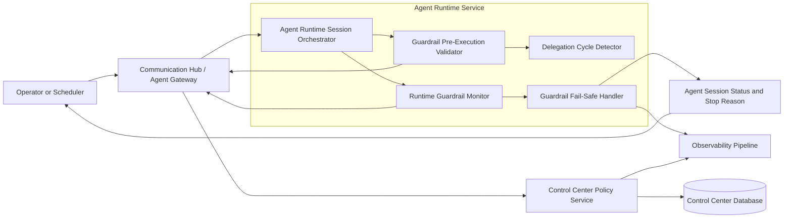
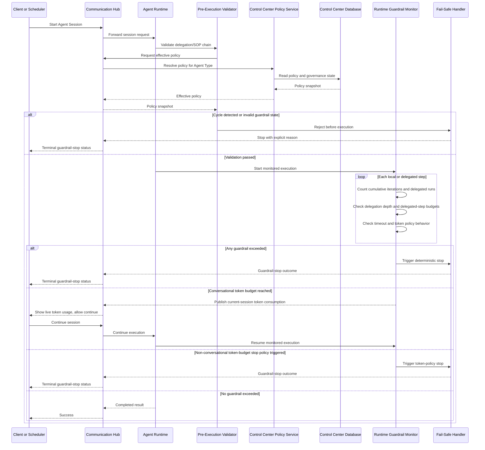

# Architecture Changes: add-agent-execution-guardrails

## 1) Changed Components
- Agent Runtime Session Orchestrator: now enforces a unified execution ceiling across local and delegated activity, and emits guardrail events during execution.
- Communication Hub (Agent Gateway): routes guardrail policy fetches and stop outcomes between Agent Runtime and Control Center without moving execution out of Agent Runtime.
- Control Center Policy Service: serves effective guardrail policy per Agent Type and records policy-stop outcomes for governance/audit.
- Agent Session Tracking and Observability path: now distinguishes guardrail stops (cycle, iteration cap, timeout, token-policy outcome) from functional failures.

## 2) New Components
- Guardrail Pre-Execution Validator: validates policy presence and delegation-chain safety before first execution step.
- Delegation Cycle Detector: checks direct and indirect recursion across multi-level agent delegation and SOP chains.
- Runtime Guardrail Monitor: enforces max iterations (including delegated runs), delegation depth and delegated-step budgets, per-agent timeout, and token budget behavior when supported.
- Guardrail Fail-Safe Handler: performs deterministic stop/fail-safe termination and returns explicit stop reason.

## 3) Integration Points
- Agent Runtime -> Communication Hub -> Control Center Policy Service:
  - Pre-execution policy snapshot retrieval per Agent Type.
  - Runtime policy checks for cumulative iteration/delegation counters and timeout boundaries.
  - Runtime policy mode resolution for token handling by session type:
    - Conversational sessions: continuous current-session token consumption updates are published to the client while execution remains user-continuable.
    - Non-conversational or automated runs: token-budget stop policy may be enforced as a terminal guardrail.
- Agent Runtime internal integrations:
  - Session Orchestrator -> Pre-Execution Validator -> Cycle Detector before first model/tool/delegation step.
  - Session Orchestrator -> Runtime Guardrail Monitor during execution and delegation expansion.
- Guardrail outcome integrations:
  - Fail-Safe Handler -> Agent Session tracking for explicit terminal states.
  - Fail-Safe Handler and Control Center -> Observability for policy-stop telemetry and triage.
  - Runtime Guardrail Monitor -> Communication Hub -> Client session channel for continuous token-consumption telemetry in conversational sessions.

## 4) Data Flow Changes
- Pre-execution path now blocks unsafe chains before work starts:
  - Delegation graph is validated for direct/indirect cycles across SOP and downstream delegated runs.
  - If cycle or invalid policy state is found, execution is denied with a guardrail stop reason.
- Runtime path now applies bounded execution across the full chain:
  - Max iterations count parent and delegated runs in one cumulative budget.
  - Delegation depth and delegated-step budgets prevent unbounded delegation expansion.
  - Per-agent timeout triggers deterministic stop when wall-clock limit is exceeded.
  - Conversational sessions continuously publish current-session token consumption to the user experience and allow continuation; token budget alone does not force a hard stop.
  - Non-conversational or automated runs may apply token-budget stop policy as a terminal guardrail when configured.
  - If hard token enforcement is unsupported, token policy remains explicit and mode-aware, while iteration and timeout guardrails remain mandatory.
- Architecture boundary compliance:
  - Execution decisions and stop triggers occur in Agent Runtime.
  - Persistent policy/governance records and all database access remain in Control Center.

## 5) Master Arch Update Instructions
- Update [docs/master/architecture/system-overview.md](docs/master/architecture/system-overview.md) with a guardrail control path showing pre-execution validation and runtime stop boundaries.
- Update [docs/master/architecture/modules/agent-runtime/](docs/master/architecture/modules/agent-runtime/) docs to add the four guardrail components and clarify cumulative delegated-iteration accounting.
- Update [docs/master/architecture/modules/communication-hub/](docs/master/architecture/modules/communication-hub/) docs to describe policy-resolution and stop-reason routing responsibilities.
- Update [docs/master/architecture/modules/control-center/](docs/master/architecture/modules/control-center/) docs to capture policy-source-of-truth and governance logging ownership.
- Update [docs/master/architecture/modules/execution-logs.md](docs/master/architecture/modules/execution-logs.md) to include guardrail-stop reason taxonomy for operator triage.
- Update [docs/master/architecture/security/certificate-management.md](docs/master/architecture/security/certificate-management.md) only if needed to clarify that guardrail enforcement does not alter certificate trust boundaries.
