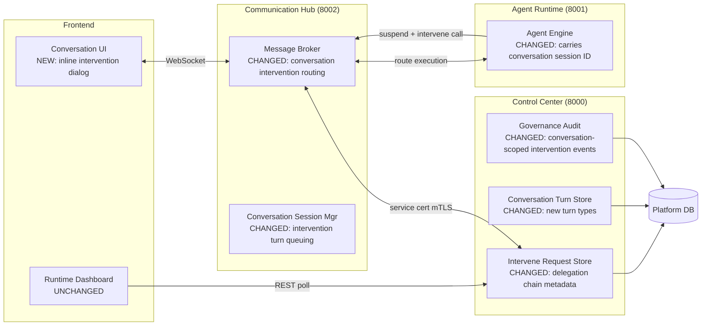
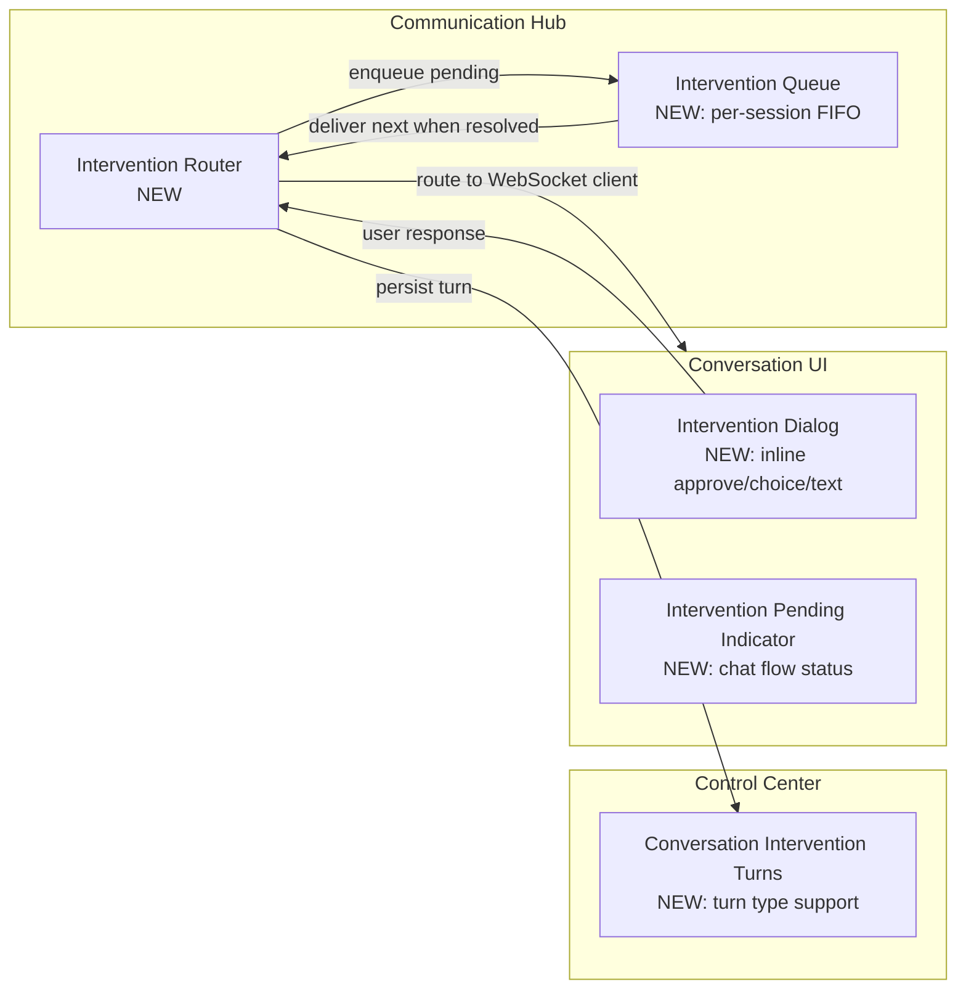
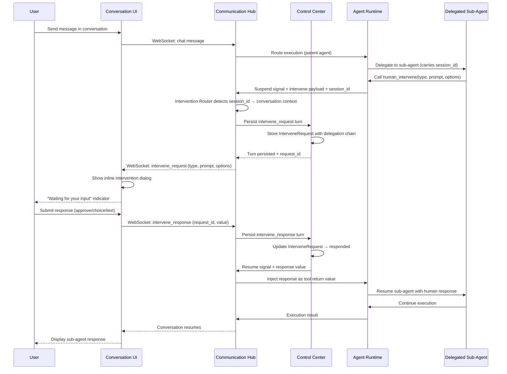

# Architecture: Conversational Agent Intervention

## 1. Changed Components

Existing components that change and how.

- **Communication Hub — Message Broker**: Detects intervention requests originating from delegated sub-agents within a conversation session. Routes them as WebSocket messages to the parent conversation's UI client instead of (or in addition to) the operator dashboard. Queues multiple concurrent intervention requests per conversation and delivers them sequentially.
- **Communication Hub — Conversation Session Manager**: Extends session lifecycle to include an `intervention_pending` state that blocks new user messages until the outstanding intervention is resolved or cancelled. Tracks outstanding intervention request IDs per session.
- **Control Center — Intervene Request Store**: Adds `parent_session_id` and `delegation_depth` metadata to `InterveneRequest` records so the platform can distinguish conversation-context interventions from standalone ones. Emits `intervene_request_created` events with conversation routing metadata.
- **Control Center — Conversation Turn Store**: Accepts two new turn types: `intervene_request` (captures the intervention prompt, type, and options) and `intervene_response` (captures the operator's identity, response value, and timestamp). Turns are persisted in order within the conversation stream.
- **Control Center — Governance Audit**: Records intervention request and response turns in the conversation audit trail with full delegation chain traceability.
- **Agent Runtime — Agent Engine**: Carries the parent conversation session ID through delegation. When a delegated sub-agent calls `human_intervene`, the engine includes the conversation session ID in the suspend signal sent to the Communication Hub. The `human_intervene` tool contract itself is unchanged.
- **Conversation UI**: Adds an inline intervention dialog component that renders within the chat flow. Shows the intervention prompt, type-specific input controls, and a "Waiting for your input" indicator. Blocks new message input while an intervention is pending. Handles dismissal/cancellation.

## 2. New Components

New components added by this change.

- **Intervention Router** — Communication Hub: New routing module that inspects each `human_intervene` tool call for a conversation session context. If present, routes the intervention request to the connected WebSocket client of the parent conversation session. If the conversation client is disconnected, holds the request pending for re-delivery on reconnect. Falls back to the existing dashboard flow when no conversation session context exists.
- **Intervention Queue** — Communication Hub: Per-conversation-session FIFO queue for intervention requests. When a delegated sub-agent calls `human_intervene` and another intervention is already pending for the same conversation, the new request is enqueued. Delivered to the UI in order as prior interventions are resolved or cancelled.
- **Conversation Intervention Turns** — Control Center: Extension of the existing conversation turn persistence to support `intervene_request` and `intervene_response` turn types. Stores the intervention type (approval/choice/text), prompt text, available options, and delegation chain metadata on request turns. Stores operator identity, response value, and timestamp on response turns.
- **Intervention Dialog** — Conversation UI: New inline dialog component that appears at the point of delegation in the chat flow. Presents the same three intervention types as the non-conversational flow. Handles user dismissal/cancellation with a cancellation signal back to the sub-agent.
- **Intervention Pending Indicator** — Conversation UI: Visual indicator in the chat flow showing "Waiting for your input" while an intervention is outstanding. Replaces the current indefinite waiting state. Blocks the message input field.

## 3. Integration Points

New or changed integration points between services.

### Communication Hub → Conversation UI (WebSocket)

- **New message type: `intervene_request`** — CH pushes to the conversation WebSocket client when a delegated sub-agent calls `human_intervene`. Payload includes: intervention type (approval/choice/text), prompt text, available options (for choice type), intervention request ID, and delegation context (sub-agent type, depth).
- **New message type: `intervene_response`** — CH receives from the conversation WebSocket client when the user submits a response. CH routes this to CC for persistence and resume signalling.
- **New message type: `intervene_cancel`** — CH receives from the conversation WebSocket client when the user dismisses the dialog. CH routes cancellation to AR via CC.
- **New message type: `intervene_status`** — CH pushes status updates (pending, responded, cancelled, timeout) to the conversation WebSocket client.
- **Changed message type: `chat`** — The conversation session manager blocks new user chat messages when an intervention is pending (returns error to client).

### Control Center API — New Endpoints

- `POST /api/v1/conversations/{session_id}/interventions/{request_id}/respond` — Persists the user's intervention response as a conversation turn of type `intervene_response`, updates the `InterveneRequest` status to `responded`, and triggers the resume signal through CH to AR.
- `GET /api/v1/conversations/{session_id}/interventions/pending` — Returns the currently pending intervention request for a conversation session, if any. Used by the UI on reconnect to re-surface an outstanding intervention.

### Control Center API — Changed Endpoints

- `POST /api/v1/conversations/{session_id}/turns` — Extended to accept `turn_type` values of `intervene_request` and `intervene_response` in addition to existing turn types. Intervention request turns include the intervention type, prompt, and options. Intervention response turns include the operator identity and response value.
- `POST /api/v1/interventions/` (Intervene Request Store) — Extended to accept optional `conversation_session_id` and `delegation_depth` fields. When present, the intervention is scoped to the conversation session and routed accordingly.

### Agent Runtime — No New Endpoints

- The `human_intervene` tool contract is unchanged. The AR execution context now carries the conversation session ID through delegation so the suspend signal issued by AR includes the parent session context. CH uses this context to determine routing.

### Service Boundaries Preserved

- AR never connects to the database — all intervention persistence is done by CC.
- AR never receives user identity tokens — intervention responses are injected as tool return values without exposing caller identity.
- AR's certificate validation enforcement is unchanged — only service-certificate mTLS from `service:communication-hub` is accepted on internal endpoints.
- CC is the sole database accessor — conversation intervention turns are persisted by CC.

## 4. Data Flow Changes

- The key change from the existing non-conversational flow: instead of the intervention request going to the operator dashboard (poll-based), it is pushed via WebSocket directly to the conversation UI that owns the parent session.
- The Communication Hub's Intervention Router detects conversation-scoped interventions by the presence of a `conversation_session_id` in the suspend signal. Non-conversational interventions (no `conversation_session_id`) continue to the existing dashboard flow unchanged.
- If the user disconnects while an intervention dialog is open, the request remains pending in CC. On reconnect, the UI calls `GET /api/v1/conversations/{session_id}/interventions/pending` and re-surfaces the dialog.
- Multiple concurrent interventions from the same conversation are queued by the Intervention Queue and delivered one at a time.

## 5. Master Arch Update Instructions

After this change is implemented, update the following files in `docs/master/architecture/`:

### `docs/master/architecture/modules/communication-hub/architecture.md`
- Add `Intervention Router` node to the flowchart, branching from the `AR -->|Intervene tool call and suspend| CH` edge
- Add `Intervention Queue` node showing per-session FIFO delivery
- Add edges: `IR -->|intervene_request WS message| CHAT` and `CHAT -->|intervene_response WS message| IR`
- Update Responsibilities section: add "Conversation intervention routing" — detects intervention requests from delegated sub-agents and routes to parent conversation WebSocket clients
- Add new subsection "Conversation Intervention Routing" documenting the router, queue, and WebSocket message types

### `docs/master/architecture/modules/control-center/architecture.md`
- Add `Conversation Intervention Turns` node to the flowchart under `API`
- Add edges from `IRS` to the new turn store and to the conversation session store
- Update `IRS[Intervene Request Store]` to show expanded scope: conversation-scoped intervention persistence
- Add new subsection "Conversation Intervention Persistence" documenting `intervene_request`/`intervene_response` turn types and delegation chain metadata

### `docs/master/architecture/modules/agent-lifecycle.md`
- Update section "5a. Human-in-the-Loop Intervention" to document the conversation-context intervention path: when a delegated sub-agent in a conversation session calls `human_intervene`, the request routes to the conversation UI instead of the operator dashboard
- Add delegation-depth context to the suspend/resume steps
- Update the conversation session state machine diagram to include `intervention_pending` state between `active` and conversation resumption

### `docs/master/architecture/modules/communication.md`
- Add "Conversation Intervention Flow" subsection to "Web UI ↔ Agent" messaging section
- Document new WebSocket message types: `intervene_request`, `intervene_response`, `intervene_cancel`, `intervene_status`
- Document that chat messages are blocked while an intervention is pending

### `docs/master/architecture/modules/tool-execution.md`
- Extend "System Tools — Suspend-on-Call Pattern" section to note that in conversation contexts, the intervention response arrives inline through the WebSocket conversation channel rather than through the operator dashboard poll path

### `docs/master/architecture/system-overview.md`
- Add `Conversation Intervention Routing` to the Communication Hub's responsibilities in the main flow diagram
- No structural changes to the 3-service architecture — service segregation rules are preserved

