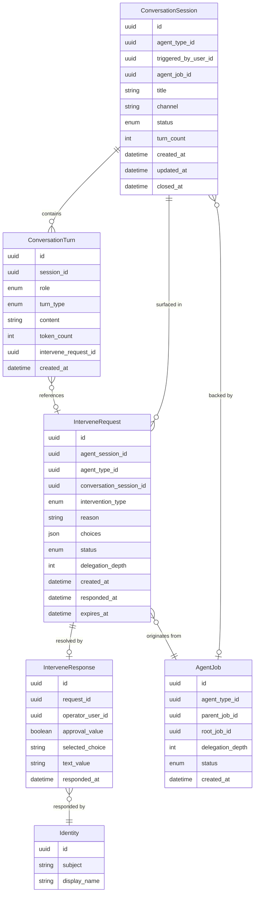

# Data Model: Conversational Agent Intervention

## 1. New Entities

No new entities are required. The change is implemented by extending existing entities to bridge the gap between the conversational store and the intervention system.

---

## 2. Modified Entities

### 2.1 ConversationTurn

**Rationale:** Currently `ConversationTurn` uses only a `role` field (`user` | `agent` | `tool` | `system`) to classify turns. The PRD requires intervention request and response events to be persisted as distinct conversation turn *types* that are separate from the participant role. Additionally, intervention turns must reference the underlying `InterveneRequest` so the conversation UI can display intervention details (type, choices, status) and re-surface pending requests on reconnect.

**Added fields:**

| Field | Type | Purpose |
|---|---|---|
| `turn_type` | `enum` | Distinguishes regular messages from intervention events. Values: `message` (default), `intervene_request`, `intervene_response`. |
| `intervene_request_id` | `uuid` (nullable FK → `intervene_requests.id`) | Links an intervention-type turn back to its underlying `InterveneRequest` for display and lifecycle tracking. |

### 2.2 InterveneRequest

**Rationale:** Currently `InterveneRequest` links only to `AgentJob` (`agent_session_id`). When a delegated sub-agent in a *conversational* session calls `human_intervene`, there is no path to identify which `ConversationSession` the request should be surfaced in. Additionally, the PRD requires delegation chain metadata (which sub-agent at which depth made the request) to be preserved directly in intervention records for audit without requiring joins through `AgentJob`.

**Added fields:**

| Field | Type | Purpose |
|---|---|---|
| `conversation_session_id` | `uuid` (nullable FK → `conversation_sessions.id`) | Identifies the parent `ConversationSession` where this intervention should be surfaced. `NULL` for non-conversational agent interventions (preserves existing flow). |
| `delegation_depth` | `int` (default `0`) | Denormalized from `AgentJob.delegation_depth` at request creation time. Preserves the delegation chain depth in the intervention record for direct audit queries. |

**Status enum note:** The existing `InterveneRequestStatus` values (`pending`, `responded`, `cancelled`, `expired`) already cover the lifecycle states described in the PRD. The PRD's `timed_out` concept maps to `expired` in the current model. No enum change is required.

---

## 3. Removed Entities / Fields

None. This change is purely additive — no existing entities, fields, or relationships are removed or renamed.

---

## 4. ER Diagram

### Conversational Intervention Model

### Relationship Summary

| Relationship | Cardinality | Label |
|---|---|---|
| `ConversationSession` → `ConversationTurn` | one-to-many | A session contains many turns, including intervention-type turns |
| `ConversationTurn` → `InterveneRequest` | optional many-to-one | An `intervene_request` or `intervene_response` turn references its underlying intervention record |
| `InterveneRequest` → `ConversationSession` | many-to-one | An intervention request is surfaced in exactly one conversation session (nullable for non-conversational flows) |
| `InterveneRequest` → `AgentJob` | many-to-one | Each intervention request originates from a specific agent job (delegated or root) |
| `InterveneRequest` → `InterveneResponse` | one-to-zero-or-one | A request may have exactly one response |
| `InterveneResponse` → `Identity` | many-to-one | The operator who responded is an identity principal |

### Enum Definitions

**`turn_type` (new on ConversationTurn):**

| Value | Meaning |
|---|---|
| `message` | Regular user/agent/tool/system message (default) |
| `intervene_request` | Turn represents a sub-agent intervention request surfaced in the conversation |
| `intervene_response` | Turn represents the user's response to an intervention request |

**`InterveneRequestStatus` (existing, no changes):**

| Value | Meaning |
|---|---|
| `pending` | Awaiting operator response |
| `responded` | Operator submitted a response |
| `cancelled` | Operator dismissed or session terminated |
| `expired` | Timeout elapsed without response |

**`InterventionType` (existing, no changes):**

| Value | Meaning |
|---|---|
| `approval` | Yes/no confirmation |
| `choice` | Select one option from a provided list |
| `text` | Free-form text input |

---

## 5. Schema File References

The following files in `backend/app/db/models/` require changes:

| File | Changes |
|---|---|
| `backend/app/db/models/conversations.py` | Add `turn_type` enum and field to `ConversationTurn`. Add `intervene_request_id` FK to `ConversationTurn`. |
| `backend/app/db/models/intervene.py` | Add `conversation_session_id` FK to `InterveneRequest`. Add `delegation_depth` field to `InterveneRequest`. |

No other model files require changes.

---

## 6. Master Data Model Update Instructions

After implementation, update the following master doc files:

### `docs/master/data-model/modules/communication/entities.md`

- Update the `ConversationTurn` entity block in the Mermaid diagram to include the new `turn_type` (enum) and `intervene_request_id` (uuid) fields
- Add `InterveneRequest` and `InterveneResponse` entity blocks (currently missing from this module doc)
- Add relationship lines: `ConversationTurn }o--o| InterveneRequest : "references"` and `InterveneRequest }o--|| ConversationSession : "surfaced in"`
- Update the entity description table: revise `ConversationTurn` description to mention `turn_type`; add entries for `InterveneRequest` and `InterveneResponse`

### `docs/master/data-model/modules/agents/entities.md`

- Update the `InterveneRequest` entity block to include the new `conversation_session_id` (uuid) and `delegation_depth` (int) fields
- Add relationship line: `InterveneRequest }o--|| ConversationSession : "surfaced in"` (or note cross-module relationship to Communication)
- Update the `InterveneRequest` entity description to mention conversational session linking and delegation depth

### `docs/master/data-model/overview.md`

- Update the Communication & Conversations section: add `turn_type` and `intervene_request_id` to `ConversationTurn`
- Update the Cross-Domain Relationship Map section: add `InterveneRequest }o--|| ConversationSession : "surfaced in"` relationship and update the `InterveneRequest` entity block with new fields
