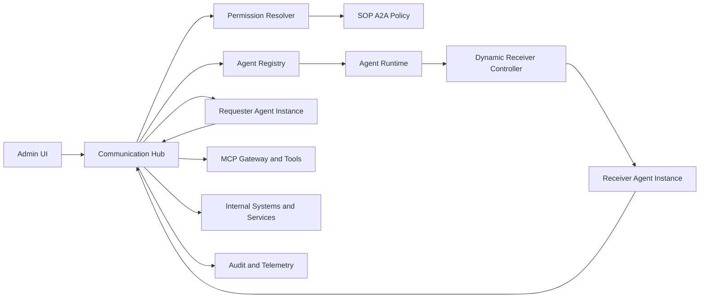
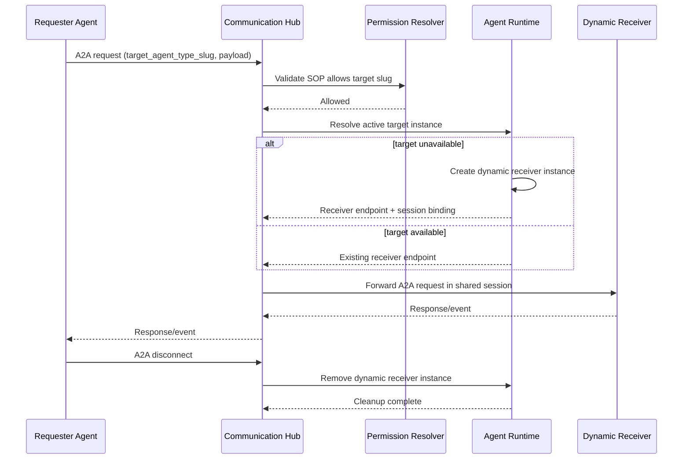

# Architecture Changes: Agent-to-Agent Communication and Slug Enforcement

## Changed Components
- Communication Hub: extended to route A2A requests by target agent type slug and coordinate dynamic target activation when unavailable.
- Agent Runtime: extended to create and attach dynamic receiver instances to requester session context.
- Permission Resolution Path: expanded to evaluate SOP-step-derived A2A allow rules in addition to existing tool-level controls.
- SOP Execution Definition Layer: delegation step definitions now generate agent association and permission mapping, consistent with current skill/tool derivation behavior.
- Plan Preview Layer: renders agent-delegation steps in both ordered plan and topology diagram outputs.
- Validation Layer: shared slug validation introduced across agent type, agent name, and MCP server naming paths.

## New Components
- A2A Session Link Manager: maintains requester-receiver session affinity and lifecycle state until explicit disconnect.
- Dynamic Receiver Lifecycle Controller: governs receiver create, active, disconnect, and remove transitions.

## Integration Points
- Agent Runtime and Communication Hub integration now includes target-availability callback and dynamic receiver provisioning request.
- Communication Hub is the single transport channel for all agent, MCP, and system communications; no direct peer-to-peer agent communication is allowed.
- SOP policy and permission resolver integration now includes delegation-step-derived target agent type slug evaluation.
- Agent role management view integrates allowed agent type slug preview from role assignment data.
- Agent plan preview integration renders delegation steps as first-class plan nodes and edges.
- Naming validation integration is shared across agent type management, agent identity naming, and MCP server registration/update.

## Data Flow Changes
- A2A request path now resolves target agent type by slug before dispatch, and all message exchange remains hub-mediated.
- SOP save/update flow derives A2A permission associations from delegation step definitions and publishes them to permission resolution.
- If no target instance is active, runtime provisions receiver and returns active endpoint binding to hub.
- Hub maintains both agents in one shared session channel until requester emits disconnect intent.
- Disconnect event triggers receiver cleanup and session-link removal.

## Master Arch Update Instructions
- Update docs/master/architecture/system-overview.md with A2A routing and dynamic receiver lifecycle.
- Add or update module diagram in docs/master/architecture/modules/communication-hub.md to include SOP A2A permission check path.
- Add lifecycle states and cleanup semantics to docs/master/architecture/modules/agent-runtime.md.
- Add naming validation responsibility notes for shared validation layer in relevant module docs.
