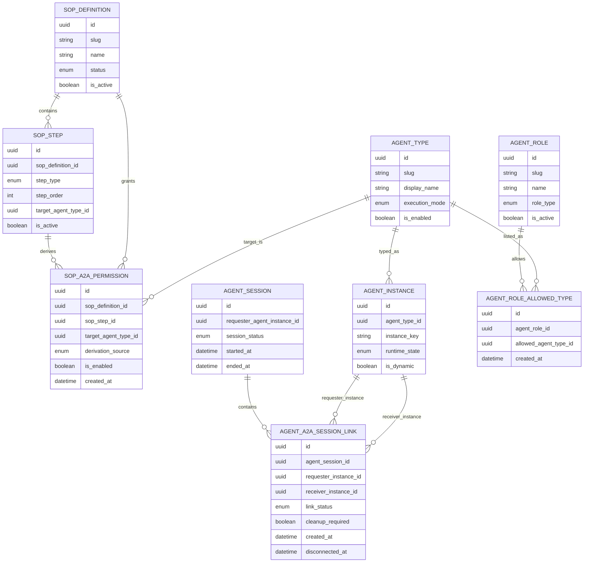

# Data Model Changes: Agent-to-Agent Communication and Slug Enforcement

## New Entities
- SOP_A2A_PERMISSION: derived allow-list records mapping SOP delegation steps to target agent type slugs.
- AGENT_A2A_SESSION_LINK: tracks requester/receiver relationship and lifecycle for shared-session A2A conversations.

## Modified Entities
- AGENT_TYPE
  - Require slug normalization and uniqueness enforcement as canonical routing identifier.
  - Keep display name separate from slug for user-friendly labels.
- AGENT (or equivalent agent identity/profile entity)
  - Enforce slug-safe agent name field used by runtime routing and protocol metadata.
- MCP_SERVER
  - Enforce slug-only namespace identifier for server name/alias used in tool namespacing.
- SOP_DEFINITION
  - Extend policy reference to include derived A2A permission controls generated from delegation steps.
- SOP_STEP
  - Ensure delegation step rows capture target agent type reference used for permission derivation.
- AGENT_ROLE
  - Extend to support allowed agent type preview through explicit many-to-many relation with agent types.

## Removed Entities/Fields
- No entity removals required.
- No field removals required; this change is additive with stronger validation constraints.

## Schema File References
The following declarative model files under `backend/app/db/models/` are expected to be updated:
- `backend/app/db/models/agent_type.py`
- `backend/app/db/models/agent.py` (or equivalent agent identity model file)
- `backend/app/db/models/mcp_server.py`
- `backend/app/db/models/sop.py`
- `backend/app/db/models/agent_role.py`
- New model file(s) for A2A permission/link entities, for example:
  - `backend/app/db/models/sop_a2a_permission.py`
  - `backend/app/db/models/agent_a2a_session_link.py`
  - `backend/app/db/models/sop_step.py` (if step model is split into a dedicated file)

## Master Data Model Update Instructions
- Update `docs/master/data-model/overview.md` with new A2A permission and session-link entities.
- Update role/identity module entity documentation in `docs/master/data-model/modules/` to include allowed agent type mapping.
- Add slug enforcement business rules for AGENT_TYPE, AGENT, and MCP_SERVER entities in the corresponding module docs.
