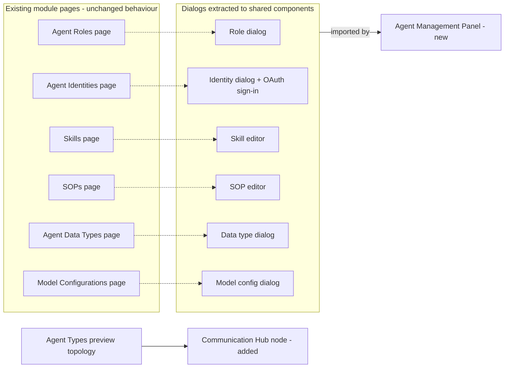
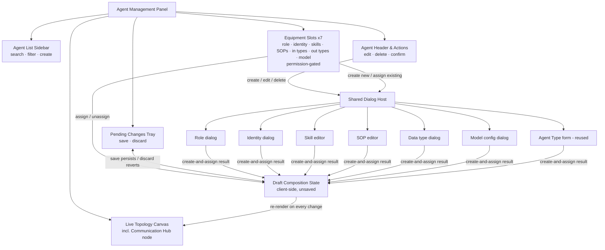
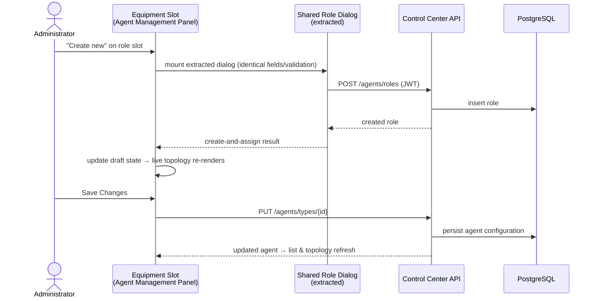
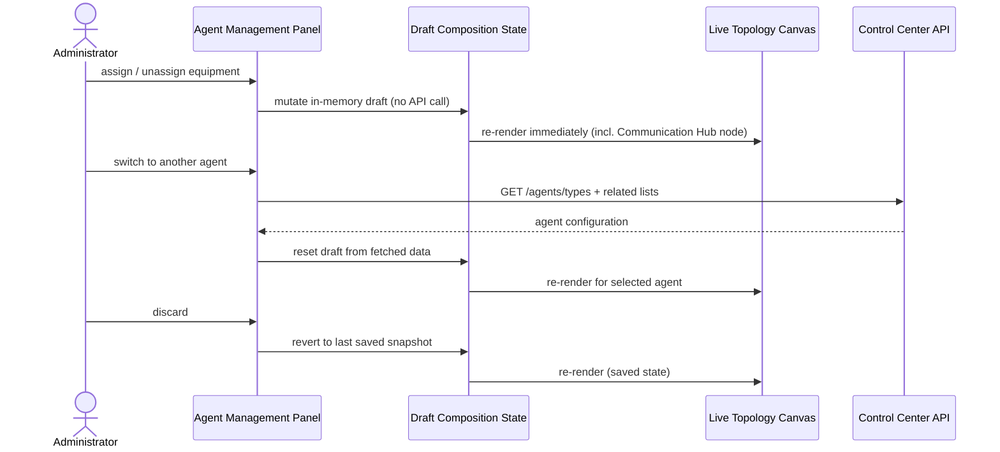

# Architecture: Agent Management Panel

Frontend-only composition change: a new unified panel that equips an agent (roles, identity, skills, SOPs, input/output data types, model) by reusing the existing module dialogs. No database changes, no new backend endpoints, and no change to the segregated three-service topology (Control Center remains the only DB-connected service). All backend interaction flows through existing Control Center REST APIs.

## Changed Components

| Component | Change | Why |
|---|---|---|
| Module dialogs (`AgentRoleDialog`, `AgentIdentityDialog` incl. OAuth sign-in, `SkillEditor`, `SopEditor`, `DataTypeFormDialog`, `ModelConfigDialog`) | Extracted from their host pages into shared dialog components; fields, validation, error handling unchanged. Source pages import the same extracted components — single implementation, zero duplication | Enables inline creation in the panel with behaviour identical to the source modules (PRD hard requirement) |
| `AgentTypeForm` (agent create/edit) | Wrapped for reuse inside the panel (header card create/edit/delete); equipment editing delegated to the panel's equipment slots | Agent CRUD stays consistent with the existing Agent Types module |
| Agent Types preview topology (`AgentTypeDetailsDialog` → shared `TopologyDiagramRenderer`) | Gains a **Communication Hub node** connected to the agent (dashed platform messaging edge); both conversational and typed/plan topologies include it | PRD: the hub must be visible in the existing agent preview topology |
| `AppRouter` | New route for the Agent Management Panel | Panel is a first-class navigation target |
| `AppShell` navigation | New sidebar entry in the Agents group | Discoverability; respects existing permission-based nav visibility |
| i18n locale files | New keys for panel labels, slot hints, permission notes | All UI text via i18next — no hardcoded strings |

Dashed links: extraction moves (page now imports the shared component). Module pages keep their standalone management role — the panel is additive, never a replacement.

## New Components

The Agent Management Panel (`/agents/panel` style route in the Agents group) — a three-region layout: agent list, live topology, equipment slots.

- **Draft Composition State** — the core new concept: an in-memory copy of the selected agent's equipment. Every assign/unassign/inline-create mutates this state only.
- **Live Topology Canvas** — re-renders from the draft state on every change, before saving; renders empty slots as dashed placeholders and the Communication Hub as a fixed platform node (broker · agent gateway · MCP), so no runtime call to the Communication Hub service is needed.
- **Equipment Slots** — seven slots, each gated by the module's existing resource permissions (`agent::roles`, `agent::identities`, `agent::skills`, `agent::sops`, `agent::data_types`, `agent::model_configs`, `agent::management`); read-only users see disabled actions with an explanation. Conversational agents show a locked output-type slot (data-type rule).
- **Shared Dialog Host** — mounts the extracted module dialogs inline; "create-and-assign" chains the dialog's normal create with a draft-state assignment.

## Integration Points

| Integration | Type | Notes |
|---|---|---|
| Extracted module dialogs (roles, identities, skills, SOPs, data types, models) | Reused (moved, not duplicated) | Panel mounts them via the Shared Dialog Host; source pages import the same components |
| Shared `TopologyDiagramRenderer` | Reused | Backs both the existing Agent Types preview topology (now with hub node) and the panel canvas |
| `usePermissions` + `PermissionDeniedAlert` | Reused | Per-slot capability gating and graceful read-only degradation; no new resource types — reuses existing `agent::*` manifest entries |
| `useDialogErrorHandler`, `ConfirmDialog`, `useUnsavedChangesDialog` | Reused | Standard dialog error display (403 surfaced in-dialog), delete confirmation, unsaved-changes guard |
| Data hooks (`useAgentTypes`, `useDataTypes`, `useAvailableModels`) + inline react-query list fetches | Reused | Panel reads agent types, data types, and available models through the existing data hooks; skills and SOPs lists are fetched via react-query against the existing skills and SOPs list endpoints, mirroring the Skills and SOPs list pages |
| Control Center REST (`/api/v1`) — `agents/types`, `agents/roles`, `agents/identities` (+ `identities/oauth/authorize` and callback), `agents/model-configs`, `data-types`, `skills`, `sops`, `mcp/servers` | Existing endpoints only | Inline creation = the modules' existing POST/PUT calls; agent save = existing agent-type update; lists = existing GETs |
| OIDC provider (Keycloak / Azure EntraID) | Via Control Center only | Inline identity sign-in reuses the existing OAuth popup flow; provider unavailability surfaces through the standard dialog error handler |
| Agent Runtime / Communication Hub backend services | **No new integration** | The hub appears in topologies as a static platform node; no runtime queries against the hub service |

**No backend additions required** — validated against `top_priority_rules`: inline creation maps 1:1 onto existing Control Center endpoints; the live topology is client-side composition of already-fetched resources; no schema, migration, or new-service work (`has_db_changes: false`); the three-service segregation and Control-Center-only database access are untouched.

## Data Flow Changes

### Inline create-and-assign (example: role)

### Live topology updates without saving

## Master Arch Update Instructions

- `docs/master/architecture/modules/agent-management-panel.md` — **create**: new module doc with the panel composition diagram (above) and the reuse model (extracted shared dialogs, draft-state topology).
- `docs/master/architecture/modules/agent-types.md` — add the Communication Hub node to the preview topology diagram; add a pointer to the new panel module doc.
- `docs/master/architecture/modules/iam.md` — note the panel's permission gating: reuses existing `agent::*` resource types only, no new manifest entries.
- `docs/master/architecture/modules/identity.md` — note that inline identity provisioning in the panel reuses the existing OAuth sign-in/callback flow via Control Center.
- `docs/master/architecture/system-overview.md` — **no change**: backend topology, service segregation, and inter-service flows are unchanged by this frontend-only composition.
