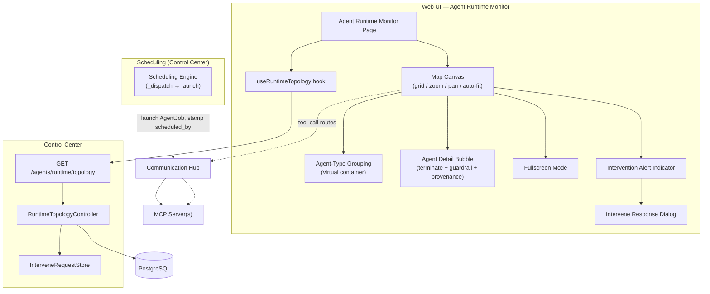
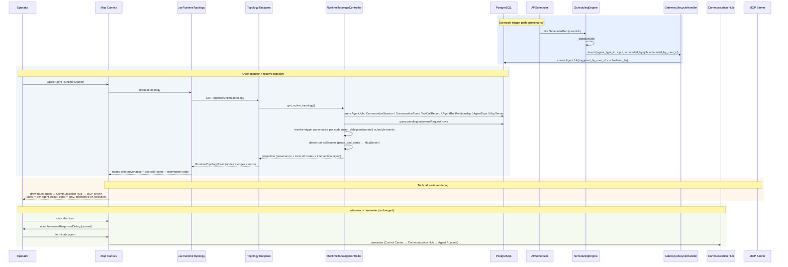

# Architecture Changes — Agent Runtime Monitor

## Overview

The runtime-control "agent topology" view becomes **Agent Runtime Monitor** — a full-page, interactive, map-style canvas (frontend). Three backend/frontend capabilities underpin the new view:

1. **Trigger provenance** — `ScheduledJob` records the user who scheduled it; the scheduling engine passes that user through launch so every `AgentJob` carries a `triggered_by_user_id`; delegated children inherit it. `RuntimeTopologyController` resolves a human-readable trigger source per node (user name, delegated parent, or schedule name).
2. **Tool-call history via Communication Hub** — the Communication Hub becomes a visible map component; `RuntimeTopologyController` reads tool-call history (`ToolCallRecord` via `ConversationTurn` → `ConversationSession`, and/or `AgentJob.conversation_history`), maps each namespaced tool name (`server____tool` via `parse_tool_name`) to its `McpServer`, and the frontend draws each agent's calls as routes agent → Communication Hub → MCP server.
3. **Delegation legibility + empty-state recovery** — frontend canvas gives delegation adjacency precedence over type grouping and keeps the filter/legend toolbar usable even when a filter hides every agent.

No new database entities are introduced (`scheduled_by_user_id` is an added field, not an entity).

---

## 1. Changed Components

| Component | Change |
|-----------|--------|
| `ScheduledJob` (`backend/app/db/models/scheduling.py`) | Gains `scheduled_by_user_id` — records the user who owns/created the schedule; the source of a schedule-triggered agent's provenance. |
| `SchedulingEngine._dispatch` (`backend/app/services/scheduling/scheduler.py`) | Passes `job.scheduled_by_user_id` through to `GatewayLifecycleHandler.launch(...)` (currently `user_id=None`) so the launched `AgentJob.triggered_by_user_id` is populated. |
| `GatewayLifecycleHandler.launch` (`backend/app/services/gateway/lifecycle_handler.py`) | Accepts the scheduled-by user and stamps it onto the created `AgentJob.triggered_by_user_id`. |
| `AgentJob` (`backend/app/db/models/agents.py`) | `triggered_by_user_id` becomes the single trigger-provenance anchor; delegated child agents inherit it from their parent; `conversation_history` is read as one tool-call-history source. |
| `RuntimeTopologyController` (`backend/app/services/control_center/runtime_topology_controller.py`) | Resolves per-node trigger provenance (user name / delegated parent / schedule name); reads tool-call history and derives per-node MCP-server routes; keeps the pending-intervention signal from the existing `InterveneRequestStore` data. |
| `RuntimeTopologyNodeRead` / `RuntimeTopologyRead` (`backend/app/schemas/agents.py`) | Node schema gains trigger-provenance fields (trigger source + human-readable label) and a per-node tool-call route list (tool name → MCP server). |
| `ToolCallRecord` / `ConversationTurn` / `ConversationSession` (`backend/app/db/models/conversations.py`) | Read (not modified) as the canonical per-agent tool-call history. |
| `McpServer` (`backend/app/db/models/mcp_hub.py`) | Read (not modified) to resolve a namespaced tool name back to its MCP server. |
| `parse_tool_name` (`backend/app/services/agents/tool_naming.py`) | Used to split `server____tool` into (server slug, tool name) for tool-call → MCP server routing. |
| `useRuntimeTopology` hook (`frontend/src/hooks/useRuntimeTopology.ts`) | Consumes the new trigger-provenance and tool-call-route fields; preserves toolbar/legend usability on an empty (fully-filtered) map. |
| Frontend types (`frontend/src/types/index.ts`) | Mirror trigger-provenance and tool-call-route fields (`triggered_by_user_id` / `triggered_by_user_name` / `tool_calls`) on `RuntimeTopologyNode` / `RuntimeTopologyProjection`. |
| Page (`frontend/src/pages/agents/RuntimeControlDashboardPage.tsx`) | Rebranded to "Agent Runtime Monitor"; model guardrail panel removed; map becomes the primary canvas. |
| Map canvas (`frontend/src/components/agents/AgentRuntimeMapCanvas.tsx`, `TopologyDiagramRenderer.tsx`) | Grid/auto-fit layout with delegation adjacency precedence over type grouping; draws agent → Communication Hub → MCP server routes (latest call in a per-agent colour, older calls grey, brightened on selection); toolbar/legend stay usable on empty state. |
| `VendorModelGuardrailPanel.tsx` (`frontend/src/components/agents/VendorModelGuardrailPanel.tsx`) | Removed from this page entirely. |

---

## 2. New Components

Key additions over the prior map: the **Scheduling Engine** (provenance source for schedule-triggered agents), the **Communication Hub** and **MCP Server(s)** (visible tool-call route endpoints), and dashed **tool-call route** edges drawn on the map.

---

## 3. Integration Points

- **Control Center → DB** — `RuntimeTopologyController.get_active_topology()` now additionally reads: pending `InterveneRequest` rows (status `pending`, keyed by `agent_session_id` / `conversation_session_id`); tool-call history (`ToolCallRecord` via `ConversationTurn` → `ConversationSession`, and/or `AgentJob.conversation_history`); and `McpServer` rows to resolve namespaced tool names. Control Center remains the only service touching the database.
- **Scheduling Engine → GatewayLifecycleHandler → AgentJob** — `_dispatch` (`backend/app/services/scheduling/scheduler.py`) passes `ScheduledJob.scheduled_by_user_id` into `GatewayLifecycleHandler.launch` (`backend/app/services/gateway/lifecycle_handler.py`), which stamps `AgentJob.triggered_by_user_id` so schedule-triggered agents carry the schedule owner as their trigger source.
- **Delegation inheritance** — delegated child agents inherit `triggered_by_user_id` from their parent `AgentJob`, so the map shows a parent-delegated trigger source.
- **Topology API → Frontend** — `GET /agents/runtime/topology` (`backend/app/api/v1/agents.py`) returns, per node: trigger provenance (source + label), tool-call routes (tool name → MCP server), and the pending-intervention signal.
- **Frontend hook → map** — `useRuntimeTopology` passes provenance, tool-call routes, and pending-intervention state into the map renderer; the map draws agent → Communication Hub → MCP server routes and alert indicators.
- **Map → Intervene dialog** — clicking the alert indicator opens the existing `InterveneResponseDialog.tsx` (`frontend/src/components/agents/InterveneResponseDialog.tsx`, unchanged).
- **Map → terminate** — terminate reuses the existing action (Control Center → Communication Hub → Agent Runtime), unchanged.
- **No new database entities** — `scheduled_by_user_id` on `ScheduledJob` is an added field; `AgentJob`, `ConversationSession`, `ConversationTurn`, `ToolCallRecord`, and `McpServer` are read-only from this feature's perspective.

---

## 4. Data Flow Changes

---

## 5. Master Arch Update Instructions

- `docs/master/architecture/modules/runtime-control-dashboard.md` — rename the module title/intro to **Agent Runtime Monitor**; replace the static topology diagram with the map canvas (grid, auto-fit, zoom/pan, fullscreen, agent-type grouping, delegation-adjacency precedence, detail bubble); document trigger provenance (user / delegated parent / schedule name), the tool-call routes through the Communication Hub to MCP servers, the pending-intervention alert indicator, and empty-state filter recovery; note removal of the model guardrail panel from this view.
- `docs/master/architecture/modules/scheduling/architecture.md` — document the `ScheduledJob.scheduled_by_user_id` field and that the scheduling engine passes it through to `AgentJob.triggered_by_user_id` at launch.
- `docs/master/architecture/modules/communication-hub/architecture.md` — note the Communication Hub's role as a visible tool-call-route hop in the runtime monitor (agent → hub → MCP server), and that tool-call history is read by Control Center, not the hub.
- `docs/master/architecture/modules/agent-instance-dashboard.md` — update the parent-dashboard reference to the renamed Agent Runtime Monitor view.
- `docs/master/architecture/system-overview.md` — only if the runtime-control view is listed at the system level; otherwise no change.
- Keep diagrams ≤ 15 nodes, Mermaid only, component/service level.
