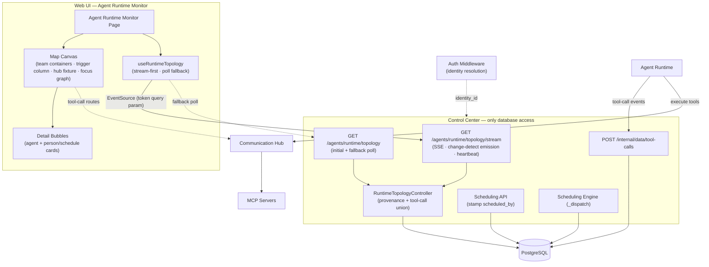
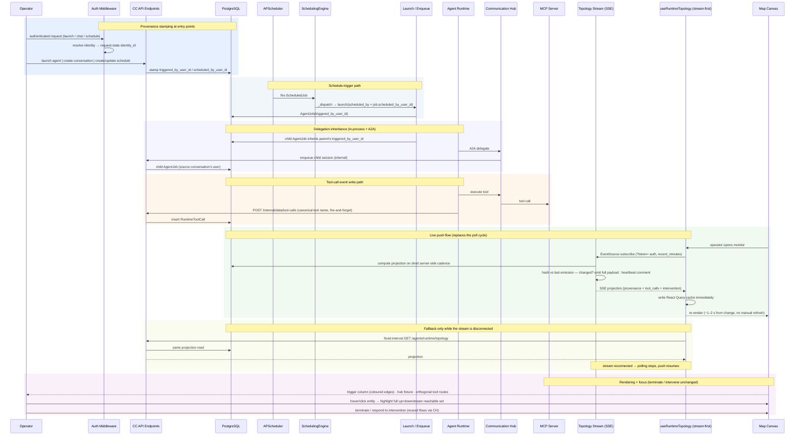

# Architecture Changes — Agent Runtime Monitor

## Overview

The runtime-control "agent topology" view becomes **Agent Runtime Monitor** — a full-page, interactive, map-style canvas (frontend). Six capabilities underpin the new view:

1. **Trigger provenance stamping** — the auth middleware resolves every authenticated human to their canonical `Identity` row and exposes it as `request.state.identity_id`; manual agent launches and conversation sessions stamp it at creation, schedules carry `scheduled_by_user_id` (stamped by the scheduling API on create/update, passed through by `SchedulingEngine._dispatch` at trigger time), and A2A delegation enqueues inherit the source conversation's user. Every `AgentJob` therefore carries a human provenance anchor (`triggered_by_user_id`).
2. **Per-node provenance resolution** — `RuntimeTopologyController` returns, per node: `trigger_source` (`user` | `schedule` | `delegated` | `unknown`), `trigger_source_label` (user name or schedule name), and `trigger_user_label` — always the resolved **human** (chat user, inherited user, or schedule creator; `null` when unknown, never the schedule name).
3. **Runtime tool-call events** — a new `RuntimeToolCall` entity (table `runtime_tool_calls`); Agent Runtime records every tool execution fire-and-forget to the Control Center internal endpoint `POST /internal/data/tool-calls` (canonical tool names restored via `tool_name_map`). The controller unions these with conversation `ToolCallRecord` history into `node.tool_calls` (rendered as `mcp:<slug>::<tool>` chips; A2A rows excluded — delegations render as delegation edges, not tool routes).
4. **Trigger entity column + focus graph** — the map shows person/schedule entity cards in a leftmost column with per-entity coloured directed edges (person → schedule → execution → …); the canvas builds a directed topology graph (trigger → execution, execution → execution delegation, execution → MCP → tool) in which hovering or clicking **any** entity highlights its full up+downstream reachable set. The execution → MCP edge is not backwards-traversable, so focus never leaks sideways to executions that merely share a tool server. Trigger entities open their own detail bubbles (executions triggered; creator for schedules).
5. **Map layout** — delegation-tree team containers (one tree per row, columns = delegation depth), a full-height Communication Hub fixture with MCP nodes and tool chips, orthogonal tool-call routes, a filter popover with a recent-completed window (`recent_minutes` on `GET /agents/runtime/topology`), and a live set that includes `waiting_for_human` plus terminal direct children so delegation chains stay readable — with three visual guarantees: the grid-dot background is painted at stage level so it covers the whole canvas in every state (panning/zooming beyond drawn content, filtered-empty), the Communication Hub spans full canvas height from first load even when the map is empty, and the initial auto-fit is not clamped by the interactive min-zoom.
6. **Live push delivery** — Control Center serves the projection as server-sent events (`GET /agents/runtime/topology/stream`): the stream recomputes the projection on a short server-side cadence and emits the full payload only when it changed (hash comparison), with heartbeat comments keeping the connection alive. `useRuntimeTopology` is stream-first (EventSource → React Query cache) and the fixed-interval poll survives only as an automatic fallback while the stream is disconnected, reverting on recovery. Because `EventSource` cannot set Authorization headers, the stream authenticates via the `?token=` query param — the same pattern as the Communication Hub chat WebSocket.

One new database entity is introduced (`RuntimeToolCall`); `scheduled_by_user_id` on `ScheduledJob` is an added field, not an entity. The live stream adds no new persistence — it re-reads the existing projection sources. Only Control Center touches the database — Agent Runtime reports tool-call events through a CC internal endpoint.

---

## 1. Changed Components

| Component | Change |
|-----------|--------|
| Auth middleware (`backend/app/middleware/auth.py`) | Resolves the authenticated human to their canonical `Identity` row and exposes it as `request.state.identity_id` on every authenticated request — the single provenance source for all stamping. |
| `launch_agent_session` (`backend/app/api/v1/agents.py`) / `create_conversation_session` (`backend/app/api/v1/conversations.py`) | Manual agent runs and conversation sessions stamp the requesting identity (`request.state.identity_id`) as `triggered_by_user_id` / chat user at creation. |
| Scheduling API (`backend/app/api/v1/scheduling.py`) + `ScheduledJob` (`backend/app/db/models/scheduling.py`) | `create_schedule` / `update_schedule` stamp `scheduled_by_user_id` from the requesting identity; the field is the provenance anchor for schedule-triggered runs. |
| `SchedulingEngine._dispatch` (`backend/app/services/scheduling/scheduler.py`) | Passes `job.scheduled_by_user_id` through to `GatewayLifecycleHandler.launch(...)` at trigger time. |
| `GatewayLifecycleHandler.launch` (`backend/app/services/gateway/lifecycle_handler.py`) | Stamps the forwarded user onto the created `AgentJob.triggered_by_user_id`. |
| `AgentSessionService.enqueue` (`backend/app/services/agents/session_service.py`) + `prepare_a2a_request` (`backend/app/api/v1/internal/session_data.py`) | Delegated children inherit the parent's `triggered_by_user_id`; A2A delegation enqueue resolves the source `ConversationSession`'s user and passes it through. |
| `AgentJob` (`backend/app/db/models/agents.py`) | `triggered_by_user_id` is the single trigger-provenance anchor; `parent_job_id` drives delegation edges. |
| `RuntimeToolCall` (`backend/app/db/models/tool_calls.py`) | **New entity** (`runtime_tool_calls`): one row per recorded tool execution, polymorphic session link, tool name, route type, MCP slug, status, duration, error. |
| `record_tool_calls` (`backend/app/api/v1/internal/session_data.py`) | **New** CC internal endpoint `POST /internal/data/tool-calls` (service-cert auth): persists single/batched tool-call events reported by Agent Runtime. |
| Agent Runtime recorder (`backend/app/agent_runtime/data_client.py`, `backend/app/services/agents/runtime_executor.py`) | Fire-and-forget recording of every tool execution to the CC endpoint — failures are logged and swallowed, never breaking tool execution; canonical tool names restored via `tool_name_map` before writing. |
| `RuntimeTopologyController` (`backend/app/services/control_center/runtime_topology_controller.py`) | Resolves per-node provenance (`trigger_source` / `trigger_source_label` / `trigger_user_label`); unions `RuntimeToolCall` events with `ToolCallRecord` history into `node.tool_calls` (latest first, capped, A2A excluded); live set includes `waiting_for_human` and recent-terminal jobs (`recent_minutes` window) plus terminal direct children; keeps the pending-intervention signal. |
| `RuntimeTopologyNodeRead` / `ToolCallRouteRead` (`backend/app/schemas/agents.py`) | Node schema gains `needs_intervention`, `trigger_source`, `trigger_source_label`, `trigger_user_label`, and a `tool_calls` route list (tool name, MCP slug, called-at, route type). |
| `GET /agents/runtime/topology` handler (`backend/app/api/v1/agents.py`) | Adds `recent_minutes` query param (default 30, `0` disables; `include_terminal` supersedes) and includes `waiting_for_human` in the default live-status list. Remains the initial fetch and the automatic fallback path. |
| **New** topology stream endpoint (`backend/app/api/v1/agents.py`) | `GET /agents/runtime/topology/stream` (server-sent events). Authenticates via the `?token=` query param — the established Communication Hub chat WebSocket pattern (`backend/app/api/ws/chat.py`) — because EventSource cannot set Authorization headers; the same agent-read permission as the REST topology endpoint applies. Recomputes the projection on a short server-side cadence and emits the full payload only when its hash differs from the last emission; heartbeat comments keep the connection alive. |
| `parse_tool_name` / `_resolve_mcp_slug` (`backend/app/services/agents/tool_naming.py`, controller) | Split `server____tool` names into (server slug, tool name); fallback resolution for historically sanitised names so old rows still route to their MCP server. |
| `ToolCallRecord` / `ConversationTurn` / `ConversationSession` (`backend/app/db/models/conversations.py`), `McpServer` (`backend/app/db/models/mcp_hub.py`), `Identity` (`backend/app/db/models/identity.py`) | Read (not modified): conversation tool-call history, MCP-server resolution, human display names. |
| Map canvas (`frontend/src/components/agents/AgentRuntimeMapCanvas.tsx` + `TopologyDiagramRenderer.tsx`) | Delegation-tree team containers (one tree per row, columns = delegation depth); leftmost trigger-entity column with per-entity coloured directed edges; directed focus graph with full up+downstream highlight and non-backwards MCP edges; Communication Hub full-height fixture with MCP nodes + `mcp:<slug>::<tool>` chips; orthogonal tool routes (latest = per-agent colour, older = grey, brightened on selection); filter popover with status/kind chips and the recent-completed window; toolbar/legend stay usable on an empty map. **Visual guarantees:** grid-dot background painted at stage level so it covers the whole canvas in all states (panning/zooming beyond drawn content, filtered-empty); the Communication Hub spans full canvas height from first load even when empty (world is at least stage-sized); the initial auto-fit is not clamped by the interactive min-zoom — only interactive zooming is. |
| Detail bubbles (`frontend/src/components/agents/AgentDetailBubble.tsx`) | Agent bubble (terminate, guardrail usage vs limits, execution-log link, trigger provenance) plus person/schedule trigger-entity bubbles (executions triggered; creator for schedules; execution selection focuses the map). |
| `useRuntimeTopology` hook (`frontend/src/hooks/useRuntimeTopology.ts`) + types (`frontend/src/types/index.ts`) | **Stream-first**: an EventSource subscribes to `GET /agents/runtime/topology/stream` (with `recent_minutes` and the `?token=` auth param) and pushes each payload into the React Query cache immediately; the fixed-interval poll is demoted to an automatic fallback that runs only while the stream is disconnected, reverting to the stream on recovery. Still consumes `trigger_user_label` and tool-call-route fields; exports the default-visibility predicate (`waiting_for_human` nodes visible). |
| Page (`frontend/src/pages/agents/RuntimeControlDashboardPage.tsx`) | Rebranded to "Agent Runtime Monitor"; model guardrail panel removed; map is the primary canvas. |
| `VendorModelGuardrailPanel.tsx` | Removed from this page entirely (still used by `ModelConfigListPage`). `RuntimeTopologyDiagram.tsx` is deleted (replaced by the map canvas). |

---

## 2. New Components

Key additions over the prior map: the **auth-middleware identity** (provenance source for every human-triggered path), the **internal tool-call ingest endpoint** (Agent Runtime reports events; only CC writes the DB), the **Scheduling API + Engine** (schedule provenance), the **SSE topology stream** (live push into the React Query cache, with the REST endpoint demoted to initial fetch + fallback poll), and the visible **Communication Hub / MCP** fixture rendered from the projection.

---

## 3. Integration Points

- **Auth middleware → provenance stamping** — every authenticated request carries `request.state.identity_id`; manual launches (`launch_agent_session`), conversation sessions (`create_conversation_session`), and schedule create/update (scheduling API) stamp the human anchor at write time. Unknown creators stay `null` — never a placeholder.
- **Scheduling → AgentJob** — `SchedulingEngine._dispatch` forwards `ScheduledJob.scheduled_by_user_id` via `GatewayLifecycleHandler.launch` into `AgentJob.triggered_by_user_id`, so schedule-triggered agents carry the schedule creator as their trigger human.
- **Delegation inheritance** — in-process delegation (`AgentSessionService.enqueue`) and A2A delegation (`prepare_a2a_request`, inheriting the source conversation's user) both propagate `triggered_by_user_id` to child jobs.
- **Agent Runtime → Control Center tool-call events** — AR records every tool execution to `POST /internal/data/tool-calls` (service-cert authenticated). Agent Runtime never touches the database; Control Center remains the only DB writer, preserving the service-segregation rule.
- **Topology resolution (CC → DB)** — `RuntimeTopologyController` reads `AgentJob`/`ScheduledJob`/`Identity`, the union of `RuntimeToolCall` events and `ToolCallRecord` history, `McpServer` rows, and pending `InterveneRequest` rows; it derives delegation edges and per-node provenance + tool-call routes.
- **Topology stream (CC → frontend)** — `GET /agents/runtime/topology/stream` (server-sent events, served by the CC agents API). Auth follows the **established query-param token pattern** used by the Communication Hub chat WebSocket (`backend/app/api/ws/chat.py`): the client passes `?token=<JWT>` because EventSource cannot set Authorization headers; the same agent-read permission as the REST topology endpoint applies, and the validated identity feeds the same provenance resolution. The stream computes the projection on a short server-side cadence and **emits the full payload only when it changed** (hash comparison against the last emission — no redundant traffic), while heartbeat comments keep intermediaries from closing an idle connection. No new persistence — it re-reads the existing projection sources, so CC remains the only DB accessor.
- **Topology API → Frontend** — `GET /agents/runtime/topology` (`backend/app/api/v1/agents.py`) remains the initial fetch and the **automatic fallback**: while the stream is disconnected the hook resumes fixed-interval polling; on reconnection polling stops and push resumes. The endpoint returns, per node: provenance (`trigger_source`, `trigger_source_label`, `trigger_user_label`), `tool_calls` routes, `needs_intervention`; query params include `recent_minutes` (recent-completed window) and `include_terminal`.
- **Frontend focus graph** — the canvas builds the directed graph client-side (trigger → execution, execution → execution delegation, execution → MCP → tool); hover/click on any entity highlights its full up+downstream reachable set, and the execution → MCP edge is directional so shared tool servers never leak sideways.
- **Reused flows** — terminate (CC → CH → AR), human-intervention dialog (`InterveneResponseDialog.tsx`), execution-log dialog, and node termination dialog are unchanged.
- **Schema** — one new entity (`RuntimeToolCall`) plus the added `ScheduledJob.scheduled_by_user_id` field; both covered by Alembic migrations. All other entities are read-only from this feature's perspective.

---

## 4. Data Flow Changes

---

## 5. Master Arch Update Instructions

- `docs/master/architecture/modules/runtime-control-dashboard.md` — rename to **Agent Runtime Monitor**; replace the static topology diagram with the map canvas: delegation-tree team containers (columns = delegation depth), trigger-entity column with per-entity coloured edges and trigger cards, Communication Hub fixture with MCP nodes + tool chips and orthogonal routes, the directed focus graph (full up+downstream highlight; no sideways leaks through shared MCP servers), filter popover with the recent-completed window, and `waiting_for_human` visibility. Document provenance semantics (`trigger_source` / `trigger_source_label` / `trigger_user_label` — human attribution only, unknown creators shown as none) and removal of the model guardrail panel. Document **live delivery**: the SSE stream `GET /agents/runtime/topology/stream` is the primary channel (short server-side recompute cadence, full-payload emission only on hash change, heartbeat keep-alive, `?token=` query-param auth mirroring the Communication Hub chat WebSocket pattern) with fixed-interval polling as automatic fallback only. Document the **canvas visual guarantees**: stage-level grid dots covering the whole canvas in all states, full-canvas-height hub fixture from first load even when empty, and initial auto-fit not clamped by the interactive min-zoom.
- `docs/master/architecture/modules/scheduling/architecture.md` — document `ScheduledJob.scheduled_by_user_id`: stamped by the scheduling API from the authenticated identity on create/update and passed through `SchedulingEngine._dispatch` → launch into `AgentJob.triggered_by_user_id` at trigger time.
- `docs/master/architecture/modules/communication-hub/architecture.md` — note the hub's role as a visible map fixture and tool-execution hop (agent → hub → MCP), that tool-call events are reported by Agent Runtime to Control Center (not via the hub), and that its chat WebSocket `?token=` query-param auth is the established pattern the CC topology stream reuses.
- `docs/master/architecture/modules/agent-runtime/architecture.md` — document the fire-and-forget tool-call recorder: every tool execution is reported to `POST /internal/data/tool-calls` under its canonical tool name; failures never break execution; AR never writes the database directly.
- `docs/master/architecture/modules/tool-execution.md` — document the `RuntimeToolCall` event store and the union with conversation `ToolCallRecord` history as the runtime tool-call record of truth.
- `docs/master/architecture/modules/agent-instance-dashboard.md` — update the parent-dashboard reference to the renamed Agent Runtime Monitor view.
- `docs/master/architecture/system-overview.md` — only if the runtime-control view is listed at the system level; otherwise no change.
- Keep diagrams ≤ 15 nodes, Mermaid only, component/service level.
