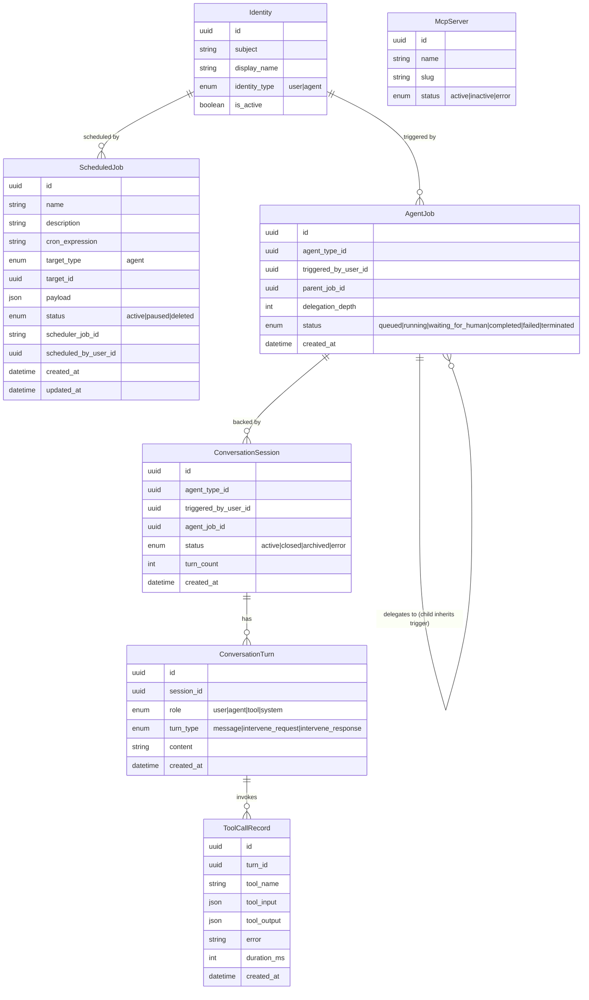

# Agent Runtime Monitor — Data Model

> Technology-agnostic entity model for trigger provenance and tool-call history. No SQL, ORM, or migration code. Schema files under `backend/app/db/models/` are the source of truth.

## Summary

This change adds **no new entities**. It adds one field to `ScheduledJob` (`scheduled_by_user_id`) and changes the **semantics** of an existing field on `AgentJob` (`triggered_by_user_id`) so that every running agent can surface who (or what) triggered it. Tool-call history (`ToolCallRecord`), MCP server nodes (`McpServer`), and user display names (`Identity`) are consumed **read-only** — no schema change to those entities.

| Entity | Change | Table | Source File |
|--------|--------|-------|-------------|
| `ScheduledJob` | New field `scheduled_by_user_id` (uuid, nullable → `Identity`) | `scheduled_jobs` | `backend/app/db/models/scheduling.py` |
| `AgentJob` | Semantics of existing `triggered_by_user_id` (no new column) | `agent_jobs` | `backend/app/db/models/agents.py` |
| `ToolCallRecord` | Read-only source of tool-call history | `tool_call_records` | `backend/app/db/models/conversations.py` |
| `McpServer` | Read-only source of MCP server nodes | `mcp_servers` | `backend/app/db/models/mcp_hub.py` |
| `Identity` | Read-only source of user display names | `identities` | `backend/app/db/models/identity.py` |

## New Entities

None. The PRD explicitly states no new database entities are introduced by this change ("the schedule 'scheduled by' user is an added field, not a new entity; no other schema additions").

## Modified Entities

### `ScheduledJob` — added field

Gains a nullable reference to the user identity that created the schedule, so a schedule-triggered agent can surface the schedule's "scheduled by" user as its trigger source.

- **`scheduled_by_user_id`** — `uuid`, nullable, FK → `Identity` (user who created the schedule).

Existing fields are unchanged: `id`, `name`, `description`, `cron_expression`, `target_type` (enum: `agent`), `target_id`, `payload`, `status` (enum: `active | paused | deleted`), `scheduler_job_id`, `created_at`, `updated_at`.

### `AgentJob` — semantic change only (no new column)

The existing `triggered_by_user_id` field (uuid, nullable, FK → `Identity`) already records the identity that triggered/launched the job. This change defines how the value is **populated** so trigger provenance is consistent across all launch paths:

- **Direct user trigger** — `triggered_by_user_id` is set to the triggering user's `Identity`.
- **Delegated child job** — inherits `triggered_by_user_id` from its parent job (via `parent_job_id`), so a delegated agent shows the same trigger source as its parent.
- **Schedule-triggered job** — `triggered_by_user_id` is copied from the schedule's `scheduled_by_user_id` at trigger time; the schedule **name** is shown as the trigger source.

No schema change is required for `AgentJob` — the column already exists.

## Removed Entities/Fields

None.

## Relationships

**Notes:**

- **`ToolCallRecord` → MCP server** is **not** a foreign-key relationship. The serving `McpServer` is derived at render time from the namespaced tool name (`server____tool`): the slug prefix maps to `McpServer.slug`, the remainder is the tool name. This is why `McpServer` appears without a direct relationship line to `ToolCallRecord`.
- **`AgentJob.parent_job_id`** is a self-referencing uuid (optional) that drives trigger inheritance for delegated children.

## Schema File References

| File | Change | Action |
|------|--------|--------|
| `backend/app/db/models/scheduling.py` | Add `scheduled_by_user_id` (uuid, nullable, FK → `Identity`) to `ScheduledJob` | Update model |
| `backend/app/db/models/agents.py` | No schema change — `triggered_by_user_id` already exists | Read-only reference |
| `backend/app/db/models/conversations.py` | No schema change — `ToolCallRecord` read as tool-call history source | Read-only reference |
| `backend/app/db/models/mcp_hub.py` | No schema change — `McpServer` read for node rendering (slug lookup) | Read-only reference |
| `backend/app/db/models/identity.py` | No schema change — `Identity` read for `display_name` | Read-only reference |

## Master Data Model Update Instructions

After implementation, update these master files:

1. **`docs/master/data-model/modules/scheduling/entities.md`** — add `uuid scheduled_by_user_id` to the `ScheduledJob` block; add relationship `Identity ||--o{ ScheduledJob : "scheduled by"`; extend the entity description to mention the "scheduled by" user.
2. **`docs/master/data-model/modules/operations/entities.md`** — the `ScheduledJob` block here also carries schedule fields; add `uuid scheduled_by_user_id` to keep it consistent (or remove the duplicate and reference the scheduling module).
3. **`docs/master/data-model/modules/communication/entities.md`** — in the `AgentJob` block, add `uuid triggered_by_user_id` and `uuid parent_job_id`; add relationships `Identity ||--o{ AgentJob : "triggered by"` and `AgentJob ||--o{ AgentJob : "delegates to"`; note the trigger-provenance inheritance semantics.
4. **`docs/master/data-model/overview.md`** — update the aggregate `erDiagram` to reflect `ScheduledJob.scheduled_by_user_id`, `AgentJob` → `Identity` trigger relationship, and the self-delegation relationship.

No new module files are required since no new entities are introduced.
