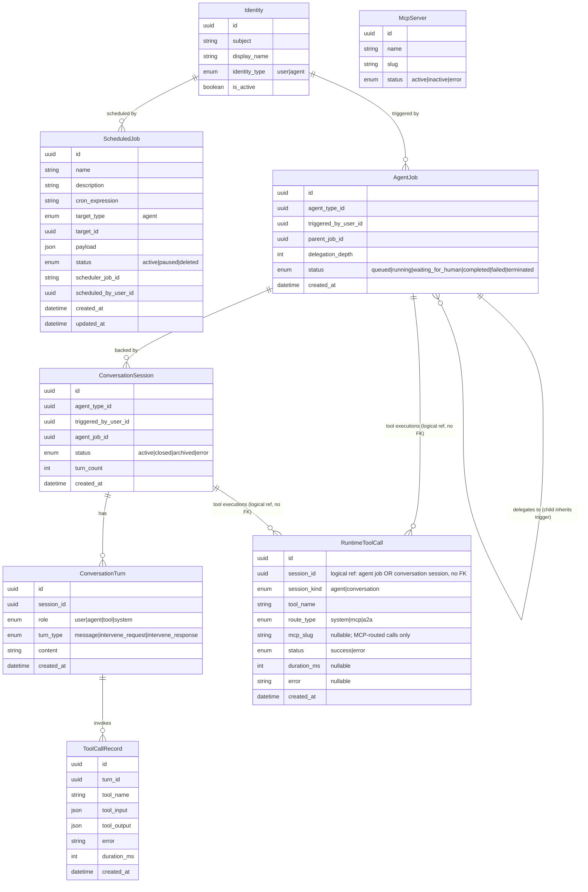

# Agent Runtime Monitor — Data Model

> Technology-agnostic entity model for trigger provenance and tool-call history. No SQL, ORM, or migration code. Schema files under `backend/app/db/models/` are the source of truth.

## Summary

This change adds one new entity, **`RuntimeToolCall`** — a runtime event log written by Agent Runtime (via the Control Center internal API) for every tool execution. It also adds one field to `ScheduledJob` (`scheduled_by_user_id`) and changes the **semantics** of an existing field on `AgentJob` (`triggered_by_user_id`) so that every running agent can surface who (or what) triggered it. Conversation-turn tool-call history (`ToolCallRecord`), MCP server nodes (`McpServer`), and user display names (`Identity`) are consumed **read-only** — no schema change to those entities.

| Entity | Change | Table | Source File |
|--------|--------|-------|-------------|
| `RuntimeToolCall` | **New entity** — runtime tool-call event log for agent jobs and conversation sessions | `runtime_tool_calls` | `backend/app/db/models/tool_calls.py` |
| `ScheduledJob` | New field `scheduled_by_user_id` (uuid, nullable → `Identity`) | `scheduled_jobs` | `backend/app/db/models/scheduling.py` |
| `AgentJob` | Semantics of existing `triggered_by_user_id` (no new column) | `agent_jobs` | `backend/app/db/models/agents.py` |
| `ToolCallRecord` | Read-only source of tool-call history | `tool_call_records` | `backend/app/db/models/conversations.py` |
| `McpServer` | Read-only source of MCP server nodes | `mcp_servers` | `backend/app/db/models/mcp_hub.py` |
| `Identity` | Read-only source of user display names | `identities` | `backend/app/db/models/identity.py` |

## New Entities

### `RuntimeToolCall` — runtime tool-call event log

Written by Agent Runtime for every tool execution (system tools, MCP tools, and A2A delegations) and reported to Control Center through the internal API. The Agent Runtime Monitor consumes it to render per-node tool-call routes and history for both agent jobs and conversation sessions.

- **`id`** — `uuid` (primary identifier).
- **`session_id`** — `uuid`, polymorphic: references an agent job **or** a conversation session, disambiguated by `session_kind`; deliberately a **logical reference with no enforced FK** (conversation turns execute without a backing agent job, so a single FK cannot express both targets).
- **`session_kind`** — `enum`: `agent | conversation`.
- **`tool_name`** — `string`.
- **`route_type`** — `enum`: `system | mcp | a2a` — routing path the call took.
- **`mcp_slug`** — `string`, nullable — MCP server slug, set only for MCP-routed calls.
- **`status`** — `enum`: `success | error`.
- **`duration_ms`** — `int`, nullable.
- **`error`** — `string`, nullable.
- **`created_at`** — `datetime`.

The PRD's original "no new entities" statement referred to the schedule-creator addition only; the runtime tool-call event log was introduced during implementation as `RuntimeToolCall` to support per-node tool-call routes.

## Modified Entities

### `ScheduledJob` — added field

Gains a nullable reference to the user identity that created the schedule, so a schedule-triggered agent can surface the schedule's "scheduled by" user as its trigger source.

- **`scheduled_by_user_id`** — `uuid`, nullable, FK → `Identity` (user who created the schedule).

Existing fields are unchanged: `id`, `name`, `description`, `cron_expression`, `target_type` (enum: `agent`), `target_id`, `payload`, `status` (enum: `active | paused | deleted`), `scheduler_job_id`, `created_at`, `updated_at`.

### `AgentJob` — semantic change only (no new column)

The existing `triggered_by_user_id` field (uuid, nullable, FK → `Identity`) already records the identity that triggered/launched the job. This change defines how the value is **populated** so trigger provenance is consistent across all launch paths:

- **Direct user trigger** — `triggered_by_user_id` is set to the triggering user's `Identity`.
- **Delegated child job** — inherits `triggered_by_user_id` from its parent job (via `parent_job_id`), so a delegated agent shows the same trigger source as its parent.
- **Schedule-triggered job** — `triggered_by_user_id` is copied from the schedule's `scheduled_by_user_id` at trigger time; the schedule **name** is shown as the trigger source.

No schema change is required for `AgentJob` — the column already exists.

> **`trigger_user_label` note (API-level):** the topology projection exposes a `trigger_user_label` display label per execution. It is **derived at read time** — from `triggered_by_user_id` for direct and delegated triggers, and from the schedule's `scheduled_by_user_id` for schedule triggers (no label when the creator is unknown). It is not a persisted field and not an entity on `AgentJob`.

## Removed Entities/Fields

None.

## Relationships

**Notes:**

- **`ToolCallRecord` → MCP server** is **not** a foreign-key relationship. The serving `McpServer` is derived at render time from the namespaced tool name (`server____tool`): the slug prefix maps to `McpServer.slug`, the remainder is the tool name. This is why `McpServer` appears without a direct relationship line to `ToolCallRecord`.
- **`RuntimeToolCall.session_id`** is a **polymorphic logical reference with no enforced FK**: when `session_kind` is `agent` it holds an `AgentJob` id; when `session_kind` is `conversation` it holds a `ConversationSession` id. The two relationship lines to `RuntimeToolCall` in the diagram are therefore logical references, not enforced foreign keys. `RuntimeToolCall.mcp_slug` similarly maps to `McpServer.slug` at render time for MCP-routed calls (no FK).
- **`AgentJob.parent_job_id`** is a self-referencing uuid (optional) that drives trigger inheritance for delegated children.

## Schema File References

| File | Change | Action |
|------|--------|--------|
| `backend/app/db/models/tool_calls.py` | New entity `RuntimeToolCall` — runtime tool-call event log (`runtime_tool_calls`) for agent jobs and conversation sessions | New file |
| `backend/app/db/models/scheduling.py` | Add `scheduled_by_user_id` (uuid, nullable, FK → `Identity`) to `ScheduledJob` | Update model |
| `backend/app/db/models/agents.py` | No schema change — `triggered_by_user_id` already exists | Read-only reference |
| `backend/app/db/models/conversations.py` | No schema change — `ToolCallRecord` read as tool-call history source | Read-only reference |
| `backend/app/db/models/mcp_hub.py` | No schema change — `McpServer` read for node rendering (slug lookup) | Read-only reference |
| `backend/app/db/models/identity.py` | No schema change — `Identity` read for `display_name` | Read-only reference |

## Master Data Model Update Instructions

After implementation, update these master files:

1. **`docs/master/data-model/modules/scheduling/entities.md`** — add `uuid scheduled_by_user_id` to the `ScheduledJob` block; add relationship `Identity ||--o{ ScheduledJob : "scheduled by"`; extend the entity description to mention the "scheduled by" user.
2. **`docs/master/data-model/modules/operations/entities.md`** — the `ScheduledJob` block here also carries schedule fields; add `uuid scheduled_by_user_id` to keep it consistent (or remove the duplicate and reference the scheduling module).
3. **`docs/master/data-model/modules/communication/entities.md`** — in the `AgentJob` block, add `uuid triggered_by_user_id` and `uuid parent_job_id`; add relationships `Identity ||--o{ AgentJob : "triggered by"` and `AgentJob ||--o{ AgentJob : "delegates to"`; note the trigger-provenance inheritance semantics. Add the **`RuntimeToolCall`** entity (attributes per the New Entities section above) and the labelled logical relationships `AgentJob ||--o{ RuntimeToolCall : "tool executions (logical ref, no FK)"` and `ConversationSession ||--o{ RuntimeToolCall : "tool executions (logical ref, no FK)"`; note that `session_id` is polymorphic with no enforced FK.
4. **`docs/master/data-model/overview.md`** — update the aggregate `erDiagram` to reflect `ScheduledJob.scheduled_by_user_id`, `AgentJob` → `Identity` trigger relationship, the self-delegation relationship, and the new `RuntimeToolCall` entity with its two labelled logical relationships.

No new module files are required — `RuntimeToolCall` is documented in the communication module alongside `AgentJob`, `ConversationSession`, and `ToolCallRecord`.
