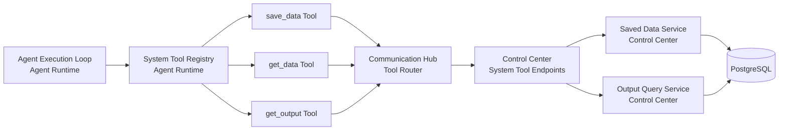
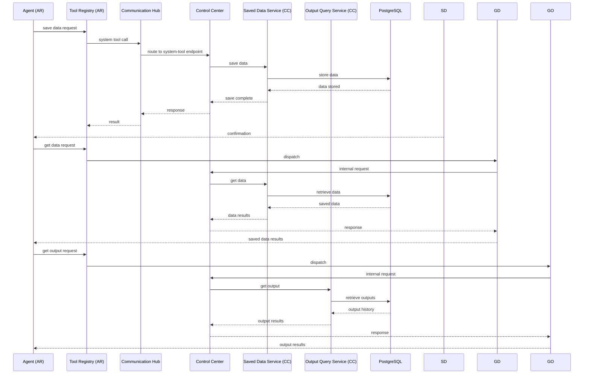

# Architecture — Agent Save Data + Retrieval Tools

## Changed Components

- Agent Runtime tool registry updates:
  - `save_result` is replaced by `save_data` in the default/system tool set.
  - Tool invocation semantics now distinguish intermediate saved data from final session output.
- Control Center service scope expands to support:
  - Saved data record persistence and querying.
  - Session output history querying by agent/session/time filters.
- Existing session output persistence remains in Control Center as the system of record for final outputs.

## New Components

- `save_data` tool in Agent Runtime (calls through Communication Hub).
- `get_data` tool in Agent Runtime (calls through Communication Hub).
- `get_output` tool in Agent Runtime (calls through Communication Hub).
- Communication Hub endpoint routing table extended with three new system tool entries.
- Control Center internal query/persistence capability for saved-data records and output-history retrieval.

## Integration Points

- Changed: Agent Runtime tool registry → `save_data` tool (replaces `save_result`).
- New: Agent Runtime tool registry → `get_data` tool.
- New: Agent Runtime tool registry → `get_output` tool.
- Changed: Communication Hub tool routing table → three new `system____*` entries mapping to Control Center system-tool endpoints.
- New: Control Center internal system-tool endpoints for save/query operations.
- Unchanged guardrail: all Agent Runtime tool calls flow through Communication Hub; only Control Center performs database reads/writes.

## Data Flow Changes

- Intermediate data flow:
  - Agent invokes `save_data` any number of times during execution.
  - Agent Runtime forwards request to Control Center.
  - Control Center stores intermediate session data.
- Saved-data retrieval flow:
  - Agent invokes `get_data` to retrieve previously saved data.
  - Agent Runtime forwards query to Control Center.
  - Control Center returns saved data results.
- Final-output retrieval flow:
  - Agent invokes `get_output` to retrieve session outputs.
  - Agent Runtime forwards query to Control Center.
  - Control Center returns output history results.

## Master Arch Update Instructions

- Update master architecture system-context/service-boundary diagram to include three Agent Runtime system tools: `save_data`, `get_data`, `get_output`.
- Update master data-flow diagram to show mandatory routing path:
  - Agent Runtime (tool adapters) → Control Center API → PostgreSQL.
- Update master component responsibility matrix:
  - Agent Runtime: tool registration and internal forwarding only.
  - Control Center: authorization boundary for persistence/query and exclusive database access.
- Update master terminology from `save_result` to:
  - `save_data` for intermediate named records.
  - `output` for final session completion artifact.
