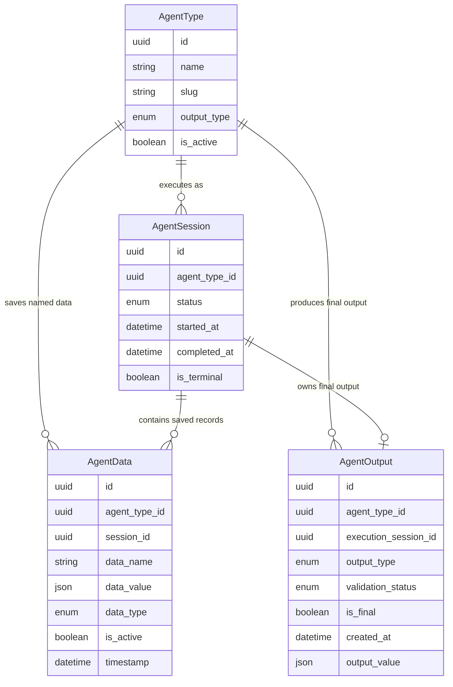

# Data Model

## 1) New Entities

- Add AgentData as a distinct business entity for explicitly saved intermediate records created by save_data.
- Keep final output as a separate artifact (AgentOutput) to preserve one-final-output-per-session semantics.

## 2) Modified Entities

- Agent tool semantics:
- Rename tool contract from save_result to save_data (terminology and business meaning update).
- AgentOutput:
- No required structural field changes for this epic.
- Reused for get_output queries by agent_type, session, and date range.
- AgentSession:
- No required structural field changes for this epic.
- Reused as session context for both AgentData and AgentOutput retrieval.

## 3) Removed Entities/Fields

- Remove end-user exposure of save_result naming from documentation and tool catalog.
- Remove legacy ResultRecord business role for intermediate persistence to avoid overlap with final output semantics.
- Rationale:
- save_data represents optional, many-per-session intermediate records.
- output remains the single final session artifact.

## 4) Schema File References

- `backend/app/db/models/agent_data.py` — AgentData entity
- `backend/app/db/models/agent_output.py` — AgentOutput entity
- `backend/app/db/models/agents.py` — AgentSession and AgentType entities
- `backend/app/db/models/results.py` — legacy ResultRecord entity

## 5) Master Data Model Update Instructions

Update master docs in docs/master/data-model/:

- docs/master/data-model/overview.md
- Add AgentData to the Agents domain ER view.
- Replace save_result wording with save_data.
- Clarify: saved data is intermediate and optional; output is final and singular per session.
- docs/master/data-model/modules/agents/entities.md
- Add AgentData entity definition and relationships to AgentType and AgentSession.
- Update AgentOutput and AgentSession descriptions to include get_output and get_data query use cases.
- Remove ResultRecord references as an intermediate-data concept.
- Ensure all diagrams and entity tables consistently use save_data terminology.
