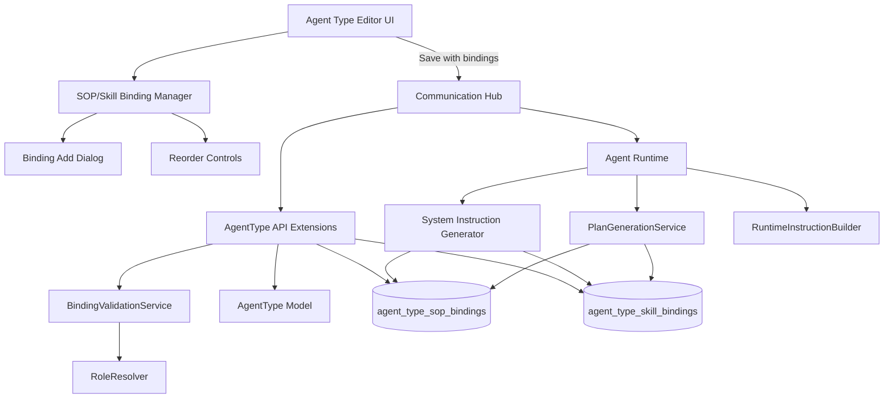
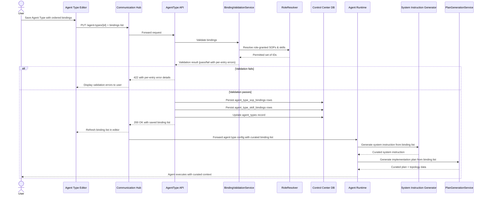

# Architecture: Agent Type Multi-SOP Binding

## 1. Changed Components

### Agent Type Editor (UI)
- **`frontend/src/components/agent-types/AgentTypeEditor.tsx`** — Binding list replaces the single "Primary SOP" dropdown. A new **SOP/Skill Binding Manager** section displays the merged, ordered binding list with reorder controls, inline editing, and an add-binding action.
- Binding picker dropdowns gate selectable items to only SOPs and skills accessible through the agent's assigned role(s). Duplicate and role-inaccessible items are rejected client-side before submit; server-side validation provides the final enforcement.

### Agent Type API (REST Endpoints — Control Center)
- **`backend/app/api/v1/agent_types.py`** — `POST /agent-types` and `PUT /agent-types/{id}` accept a new `bindings` payload (array of `{type: "sop"|"skill", sop_id: uuid | skill_id: uuid, order: int}`). The single `primary_sop_id` field is removed from the request/response schema.
- **`backend/app/api/v1/agent_types.py`** — `GET /agent-types/{id}` returns the merged, ordered binding list alongside the agent type record.
- Binding validation endpoint (reuses existing PUT/POST): validates that every bound SOP or skill is accessible through at least one role assigned to the agent type's identity. Returns specific per-entry error messages for unreachable references or duplicates.

### System Instruction Generator
- **`backend/app/services/system_instruction_generator.py`** — Reads the merged, ordered binding list (`agent_type_sop_bindings` + `agent_type_skill_bindings`) instead of enumerating all role-assigned SOPs and skills. When no bindings exist, falls back to current behavior (all role-assigned). Bound entries are presented in their saved order as context to the LLM.

### Agent Plan Mode / PlanGenerationService
- **`backend/app/services/plan_generation_service.py`** — Uses the curated binding list (instead of all role-assigned) when generating the implementation plan for a new or updated Agent Type. The topology diagram renders only bound SOPs and skills, showing relationships from agent type → each bound entry → downstream tool/skill connections.

### RuntimeInstructionBuilder
- **`backend/app/services/runtime_instruction_builder.py`** — Loads the curated binding list from `agent_type_sop_bindings` and `agent_type_skill_bindings` to construct runtime instructions. Bound entries are presented in their saved order.

---

## 2. New Components

**Diagram legend**: Dashed nodes represent new or substantially changed components; solid nodes represent existing components with modified behavior. Arrows to join tables represent logical data dependency — actual data access is mediated through Communication Hub and Control Center, never directly from Agent Runtime services.

### SOP/Skill Binding Manager
A new UI section embedded in the Agent Type Editor. Manages the display and manipulation of the merged, ordered binding list. Sub-components:

| Sub-component | Responsibility |
|---|---|
| **Binding List Table** | Displays merged bindings in order, showing type badge (SOP/Skill), name, and order number |
| **Binding Add Dialog** | Selects binding type (SOP or Skill), picks target from role-filtered list, appends to end of list |
| **Reorder Controls** | Move-up/move-down buttons per row; keyboard-navigable |
| **Remove Control** | Delete button per row; removal is committed on the main Agent Type save action |

### AgentType API Schema Extensions
New request/response shape for the Agent Type endpoints. The `bindings` field in the payload is an ordered array:

| Payload Field | Type | Description |
|---|---|---|
| `bindings` | `Array<BindingEntry>` | Ordered list of binding entries |
| `BindingEntry.type` | `"sop" \| "skill"` | Whether this entry references an SOP or a skill |
| `BindingEntry.order` | `int` | Zero-based position in the merged binding list |
| `BindingEntry.sop_id` | `uuid` (conditional) | Present when `type` is `"sop"` |
| `BindingEntry.skill_id` | `uuid` (conditional) | Present when `type` is `"skill"` |

The `primary_sop_id` field is removed from the Agent Type read/write schema. Existing consumers that expected `primary_sop_id` receive the first SOP binding (if any) as the effective primary.

### BindingValidationService
Server-side validation logic invoked during Agent Type create/update:
- Resolves the agent type's assigned role(s) to a full set of permitted SOP and skill IDs via **RoleResolver**.
- Rejects any binding entry referencing an SOP or skill outside the role-granted set, with a specific per-entry error.
- Rejects duplicate bindings (same SOP or skill referenced more than once across both join tables).
- Validates that binding order values are sequential and non-negative.

---

## 3. Integration Points

### Binding Validation ↔ Role Resolution
When an Agent Type is saved, the **BindingValidationService** calls **RoleResolver** (`backend/app/services/role_resolver.py`) with the agent type's `identity_id` and `role_id` to obtain the full set of permitted SOP IDs and skill IDs. RoleResolver returns the union of all SOPs and skills granted through the assigned role(s). Bindings are validated against this resolved set. Rejected bindings produce a 422 response with per-entry error details.

### Communication Hub → Agent Runtime: Binding Forwarding
When the Communication Hub forwards agent type configuration to Agent Runtime for execution, the curated binding list is included in the forwarded payload. Agent Runtime receives only the resolved binding list (not full role permission data), consistent with the top-priority rule that agents must not receive sensitive identity/permission data.

### PlanGenerationService → Topology Diagram
The Agent Plan Mode topology diagram (rendered in the UI after plan generation) reflects only bound SOPs and skills. The diagram data is computed from the binding list stored in `agent_type_sop_bindings` and `agent_type_skill_bindings`, showing the curated capability graph rather than the full role-assigned superset.

---

## 4. Data Flow Changes

**Key data flow changes**:
1. The single `primary_sop_id` field is no longer written — the binding list replaces it.
2. Bindings are validated against the role's permitted SOP/skill set **before** persistence (gate check).
3. The curated binding list is resolved by Control Center and included in the config payload forwarded by Communication Hub to Agent Runtime. System Instruction Generator and PlanGenerationService consume this forwarded binding list — they never access the database directly, preserving the three-service segregation rule.
4. When no bindings exist, the generators fall back to the current role-enumeration behavior (backward compatibility).

---

## 5. Master Arch Update Instructions

Update `docs/master/architecture/modules/agent-types.md`:

### Replace Diagram 1 (System Flow)
The current flowchart shows `Agent Type Editor → Communication Hub → Agent Runtime → PlanGenerationService / RuntimeInstructionBuilder → SOP decision → Default SOP or CH`. Replace with a new flowchart that:

1. **Shows the binding-based flow**: Agent Type Editor → Communication Hub → AgentType API (Control Center) → BindingValidationService → RoleResolver. After validation, data persists to the two new join tables.
2. **Shows generator consumption**: PlanGenerationService and RuntimeInstructionBuilder read the merged, ordered binding list from `agent_type_sop_bindings` and `agent_type_skill_bindings` (not from role enumeration).
3. **Shows the fallback path**: When no bindings exist, the generators fall back to all role-assigned SOPs/skills (current behavior preserved).
4. **Removes** the `SOP{SOP names in system instruction?}` decision node and the `DSOP[Default SOP for all input types]` node — these are replaced by the binding list resolution.
5. **Adds** the `BindingValidationService` and `RoleResolver` nodes.
6. **Adds** the two new join tables as data store nodes.
7. Max 15 nodes.

### Replace Diagram 2 (Instruction Context)
The current flowchart shows `System Instruction → Named SOP present? → Referenced SOP Set / Default SOP → Plan Context / Runtime Instruction`. Replace with a new flowchart that:

1. **Replaces** the `Named SOP present?` decision with a `Bindings exist?` decision.
2. **On Yes (bindings exist)**: reads the merged, ordered binding list → produces curated SOP and skill context → feeds Plan Context and Runtime Instruction in saved order.
3. **On No (no bindings)**: falls back to all role-assigned SOPs and skills → feeds Plan Context and Runtime Instruction (current behavior).
4. **Shows** that both SOP bindings and skill bindings are merged into a single ordered context list before being passed to PlanContext and RuntimeInstruction.
5. Max 10 nodes.

### Document the New Binding Flow
Add a bullet-list description of the binding lifecycle:
- Binding entry creation, reordering, and deletion within the Agent Type editor.
- Validation against role-resolved permissions on save.
- How the merged, ordered binding list feeds the system instruction generator and Agent Plan Mode.
- Fallback behavior when no bindings are configured.
