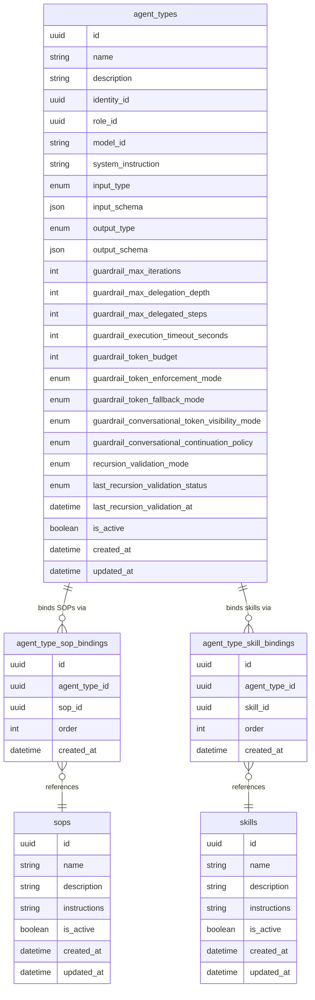

# Agent Type Multi-SOP Binding — Data Model

## 1. New Entities

Two join entities replace the single `primary_sop_id` field on `AgentType`, introducing the same ordered-binding pattern already used by `SkillToolBinding` (skill ↔ tool) and `AgentRoleSOP` (role ↔ SOP).

### `agent_type_sop_bindings`

Links an `AgentType` to a `Sop` with an explicit ordering position. Each (`agent_type_id`, `sop_id`) pair is unique — the same SOP cannot be bound twice to the same agent type. The `order` field determines the sequence in which bound SOPs are presented as context to the system instruction generator and Agent Plan Mode.

| Attribute | Type | Description |
|---|---|---|
| `id` | uuid | Surrogate primary key |
| `agent_type_id` | uuid | FK → `agent_types.id`; cascade delete |
| `sop_id` | uuid | FK → `sops.id`; cascade delete |
| `order` | int | Zero-based position within the agent type's ordered binding list |
| `created_at` | datetime | Row creation timestamp |

### `agent_type_skill_bindings`

Links an `AgentType` to a `Skill` with an explicit ordering position. Each (`agent_type_id`, `skill_id`) pair is unique — the same skill cannot be bound twice to the same agent type. The `order` field determines the sequence alongside SOP bindings.

| Attribute | Type | Description |
|---|---|---|
| `id` | uuid | Surrogate primary key |
| `agent_type_id` | uuid | FK → `agent_types.id`; cascade delete |
| `skill_id` | uuid | FK → `skills.id`; cascade delete |
| `order` | int | Zero-based position within the agent type's ordered binding list |
| `created_at` | datetime | Row creation timestamp |

> **Design note**: The order space is shared across both binding types. The agent type's full curated capability list is the merged, ordered sequence of `agent_type_sop_bindings` and `agent_type_skill_bindings`. The UI and generators consume this merged list in `order` sequence.

---

## 2. Modified Entities

### `agent_types` — Field Removal

The `primary_sop_id` field is removed. The direct `primary_sop` relationship to `Sop` is removed. The single-SOP binding is replaced by one or more `agent_type_sop_bindings` rows.

| Field | Change | Notes |
|---|---|---|
| `primary_sop_id` | **Removed** | Replaced by `agent_type_sop_bindings`; existing values are migrated into a single binding row with `order = 0` |

No other fields on `agent_types` are added, removed, or modified.

---

## 3. Removed Entities/Fields

| Entity | Field Removed | Replaced By | Reason |
|---|---|---|---|
| `agent_types` | `primary_sop_id` | `agent_type_sop_bindings` | Single-SOP binding cannot express multi-SOP curation; replaced by the ordered join-table pattern already established by `AgentRoleSOP` and `SkillToolBinding` |

No entities are removed.

---

## 4. Schema File References

Per `docs/config.yaml` `source.schema`: `backend/app/db/models/`

| File | Action | Reason |
|---|---|---|
| `backend/app/db/models/agents.py` | Add `AgentTypeSopBinding` model | New join entity |
| `backend/app/db/models/agents.py` | Add `AgentTypeSkillBinding` model | New join entity |
| `backend/app/db/models/agents.py` | Remove `primary_sop_id` column and `primary_sop` relationship from `AgentType` | Field replaced by join entities |
| `backend/alembic/versions/` | Generate migration via `alembic revision --autogenerate` | Schema change — remove column, add two new tables |

---

## 5. Master Data Model Update Instructions

Update the following in `docs/master/data-model/`:

- **`overview.md` — Agent Management ER diagram**: Add `agent_type_sop_bindings` and `agent_type_skill_bindings` entities with their attributes and relationships. Remove `primary_sop_id` from `agent_types`. Add relationships: `agent_types ||--o{ agent_type_sop_bindings`, `agent_types ||--o{ agent_type_skill_bindings`, `agent_type_sop_bindings }o--|| sops`, `agent_type_skill_bindings }o--|| skills`. Add the cross-domain relationship `agent_types ||--o{ agent_type_sop_bindings` to the Cross-Domain Relationship Map.
- **`overview.md` — Skills & SOPs ER diagram**: No changes needed. SOPs and Skills are read-only targets of the new binding entities; their own schemas are unaffected.
- **`modules/agents/entities.md`** (create if absent): Add entries for `agent_type_sop_bindings` and `agent_type_skill_bindings`. Document the ordered-list binding pattern and the shared order space across both binding types. Note that binding validation ensures referenced SOPs and skills are accessible through the agent's assigned role.
