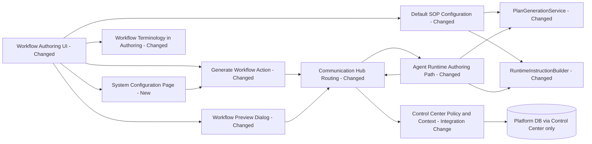
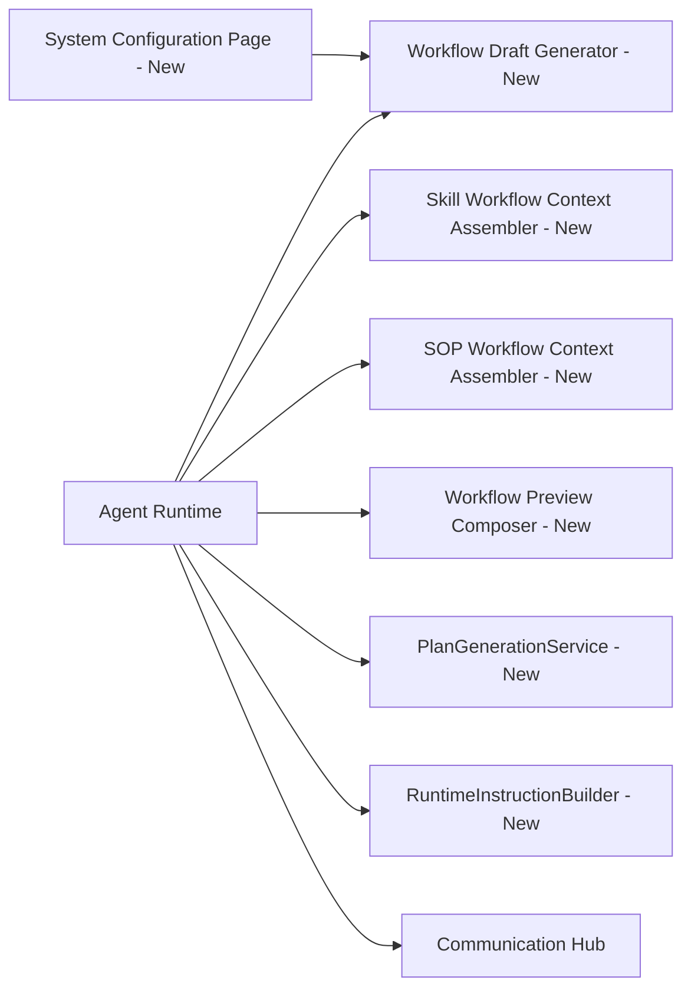
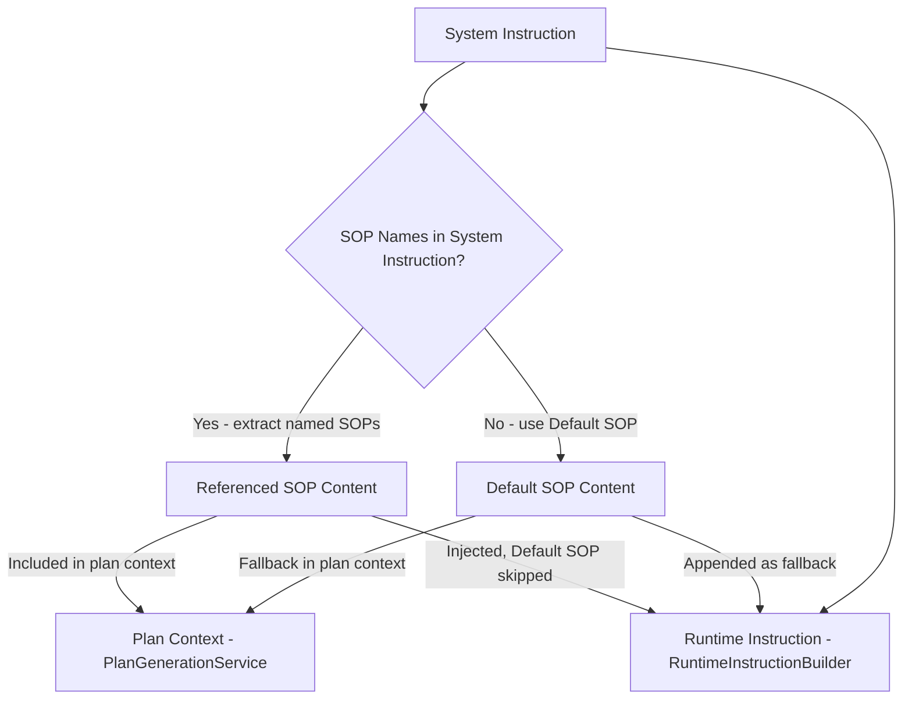
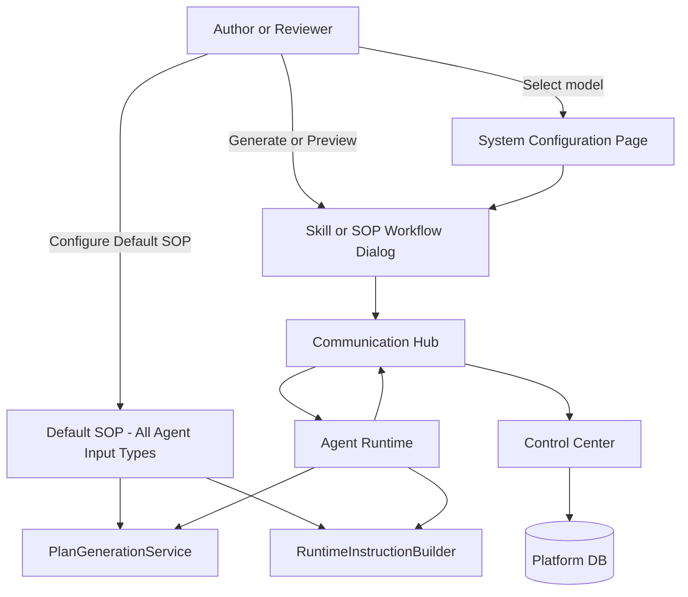
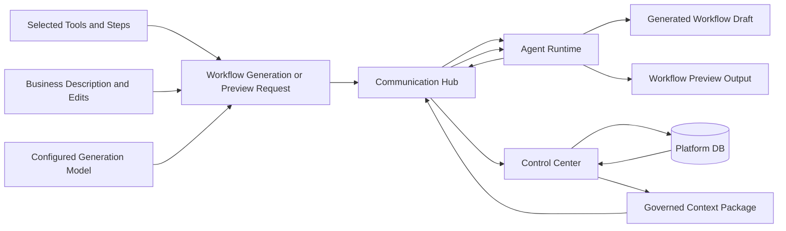
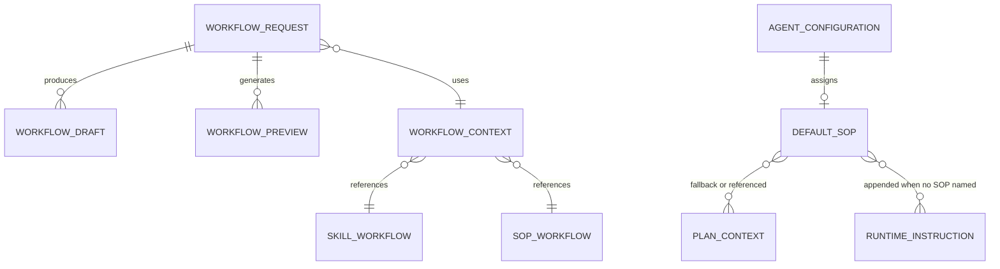
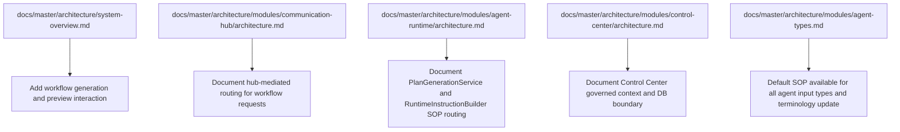

# Architecture: AI-Assisted Workflow Authoring for SOP and Skill

## Changed Components

This change updates existing authoring interactions to use workflow terminology and preserves service boundaries where the agent runtime handles authoring while Control Center remains the only database-facing service.
It also adds a system configuration entry point for selecting the workflow generation model, reusing the existing model configuration surface so administrators can control the generator used by Skill and SOP authoring.
Default SOP (renamed from Primary SOP) is now configurable for every agent input type, and two components — PlanGenerationService and RuntimeInstructionBuilder — are updated to apply system-instruction-aware SOP selection.

## New Components

New workflow-focused authoring capabilities are introduced in the runtime path to generate and preview workflow drafts for both skill and SOP contexts.
The design also introduces a system configuration surface for selecting the generation model, and two new services that implement system-instruction-aware SOP routing for plan generation and runtime execution.

## SOP Routing Logic

Both plan generation and runtime execution apply the same decision rule: if the system instruction names specific SOPs, only those SOPs are used; otherwise the Default SOP is applied as a fallback.
At runtime, the Default SOP is never injected alongside named SOPs — it is appended only when the system instruction references no SOP by name.

## Integration Points

Integration remains hub-mediated end to end: UI requests route through the Communication Hub to Agent Runtime, while governed context comes from Control Center using sanitized data only.
The system configuration page feeds the selected generation model into the governed path so the chosen model is used consistently by both authoring flows and is visible in preview headers.
Default SOP is now configurable for all agent input types and feeds into both PlanGenerationService and RuntimeInstructionBuilder through the same governed path.

## Data Flow Changes

Workflow generation and preview now combine author inputs with governed context so that output quality improves without allowing direct agent runtime access to sensitive data stores.
The configured generation model is part of that governed context and is surfaced in preview headers for reviewer clarity.
SOP context — whether named SOPs or the Default SOP fallback — is resolved from the governed context package before reaching PlanGenerationService or RuntimeInstructionBuilder.

## Business Entity Relationships

The workflow authoring domain centers on request, draft, and preview entities, with context supplied from governed sources rather than direct runtime data access.
Default SOP is now an agent-level configuration entity that applies to any agent input type and participates in both plan context and runtime instruction assembly.

## Master Arch Update Instructions

The following master architecture pages should be updated to reflect the workflow authoring flow, governed context boundary, consistent workflow terminology, and the system-instruction-aware Default SOP routing behavior.

