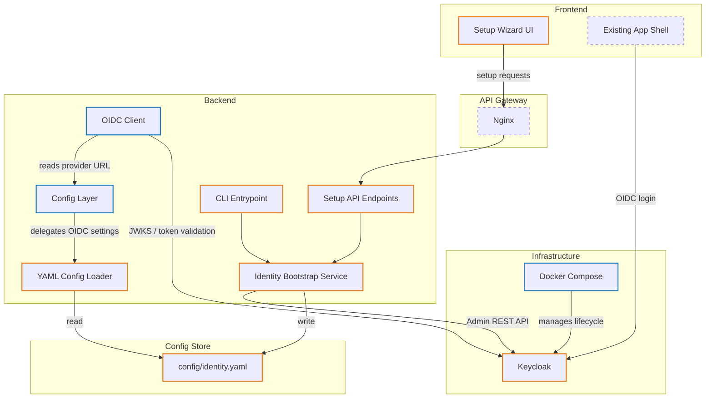
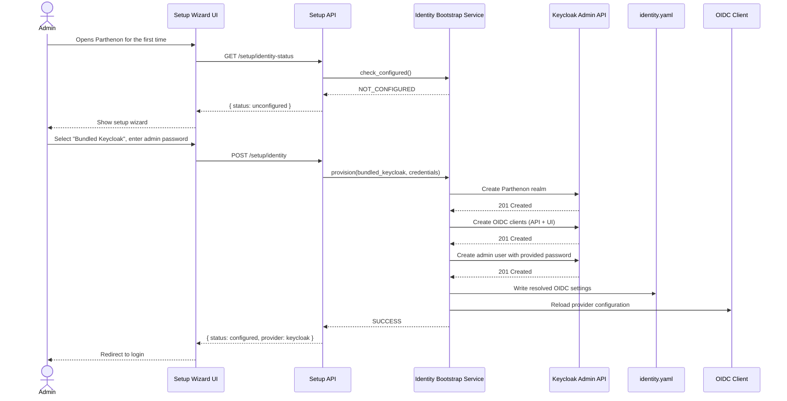

# Keycloak Identity Bootstrap — Architecture

## Changed Components

| Component | Current State | Change |
|---|---|---|
| **Config Layer** (`core/config.py`) | `Settings` class loads OIDC values from env vars only | Reads `config/identity.yaml` first, then applies env-var overrides; adds identity-status check |
| **OIDC Client** (`core/oidc_client.py`) | Singleton wired to a single static provider URL at startup | Provider URL resolved dynamically from the merged config (YAML + env); cache cleared on provider switch |
| **Docker Compose** (`docker-compose.yml`) | No identity provider service | Adds a `keycloak` service with realm-import volume mount and health check |
| **Start / Stop Scripts** (`.github/prompts/`) | Manage Postgres, Redis, OTEL stack only | Include Keycloak container lifecycle when bundled provider is active |

## New Components

| Component | Responsibility |
|---|---|
| **Identity Bootstrap Service** | Orchestrates first-run detection, Keycloak realm/client provisioning via Keycloak Admin REST API, and config persistence to `identity.yaml` |
| **YAML Config Loader** | Reads `config/identity.yaml`, merges with env-var overrides, and exposes resolved OIDC settings to the rest of the backend |
| **Setup API Endpoints** | Expose identity-status and provider-setup routes consumed by the frontend wizard (outside the authenticated perimeter) |
| **CLI Entrypoint** | Backend CLI command to run identity setup or provider switching headlessly, reusing the Identity Bootstrap Service |
| **Setup Wizard UI** | React multi-step wizard that detects unconfigured state and walks the admin through provider selection, credentials, and verification |

## Integration Point Changes

| Integration | Protocol | Change |
|---|---|---|
| **Keycloak ↔ Backend (Admin)** | Keycloak Admin REST API (HTTP) | New — used only during provisioning to create the Parthenon realm, clients, and initial admin user |
| **Keycloak ↔ Backend (Runtime)** | OpenID Connect (JWKS, token introspection) | Unchanged protocol — Keycloak becomes the default OIDC provider URL |
| **Keycloak ↔ Frontend** | OpenID Connect (Authorization Code + PKCE) | Unchanged protocol — frontend redirects to Keycloak login when bundled provider is active |
| **Frontend ↔ Backend (Setup)** | REST (unauthenticated) | New — Setup API endpoints for identity status and provider configuration |

## Data Flow Changes

### First-Run Detection Flow

When the backend starts, the Config Loader checks for `config/identity.yaml`. If the file is absent or has no configured provider, the backend reports an unconfigured identity status. The frontend detects this via the Setup API and presents the Setup Wizard.

### Setup Wizard Flow

The admin selects a provider type (bundled Keycloak or external OIDC), enters credentials, and submits. The backend's Identity Bootstrap Service provisions Keycloak (if bundled) or validates the external provider, writes the resolved settings to `identity.yaml`, and signals the OIDC Client to reload.

### CLI Setup Flow

The CLI entrypoint accepts provider type and credentials as arguments, delegates to the same Identity Bootstrap Service, and writes `identity.yaml` — identical outcome to the wizard, without a browser.

## Diagrams

### Component Diagram — New and Changed Components

> **Legend** — Orange border: new component · Blue border: changed component · Dashed border: unchanged, shown for context

### Sequence Diagram — First-Run Setup Flow (Bundled Keycloak)

## What to Update in `docs/master/`

After this change is implemented, the following master documents should be updated:

| Document | What to Add or Change |
|---|---|
| `architecture/system-overview.md` | Add Keycloak as an explicit node in the system diagram; update the OIDC Provider integration row to note it can be bundled or external |
| `architecture/modules/` (new file) | Add an **identity-bootstrap** module doc covering the Config Loader, Bootstrap Service, and Setup API |
| `deployment/` | Document the `config/identity.yaml` file, Keycloak container prerequisites, and first-run setup expectations |
| `operations/` | Add Keycloak start/stop lifecycle, health-check details, and provider-switching runbook reference |
