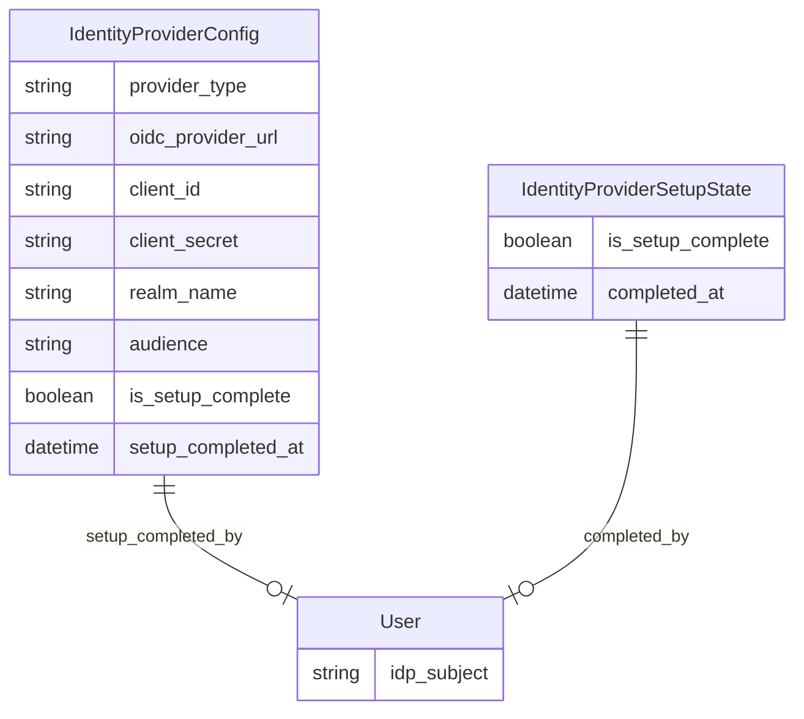

# Parthenon: Keycloak Identity Bootstrap — Data Model Changes

## 1. New Entities

### IdentityProviderConfig
- **Purpose**: Stores the current identity provider (IdP) configuration for authentication, enabling the application to track which IdP is active and whether initial setup is complete.
- **Key Attributes**:
  - Provider type (e.g., keycloak_bundled, keycloak_external, azure_entraid)
  - OIDC provider URL
  - Client ID and client secret
  - Realm name
  - Audience
  - Is setup complete (flag)
  - Date/time setup was completed
  - User who completed setup
- **Relationships**: May reference the user who completed setup.

### IdentityProviderSetupState
- **Purpose**: Tracks the state of the first-run identity provider setup, including completion status, timestamp, and responsible user.
- **Key Attributes**:
  - Is setup complete (flag)
  - Date/time of completion
  - User who completed setup
- **Relationships**: References the user entity for the setup completer.

## 2. Modified Entities

### User
- **Modification**: Gains a new attribute to store the subject identifier from the external IdP (`idp_subject`), enabling linkage between application users and their identity provider accounts.
- **Relationships**: If added, this field links users to their external IdP identity.

## 3. Entity Relationship Diagram

## 4. Schema File References

- **To be created:**
  - `backend/app/db/models/identity_provider_config.py`
  - `backend/app/db/models/identity_provider_setup_state.py`
- **To be modified:**
  - `backend/app/db/models/user.py` (add `idp_subject` attribute)

## 5. What to Update in `docs/master/data-model/`

- Add new entity descriptions for `IdentityProviderConfig` and `IdentityProviderSetupState`
- Update the `User` entity description to include the `idp_subject` attribute
- Update the master entity relationship diagram to reflect new entities and relationships
