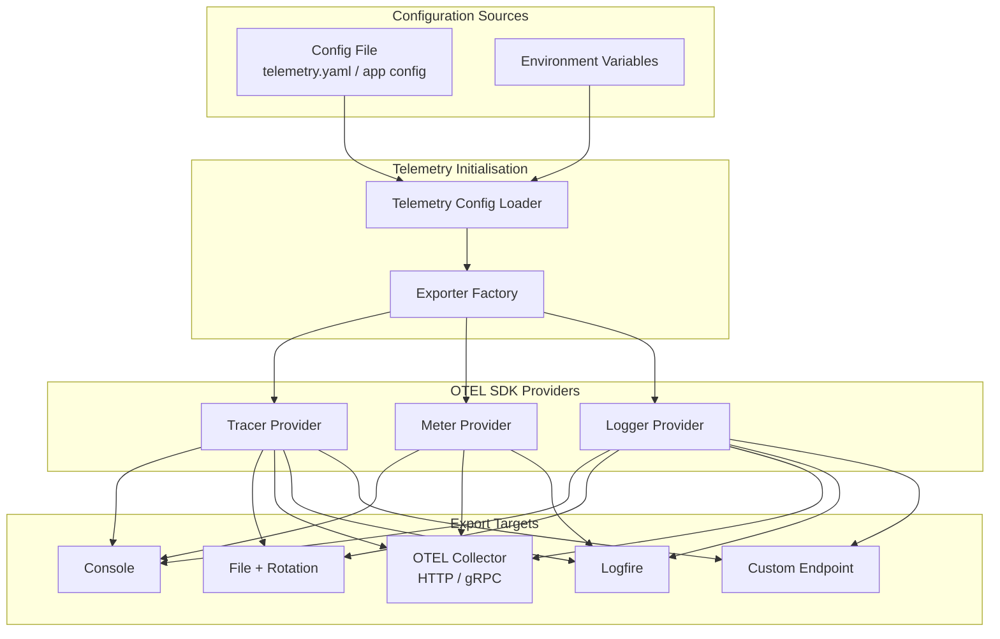
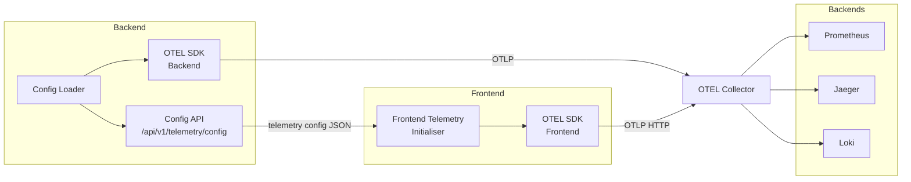
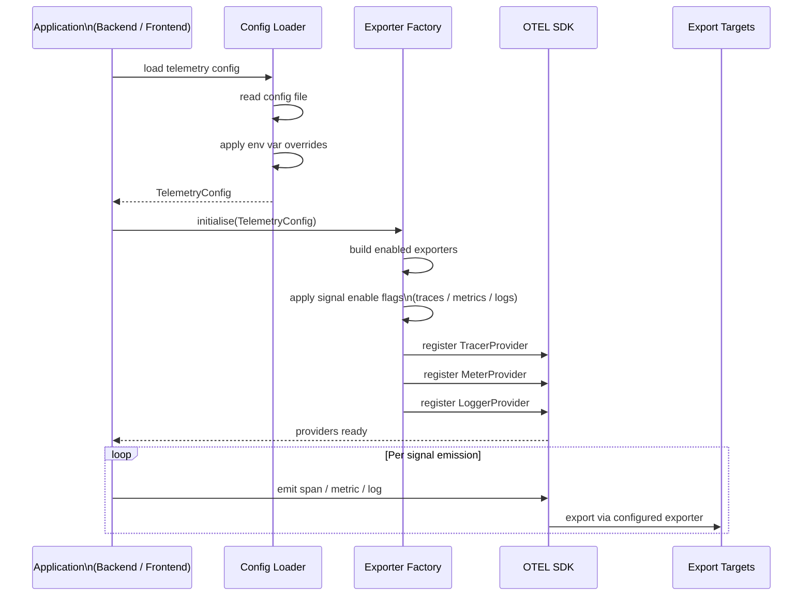

# Architecture Changes — Configurable Telemetry System

## Changed Components

| Component | Location | Change |
|---|---|---|
| **Backend Telemetry Module** | `backend/app/core/telemetry.py` | Hardcoded OTLP gRPC exporters replaced with config-driven exporter factory; providers initialised conditionally based on `TelemetryConfig` |
| **Frontend Telemetry Module** | `frontend/src/telemetry.ts` | Hardcoded OTLP endpoint replaced with runtime config lookup; OTEL SDK initialisation gated on enabled flags from config |
| **Backend App Config** | `backend/app/core/config.py` | `TelemetrySettings` section added covering export targets, signal enable flags, log levels, and exporter-specific parameters |

---

## New Components

Two new components are introduced: a **Telemetry Config Loader** (shared concern across backend and frontend) and an **Exporter Factory** that translates config into live OTEL provider registrations.

### Component Responsibilities

| Component | Responsibility |
|---|---|
| **Telemetry Config Loader** | Reads telemetry settings from config file and environment overrides; resolves final `TelemetryConfig` |
| **Exporter Factory** | Instantiates OTEL exporters and processors based on `TelemetryConfig`; registers `TracerProvider`, `MeterProvider`, and `LoggerProvider` |
| **Config File** | Declarative telemetry settings per deployment; lives alongside app config; compatible with Docker Compose and Kubernetes ConfigMap |

---

## Integration Points

**Integration notes:**
- The backend exposes a lightweight `/api/v1/telemetry/config` endpoint so the frontend can fetch its telemetry settings at startup without duplicating configuration.
- The OTEL Collector remains the primary fan-out hub; direct exporter targets (Logfire, custom endpoint) bypass the Collector only when explicitly configured.
- Environment variables take precedence over file-based config (12-factor pattern), enabling per-pod overrides in Kubernetes.

---

## Data Flow Changes

### Before (hardcoded)
All OTEL providers were initialised at startup with a single hardcoded OTLP gRPC endpoint and fixed log level. No runtime flexibility existed.

### After (config-driven)

**Key changes to data flow:**
- Config resolution now precedes SDK initialisation — providers are never registered without a resolved config.
- Signal types (traces, metrics, logs) are independently gated; a disabled signal produces a no-op provider, preserving instrumented code without side effects.
- Log level is applied at SDK initialisation time per component, not globally.
- Multiple exporters can be active simultaneously for the same signal (e.g., Console + OTEL Collector for local debugging alongside production pipeline).

---

## Master Arch Update Instructions

Update `docs/master/architecture/modules/observability.md`:

1. **Telemetry Pipeline diagram** — Extend to show the Config Loader feeding into the OTEL SDK block; add export target branches (Console, File, Logfire, Custom) alongside the existing Collector path.
2. **Instrumentation Strategy section** — Add a bullet describing config-driven exporter selection and the signal enable/disable capability.
3. **New section: Telemetry Configuration** — Document the `TelemetryConfig` resolution order (config file → env var overrides), the frontend config fetch pattern, and the supported export targets.

No changes required to `docs/master/architecture/system-overview.md` — observability remains a cross-cutting concern anchored to the OTEL Collector; the new config layer is an internal initialisation detail, not a topology change.
