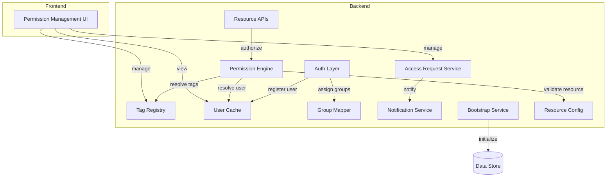

# Architecture: User Permission Management

**System Context:** This feature introduces a policy-based permission system for controlling human user access to Parthenon features and resources. It operates alongside — but separately from — the existing agent permission system that governs AI agent access.

## System Architecture

## Components

### Auth Layer
Verifies user identity on every request. On first login, it registers the user in the User Cache and triggers group assignment via the Group Mapper.

### Permission Engine
Evaluates whether a user may perform an action on a resource by applying tag-based policy conditions. Returns an allow or deny decision independently of the agent permission system.

### Tag Registry
Manages permission tag definitions — their allowed values and scope. Serves as the reference for both policy authoring and enforcement.

### User Cache
Tracks authenticated users to support permission lookups and administrative visibility. Kept current at login time and queried by the Permission Engine during authorization.

### Group Mapper
Automatically assigns users to groups based on identity claims received at login. Operates idempotently so repeated logins do not create duplicate memberships.

### Access Request Service
Manages the lifecycle of user requests to join groups — covering submission, review, and approval or rejection by group owners.

### Notification Service
Alerts group owners when a join request is submitted and notifies the requesting user when its status changes.

### Bootstrap Service
Ensures foundational system roles and policies exist before the application accepts traffic. Safe to run on every startup without side effects.

### Resource Config
Defines recognized resource types and their permitted actions. Acts as the authoritative schema for both policy authoring and runtime enforcement.

### Permission Management UI
Provides administrators with interfaces to manage roles, policies, tags, groups, and access requests.

---

## Integration Points

### Auth Layer ↔ User Cache and Group Mapper
The Auth Layer registers users in the User Cache and triggers group assignment via the Group Mapper on first login, ensuring users are known to the permission system before any protected resource is accessed.

### Permission Engine ↔ Resource APIs
Resource APIs delegate all authorization decisions to the Permission Engine before executing protected operations. A deny decision halts the operation and returns an error to the caller.

### Permission Engine ↔ Tag Registry and Resource Config
The Permission Engine consults the Tag Registry for tag definitions and the Resource Config to validate that requested resource types and actions are recognized before evaluating policy statements.

### Access Request Service ↔ Notification Service
The Access Request Service triggers the Notification Service whenever a request is created or its status changes, keeping both group owners and requesters informed.

### Bootstrap Service ↔ Data Store
The Bootstrap Service seeds the system admin role, its all-permissions policy, and the initial admin assignment on startup, guaranteeing the permission system is operable from the first request.

### Permission Management UI ↔ Backend
The UI coordinates with the Tag Registry, Permission Engine, Access Request Service, and User Cache to support all administrative permission workflows.
