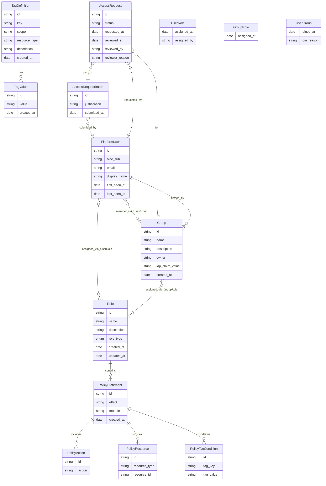

# User Permission Management — Data Model

**Context:** This data model defines entities for the **user permission system** which controls what human users can access and do in the Parthenon platform. This is distinct from the existing **agent permission system** which controls what AI agents can access. All API endpoints for this system use the `/api/v1/user-*` prefix to avoid conflicts.

## 1. New Entities

### Entity Relationship Diagram

### Entity List
- **TagDefinition** — Defines a tag key with allowed values and scope
- **TagValue** — Allowed values for a tag definition
- **Role** — A named permission role
- **PolicyStatement** — A permission statement belonging to a role
- **PolicyAction** — Actions within a policy statement
- **PolicyResource** — Resources scoped by a policy statement
- **PolicyTagCondition** — Tag-based conditions on a policy statement
- **PlatformUser** — Cached user from OIDC sign-in
- **UserRole** — Direct role assignment to a user (junction)
- **Group** — A named group of users
- **GroupRole** — Roles assigned to a group (junction)
- **UserGroup** — Users belonging to a group (junction)
- **AccessRequestBatch** — A user's submission requesting access to one or more groups (holds justification)
- **AccessRequest** — A request for access to a single group within a batch (holds status, reviewer, reviewer_reason)

## 2. Modified Entities
- **Role** — Added `role_type` field (enum: `system` | `user_defined`). Distinguishes system-managed roles (cannot be edited or deleted by users) from user-defined roles. Default value for all existing roles: `user_defined`.
- **AccessRequestBatch** — New entity for multi-group access request submissions
- **AccessRequest** — Now references AccessRequestBatch, justification moved to batch, reviewer_reason added

## 3. Removed Entities/Fields
- **None.** No entities or fields are removed.

## 4. Schema File References
- Modify existing model file:
  - `backend/app/db/models/role.py` — add `role_type` column (enum: `system` | `user_defined`; default `user_defined`)
- Create new model files in `backend/app/db/models/` for each entity:
  - `tag_definition.py`
  - `tag_value.py`
  - `role.py`
  - `policy_statement.py`
  - `policy_action.py`
  - `policy_resource.py`
  - `policy_tag_condition.py`
  - `platform_user.py`
  - `user_role.py`
  - `group.py`
  - `group_role.py`
  - `user_group.py`
  - `access_request_batch.py`
  - `access_request.py`

## 5. Master Data Model Update Instructions
- Add all new entities and their relationships to the master data model in `docs/master/data-model/overview.md`.
- Add references to these entities in the appropriate module subfolders under `docs/master/data-model/modules/` (e.g., `identity/`, `agents/`, etc.) as relevant to their usage.
