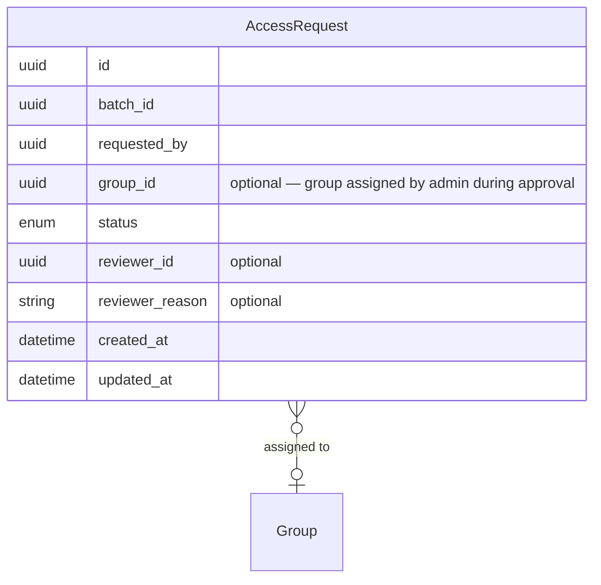

# Data Model — Group-Optional Access Request

## New Entities

None. This change modifies an existing entity only.

---

## Modified Entities

### AccessRequest

- **Change**: The `group_id` attribute is now optional.
- **Business reason**: Users who lack permissions to view groups can submit access requests without selecting a group. Administrators assign the appropriate group during the approval process.
- **Impact**: Access requests can exist in a "pending group assignment" state until an administrator completes the review.



| Attribute | Before | After |
|-----------|--------|-------|
| `group_id` | required | optional |

All other attributes are unchanged.

---

### AccessRequestBatch

No attribute changes. The existing `justification` field captures the user's free-text reason for access, displayed to administrators during review.

---

## Removed Entities / Attributes

None.

---

## Schema File References

| File | Change |
|------|--------|
| `backend/app/db/models/access_request.py` | `group_id` is now optional |

---

## Master Data Model Update Instructions

Update `docs/master/data-model/modules/identity/entities.md`:

1. **Relationship line** — change `AccessRequest }o--|| Group : "for"` to `AccessRequest }o--o| Group : "assigned to"` to reflect the optional cardinality.

2. **AccessRequest entity block** — annotate `group_id` as optional:

```
    AccessRequest {
        uuid id
        uuid batch_id
        uuid group_id "optional"
        uuid requested_by
        enum status
        datetime requested_at
        datetime reviewed_at
        string reviewed_by
        string reviewer_reason
    }
```

3. **Entity description table** — update the `AccessRequest` description to: _"A single group-access request within a batch; `group_id` is optional — users without permission to view groups submit requests without a group, and administrators assign the group during approval."_
