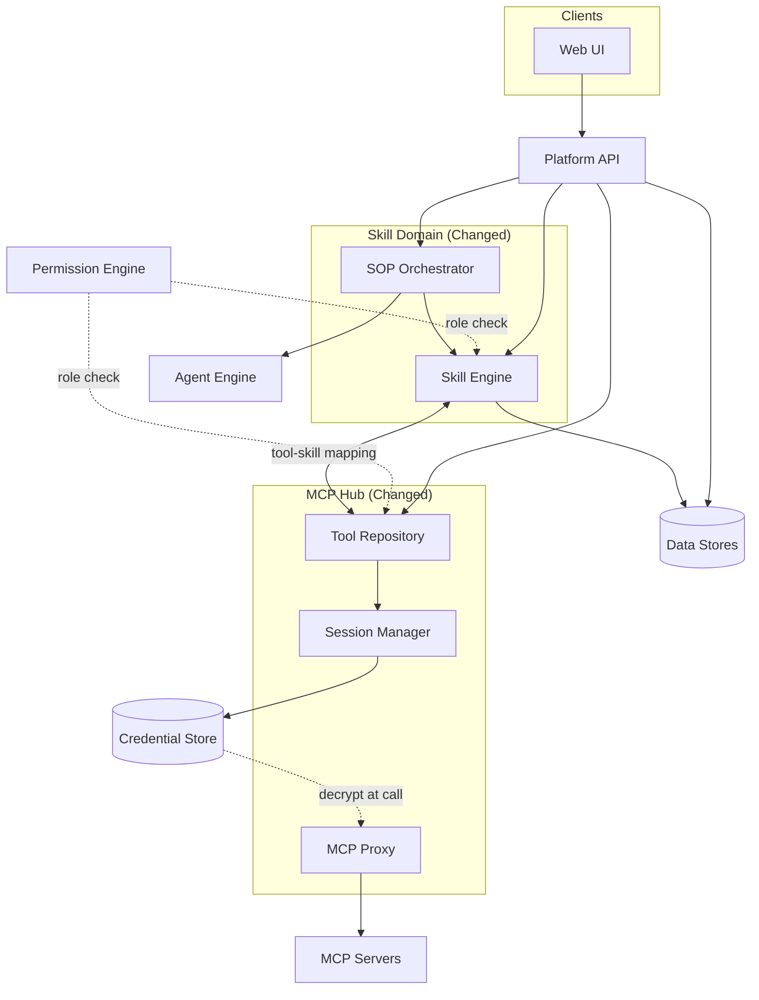
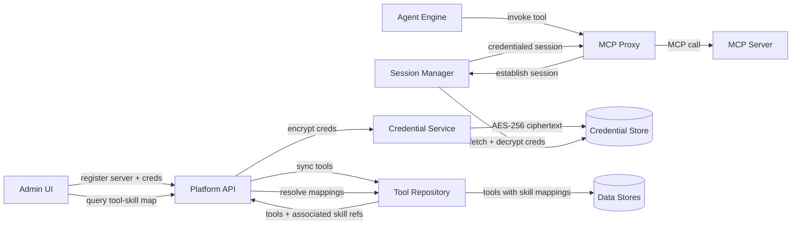

# Architecture — Enhance MCP Hub, Skills & SOPs

## Changed Components

Three existing components expand in scope and responsibility:

| Component | What Changed |
|---|---|
| **MCP Hub** | Tool Repository gains tool-to-skill reverse mapping; Session Manager gains per-server named sessions; Credential Service handles AES-256 encrypt/decrypt lifecycle |
| **Skill Engine** | Resolves skills with multiple tool bindings; enforces role-based access per skill; handles server-slug namespace prefixes on tool names |
| **SOP Orchestrator** | Differentiates step types (skill invocation vs. agent delegation); applies per-step instruction guidance; supports runtime step reordering |

No new top-level services are introduced. All changes are internal expansions of existing components.

---

## System Architecture — Changed Component View

### Integration Point Changes

| Integration | Before | After |
|---|---|---|
| **Skill Engine → Tool Repository** | Tool lookup by name | Bidirectional: tool lookup + reverse skill-membership query |
| **SOP Orchestrator → Agent Engine** | Not present | New: delegation steps hand off to Agent Engine instead of invoking Skill Engine |
| **Session Manager → Credential Store** | Single default credential per server | Named sessions per server, each with independent credential binding |
| **Permission Engine → Skill Engine** | Not present | Role membership checked before skill resolution |
| **Permission Engine → Tool Repository** | Not present | Role-filtered tool visibility in Tool Repository queries |

---

## Data Flow — Tool-to-Skill Mapping & Credential Lifecycle

**Key flows:**
- Credentials are encrypted at registration time and decrypted only at tool-call time — never stored or returned in plaintext
- Tool sync populates the Tool Repository with server-slug-prefixed tool names; skill bindings are written when a skill is saved
- Tool Repository resolves both directions: tool → skills that use it, and skill → tools it binds

---

## What to Update in `docs/master/architecture/`

| Document | Required Update |
|---|---|
| `modules/tool-execution.md` | Expand Skill Engine section: document multi-tool binding, role-based skill access, server-slug namespace. Expand MCP Hub section: named sessions per server, credential encrypt/decrypt lifecycle. |
| `modules/tool-execution.md` | Add SOP Orchestrator as a distinct layer between Agent Engine and Skill Engine; document skill-invocation vs. agent-delegation step types. |
| `system-overview.md` | Update MCP Hub component responsibility row to include credential lifecycle and tool-to-skill reverse mapping. Update Skill Engine row to include role enforcement and multi-tool binding. |
