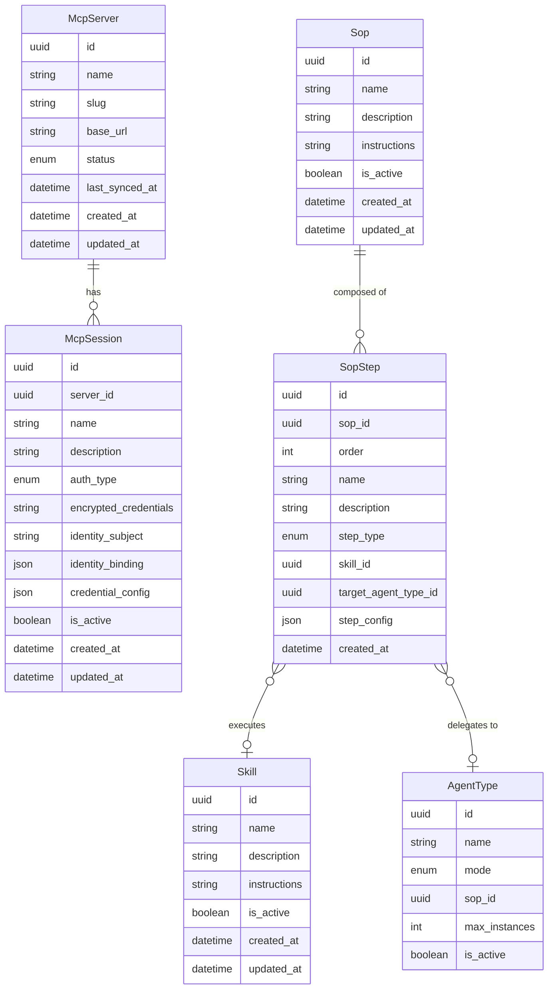

# Data Model Changes — Enhance MCP Hub, Skills & SOPs

## 1. New Entities

No new entities are introduced by this change. All data model work is additive modifications to existing entities.

## 2. Modified Entities

Three entities gain new fields. The diagram shows each modified entity in full, with all current and new attributes.

### Skill — New Fields

| Field | Type | Notes |
|-------|------|-------|
| `instructions` | string | Agent-facing guidance on how to use the skill's composed tools |

### McpSession — New Fields

| Field | Type | Notes |
|-------|------|-------|
| `identity_binding` | json | Structured reference to an agent identity or role; extends the existing `identity_subject` string with typed, structured binding information |
| `credential_config` | json | Session-specific credential configuration (field shape, required keys); complements `encrypted_credentials` which holds the encrypted value |

> **Note on `session_name`**: The requirement for a unique-per-server session name is already satisfied by the existing `name` field (`McpSession.name`), which already enforces unique naming per server. No additional field is needed.

### Sop — New Fields

| Field | Type | Notes |
|-------|------|-------|
| `instructions` | string | Multi-line, human-readable workflow guidance presented to agents and operators running the SOP |

### SopStep — Modified and New Fields

| Field | Change | Type | Notes |
|-------|--------|------|-------|
| `step_type` | Enum updated | enum | Value `skill` renamed to `skill_invocation`; `agent_delegation` unchanged. Updated values: `{skill_invocation, agent_delegation}` |
| `target_agent_type_id` | Renamed from `delegate_agent_type_id` | uuid | References `AgentType`; used when `step_type = agent_delegation` |
| `step_config` | Added | json | Step-specific runtime configuration (e.g. input overrides, timeout, retry policy) |

## 3. Removed Entities/Fields

No entities are removed. The following fields are replaced:

| Entity | Field Removed | Replaced By | Reason |
|--------|--------------|-------------|--------|
| `SopStep` | `delegate_agent_type_id` | `target_agent_type_id` | Renamed for clarity and consistent naming with `AgentType` references across the codebase |
| `SopStep` | `step_type` enum value `skill` | `skill_invocation` | Renamed to be explicit about the action type; more descriptive for step configuration UIs |

## 4. Schema File References

Per `docs/config.yaml` `source.schema`: `backend/app/db/models/`

| Entity | Required Changes |
|--------|-----------------|
| `McpSession` | Add `identity_binding` (json) field; add `credential_config` (json) field || `Skill` | Add `instructions` (string) field || `Sop` | Add `instructions` (string) field |
| `SopStep` | Rename `delegate_agent_type_id` → `target_agent_type_id`; update `step_type` enum value `skill` → `skill_invocation`; add `step_config` (json) field |

## 5. Master Data Model Update Instructions

Update `docs/master/data-model/` to reflect the following business entity changes:

- **McpSession** — Add `identity_binding` and `credential_config` attributes; update entity description to reflect the richer identity and credential binding model
- **Skill** — Add `instructions` attribute to the entity model
- **Sop** — Add `instructions` attribute to the entity model
- **SopStep** — Add `step_config` attribute; rename `delegate_agent_type_id` → `target_agent_type_id`; update `step_type` enum values to `{skill_invocation, agent_delegation}`; reflect the `AgentType` delegation relationship
