# Architecture: Implement Agent Runtime with Gateway

## Overview

This change introduces the **Agent Runtime** (powered by the **LangChain deep agent** framework), **Agent Permission Manager**, **Agent Session Queue**, **Token Refresh Service**, and **Model Config Service** as new core components, and enhances the **Communication Hub** to serve as the **Agent Gateway**. Agent identities live in a dedicated `ai_agents` realm within the same identity provider used for human users; the bootstrap process initialises both realms, and an OAuth-based sign-in flow provisions agent credentials at configuration time. A new **Model Configuration Service** manages LLM provider configs and credentials, decoupling agent types from direct LLM field bindings. The **Web UI** gains an **Agent Instance Dashboard** for monitoring and drilling into individual agent executions.

---

## 1. Updated System Architecture

Components marked with `*` are new; the Communication Hub is extended to absorb the Agent Gateway role. The Identity Provider now exposes two realms: `parthenon` (human users) and `ai_agents` (agent users). The new **Model Config Service** mediates all LLM provider access; agent types reference a model configuration rather than embedding LLM fields directly.

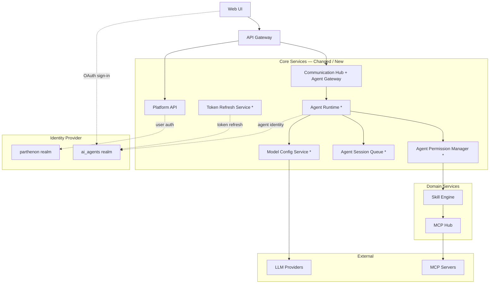

### Component Responsibilities (delta)

| Component | Status | Responsibility Added / Changed |
|---|---|---|
| **Platform API** | Extended | New endpoints for agent role management, agent type configuration, model config CRUD, enhanced session status and history queries, and OAuth token exchange for agent identity provisioning |
| **Web UI** | Extended | New pages: Agent Role management, Agent Type configuration (with model config selection), Model Configuration management, Agent Instance Dashboard with status/time filtering and instance detail drill-down; OAuth sign-in flow for agent identity setup |
| **Communication Hub** | Extended | Now serves as the **Agent Gateway** — accepts inbound agent execution requests, manages agent instance lifecycle, routes results back to callers; enforces OAuth authentication for agent connections; validates identity token and role authorization; dynamically exposes tools based on role without descriptions or schemas |
| **AgentRole Service** | **New** | CRUD for AgentRole and identity-role assignments (assign/remove identities to/from roles) |
| **AgentIdentity Service** | **New** | CRUD for AgentIdentity; OAuth authorization flow; token refresh and re-authentication; role assignments |
| **Agent Runtime** | **New** | Manages agent instance lifecycle using the **LangChain deep agent** framework (observe → reason → act loop); enforces permission boundaries; validates agent identity is assigned to agent role (not type matching); resolves model config via Model Config Service; coordinates LLM inference and skill execution; captures the full system instruction and user prompt to the execution log before each session's first LLM call; fetches agent tokens from the Token Store |
| **Agent Permission Manager** | **New** | Evaluates an agent role's SOP and Skill assignments; calculates the complete set of allowed MCP tools using unified `mcp_slug/tool_name` references; provides real-time tool preview to the management UI |
| **Agent Session Queue** | **New** | Accepts execution requests asynchronously; dispatches sessions to the Agent Runtime; tracks session state (pending → running → complete / failed / cancelled); persists results, conversation history, and execution logs (including full system instruction, user prompt, and reasoning steps); supports filtered queries by status and time |
| **Token Refresh Service** | **New** | Background service that monitors agent token expiry; proactively refreshes access tokens against the `ai_agents` realm using stored refresh tokens; updates the Token Store |
| **Model Config Service** | **New** | Manages LLM provider configurations (provider type, API endpoint, encrypted credentials, and `enabled_models` array); at runtime resolves the correct provider by finding the `ModelConfig` whose `enabled_models` contains the agent type's `model_id`; supports both direct LLM provider APIs and LiteLLM proxy as model backends |

---

## 2. Agent Identity & Realm Architecture

Agent identities are **users** (not clients) inside a dedicated realm configured in `identity.yaml`. The bootstrap process initialises both realms in the identity provider on first deploy, mirroring how the `parthenon` user realm is set up.

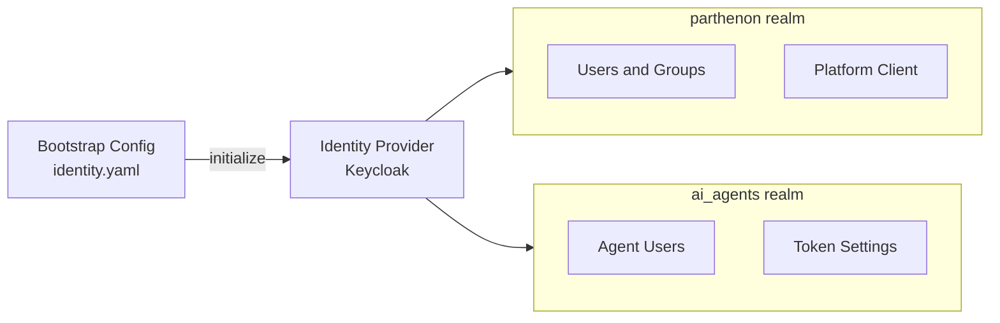

**Key design decisions:**
- Agent identities are **realm users**, not OIDC clients — this aligns agent auth with the same user-based identity model used for humans and keeps audit trails consistent.
- The `ai_agents` realm name is configurable in `identity.yaml`; operators can substitute any realm name or point to a different realm in an external IdP.
- Bootstrap is idempotent — re-running on an already-initialised IdP is safe.

---

## 3. Agent Identity OAuth Flow

An administrator provisions an agent identity by performing an OAuth sign-in to an agent user account in the `ai_agents` realm. The resulting tokens are stored securely and used by the Agent Runtime at execution time. The Token Refresh Service keeps tokens valid in the background.

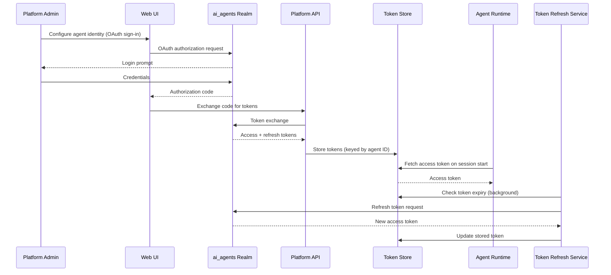

---

## 4. Identity-Role Assignment Flow

When an administrator assigns identities to a role from the role management UI.

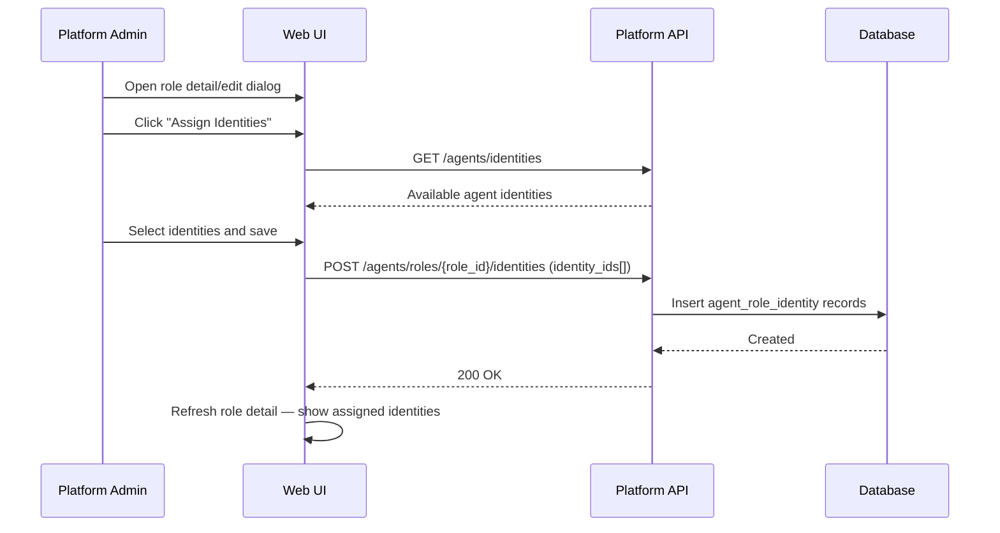

---

## 5. Runtime Identity-Role Validation

The runtime validates that the agent identity is explicitly assigned to the agent role before any execution begins.

**Validation steps:**
1. Session dispatcher loads `AgentType` with its linked `AgentIdentity` and `AgentRole`
2. Executor queries the `agent_role_identities` table
3. Executor validates: `EXISTS(SELECT 1 FROM agent_role_identities WHERE identity_id = X AND role_id = Y)`
4. If not exists: session fails immediately with a permission error — no LLM or tool calls are made
5. If exists: execution proceeds normally

---

## 6. Role Assignment from Identity View

The inverse flow — when an administrator assigns roles to an identity from the identity management UI.

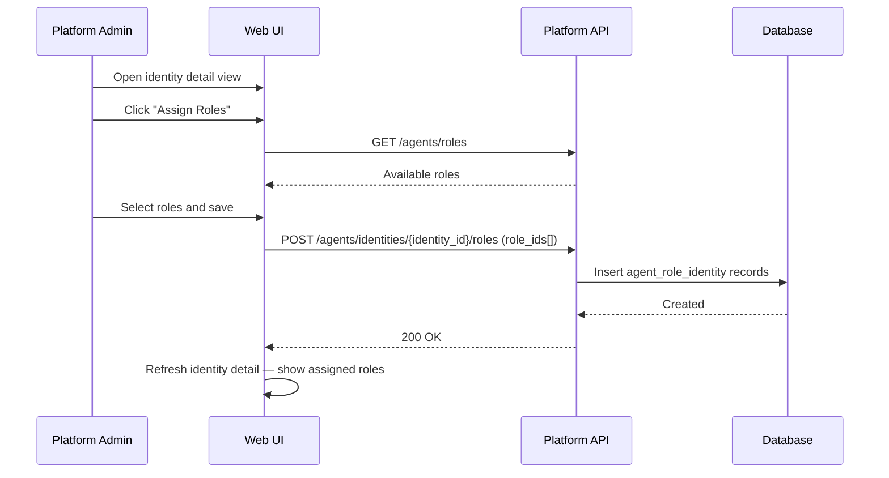

---

## 7. Token Refresh and Re-Authentication Flow

The identity list shows token status for each agent identity; admins can refresh or re-authenticate directly from the UI.

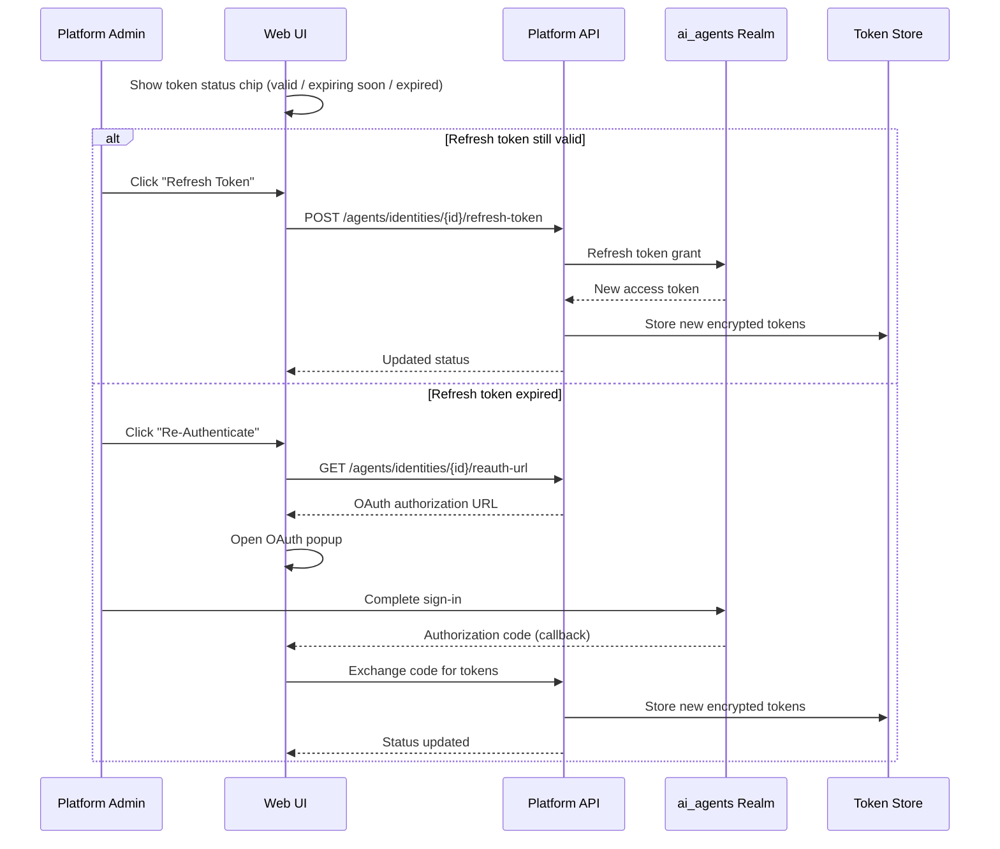

---

## 8. Communication Hub OAuth Enforcement

The Communication Hub validates every inbound agent connection with the identity provider before exposing any tools. Tool exposure is role-scoped and intentionally stripped of descriptions and schemas so agents rely entirely on skill instructions.

**Enforcement steps:**
1. Agent connects to the hub with an identity token in the `Authorization` header
2. Hub validates the token with the identity provider (`ai_agents` realm)
3. Hub extracts the identity subject and role claim from the validated token
4. Hub validates the identity is explicitly assigned to the claimed role (queries `agent_role_identities`)
5. Hub resolves the allowed tool set for the role via the Agent Permission Manager
6. Hub registers a dynamic MCP server exposing only the allowed tools — with no descriptions or schemas
7. Agent can call only tools in the allowed set; any call outside the set is rejected

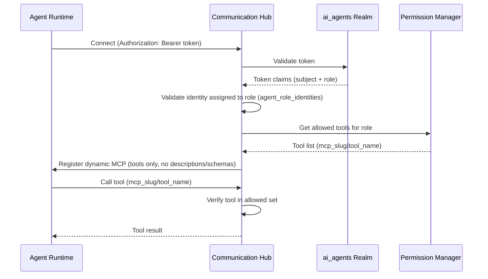

---

## 9. Agent Permission Inheritance

An agent role grants access by selecting SOPs and/or individual Skills. The Agent Permission Manager automatically calculates the full set of allowed MCP tools by traversing the SOP → Skill → Tool hierarchy. This calculation drives both runtime enforcement and the management UI preview.

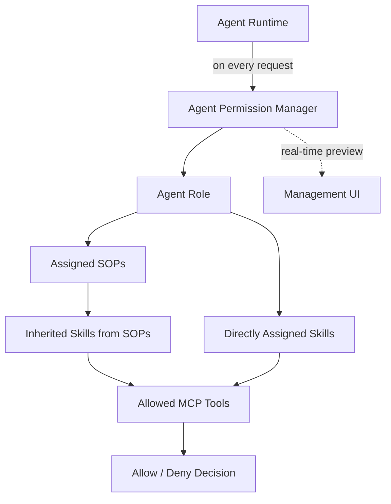

**Key rules:**
- Granting an SOP automatically includes all Skills the SOP depends on, and all MCP tools those Skills require.
- Directly assigned Skills contribute their required MCP tools independently of any SOP.
- The Agent Runtime (using the LangChain deep agent executor) consults the Permission Manager on every session dispatch — no tool call is made without an allow decision.
- All tool references use the unified `mcp_slug/tool_name` format (not `server_slug:tool_name`).

---

## 10. Model Configuration Service

The Model Config Service decouples LLM provider details from agent type definitions. Admins manage provider configurations centrally; agent types reference a `ModelConfig` by ID (the **Model Binding Layer**). At runtime, the Agent Runtime resolves the correct provider endpoint and credentials through the service before dispatching any LLM inference call. Both direct LLM provider APIs (OpenAI, Anthropic) and a LiteLLM proxy are supported as backends.

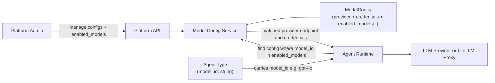

**Key design decisions:**
- `ModelConfig` stores the provider type, API endpoint, encrypted credentials, and an **`enabled_models` array** — the explicit set of model IDs available via that provider configuration.
- `AgentType` stores a **`model_id`** string (e.g. `"gpt-4o"`) with no foreign key to `ModelConfig`; the binding is resolved at runtime, not at configuration time.
- At runtime the Model Config Service scans `ModelConfig` records to find the one whose `enabled_models` array contains the requested `model_id`; this is the **Model Binding Layer** — a lookup, not a join.
- Credentials stored in `ModelConfig` are encrypted at rest; the Model Config Service decrypts them only at resolution time for the Agent Runtime.
- Admins configure which model IDs are enabled per provider config; agent types select a specific model ID from the union of all enabled models across all configs.
- Swapping a provider or rotating credentials requires updating only the `ModelConfig` record; if the same `model_id` remains in `enabled_models`, no agent type changes are needed.

---

## 11. Agent Instance Dashboard

The Agent Instance Dashboard is a new Web UI component that gives platform admins and business users visibility into all running and historical agent executions. It replaces the previous session-tracking view with richer filtering and drill-down capabilities, backed by enhanced `AgentSession` query endpoints in the Platform API.

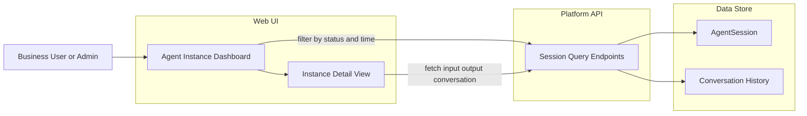

**Key design decisions:**
- The dashboard lists **agent instances** (individual executions), not agent types — each row corresponds to one `AgentSession` record.
- Status filter covers four states: `running`, `completed`, `failed`, `cancelled`; a time-range picker further scopes results.
- The Instance Detail View surfaces: structured input, structured or markdown output, and the full conversation turn history (for conversational agent types).
- Backend query endpoints expose status and time-range parameters; no additional persistence schema is required beyond what the Agent Session Queue already tracks.

---

## 12. Asynchronous Session Execution Flow

Agent execution is fully asynchronous. The caller receives a Session ID immediately and polls for results. The Agent Session Queue decouples request acceptance from runtime execution, enabling scalable, observable session processing. The Agent Runtime uses the **LangChain deep agent** framework; the agent executor runs an observe → reason → act loop to orchestrate skill calls, with the full system instruction and user prompt logged before the first LLM inference. The runtime also resolves the agent type's model configuration via the Model Config Service before any LLM call.

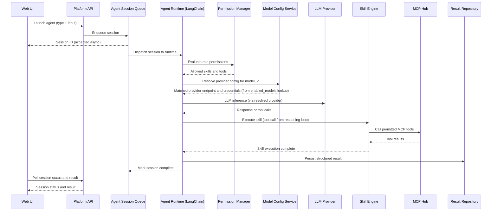

---

## 13. Execution Log Capture

Every agent session records the full system instruction and user prompt before the first LLM inference call. The Agent Runtime writes these to the Execution Log Store at session start; subsequent reasoning steps and tool calls are appended throughout the LangChain executor loop. The complete log is surfaced in the Agent Instance Dashboard detail view.

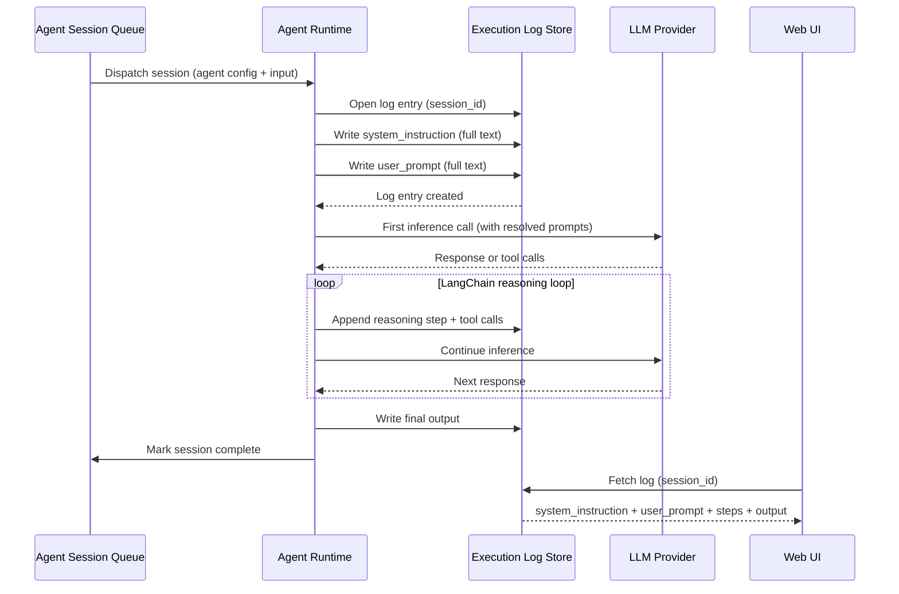

**Key design decisions:**
- The system instruction and user prompt are written **before** the first LLM call — not reconstructed after — ensuring the log reflects exactly what was sent.
- Log entries are keyed by `session_id`; entries are appended so the UI always receives a consistent snapshot.
- The Instance Detail View surfaces `system_instruction`, `user_prompt`, all intermediate reasoning steps, and the final output in a single scrollable timeline.
- Execution logs are append-only; no entries are modified or deleted after the session completes.

---

## 14. Integration Points

| Integration | Protocol | Purpose |
|---|---|---|
| **Web UI → Platform API** | REST / JWT | Agent role and type management; model config CRUD; session launch and status/history polling |
| **Web UI → ai_agents Realm** | OAuth 2.0 | Admin-initiated OAuth sign-in to provision agent user credentials |
| **Platform API → ai_agents Realm** | OAuth 2.0 | Token exchange during agent identity provisioning; token validation |
| **Platform API → Model Config Service** | Internal | Model config CRUD; provider credential storage (encrypted) |
| **Communication Hub → Agent Runtime** | Internal | Routes agent execution requests; delivers results back to callers; for conversational agents, maintains bidirectional communication for chat messages |
| **Agent Runtime → Token Store** | Internal | Fetches stored access token for the agent identity on each session start |
| **Agent Runtime → ai_agents Realm** | OIDC / Bearer | Authenticates agent instances using their stored user token from the `ai_agents` realm |
| **Agent Runtime → Model Config Service** | Internal | Passes the agent type's `model_id`; service finds the `ModelConfig` whose `enabled_models` contains that ID and returns the matched provider endpoint and credentials before LLM inference |
| **Agent Runtime → LLM Providers** | REST / HTTPS | LLM inference using the resolved provider endpoint and credentials; supports direct APIs and LiteLLM proxy |
| **Token Refresh Service → ai_agents Realm** | OAuth 2.0 refresh | Background refresh of agent access tokens using stored refresh tokens |
| **Agent Runtime → Agent Permission Manager** | Internal | Per-session permission evaluation before any skill or tool call |
| **Agent Permission Manager → Skill Engine** | Internal | Resolves SOP → Skill → MCP tool dependency graph |
| **Agent Session Queue → Data Stores** | Internal | Persists session state, structured results, and conversation history for audit, polling, and instance dashboard queries |
| **Agent Runtime → OTEL Collector** | OTLP | Emits traces, metrics, and logs for all agent actions and session transitions; includes LangChain agent executor steps and tool call spans |
| **Agent Runtime → Execution Log Store** | Internal | Writes the full system instruction, user prompt, all reasoning steps, and final output for every session; keyed by `session_id`; queried by the Instance Detail View |

---

## 15. Master Architecture Update Instructions

The following files in `docs/master/architecture/` require updates when this change is promoted:

| File | Update Required |
|---|---|
| `system-overview.md` | Add **Agent Runtime (LangChain deep agent)**, **Agent Permission Manager**, **Agent Session Queue**, and **Model Config Service** to the component table and system diagram; update the Communication Hub row to note Agent Gateway role; update Web UI row to note Agent Instance Dashboard |
| `modules/agent-lifecycle.md` | Extend lifecycle sequence to include the asynchronous session path (Session Queue → Runtime → Result Repository), the Permission Manager evaluation step, and the Model Config Service resolution step before LLM inference; document LangChain deep agent executor approach (observe → reason → act loop); add execution log capture step (system instruction + user prompt persisted before first LLM call) |
| `modules/communication.md` | Add the Agent Gateway responsibility to the Communication Hub overview; show inbound agent requests flowing through CH to the Agent Runtime; document bidirectional chat communication for conversational agents |
| `modules/identity.md` | Add dual-realm topology: `parthenon` (users) and `ai_agents` (agent identities); document bootstrap initialisation of both realms; note that the `ai_agents` realm name is configurable via `identity.yaml` |
| *(new)* `modules/agent-permissions.md` | Create new module doc describing the Agent Permission Manager: role → SOP → Skill → MCP tool inheritance model and real-time preview behaviour |
| *(new)* `modules/token-refresh.md` | Create new module doc describing the Token Refresh Service: background polling cadence, token store update pattern, and failure/retry behaviour |
| *(new)* `modules/model-config.md` | Create new module doc describing the Model Configuration Service: provider types (OpenAI, Anthropic, LiteLLM proxy), ModelConfig entity, credential encryption, and the model binding pattern (AgentType references ModelConfig by ID) |
| *(new)* `modules/agent-instance-dashboard.md` | Create new module doc describing the Agent Instance Dashboard: status/time filtering, instance detail drill-down (input, output, conversation history), and the enhanced AgentSession query endpoints that back it |
| *(new)* `modules/execution-logs.md` | Create new module doc describing execution log capture: full system instruction and user prompt written before first LLM call, step log entries appended during the LangChain reasoning loop, and how the Instance Detail View surfaces these logs |
