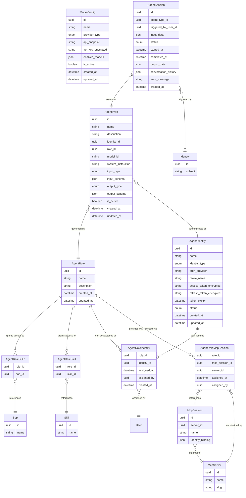

# Data Model: Implement Agent Runtime with Gateway

---

## 1. New Entities

This change introduces seven new entities: **ModelConfig**, **AgentRole**, **AgentRoleSOP**, **AgentRoleSkill**, **AgentRoleMcpSession**, **AgentIdentity**, and **AgentSession**. The existing **AgentType** entity is significantly modified (see Section 2).

### Entity Descriptions

| Entity | Purpose |
|--------|---------|
| **ModelConfig** | A named, reusable configuration for an LLM provider backend. Stores the provider type (e.g., OpenAI, LiteLLM proxy), the API endpoint (for proxies or custom deployments), encrypted credentials, and the explicit list of model IDs enabled on this config (`enabled_models`). Multiple agent types may resolve to the same config at runtime. Admins manage model configs centrally; the runtime resolves which config to use by finding one whose `enabled_models` contains the agent type's `model_id`. |
| **AgentRole** | A named permission set that grants an agent access to specific SOPs and/or Skills. The Agent Permission Manager uses this to calculate allowed MCP tools at runtime. Which identities may assume this role is controlled via the `AgentRoleIdentity` join table. MCP session context (credentials, project IDs) is provided via the `AgentRoleMcpSession` join table. |
| **AgentRoleIdentity** | Many-to-many join table explicitly assigning an AgentIdentity to an AgentRole. An identity can only be used for a role if a corresponding record exists here. Tracks when and by whom the assignment was made. |
| **AgentRoleSOP** | Join table linking an AgentRole to a Sop. Granting an SOP implicitly includes all Skills the SOP depends on and all MCP tools those Skills require. |
| **AgentRoleSkill** | Join table linking an AgentRole to a Skill directly (outside of any SOP). Contributes the Skill's required MCP tools to the role's allowed tool set. |
| **AgentRoleMcpSession** | Join table associating an MCP Session with an AgentRole. Provides MCP resource context (credentials, project IDs, parameters) when agents execute with this role. Each role can have at most **one session per MCP server** (enforced by unique constraint on `role_id + server_id`). Only MCP servers whose tools are used by the role's SOPs/Skills can be assigned. The agent runtime loads session details and injects them as context in the system instruction. |
| **AgentIdentity** | Represents an agent's identity as a user account in a dedicated identity provider realm (e.g., `ai_agents`). Stores the encrypted OAuth tokens obtained by an administrator signing in to the agent user account via OAuth. Tokens are used at runtime and automatically refreshed as needed. |
| **AgentSession** | Tracks a single agent execution instance from submission through completion. Each session is an agent instance in the dashboard view — there is no separate "AgentInstance" entity. For task-based agents, records input, output, and status. For conversational agents, additionally stores the full ordered message exchange in `conversation_history`. All fields needed for the dashboard (status, timing, agent type, triggering user) and the detail drill-down view (input, output, conversation) are present on this entity. |

#### ModelConfig Field Details

| Field | Type | Purpose |
|-------|------|---------|
| `name` | string | Human-readable label for this configuration (e.g., "Production OpenAI", "Internal LiteLLM"). Displayed in admin UI and agent type form. |
| `provider_type` | enum | Identifies the backend technology. Drives how the runtime constructs API requests and which SDK/adapter is used. See enum values below. |
| `api_endpoint` | string (nullable) | Base URL for the provider API. Required for `litellm_proxy` and `custom`; optional or unused for direct provider APIs (e.g., `openai`, `anthropic`) where the SDK handles the endpoint. |
| `api_key_encrypted` | string | AES-256 encrypted API key or credential. Decrypted only at agent runtime call time. |
| `enabled_models` | json (array) | Ordered list of model IDs available through this provider config (e.g., `["gpt-4o", "gpt-4-turbo"]`). Used by the runtime to resolve which ModelConfig to activate for a given `model_id`. Each model ID must be unique across all active ModelConfig records. |
| `is_active` | boolean | Soft-disables a config without deletion. Inactive configs are excluded from runtime model resolution. |

#### AgentRoleIdentity Field Details

| Field | Type | Description |
|-------|------|-------------|
| `role_id` | uuid | FK to agent_roles |
| `identity_id` | uuid | FK to agent_identities |
| `assigned_at` | datetime | When the assignment was made |
| `assigned_by` | uuid | FK to users (who made the assignment) |
| `created_at` | datetime | Record creation timestamp |

**Unique constraint:** `(role_id, identity_id)`

#### Identity-Role Assignment Relationship

- `AgentRoleIdentity` is a many-to-many join table between `AgentRole` and `AgentIdentity`.
- An `AgentIdentity` can be assigned to zero or more `AgentRole` records.
- An `AgentRole` can have zero or more `AgentIdentity` records assigned.
- At runtime, the executor validates that the agent's `identity_id` has a record in `agent_role_identities` for the agent's `role_id` before starting a session.
- A role with no assigned identities (empty join table) cannot be used by any agent.

#### AgentRoleMcpSession Field Details

| Field | Type | Description |
|-------|------|-------------|
| `role_id` | uuid | FK to agent_roles (primary key component) |
| `mcp_session_id` | uuid | FK to mcp_sessions (primary key component) |
| `server_id` | uuid | FK to mcp_servers (denormalized for constraint enforcement) |
| `assigned_at` | datetime | When the MCP session was assigned to this role |
| `assigned_by` | uuid | FK to users (who made the assignment) |

**Unique constraint:** `(role_id, server_id)` — ensures each role has at most one session per MCP server

#### Role-MCP Session Assignment Relationship

- `AgentRoleMcpSession` is a many-to-many join table between `AgentRole` and `McpSession`.
- An `AgentRole` can have zero or more `McpSession` assignments, but **at most one per MCP server** (enforced by unique constraint).
- Multiple roles can share the same `McpSession` if appropriate.
- At runtime, the executor:
  1. Queries all MCP sessions assigned to the agent's role via this join table
  2. Loads session details including `identity_binding` (project ID, region, etc.) and `credential_config` (pre-configured parameters)
  3. Formats this context as human-readable text injected into the system instruction
  4. Provides the agent with information about available MCP resources, credentials, and configured parameters
- Only MCP servers whose tools are actually used by the role's SOPs/Skills should be assigned.
- The UI should filter available MCP sessions to show only those from servers that match the role's tool usage.

#### AgentIdentity Field Details

| Field | Type | Purpose |
|-------|------|---------|
| `identity_type` | enum | Identity classification. Always `user` — agent identities are user accounts in the agent realm, not OIDC clients or service accounts. |
| `auth_provider` | string | Identifies the identity provider system (e.g., `keycloak`, `azure_entraid`). Supports multi-IDP deployments. |
| `realm_name` | string | The identity provider realm where this agent user account lives (e.g., `ai_agents`). Configurable per deployment via bootstrap config. |
| `access_token_encrypted` | string | Encrypted OAuth access token for this agent user. Used by the agent runtime to authenticate requests. |
| `refresh_token_encrypted` | string | Encrypted OAuth refresh token. Used to obtain a new access token when the current one expires, without requiring re-authentication. |
| `token_expiry` | datetime | Expiration timestamp of the current access token. The runtime uses this to decide when to trigger a token refresh before the next agent operation. |

#### AgentSession Field Details

| Field | Type | Purpose |
|-------|------|---------|
| `input_data` | json | The input submitted when the session was launched. Shape matches the agent type's `input_schema`. Used in the detail drill-down view. |
| `output_data` | json (nullable) | The structured or markdown result produced by the agent. Populated on completion; null while running or on failure. |
| `conversation_history` | json (nullable) | Ordered array of message objects `{role, content, timestamp}` representing the full back-and-forth exchange. Populated for `conversation` input type agents only; null for task-based agents. |
| `status` | enum | Current execution state. See enum values below. |
| `error_message` | string (nullable) | Human-readable error description when `status = failed`. Null otherwise. |

### Enum Values

| Entity | Field | Values |
|--------|-------|--------|
| ModelConfig | `provider_type` | `openai`, `anthropic`, `azure_openai`, `litellm_proxy`, `custom` |
| AgentIdentity | `identity_type` | `user` |
| AgentIdentity | `status` | `active`, `suspended`, `deprovisioned` |
| AgentType | `input_type` | `none`, `typed`, `conversation` |
| AgentType | `output_type` | `auto`, `typed`, `markdown` |
| AgentSession | `status` | `queued`, `running`, `completed`, `failed`, `cancelled` |

---

## 2. Modified Entities

### AgentRole

| Change | Detail |
|--------|--------|
| **REMOVED** | `allowed_identity_types` field (was JSON array restricting identity types by type string) |
| **Relationship** | Identity-role constraints now enforced via many-to-many `AgentRoleIdentity` join table; explicit per-identity assignment replaces type-level filtering |

### AgentType

The existing `AgentType` entity is rearchitected to support the role-based permission model, the new identity/input/output configuration, and model configuration selection. The following changes apply:

**Fields added:**

| Field | Type | Purpose |
|-------|------|---------|
| `identity_id` | uuid (FK → AgentIdentity) | Replaces flat `identity_subject` string; links to managed identity entity |
| `role_id` | uuid (FK → AgentRole) | Associates the agent type with a permission role |
| `model_id` | string | The model identifier this agent type uses (e.g., `gpt-4o`, `claude-3-opus`). At runtime, the Agent Gateway resolves the correct ModelConfig by finding an active config whose `enabled_models` contains this value. There is no direct FK — the binding is resolved dynamically, allowing model routing to change without updating agent type records. |
| `system_instruction` | string | Replaces `system_prompt`; renamed for clarity |
| `input_type` | enum | Defines how the agent accepts input: `none`, `typed`, or `conversation` |
| `input_schema` | json | JSON Schema describing expected input structure when `input_type = typed` |
| `output_type` | enum | Defines output format: `auto`, `typed`, or `markdown` |
| `output_schema` | json | JSON Schema describing expected output structure when `output_type = typed` |

**Fields removed:**

| Field | Reason |
|-------|--------|
| `mode` (sop-agent/skillful-agent) | Replaced by role-based SOP/Skill assignment; mode is implicit from role configuration |
| `sop_id` | Direct SOP binding replaced by AgentRoleSOP join via the role |
| `identity_subject` | Replaced by `identity_id` FK to AgentIdentity |
| `system_prompt` | Renamed to `system_instruction` |
| `llm_provider` | Replaced by `model_id` + runtime ModelConfig resolution |
| `llm_model` | Replaced by `model_id` (provider resolved dynamically at runtime) |
| `model_config_id` | Removed — agent types no longer hold a direct FK to ModelConfig; the runtime resolves the provider config from `enabled_models` on active ModelConfig records |
| `model_name` | Replaced by `model_id` (same concept, renamed for clarity and decoupled from provider) |
| `llm_api_key` | Replaced by encrypted credentials on ModelConfig |
| `max_instances` | Moved to operational configuration; not a schema field in this change |

---

## 3. Removed Entities

### AgentSkillAssignment

The existing `AgentSkillAssignment` entity (linking Skills directly to an AgentType) is removed. Skill permissions are now managed at the role level via `AgentRoleSkill`, which applies consistently to all agent types sharing that role.

---

## 4. Agent Instance Dashboard — No New Entity Required

The agent instance dashboard (listing running/completed/failed/cancelled agent executions with status filtering and drill-down into input, output, and conversation) is served entirely by **AgentSession**. Each `AgentSession` record is one agent instance.

The fields required by the dashboard and detail view are already present on `AgentSession`:

| Dashboard requirement | Field(s) used |
|----------------------|--------------|
| List instances with metadata | `id`, `agent_type_id`, `triggered_by_user_id`, `started_at`, `completed_at` |
| Filter by status | `status` (`queued`, `running`, `completed`, `failed`, `cancelled`) |
| Filter by time range | `started_at` |
| Drill down — input | `input_data` |
| Drill down — output | `output_data` |
| Drill down — conversation | `conversation_history` |
| Error detail | `error_message` |

No separate `AgentInstance` entity is introduced.

---

## 5. Schema File References

All schema changes are made to declarative model files in `backend/app/db/models/`.

| File | Change |
|------|--------|
| `backend/app/db/models/agents.py` | Add `ModelConfig` (with `enabled_models` JSON column), `AgentRole`, `AgentRoleIdentity` (join table with `role_id`, `identity_id`, `assigned_at`, `assigned_by`, `created_at`; unique constraint on `role_id + identity_id`), `AgentRoleMcpSession` (join table with `role_id`, `mcp_session_id`, `server_id`, `assigned_at`, `assigned_by`; unique constraint on `role_id + server_id`), `AgentRoleSOP`, `AgentRoleSkill`, `AgentIdentity`, `AgentSession` models; update `AgentType` fields (add `model_id` string, remove `model_config_id` FK, `model_name`, `llm_provider`, `llm_model`, `llm_api_key`); remove `AgentSkillAssignment` model |

---

## 6. Master Data Model Update Instructions

When this change is promoted, update the following files in `docs/master/data-model/`:

- **`modules/agents/entities.md`**: Replace current diagram and entity table with the new ModelConfig, AgentRole, AgentRoleIdentity, AgentRoleMcpSession, AgentRoleSOP, AgentRoleSkill, AgentIdentity, AgentType (updated), and AgentSession entities. Remove AgentSkillAssignment and AgentInstance entries. Note that AgentSession is the agent instance record used by the dashboard. Note that identity-role assignments are managed via AgentRoleIdentity (many-to-many); `allowed_identity_types` is removed. Note that MCP session context is provided via AgentRoleMcpSession (one session per MCP server per role).
- **`overview.md`**: Update the Agent Management domain section to include ModelConfig, AgentRole, AgentRoleMcpSession, AgentIdentity, and AgentSession in the top-level entity list; remove AgentSkillAssignment.
