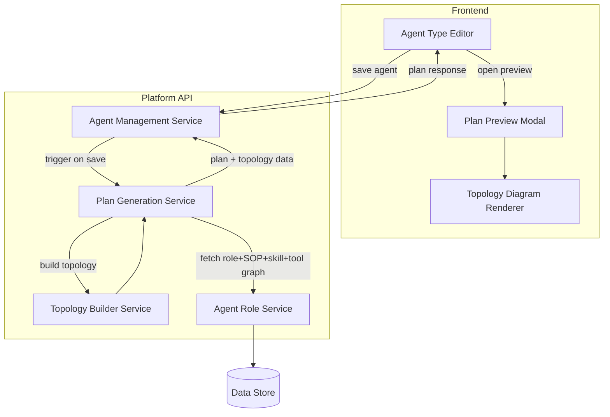
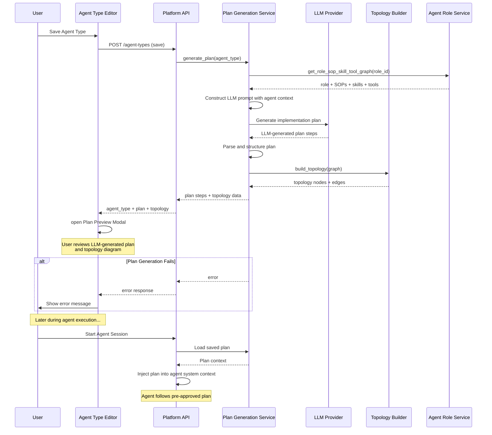

# Agent Plan Mode — Architecture

## 1. Changed Components

The following existing components are modified to support plan generation and preview.

| Component | Change |
|---|---|
| **Agent Type Editor** (frontend) | Receives plan + topology data in the save response; triggers Plan Preview Modal |
| **Agent Management Service** (backend) | Orchestrates plan generation on save; passes plan and topology back in the API response |
| **Agent Role Service** (backend) | Exposes role → SOP → Skill → Tool graph traversal for use by Plan Generation Service |

## 2. New Components

| Component | Layer | Responsibility |
|---|---|---|
| **Plan Generation Service** | Backend | Receives agent configuration on save; queries the role/SOP/skill/tool graph; constructs a prompt with agent instructions, role context, SOPs, skills, and tools; invokes the configured LLM to generate a human-readable, step-by-step implementation plan; produces an ordered, machine-parseable plan structure |
| **Topology Builder Service** | Backend | Transforms the role → SOP → Skill → Tool graph into a serialised node-edge topology structure for frontend rendering |
| **Plan Preview Modal** | Frontend | Displays the LLM-generated plan steps and hosts the Topology Diagram Renderer; opened automatically after a successful save |
| **Topology Diagram Renderer** | Frontend | Renders the node-edge topology payload as a visual diagram showing the Agent Role, SOPs, Skills, and Tools in relation |
| **Agent Runtime Loader** | Backend | Extended to load the saved plan from the `agent_plans` table when initializing an agent session; injects the plan into the agent's system context for execution guidance |

## 3. Integration Points

| Integration | Direction | Description |
|---|---|---|
| Agent Management Service → Plan Generation Service | Internal (backend) | Save handler calls Plan Generation Service synchronously; failure returns a non-blocking error alongside a persisted agent record |
| Plan Generation Service → LLM Provider | External API | Plan Generation Service constructs a prompt with agent context (instructions, role, SOPs, skills, tools) and invokes the configured LLM to generate the plan; response is parsed and structured |
| Plan Generation Service → Agent Role Service | Internal (backend) | Graph traversal to resolve role → SOPs → skills → tools; read-only query |
| Platform API → Agent Type Editor | REST response | Save response payload extended with `plan` (steps array) and `topology` (nodes + edges) fields |
| Agent Type Editor → Plan Preview Modal | Frontend event | On successful save, editor passes plan + topology to the modal; no additional API call required |
| Agent Runtime → Plan Storage | Internal (backend) | When an agent session starts, the runtime loads the saved plan from `agent_plans` table and includes it in the agent's system context to guide execution |

## 4. Data Flow — Plan Generation on Save

## 5. Master Arch Update Instructions

Update the following files in `docs/master/architecture/`:

- **`system-overview.md`** — Add Plan Generation Service and Topology Builder Service to the Platform API component table. Note that the save-agent flow now invokes an LLM to generate a plan, which is returned inline in the save response. Add Agent Runtime Loader extension for loading saved plans during agent session initialization.
- **`modules/agent-types.md`** (create if absent) — Document the extended save response contract: `plan` and `topology` fields appended to the agent-type response schema. Note that plans are LLM-generated and used to guide agent execution.
- **`modules/agent-roles.md`** (create if absent) — Note that Agent Role Service now exposes a graph-traversal query (role → SOP → Skill → Tool) consumed internally by Plan Generation Service.
- **`modules/agent-runtime.md`** (create if absent) — Document that the Agent Runtime Loader is extended to fetch the saved plan from `agent_plans` table when starting an agent session, and injects the plan into the agent's system context for execution guidance.

No changes are required to the identity or communication modules — plan generation is a config-time operation and plan-guided execution is an internal runtime enhancement.
