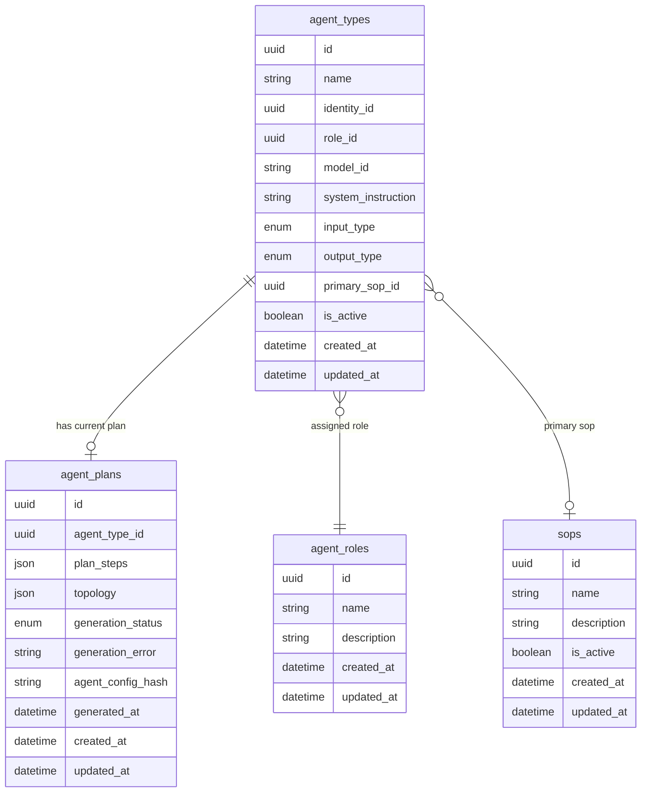

# Agent Plan Mode — Data Model

## 1. New Entities

### `agent_plans`

Stores the most recent LLM-generated implementation plan for an agent type. Created or replaced on every successful agent type save. The plan is both human-readable (for preview) and machine-parseable (for runtime execution guidance). Captures failure state when plan generation is non-blocking.



#### `agent_plans` Attribute Descriptions

| Attribute | Type | Description |
|---|---|---|
| `id` | uuid | Primary key |
| `agent_type_id` | uuid | FK → `agent_types`; unique — one plan record per agent type |
| `plan_steps` | json | Ordered array of plan step objects produced by LLM via Plan Generation Service; structure is both human-readable (for UI preview) and machine-parseable (for runtime execution guidance) |
| `topology` | json | Serialised node-edge graph (nodes array + edges array) produced by Topology Builder Service for frontend rendering |
| `generation_status` | enum | `pending` \| `success` \| `failed` |
| `generation_error` | string | Human-readable error message when `generation_status = failed`; null otherwise |
| `agent_config_hash` | string | Hash of the agent configuration inputs at generation time (role, SOPs, skills, system instruction); used to detect staleness |
| `generated_at` | datetime | Timestamp of last generation attempt |
| `created_at` | datetime | Row creation timestamp |
| `updated_at` | datetime | Last update timestamp (changes on every regeneration) |

#### `generation_status` Enum Values

| Value | Meaning |
|---|---|
| `pending` | Plan generation triggered; result not yet stored |
| `success` | Plan and topology successfully generated |
| `failed` | Generation failed; `generation_error` contains the reason; `plan_steps` and `topology` retain last successful values if a prior run succeeded |

---

## 2. Modified Entities

No fields are added to or removed from existing entities.

The `agent_types` entity is unchanged at the schema level. The relationship to `agent_plans` is expressed through the foreign key `agent_plans.agent_type_id` and resolved by the Plan Generation Service on each save. No migration to `agent_types` is required.

---

## 3. Removed Entities/Fields

None. This change introduces new data only.

---

## 4. Schema File References

| File | Action | Reason |
|---|---|---|
| `backend/app/db/models/agents.py` | Add `AgentPlanStatus` enum and `AgentPlan` model | New entity; logically belongs alongside `AgentType` in the agents module |

The new `AgentPlan` model should be declared in `backend/app/db/models/agents.py` and registered in `backend/app/db/models/__init__.py`. An Alembic migration must be generated after adding the model:

```
alembic revision --autogenerate -m "add_agent_plans"
alembic upgrade head
```

_(Do not write the migration by hand — generate it from the declarative model.)_

---

## 5. Master Data Model Update Instructions

Update the following in `docs/master/data-model/`:

- **`agents.md`** (create if absent) — Add `agent_plans` to the agent domain entity list. Document the one-to-one relationship with `agent_types`, the `generation_status` enum values, and the `agent_config_hash` staleness-detection pattern. Note that `plan_steps` is an LLM-generated, structured plan payload that is both human-readable (for preview) and machine-parseable (for runtime execution guidance). Note that `topology` is an opaque JSON payload owned by the Topology Builder service. Emphasize that the saved plan is loaded by the Agent Runtime during session initialization to guide execution.
- **`agents.md`** — If the file contains an ER diagram covering the agent domain, extend it to include `agent_plans` with its relationship to `agent_types`.
- No changes required to the skills, SOPs, roles, or identity sections of the master data model — those entities are read-only inputs to plan generation and their schemas are unaffected.
