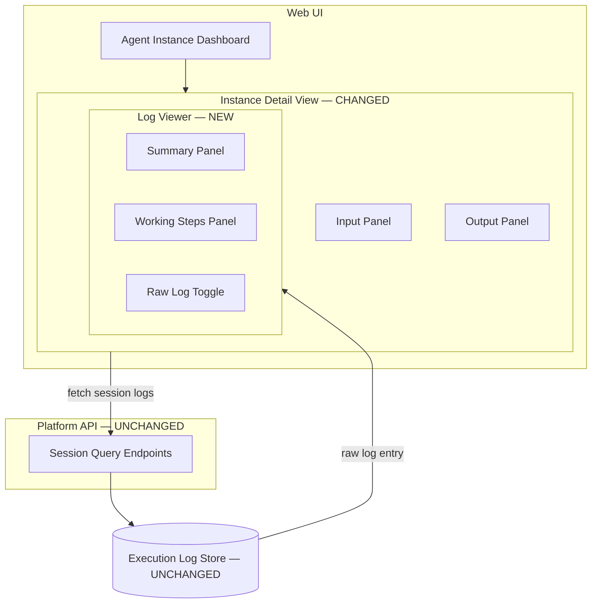
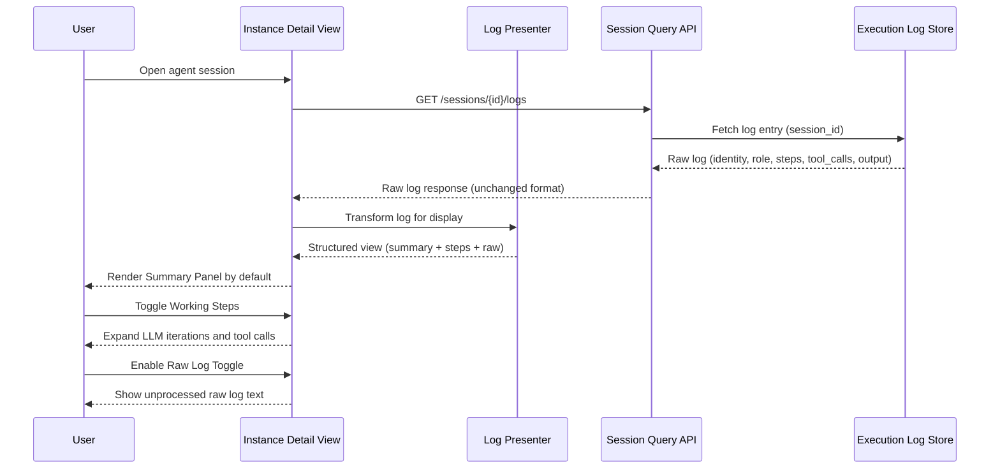

# User-Friendly Agent Logs — Architecture

## Scope

This change is **frontend-only**. The backend log capture pipeline, Execution Log Store, data model, and all API response formats remain unchanged. All restructuring happens in the Web UI presentation layer.

---

## 1. Changed Components

| Component | Location | What Changes |
|---|---|---|
| **Instance Detail View** | Web UI | Execution Log section replaced with the new Log Viewer component |

---

## 2. New Components

The **Log Viewer** is a new React component embedded inside the Instance Detail View. It introduces a **Log Presenter** — a frontend-side transformation layer that maps the raw log entry (fetched unchanged from the API) into three presentation levels.

### Log Viewer — Presentation Levels

| Panel | Content | Default State |
|---|---|---|
| **Summary Panel** | Identity, role, SOP/skills loaded, plan, model, result summary | Visible |
| **Working Steps Panel** | All LLM iterations and tool calls, grouped per reasoning step | Collapsed |
| **Raw Log Toggle** | Switches entire view to unprocessed raw log text; copyable | Off |

### Log Presenter (frontend transformation layer)

Sits between the raw API response and the Log Viewer. Reads the existing `system_instruction`, `user_prompt`, `reasoning_steps`, `tool_calls`, and `final_output` fields and derives the display-ready structure. No new backend calls. No schema changes.

---

## 3. Integration Points

No new or changed integration points. The Log Viewer consumes the same session log endpoint already used by the Instance Detail View. The API response contract is not modified.

---

## 4. Data Flow Changes

**Before:** Raw log fetched → rendered as-is in the Instance Detail View (no grouping, no summary).  
**After:** Raw log fetched → Log Presenter maps it into summary, steps, and raw levels → Log Viewer renders the appropriate level on demand.

---

## 5. Master Arch Update Instructions

Update the following files in `docs/master/architecture/`:

### `modules/execution-logs.md`

- Add a **Presentation Levels** section describing the three log views (Summary, Working Steps, Raw) surfaced by the Log Viewer in the Instance Detail View.
- Note that the Log Presenter is a **frontend transformation layer** — the stored log format and API response are unchanged.

### `modules/agent-instance-dashboard.md`

- Update the **Instance Detail View** description: replace "Execution Log" with "Log Viewer" and describe its three-panel layout (Summary Panel, Working Steps Panel, Raw Log Toggle).
- Add a row to the Instance Detail View table for the Log Viewer component.
