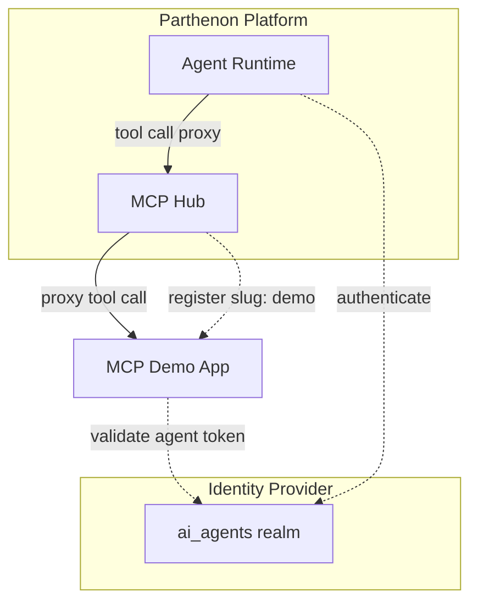
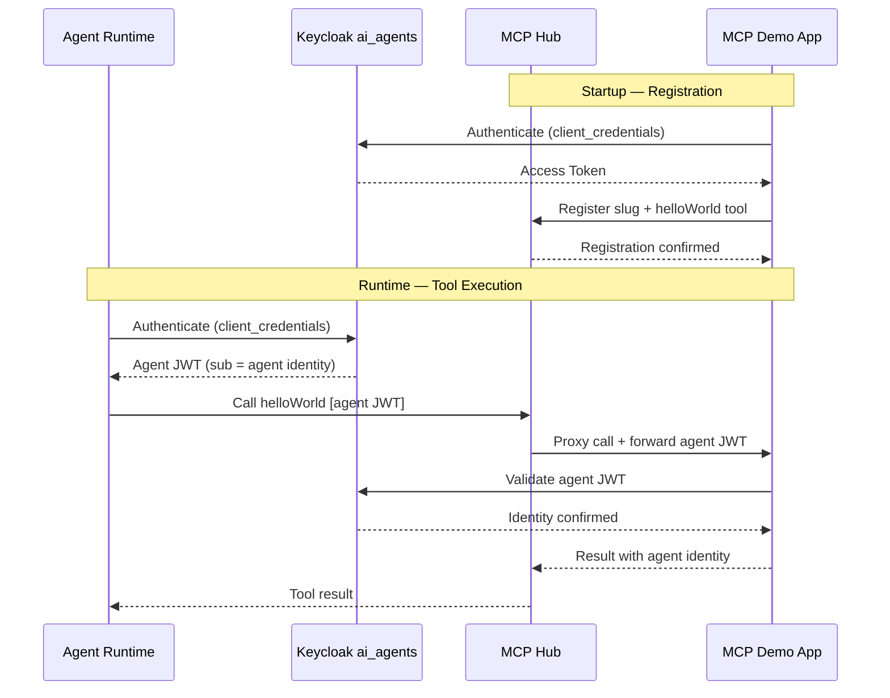

# Architecture Changes — MCP Demo App

## 1. Changed Components

| Component | Change |
|-----------|--------|
| **MCP Hub** | Gains a new registered server entry for the demo app (slug: `demo`); syncs the `helloWorld` tool into its tool registry under that namespace |

No other existing Parthenon components change. This is a purely additive change.

---

## 2. New Components

A single new standalone service is introduced: the **MCP Demo App**. It runs outside the main Parthenon codebase, authenticates with the `ai_agents` Keycloak realm, registers itself with the MCP Hub, and exposes one tool (`helloWorld`).

| Component | Responsibility |
|-----------|----------------|
| **MCP Demo App** | Standalone MCP server; authenticates with `ai_agents` realm; registers with MCP Hub under a unique slug; exposes `helloWorld` tool; validates and surfaces agent identity on each tool invocation |

---

## 3. Integration Points

| Integration | Direction | Description |
|-------------|-----------|-------------|
| MCP Demo App → Keycloak ai_agents realm | Outbound | App obtains its own access token via client credentials grant on startup |
| MCP Hub → MCP Demo App | Inbound to Demo App | Hub proxies tool calls from agents; forwards the agent's JWT as a bearer credential |
| MCP Demo App → Keycloak ai_agents realm | Outbound | App validates the forwarded agent JWT on each tool call to confirm identity |
| MCP Demo App → MCP Hub | Outbound | App registers itself with a unique slug (`demo`) and publishes the `helloWorld` tool manifest |

---

## 4. Data Flow Changes

The diagram below shows the two-phase flow: startup registration and runtime tool execution.

**Key change:** Agent identity now flows all the way through to an external MCP app — Keycloak issues the identity, the Hub forwards it, and the demo app validates it. This proves the end-to-end identity propagation pattern for all future MCP app integrations.

---

## 5. Master Arch Update Instructions

Update `docs/master/architecture/system-overview.md`:

- Add **MCP Demo App** as an example external MCP server in the component responsibilities table
- Note that the `ai_agents` realm in the Identity Provider section now also serves external MCP apps (not only the Agent Runtime)
- Add a brief note under **MCP Hub** that registered servers may be external standalone apps authenticating via the `ai_agents` realm

No diagram changes are required to `system-overview.md` — the MCP Hub node already represents all registered tool servers. The demo app is one such server and does not need its own node at the system overview level.
