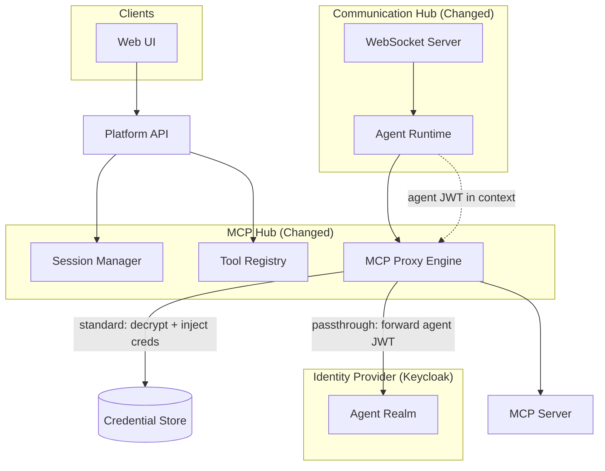
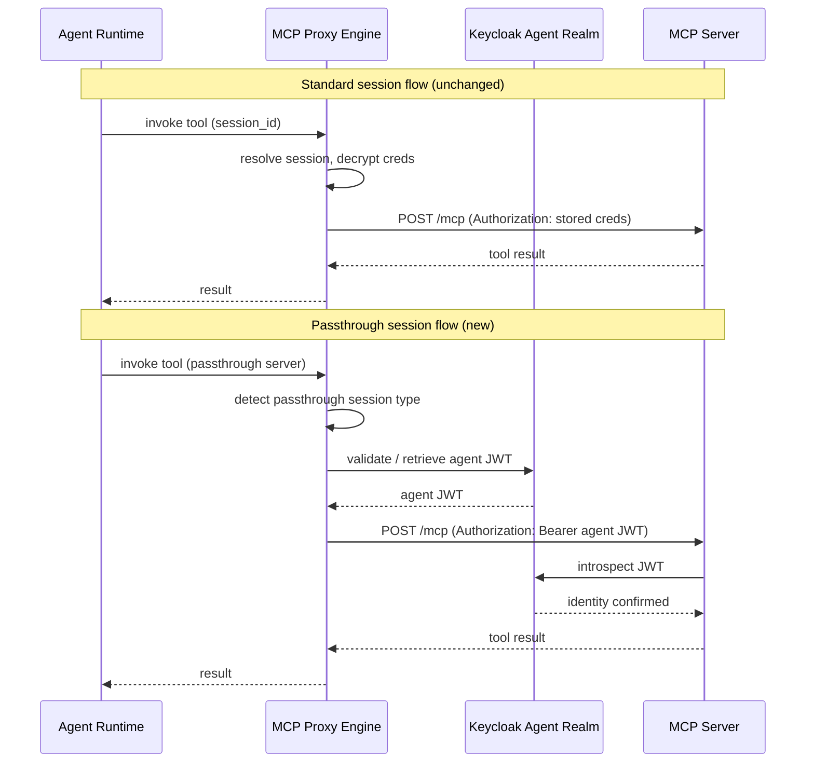

# Architecture — Passthrough Sessions

## Changed Components

Two existing components change behaviour; no new top-level services are introduced.

| Component | What Changes |
|---|---|
| **MCP Hub — Session Manager** | Adds `passthrough` as a valid session type on `McpSession`; role configuration UI allows associating an MCP server with passthrough (no credential selection required) |
| **MCP Hub — MCP Proxy Engine** | Detects passthrough session type at call time; extracts the executing agent's JWT from the request context and forwards it as the `Authorization: Bearer` header instead of decrypting stored credentials |
| **MCP Hub — Tool Registry UI** | Tool test flow branches on server session type: passthrough servers show an agent identity picker; session-based servers show the existing session picker |

---

## System Architecture — Changed Component View

The diagram shows only components involved in this change. Unchanged platform components are omitted.

---

## Integration Points

| Integration | Before | After |
|---|---|---|
| **MCP Proxy Engine → Credential Store** | Always decrypts stored credentials at call time | Skipped for passthrough sessions; agent JWT used directly |
| **MCP Proxy Engine → Keycloak Agent Realm** | Not present | New: validates and retrieves agent JWT for passthrough forwarding |
| **MCP Server ← Authorization header** | Stored credential (API key, OAuth token, bearer) | Agent JWT for passthrough servers; unchanged for all other session types |
| **Role Config UI → Session Manager** | Session selection required to associate server with role | Passthrough servers require no session selection — server association alone is sufficient |
| **Tool Registry Test UI → Session Manager** | Session picker shown for all MCP servers | Agent identity picker shown for passthrough servers; session picker shown for all others |

---

## Data Flow Changes

**Key differences from the standard flow:**
- No credential decryption step — the Credential Store is not accessed for passthrough calls
- Agent JWT travels end-to-end; the MCP server performs its own identity validation against Keycloak
- Existing session-based flows are entirely unchanged

---

## Master Arch Update Instructions

| Document | Required Update |
|---|---|
| `docs/master/architecture/modules/tool-execution.md` | Add passthrough session type to MCP Proxy Engine description; document the new integration with Keycloak Agent Realm for JWT forwarding at call time |
| `docs/master/architecture/system-overview.md` | Update MCP Hub component responsibility row to note passthrough session support and direct agent JWT propagation to compatible MCP servers |
