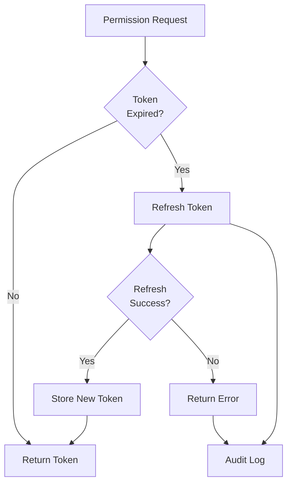
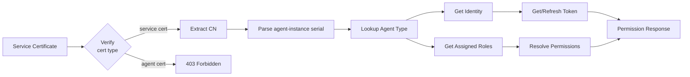
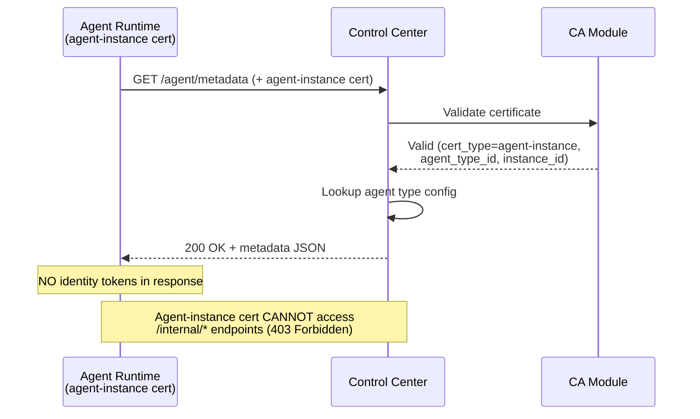
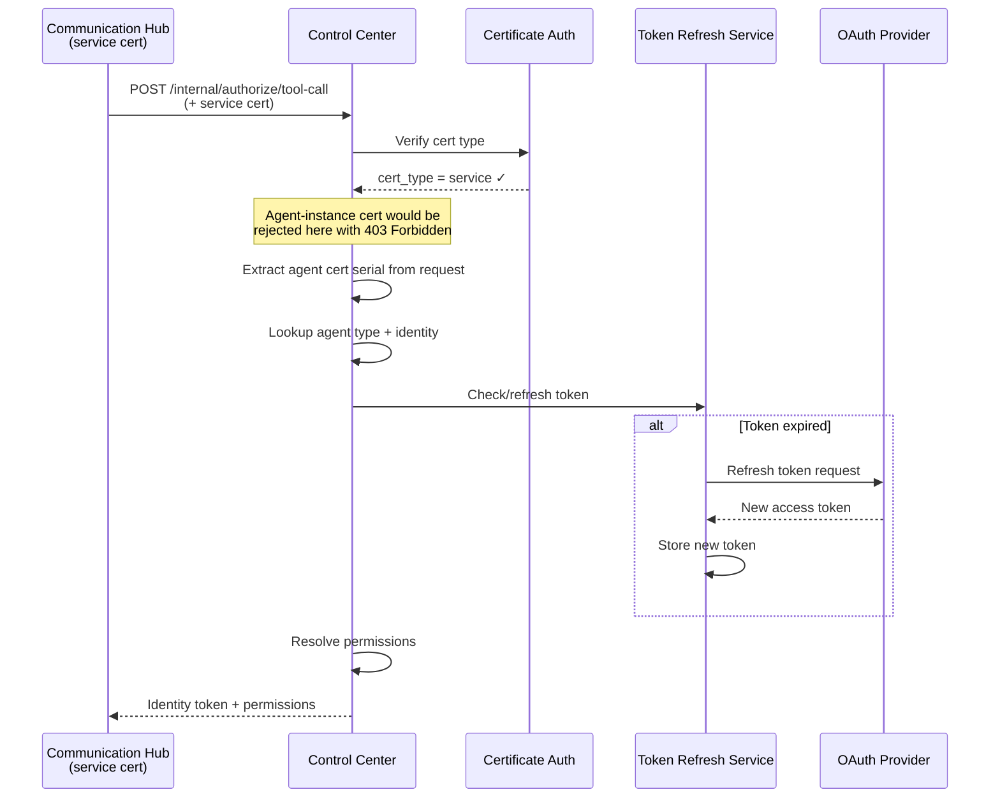
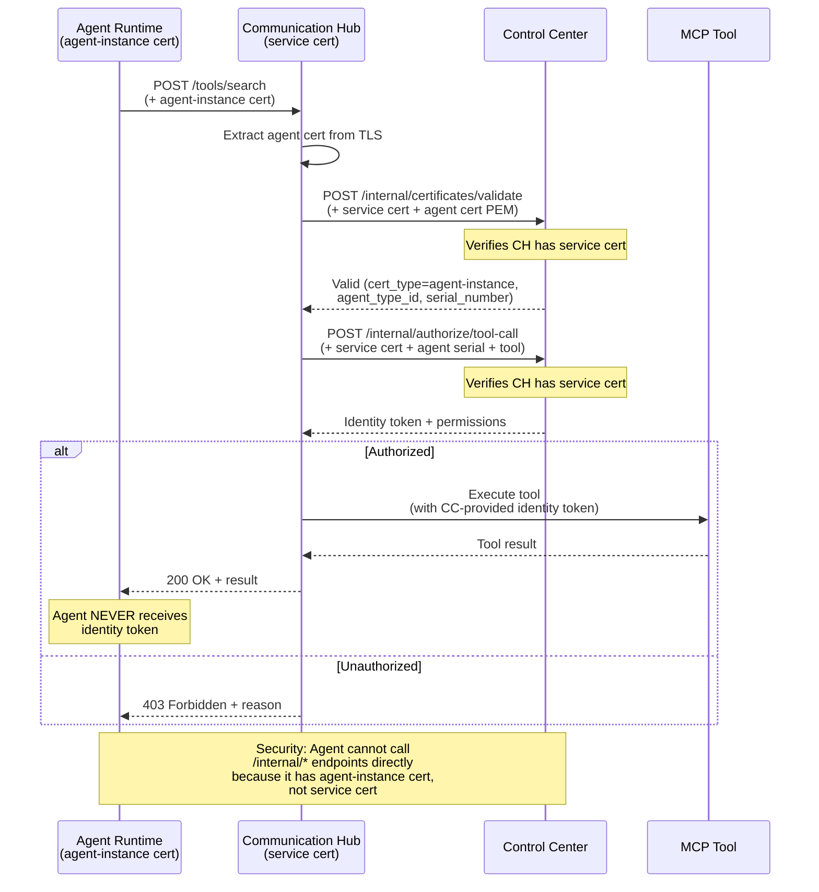
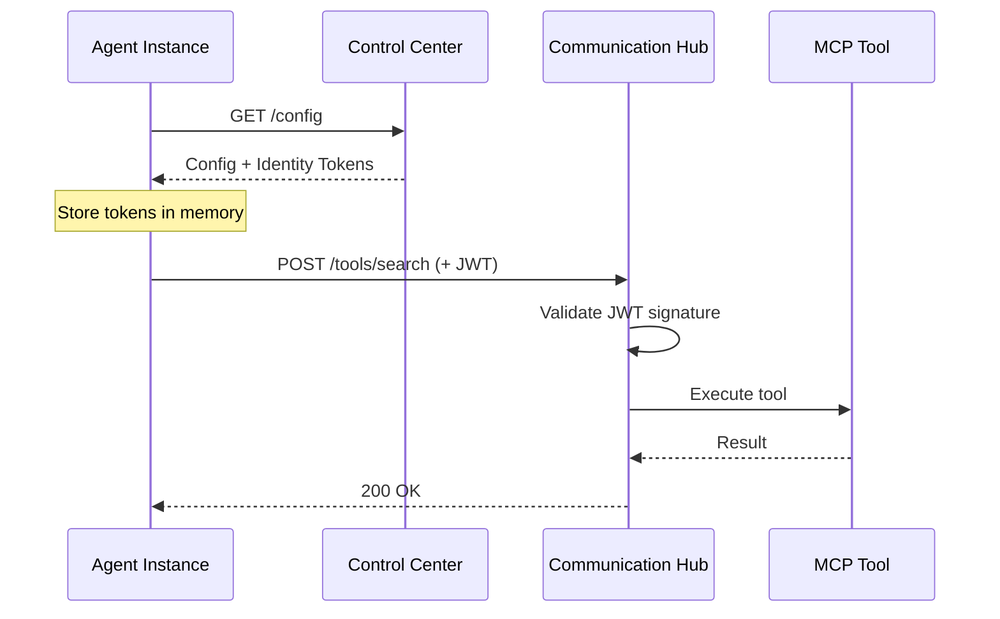
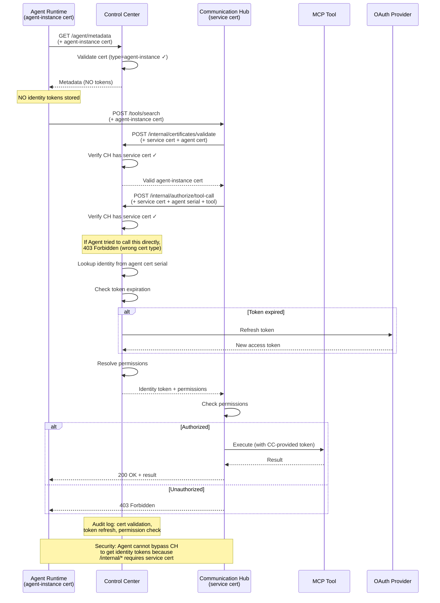
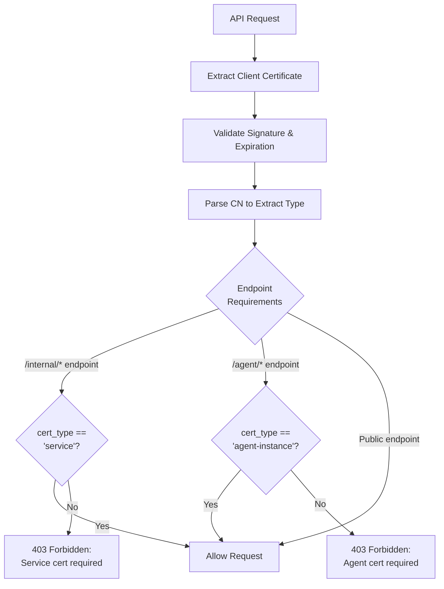

# Architecture Design: Agent Runtime Security Segregation

**Created by:** Architect Agent  
**Date:** 2026-05-13  
**Status:** Draft - Awaiting Document Reviewer approval

---

## 1. Changed Components

### Agent Runtime (Existing → Modified)
**Before:** Received complete agent configuration including identity tokens; directly authenticated to Communication Hub using JWT tokens

**After:**  
- Receives only non-sensitive metadata (SOPs, skills, instructions, model configs)
- Authenticates using X.509 client certificates (mutual TLS)
- Never stores or receives identity tokens
- Certificate identifies agent type and instance ID

**Key Changes:**
- Add certificate storage and loading on startup
- Replace JWT authentication with certificate-based authentication
- Remove identity token handling from configuration processing
- Add certificate validation to all outbound API calls

### Control Center (Existing → Extended)
**Before:** Configuration management service; distributed identity tokens to agent instances

**After:**  
- Acts as Certificate Authority (CA) for agent instance certificates
- Stores and manages all identity tokens and refresh tokens (encrypted)
- Automatically detects and refreshes expired tokens
- Validates agent certificates and authorizes tool access requests
- Central audit logging for all identity operations

**Key Changes:**
- Add CA functionality (certificate issuance, signing, revocation)
- Add token refresh automation with OAuth provider integration
- Add certificate validation endpoints for Communication Hub
- Add permission resolution based on certificate CN
- Add audit logging for certificate validation, token refresh, permission checks

### Communication Hub (Existing → Extended)
**Before:** Trusted agent-provided JWT tokens; validated signature but not freshness or permissions

**After:**  
- Validates agent client certificates on every tool call
- Requests fresh identity tokens and permissions from Control Center per-call
- Uses Control Center-provided tokens to execute tool calls
- Enforces authorization before tool execution

**Key Changes:**
- Add mutual TLS support for agent connections
- Add Control Center integration for permission checks
- Add certificate validation before processing tool requests
- Replace JWT trust with Control Center authority model
- Add authorization failure logging with certificate details

---

## 2. New Components

### Certificate Authority (CA) Module
**Location:** Control Center  
**Purpose:** Issue, sign, validate, and revoke certificates with type differentiation

```mermaid
flowchart LR
    A[Agent Instance] -->|Request agent-instance cert| CA[CA Module]
    CA -->|agent-instance:{type}:{id}| A
    S[Communication Hub] -->|Request service cert| CA
    CA -->|service:communication-hub| S
    CA -->|Store| DB[(Certificate Store)]
    CA -->|Check| CRL[Revocation List]
    
    S -->|Validate cert + type| CA
    CA -->|Valid + cert type| S
```

**Responsibilities:**
- Generate root CA certificate on Control Center initialization
- Issue **two types of certificates** with enforced access controls:
  - **Agent instance certificates:** `agent-instance:{agent_type_id}:{instance_id}`
  - **Service certificates:** `service:{service_name}` (e.g., `service:communication-hub`)
- Validate certificate signatures, expiration, and revocation
- Extract and return certificate type for authorization enforcement
- Maintain certificate revocation list (CRL)
- Provide certificate validation API for Communication Hub

**Certificate Type Security Model:**
- Agent instance certs can access: `/agent/metadata`, Communication Hub tool endpoints
- Service certs can access: `/internal/certificates/validate`, `/internal/authorize/tool-call`
- Certificate type is enforced at endpoint level using authentication dependencies

### Token Refresh Service
**Location:** Control Center  
**Purpose:** Automatically detect and refresh expired identity tokens



**Responsibilities:**
- Check token expiration before returning identity for permission requests
- Use stored refresh token to obtain new access token from OAuth provider
- Implement retry with exponential backoff for transient failures
- Respect OAuth provider rate limits
- Log all refresh attempts (success/failure) with context
- Return explicit error when refresh fails (cannot auto-recover)

### Permission Resolution Service
**Location:** Control Center  
**Purpose:** Map agent certificates to current permissions and identity tokens (service certs only)



**Responsibilities:**
- **Enforce service certificate requirement** (agent-instance certs rejected with 403)
- Extract agent type and instance ID from the agent-instance certificate being authorized
- Look up agent type configuration
- Retrieve assigned identity and roles
- Resolve roles to complete permission set (SOPs → Skills → Tools)
- Check and refresh identity token if needed
- Return identity token and permissions OR explicit error

**Security:** Only Communication Hub with valid service certificate can call this endpoint. Agent Runtime with agent-instance certificate is **blocked** to prevent identity token leakage.

---

## 3. Integration Points

### Agent Runtime ↔ Control Center
**Protocol:** HTTPS with mutual TLS (agent-instance certificate authentication)  
**Operations:**
- `GET /agent/metadata` — Request SOPs, skills, instructions, model configs
  - Request: Agent-instance certificate in TLS handshake
  - Response: Metadata JSON (NO identity tokens)
  - Errors: Invalid certificate (403), expired certificate (401)

**Sequence:**


### Communication Hub ↔ Control Center
**Protocol:** HTTPS with mutual TLS (service certificate authentication)  
**Operations:**
- `POST /internal/certificates/validate` — Validate agent-instance certificate
  - Request: Service certificate + agent-instance cert PEM
  - Response: Validation result (cert_type, agent_type_id, instance_id)
  - Auth: **Requires service certificate** (agent-instance certs rejected)
  
- `POST /internal/authorize/tool-call` — Request permission and identity for agent tool call
  - Request: Service certificate + agent cert serial + tool name
  - Response: Identity token, permissions, authorization decision
  - Errors: Invalid service cert (403), insufficient permissions (403), token refresh failed (503)
  - Auth: **Requires service certificate** (agent-instance certs rejected)

**Sequence:**


### Agent Runtime ↔ Communication Hub
**Protocol:** HTTPS with mutual TLS (agent-instance certificate authentication)  
**Operations:**
- `POST /tools/{tool_name}` — Execute MCP tool
  - Request: Tool parameters in JSON body + agent-instance certificate in TLS
  - Response: Tool execution result
  - Errors: Invalid certificate (403), unauthorized tool (403), tool execution error (4xx/5xx)

**Sequence:**


---

## 4. Data Flow Changes

### Current Flow (Before)


### New Flow (After - With Certificate Type Security)


**Improvements:**
- ✅ Agent Runtime never receives identity tokens
- ✅ **Certificate type differentiation prevents identity token leakage** (agent-instance certs cannot access /internal/*)
- ✅ **Service certificates enforce service-to-service boundary** (only Communication Hub can request identity tokens)
- ✅ Token refresh is automatic (OAuth provider called transparently)
- ✅ Permission check on every tool call (current permissions, not cached)
- ✅ Certificate validation provides cryptographic authentication with type enforcement
- ✅ Control Center logs every authorization decision
- ✅ **Zero-trust security model properly enforced** (agent cannot bypass authorization layer)

---

## 5. Certificate Type Security Model

This section explicitly describes how certificate type differentiation prevents identity token leakage.

### Two Certificate Types

**Agent Instance Certificates:**
- **CN Format:** `agent-instance:{agent_type_id}:{instance_id}`
- **Issued to:** Agent Runtime instances
- **Purpose:** Identify agent instances for metadata retrieval and tool authorization
- **Allowed Endpoints:**
  - ✅ `GET /agent/metadata` (receives metadata without identity tokens)
  - ✅ Communication Hub tool endpoints (tool execution proxied through CH)
- **Blocked Endpoints:**
  - ❌ `/internal/certificates/validate` (403 Forbidden - service cert required)
  - ❌ `/internal/authorize/tool-call` (403 Forbidden - service cert required)
  
**Service Certificates:**
- **CN Format:** `service:{service_name}` (e.g., `service:communication-hub`)
- **Issued to:** Communication Hub (and other trusted services)
- **Purpose:** Authenticate service-to-service calls for identity operations
- **Allowed Endpoints:**
  - ✅ `/internal/certificates/validate` (validate agent-instance certs)
  - ✅ `/internal/authorize/tool-call` (retrieve identity tokens for tool execution)
- **Blocked Endpoints:**
  - ❌ Agent-facing endpoints (unnecessary for services)

### Security Enforcement Mechanism



### Attack Prevention

**Attack Scenario:** Agent Runtime attempts to directly call `/internal/authorize/tool-call` to get identity tokens

**Prevention Flow:**
1. Agent Runtime sends request to `/internal/authorize/tool-call` with agent-instance certificate
2. Endpoint dependency `require_service_certificate` extracts certificate from TLS
3. Dependency validates certificate signature (passes)
4. Dependency extracts CN and parses certificate type: `agent-instance`
5. Dependency checks if cert_type == `service`: **FAILS**
6. **Response: 403 Forbidden** with message "Service certificate required - received agent-instance certificate"
7. Agent Runtime never receives identity tokens ✅

**Result:** Zero-trust security model is enforced - agent instances cannot bypass Communication Hub to access identity tokens.

### Certificate Issuance & Distribution

**Agent Instance Certificates:**
- Provisioned by admin via `POST /certificates/issue` with agent_type_id and instance_id
- Stored in agent runtime environment at `AGENT_CERT_PATH` / `AGENT_KEY_PATH`
- 24-hour validity with automatic renewal at 80% lifetime
- Stored in database for audit and revocation

**Service Certificates:**
- Provisioned via operator script: `scripts/issue-service-cert.py --service-name communication-hub`
- **NOT stored in database** (service certs are long-lived, 30-day validity)
- Stored in service environment at `SERVICE_CERT_PATH` / `SERVICE_KEY_PATH`
- Manual renewal required before expiration (operator task)

### Audit & Monitoring

All certificate validations are logged in the `certificate_validation_logs` table with:
- Certificate serial number
- Certificate CN (including type: agent-instance or service)
- Validation outcome (valid, expired, revoked, invalid_signature)
- Validated by service (control-center, communication-hub, internal-api)
- Requested operation (metadata_request, tool_call, internal-access)

Security teams can query this table to:
- Detect unauthorized access attempts (403 responses)
- Monitor certificate usage patterns
- Identify compromised certificates (unusual access patterns)
- Audit service-to-service communication

---

## 6. Master Arch Update Instructions

### `docs/master/architecture/system-overview.md`
- [ ] Update component diagram to show Agent Runtime, Control Center, Communication Hub as distinct boxes
- [ ] Add mutual TLS arrows between Agent Runtime ↔ Control Center and Agent Runtime ↔ Communication Hub
- [ ] Add service-to-service arrow: Communication Hub → Control Center (permission checks)
- [ ] Add identity token flow: Control Center → Communication Hub ONLY (NOT to Agent Runtime)
- [ ] Update description: "Control Center acts as Certificate Authority and identity authority"

### Create `docs/master/architecture/modules/agent-runtime.md`
```markdown
# Agent Runtime Module

## Responsibilities
- Execute agent instances (LangChain deep agent framework)
- Load and validate agent-instance certificates on startup
- Request agent metadata from Control Center (certificate-based, NO identity tokens)
- Call tools via Communication Hub (certificate-based, identity tokens never exposed)
- Cache non-sensitive metadata (SOPs, skills, instructions)

## Dependencies
- Control Center (metadata retrieval)
- Communication Hub (tool execution proxy)
- Certificate store (agent-instance certificate + CA root cert)

## Authentication
- **Certificate Type:** Agent-instance certificate (NOT service certificate)
- **CN Format:** `agent-instance:{agent_type_id}:{instance_id}`
- **Outbound:** X.509 client certificate via mutual TLS
- **Certificate issued by:** Control Center CA
- **Certificate validity:** 24 hours (auto-renewal at 80% lifetime)
- **Blocked from:** `/internal/*` endpoints (requires service certificate)

## Security Guarantees
- ✅ Never receives identity tokens (metadata responses exclude tokens)
- ✅ Cannot call Control Center internal APIs (403 Forbidden - wrong cert type)
- ✅ Cannot bypass Communication Hub to access identity operations
- ✅ All tool calls proxied through Communication Hub with fresh identity tokens

## Configuration
- Environment: `AGENT_CERT_PATH`, `AGENT_KEY_PATH`, `CA_CERT_PATH`, `CONTROL_CENTER_URL`
- Startup: Load certificate, validate against CA, validate cert type is agent-instance
```

### Create `docs/master/architecture/modules/communication-hub.md`
```markdown
# Communication Hub Module

## Responsibilities
- Proxy tool calls from Agent Runtime to MCP servers
- Validate agent-instance certificates on every tool call
- Request identity tokens and permissions from Control Center
- Execute tools with Control Center-provided identity tokens
- Log all authorization decisions

## Dependencies
- Control Center (certificate validation, authorization)
- MCP servers (tool execution)
- Certificate store (service certificate + CA root cert)

## Authentication
- **Certificate Type:** Service certificate (NOT agent-instance certificate)
- **CN Format:** `service:communication-hub`
- **Inbound:** Validates agent-instance certificates from Agent Runtime
- **Outbound:** Uses service certificate for Control Center internal API calls
- **Certificate validity:** 30 days (manual renewal required)

## Authorization Flow
1. Receive tool call from Agent Runtime (with agent-instance cert)
2. Call Control Center `/internal/certificates/validate` (with service cert + agent cert)
3. Call Control Center `/internal/authorize/tool-call` (with service cert + agent serial + tool)
4. Receive identity token and permissions from Control Center
5. Execute tool with identity token (token never sent to Agent Runtime)
6. Return tool result to Agent Runtime

## Security Guarantees
- ✅ Only service with service certificate can access identity tokens
- ✅ Agent-instance certificates blocked from internal APIs (403 Forbidden)
- ✅ Identity tokens used only within Communication Hub, never forwarded
- ✅ Every tool call requires fresh authorization check

## Configuration
- Environment: `SERVICE_CERT_PATH`, `SERVICE_KEY_PATH`, `CA_CERT_PATH`, `CONTROL_CENTER_URL`
- Provisioning: Use `scripts/issue-service-cert.py --service-name communication-hub`
```

### Create `docs/master/architecture/modules/control-center.md`
```markdown
# Control Center Module

## Responsibilities
- **Certificate Authority:** Issue, sign, validate, revoke certificates (both agent-instance and service types)
- **Identity Management:** Store and refresh identity tokens (encrypted, never exposed to agents)
- **Authorization:** Resolve agent certificates to permissions and current identity (service certs only)
- **Audit Logging:** Log all certificate validations, token refreshes, permission checks

## Dependencies
- Database (certificate store, identity tokens, audit logs)
- OAuth Provider (token refresh)
- Encryption service (AES-256 for token storage)

## APIs

**Public APIs:**
- `GET /certificates/ca` — Return CA public certificate (no auth - public key distribution)
- `POST /certificates/issue` — Issue agent-instance or service certificate (admin auth)
- `POST /certificates/revoke` — Revoke certificate (admin auth)
- `GET /agent/metadata` — Return non-sensitive metadata (agent-instance cert auth)

**Internal APIs (Service Certificate Required):**
- `POST /internal/certificates/validate` — Validate agent-instance certificate (service cert auth)
- `POST /internal/authorize/tool-call` — Authorize tool call and return identity token (service cert auth)

**Security Enforcement:**
- Internal APIs enforce `require_service_certificate` dependency
- Agent-instance certificates attempting to call internal APIs receive 403 Forbidden
- Identity tokens only returned to services with valid service certificates
- Certificate type extracted from CN and validated before processing

## Certificate Types Issued

**Agent-Instance Certificates:**
- CN Format: `agent-instance:{agent_type_id}:{instance_id}`
- Validity: 24 hours
- Storage: Database (for audit and revocation)
- Renewal: Automatic (agent requests renewal at 80% lifetime)

**Service Certificates:**
- CN Format: `service:{service_name}`
- Validity: 30 days
- Storage: NOT in database (operator-managed)
- Renewal: Manual (operator task)

## Token Refresh
- Automatic: Check token expiration on every permission request
- Retry: Exponential backoff (3 attempts max: 1s, 5s, 15s)
- Rate Limiting: Respect OAuth provider limits (use cached token if rate-limited)
- Audit: Log every refresh attempt (success/failure, identity, reason)
- Security: Only called from internal APIs (service cert required)
```

### Update `docs/master/architecture/modules/communication-hub.md`
- [ ] Add "Certificate Validation" section
- [ ] Add "Control Center Integration" section
- [ ] Update "Tool Authorization Flow" with Control Center permission check
- [ ] Add sequence diagram: Agent → Communication Hub → Control Center → Tool

### Create `docs/master/architecture/security/certificate-management.md`
```markdown
# Certificate Management

## CA Initialization
- On first Control Center startup, generate root CA certificate
- Store CA private key in encrypted secrets (ENCRYPTION_MASTER_KEY)
- Distribute CA public certificate to all Agent Runtime instances

## Certificate Issuance
- Agent instance startup requests certificate from Control Center
- CSR includes agent type and instance ID
- Control Center signs CSR with CA private key
- Certificate validity: 24 hours
- Certificate CN format: `agent-type:instance-id`

## Certificate Validation
- Control Center and Communication Hub validate certificate signature against CA
- Check certificate expiration (reject if expired)
- Check revocation list (reject if revoked)
- Extract CN to determine agent type and instance ID

## Certificate Renewal
- Agent Runtime renews certificate before expiration (at 80% lifetime)
- If renewal fails, agent instance shuts down gracefully (no identity operations)

## Certificate Revocation
- Admin API: `POST /certificates/revoke` with certificate serial number
- Add to CRL (Certificate Revocation List)
- Revocation takes effect immediately (next validation will fail)
```

---

**Next Steps:**
- Document Reviewer: Review and approve this architecture.md
- If approved: Proceed to Database Designer agent for data-model.md
- If rejected: Architect revises based on feedback
