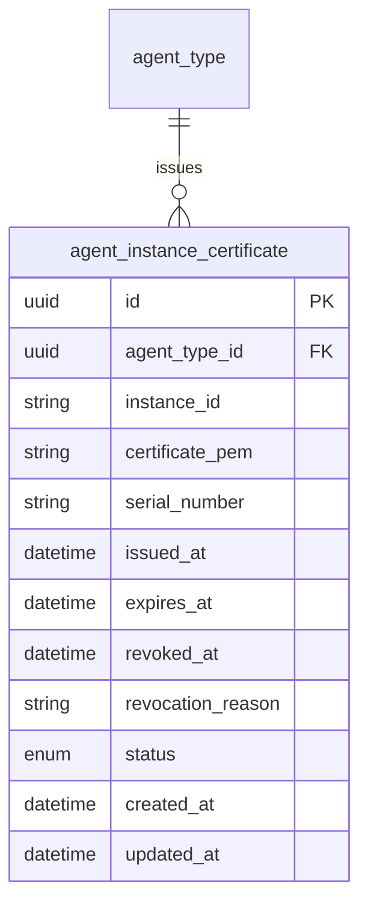
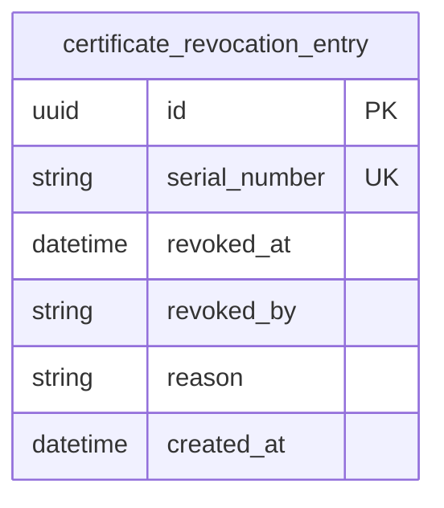
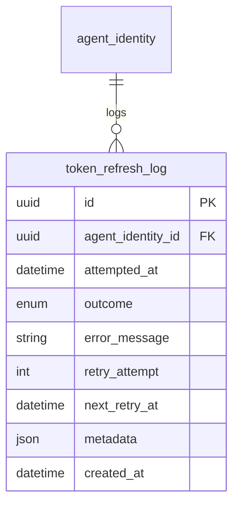
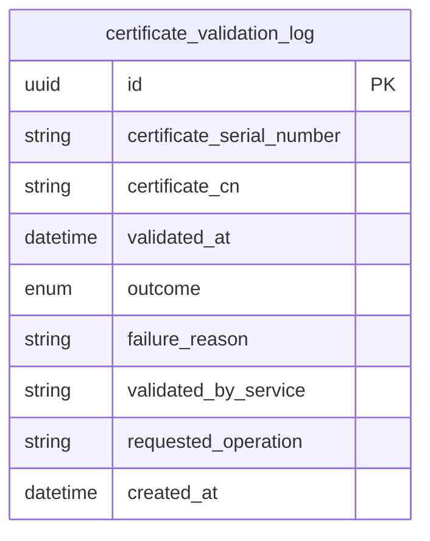
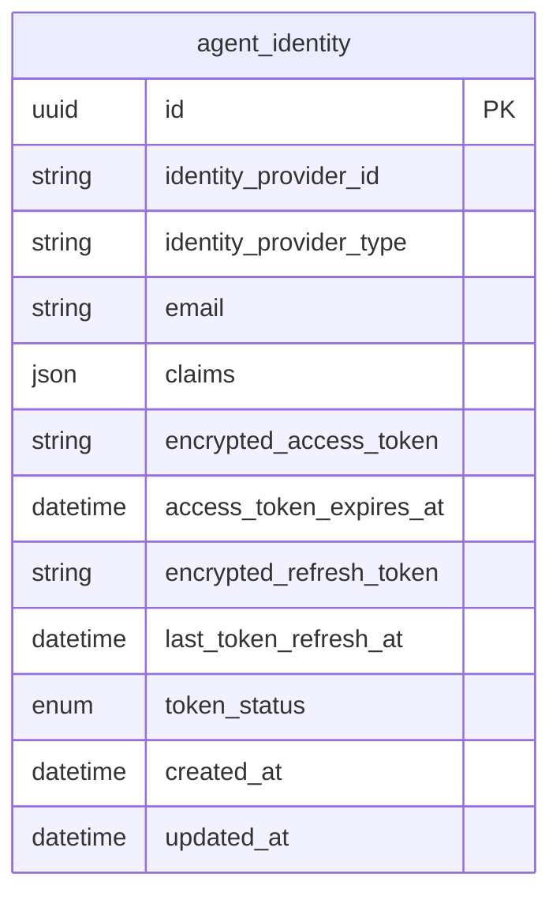

# Data Model Changes: Agent Runtime Security Segregation

**Created by:** Database Designer Agent  
**Date:** 2026-05-13  
**Status:** Draft - Awaiting Document Reviewer approval

---

## 1. New Entities

### Agent Instance Certificate

Stores issued X.509 certificates for agent instances with expiration tracking and revocation status.



**Attributes:**
- `id` — Primary key (UUID)
- `agent_type_id` — Foreign key to `agent_type` table (which agent type this cert belongs to)
- `instance_id` — Instance identifier (combined with agent_type forms unique runtime instance)
- `certificate_pem` — Full X.509 certificate in PEM format
- `serial_number` — Certificate serial number (for revocation lookups)
- `issued_at` — Timestamp when certificate was issued by Control Center CA
- `expires_at` — Certificate expiration timestamp (24 hours from issuance)
- `revoked_at` — Timestamp when certificate was revoked (NULL if not revoked)
- `revocation_reason` — Reason for revocation (admin action, security incident, etc.)
- `status` — Enum: `active`, `expired`, `revoked`
- `created_at`, `updated_at` — Audit timestamps

**Relationships:**
- Many-to-one with `agent_type`: Each certificate belongs to one agent type
- CN format: `agent-type:instance-id` (stored separately for querying)

**Business Rules:**
- Certificate validity period is 24 hours
- Agent Runtime must renew certificate at 80% lifetime (~19 hours)
- Revoked certificates remain in database (not deleted) for audit trail
- Status is computed field: `revoked` if `revoked_at` is not NULL, `expired` if `expires_at < now()`, else `active`

---

### Certificate Revocation List Entry

Tracks revoked certificates for fast validation checks. Separate from main certificate table for performance.



**Attributes:**
- `id` — Primary key (UUID)
- `serial_number` — Certificate serial number (unique, indexed for fast lookup)
- `revoked_at` — Timestamp of revocation
- `revoked_by` — Admin user ID or system identifier that revoked the certificate
- `reason` — Human-readable reason for revocation
- `created_at` — Audit timestamp

**Business Rules:**
- Serial numbers are unique within CRL
- Entries are immutable (never updated or deleted)
- Control Center checks this table on every certificate validation
- Old entries (> 30 days past certificate expiration) can be archived

---

### Token Refresh Audit Log

Logs every automatic token refresh attempt for compliance and debugging.



**Attributes:**
- `id` — Primary key (UUID)
- `agent_identity_id` — Foreign key to `agent_identity` table (which identity's token was refreshed)
- `attempted_at` — Timestamp of refresh attempt
- `outcome` — Enum: `success`, `failure`, `rate_limited`
- `error_message` — Error message if refresh failed (NULL on success)
- `retry_attempt` — Attempt number (1 for first attempt, 2-3 for retries)
- `next_retry_at` — Scheduled retry timestamp (NULL if success or max retries exceeded)
- `metadata` — JSON field for additional context (OAuth provider response, rate limit headers, etc.)
- `created_at` — Audit timestamp

**Relationships:**
- Many-to-one with `agent_identity`: Each log entry belongs to one agent identity

**Business Rules:**
- Logged immediately after refresh attempt (success or failure)
- Retries use exponential backoff: 1s, 5s, 15s
- Max 3 retry attempts per refresh operation
- Old entries (> 90 days) can be archived for compliance

---

### Certificate Validation Audit Log

Logs every certificate validation performed by Control Center and Communication Hub.



**Attributes:**
- `id` — Primary key (UUID)
- `certificate_serial_number` — Serial number of certificate being validated
- `certificate_cn` — Common Name (CN) field from certificate (agent-type:instance-id)
- `validated_at` — Timestamp of validation
- `outcome` — Enum: `valid`, `expired`, `revoked`, `invalid_signature`
- `failure_reason` — Detailed reason if outcome is not `valid`
- `validated_by_service` — Which service performed validation (`control_center`, `communication_hub`)
- `requested_operation` — What operation was being attempted (`metadata_request`, `tool_call`, etc.)
- `created_at` — Audit timestamp

**Business Rules:**
- Logged on EVERY certificate validation (even if valid)
- High-volume table (one entry per agent metadata request + one per tool call)
- Indexed on `certificate_serial_number` and `validated_at` for audit queries
- Old entries (> 90 days) can be archived for compliance

---

## 2. Modified Entities

### Agent Identity (Updated)

Add encrypted refresh token storage to support automatic token refresh.



**New Attributes:**
- `encrypted_refresh_token` — AES-256 encrypted OAuth refresh token (using `ENCRYPTION_MASTER_KEY`)
- `last_token_refresh_at` — Timestamp of most recent successful token refresh
- `token_status` — Enum: `active`, `expired`, `refresh_failed` (computed based on last refresh outcome)

**Modified Attributes:**
- `encrypted_access_token` — Was already present, no change (included for context)
- `access_token_expires_at` — Was already present, used to determine when refresh is needed

**Business Rules:**
- Refresh token is stored encrypted at rest
- Control Center decrypts refresh token only when needed for token refresh
- Token status is updated after every refresh attempt
- If refresh fails (status = `refresh_failed`), agent execution is blocked until operator intervention

---

## 3. Removed Entities/Fields

No entities or fields are being removed in this change. This is purely additive to support the new certificate-based authentication model.

---

## 4. Schema File References

Update the following schema/model files (from `docs/config.yaml` → `source.schema: backend/app/db/models/`):

### New Files to Create:
- `backend/app/db/models/agent_instance_certificate.py` — AgentInstanceCertificate model
- `backend/app/db/models/certificate_revocation_entry.py` — CertificateRevocationEntry model
- `backend/app/db/models/token_refresh_log.py` — TokenRefreshLog model
- `backend/app/db/models/certificate_validation_log.py` — CertificateValidationLog model

### Files to Update:
- `backend/app/db/models/agent_identity.py` — Add `encrypted_refresh_token`, `last_token_refresh_at`, `token_status` fields

### Migration Generation:
After updating declarative schema files, generate migration:
```bash
cd backend
alembic revision --autogenerate -m "Add certificate management and audit tables"
```

**CRITICAL:** Do NOT write migration scripts manually. Update the declarative SQLAlchemy models in `backend/app/db/models/` and use Alembic autogenerate to create migrations.

---

## 5. Master Data Model Update Instructions

### Update `docs/master/data-model/overview.md`
- [ ] Add new entities to the master ER diagram:
  - `agent_instance_certificate` (linked to `agent_type`)
  - `certificate_revocation_entry` (standalone, referenced by serial number)
  - `token_refresh_log` (linked to `agent_identity`)
  - `certificate_validation_log` (standalone, references certificates by serial number)
- [ ] Update `agent_identity` entity to show new fields: `encrypted_refresh_token`, `last_token_refresh_at`, `token_status`
- [ ] Add relationship arrows:
  - `agent_type` 1 → many `agent_instance_certificate`
  - `agent_identity` 1 → many `token_refresh_log`

### Update `docs/master/data-model/modules/agent/entities.md`
- [ ] Add entity descriptions:
  - **AgentInstanceCertificate** — X.509 certificates for agent runtime instances with expiration and revocation tracking
  - **CertificateRevocationEntry** — Fast-lookup revocation list for certificate validation
  - **TokenRefreshLog** — Audit trail for automatic identity token refresh operations
  - **CertificateValidationLog** — Audit trail for all certificate validation operations
- [ ] Update **AgentIdentity** description to mention encrypted refresh token storage and automatic refresh

### Create `docs/master/data-model/modules/security/entities.md` (NEW FILE)
- [ ] Document certificate management entities as security-focused domain objects
- [ ] Describe the certificate lifecycle: issuance → active → expired/revoked
- [ ] Describe audit log entities and their retention policies

---

**Next Steps:**
- Document Reviewer: Review and approve this data-model.md
- If approved: Proceed to Developer agent for implementation-plan.md and tech-spec.md
- If rejected: Database Designer revises based on feedback

---

## Notes for Document Reviewer

This data model follows the requirements from change-lifecycle skill:
- ✅ Technology-agnostic entity definitions (generic types: uuid, string, enum, datetime, json)
- ✅ Mermaid erDiagram blocks show business attributes with types
- ✅ Relationships shown with cardinality and labels
- ✅ NO SQL DDL, ORM syntax, or migration scripts
- ✅ Schema file references point to declarative model locations
- ✅ Business rules document constraints at domain level (not database implementation)
