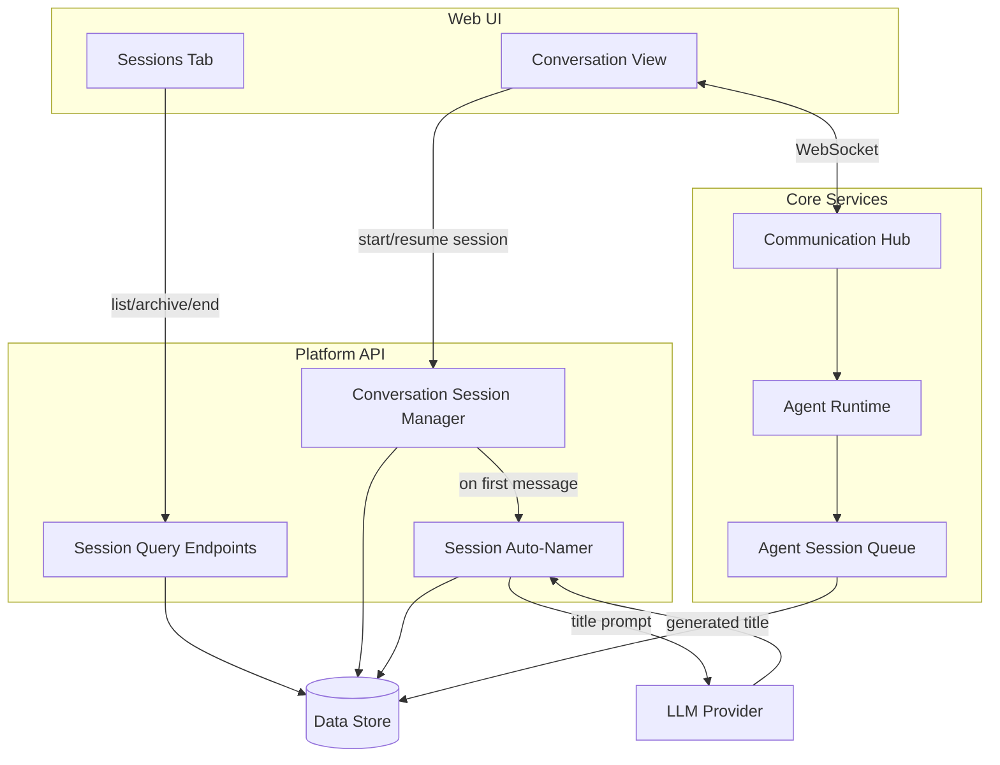
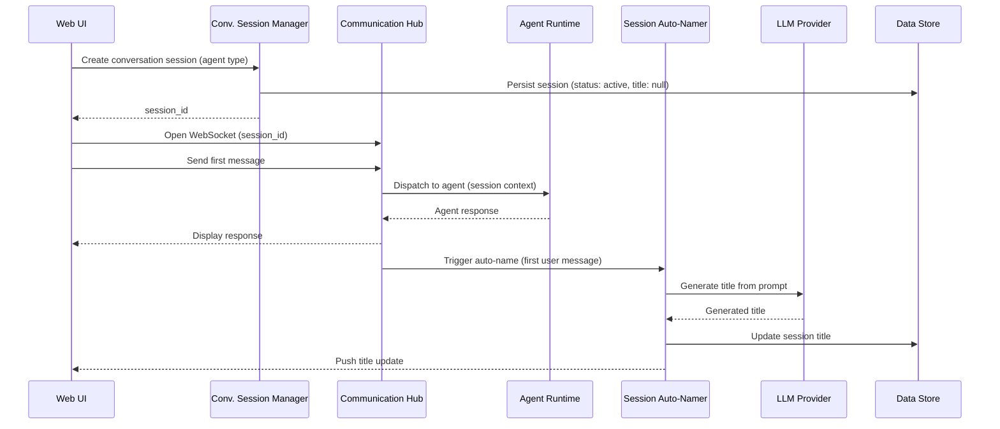
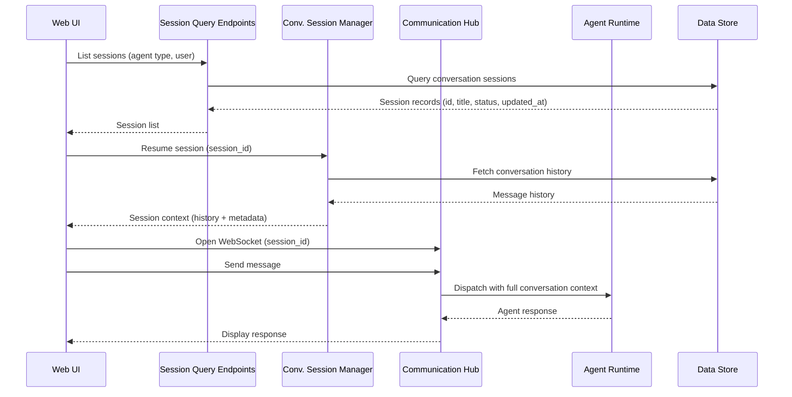

# Architecture — Conversation Agent Sessions

## Changed Components

| Component | Change |
|---|---|
| **Agent Session Queue** | Extended to store `conversation_title` and `conversation_status` (active / ended / archived) on session records for conversational agent types |
| **Communication Hub** | Receives `session_id` on WebSocket connect to associate messages with persistent sessions; triggers Session Auto-Namer after first user message lands |
| **Agent Instance Dashboard** | Sessions tab added per Agent Type view; columns updated to include session title and last-active timestamp for conversational agents; status filter extended to include `active` and `archived` states |
| **Platform API** | New session management endpoints wired to the Conversation Session Manager (create, list, resume, end, archive) |

## New Components

| Component | Responsibility |
|---|---|
| **Conversation Session Manager** | Creates and owns conversation session records; validates session ownership against the authenticated user; enforces session lifecycle transitions (active → ended → archived) |
| **Session Auto-Namer** | Invoked asynchronously after the first user message in a new session; constructs a concise title-generation prompt from the user's opening message; calls the configured LLM and writes the result back to the session record; pushes the title to the active WebSocket client |

## Integration Points

| Integration | Protocol | Direction | Purpose |
|---|---|---|---|
| Web UI → Platform API | REST | Frontend → Backend | Create, list, resume, end, archive sessions |
| Web UI ↔ Communication Hub | WebSocket | Bidirectional | Carry `session_id` on connection open; receive title-update push after auto-naming |
| Communication Hub → Session Auto-Namer | Internal | Async trigger | First-message signal initiates title generation |
| Session Auto-Namer → LLM Provider | LLM API | Outbound | Title-generation prompt resolved via Model Config Service (reuses agent type's model config) |
| Conversation Session Manager → Data Store | SQL | Read / Write | Persist session records and conversation history; query sessions by user and agent type |
| Session Query Endpoints → Data Store | SQL | Read | List and filter sessions for the Sessions tab |

## Component Architecture

## Data Flow Changes

### Start Conversation Session

### Discover and Resume Session

## Master Arch Update Instructions

Update the following files in `docs/master/architecture/`:

| File | Update |
|---|---|
| `system-overview.md` | Add **Conversation Session Manager** and **Session Auto-Namer** to the Core Services subgraph in the main flowchart; add both to the Component Responsibilities table; add session management REST and WebSocket entries to the Integration Points table |
| `modules/communication.md` | Add "Conversation Session Persistence" section: describe how the hub accepts `session_id` on WebSocket connect, associates messages with the session record, and fires the async auto-name trigger after the first user message |
| `modules/agent-instance-dashboard.md` | Document the Sessions tab added to the Agent Type detail view; update the Dashboard Features section to include session title column, last-active timestamp, and the active / archived status filter values |
| `modules/agent-lifecycle.md` | Add a "Conversational Session Lifecycle" section describing the extended lifecycle (active → ended → archived) and the Conversation Session Manager's role in managing it alongside the Agent Session Queue |
