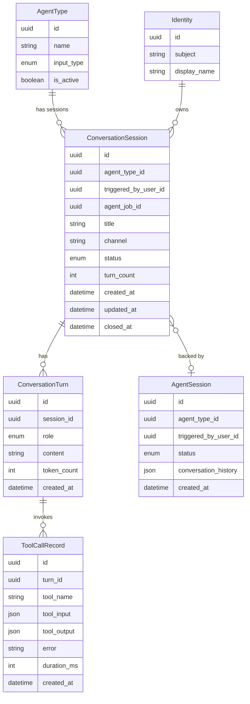

# Data Model — Conversation Agent Sessions

## New Entities

None. This feature promotes and enhances existing entities rather than introducing new tables.

---

## Modified Entities

### ConversationSession

Promoted from an internal execution record to the primary user-facing session entity for conversational agent interactions. Gains a persistent title, user ownership, a proper FK to the agent type, and an `archived` lifecycle state.

**New fields:**

| Field | Type | Description |
|---|---|---|
| `title` | `string` | Auto-generated from the first user message; displayed in the Sessions tab. Nullable until the first turn is received. |
| `triggered_by_user_id` | `uuid` | FK → `Identity`. The platform user who started the session. Replaces the unstructured `initiator_subject` string. |
| `agent_job_id` | `uuid` | FK → `AgentSession`. The active execution record backing this session. Nullable (set when an execution is spawned). |
| `updated_at` | `datetime` | Timestamp of the last turn or status change; used for sorting the Sessions list by recency. |

**Changed fields:**

| Field | Change |
|---|---|
| `agent_type_id` | Promoted from an unkeyed UUID column to a proper FK → `AgentType`. |
| `agent_instance_id` | **Removed** — legacy FK to the deprecated `AgentInstance` table. |
| `initiator_subject` | **Removed** — replaced by `triggered_by_user_id`. |
| `status` enum | Add `archived` value (existing: `active`, `closed`, `error`). |

**Updated `ConversationStatus` enum values:**

| Value | Meaning |
|---|---|
| `active` | Session is open and accepting new messages. |
| `closed` | User explicitly ended the session; no longer accepting messages. |
| `archived` | Hidden from the active sessions list; retained for audit and history. |
| `error` | Session encountered an unrecoverable error. |

---

### AgentType

No schema changes. The existing `input_type` enum already carries a `conversation` value. The Sessions tab and session management entry points are driven by filtering on `input_type = conversation` in the UI and API layer.

---

## Removed Fields

| Entity | Field | Reason |
|---|---|---|
| `ConversationSession` | `agent_instance_id` | FK to the deprecated `AgentInstance` table (legacy); no longer needed. |
| `ConversationSession` | `initiator_subject` | Unstructured string replaced by `triggered_by_user_id` FK to `Identity`. |

---

## Schema File References

| File | Change |
|---|---|
| `backend/app/db/models/conversations.py` | Add `title`, `triggered_by_user_id`, `agent_job_id`, `updated_at`; promote `agent_type_id` to FK; remove `agent_instance_id` and `initiator_subject`; add `archived` to `ConversationStatus` enum. |
| `backend/app/db/models/agents.py` | No schema changes; `AgentType.input_type` already supports `conversation`. |

---

## Master Data Model Update Instructions

Update `docs/master/data-model/modules/communication/entities.md`:

1. Replace the `ConversationSession` entity block with the updated attribute set (add `title`, `triggered_by_user_id`, `agent_job_id`, `updated_at`; remove `agent_instance_id` and `initiator_subject`).
2. Add the `archived` value to the `ConversationStatus` enum description.
3. Add the new relationships: `AgentType ||--o{ ConversationSession`, `Identity ||--o{ ConversationSession`, and `ConversationSession }o--o| AgentSession`.
4. Update the entity description table row for `ConversationSession` to reflect its new role as the primary user-facing session entity.
