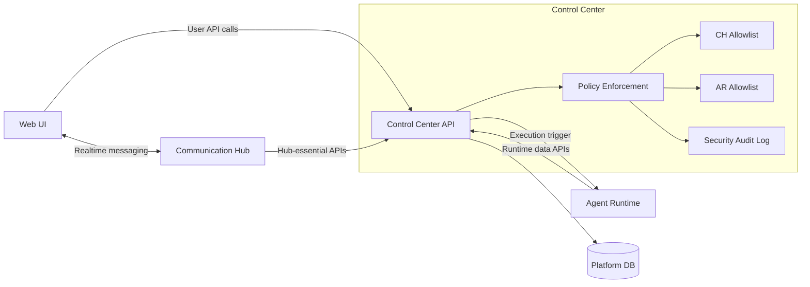
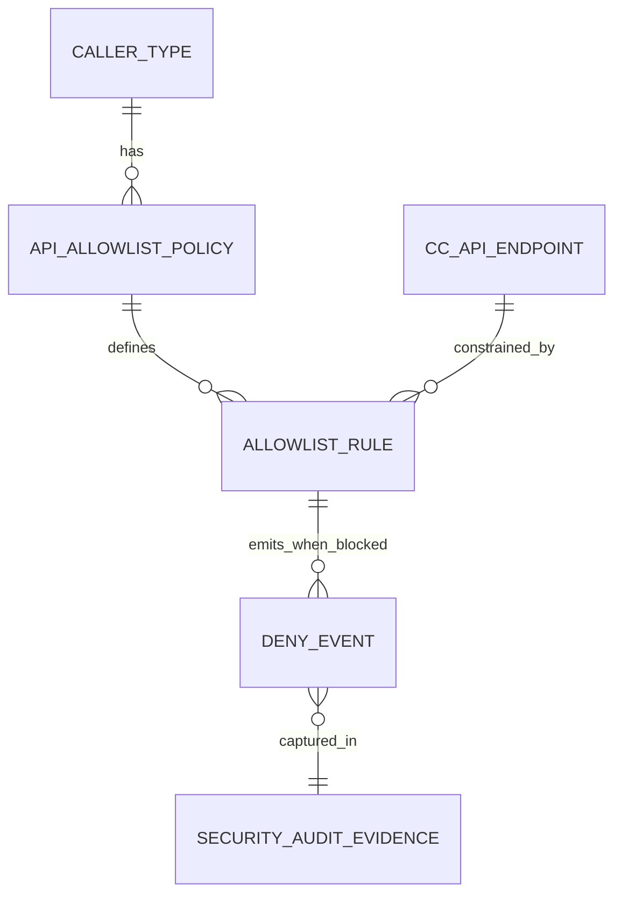
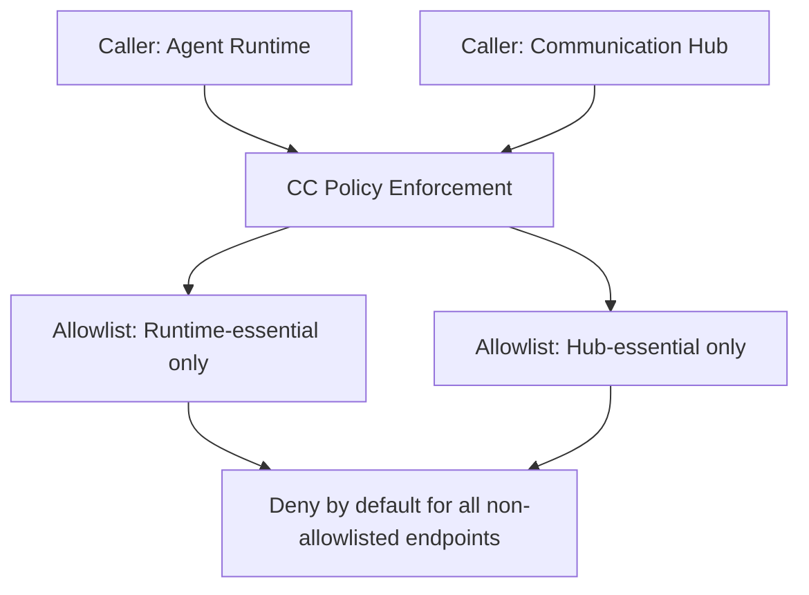
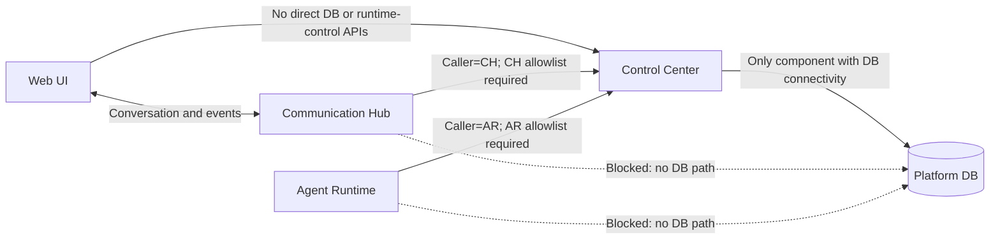
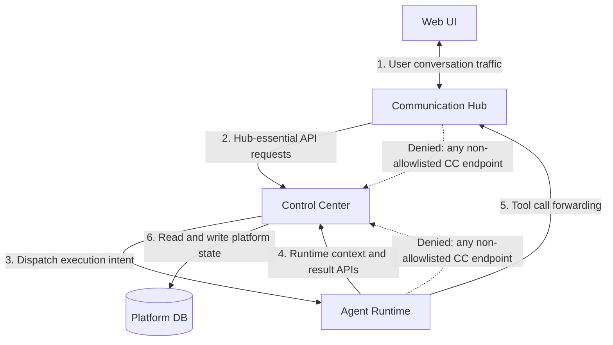
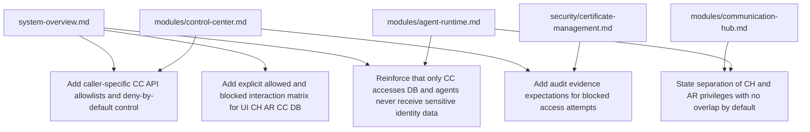

# Architecture: Service Segregation Security Audit

This target state enforces strict segregation across the three backend services. Control Center is the only database-connected service, Agent Runtime is the only place where agents execute, and caller-specific allowlists apply deny-by-default access control.

## 1) Changed Components

This model separates responsibilities by service boundary and keeps all privileged data access behind Control Center.

## 2) Caller-Based Access Control Model

This control model ensures Communication Hub and Agent Runtime are granted only the minimal Control Center API access required for their distinct responsibilities, with blocked attempts recorded as audit evidence.

## 3) Integration Boundaries

These boundaries enforce the top-priority rules: no direct database path outside Control Center and no privilege overlap by default between Communication Hub and Agent Runtime.

## 4) Primary Data Flow

This flow keeps user interaction, runtime execution, policy enforcement, and persistence concerns clearly separated while preserving full auditability of denied access attempts.

## 5) Master Documentation Alignment

Update [docs/master/architecture/system-overview.md](docs/master/architecture/system-overview.md), [docs/master/architecture/modules/control-center/architecture.md](docs/master/architecture/modules/control-center/architecture.md), [docs/master/architecture/modules/communication-hub/architecture.md](docs/master/architecture/modules/communication-hub/architecture.md), [docs/master/architecture/modules/agent-runtime/architecture.md](docs/master/architecture/modules/agent-runtime/architecture.md), and [docs/master/architecture/security/certificate-management.md](docs/master/architecture/security/certificate-management.md) to reflect these boundaries and controls at the same high level.