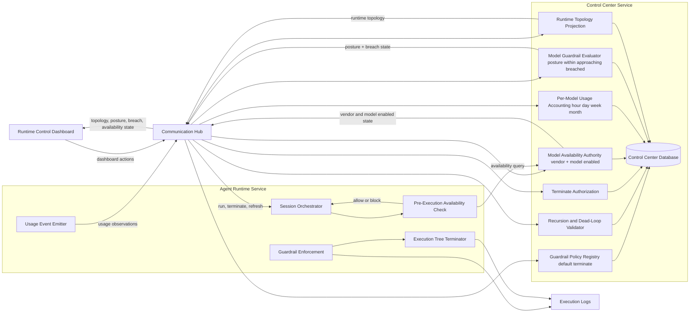
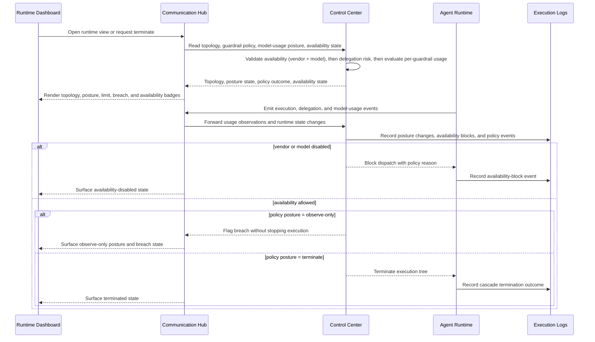
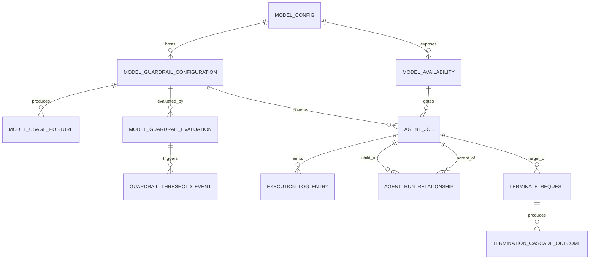

# Architecture Changes: harden-agent-guardrails-and-runtime-control-dashboard

## 1) Changed Components and Responsibilities
- Runtime Control Dashboard: shows active parent/child runtime topology, model-usage posture, breach state, and the new vendor → model → guardrail hierarchy. Terminate actions remain available only to authorized users.
- Communication Hub (Agent Gateway): brokers runtime topology, guardrail, model-usage, and availability state between the UI, Agent Runtime, and Control Center without direct database access.
- Agent Runtime: enforces guardrails across direct and delegated execution, performs the pre-execution availability check (vendor + model enabled) before dispatching, emits model-usage observations, and applies subtree-aware termination behavior.
- Control Center: remains the policy authority for recursion/dead-loop validation, terminate authorization, runtime topology projection, per-guardrail evaluation, and **Model Availability** (vendor-enabled and per-model-enabled state). Guardrails default to terminate; observe-only is explicit and non-default.
- Execution Logs: records policy outcomes, observe-only alerts, model-usage posture changes, breach events, vendor-disabled blocks, model-disabled blocks, and cascade termination outcomes for audit and operations.

## 2) New and Expanded Components
This view shows the service-level components introduced or expanded by this change and how policy, accounting, availability, topology, and observability signals move between them.

## 3) Integration Point Changes
- Runtime Control Dashboard -> Communication Hub: topology read/subscription, model-usage posture refresh, breach-state visibility, enforcement-mode display, **availability-state read for vendor/model**, and terminate-node requests.
- Communication Hub -> Control Center: recursion/dead-loop validation, terminate authorization, runtime topology projection updates, per-guardrail usage accounting/evaluation requests across hour/day/week/month windows, and availability queries.
- Agent Runtime -> Control Center (new): pre-execution availability check for the resolved model (vendor-enabled, model-enabled). Performed via Communication Hub. Failure blocks dispatch and produces a policy-block event.
- Agent Runtime -> Communication Hub: execution lifecycle events, delegation updates, and model-usage observations.
- Control Center -> Execution Logs: guardrail outcomes, observe-only alerts, model-usage posture changes, breach events, vendor-disabled blocks, model-disabled blocks, and cascade termination outcomes.
- Control Center -> Database: sole owner of persistent policy state, topology projection, availability state, usage rollups, and posture state.

## 4) Data Flow Changes
The flow consolidates pre-run graph validation, pre-execution availability, per-guardrail time-windowed usage accounting, topology projection updates, and permission-gated subtree termination.

## 5) Business Entity Relationship View
This ER view captures the core operational entities for policy-governed runtime control, availability, per-guardrail usage accounting, and posture visibility.

## 6) Master Architecture Update Instructions for docs/master/architecture/
- Update docs/master/architecture/system-overview.md to show runtime-control topology, model-usage posture, breach-state visibility, vendor/model availability, and terminate orchestration in the main system flow.
- Update docs/master/architecture/modules/agent-runtime/architecture.md to cover unified guardrail enforcement, model-usage emission, the pre-execution availability check, and execution-tree cascade termination responsibilities.
- Update docs/master/architecture/modules/communication-hub/architecture.md to add runtime-state brokering, policy-state refresh, usage-event forwarding, availability query brokering, and dashboard update responsibilities.
- Update docs/master/architecture/modules/control-center/architecture.md to add recursion/dead-loop validation, terminate authorization, default-terminate guardrail policy management, per-guardrail usage accounting/evaluation across hour/day/week/month periods, and the new Model Availability Authority capability.
- Update docs/master/architecture/modules/model-config.md to clarify that **one ModelConfig may host many per-period guardrail rows** (per-guardrail CRUD), that vendor-level `is_disabled` cascades to all its models, and that per-model availability is independent of provider binding.
- Update docs/master/architecture/modules/agent-instance-dashboard.md to add runtime topology, model-usage posture, breach-state presentation, and the vendor → model → guardrail hierarchy for active sessions.
- Update docs/master/architecture/modules/execution-logs.md to add policy-event taxonomy for observe-only alerts, breach events, vendor-disabled blocks, model-disabled blocks, and cascade termination outcomes.
- Verify docs/master/architecture/security/ and module pages continue to state that only Control Center accesses persistent data and that Agent Runtime remains the sole execution boundary.
