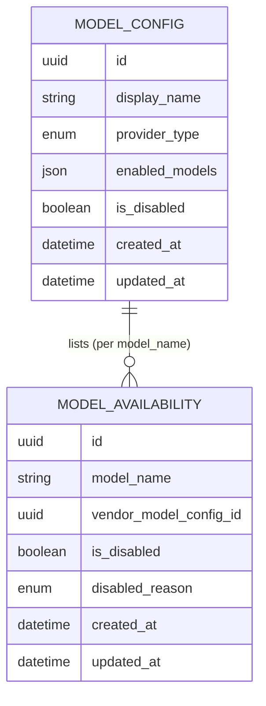
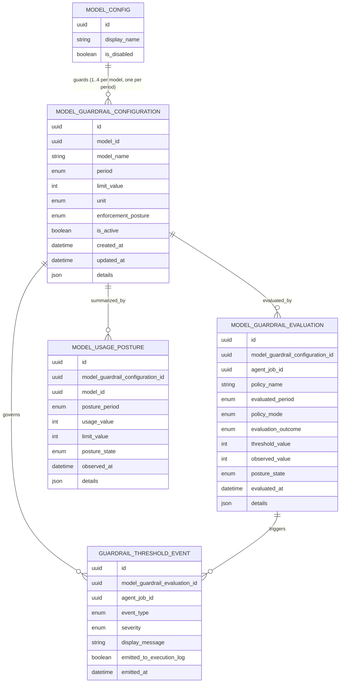
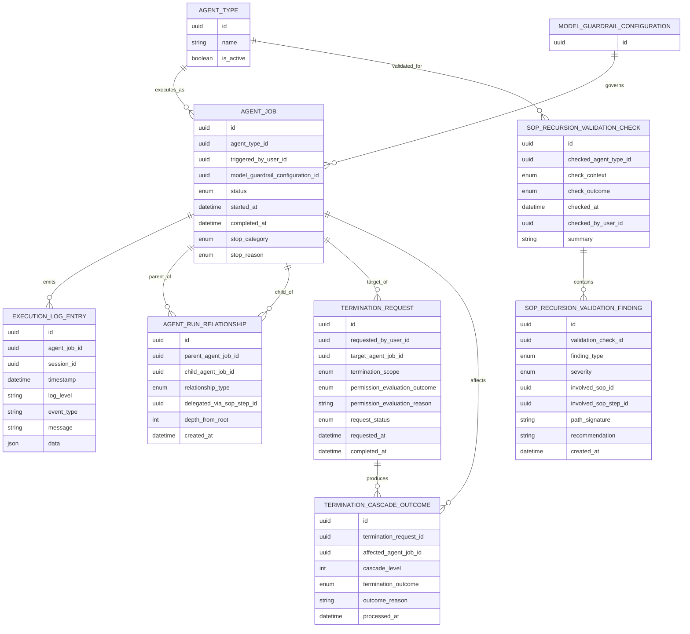

# Data Model Changes: Harden Agent Guardrails and Runtime Control Dashboard

## New Entities

### ModelGuardrailConfiguration
Defines a single per-model, per-period guardrail record under the vendor → model → guardrail hierarchy. Each model can have one to four guardrails, one per period, and operators configure only the periods they actually want — there is no forced four-period entry. The configuration is the source of truth for one period-based usage limit on one model and feeds both guardrail evaluation and dashboard posture. A uniqueness rule on (model_id, model_name, period) guarantees at most one guardrail per (model, period).

Key attributes:
- id (uuid)
- model_id (uuid) — FK to ModelConfig
- model_name (string)
- period (enum: hour, day, week, month) — exactly one period per row
- limit_value (int) — single numeric limit for this guardrail
- unit (enum: k, tokens) — the unit for this guardrail's limit and rollups
- enforcement_posture (enum: terminate, observe_only) — defaults to terminate for newly configured guardrails
- is_active (boolean) — per-guardrail enable/disable toggle
- created_at (datetime)
- updated_at (datetime)
- details (json)

### ModelAvailability
Per-model enabled state under a vendor. The model_name from `ModelConfig.enabled_models` is the primary identifier on this entity; operators toggle an individual model on or off here, and the Agent Runtime consults this entity at pre-execution time. A model is effectively disabled when either this row's `is_disabled` is true or when its vendor's `ModelConfig.is_disabled` is true; the `disabled_reason` records which condition currently applies so the cascade source is visible in operator views and audit logs.

A model name such as "gpt-4o" can be enabled by multiple vendors; the effective enabled state for a (vendor, model_name) pair is the union, so a model is considered available to agents if at least one vendor offers it as enabled.

Key attributes:
- id (uuid)
- model_name (string)
- vendor_model_config_id (uuid) — FK to ModelConfig
- is_disabled (boolean)
- disabled_reason (enum: manual, vendor_cascaded)
- created_at (datetime)
- updated_at (datetime)

### ModelGuardrailEvaluation
Captures each model-level guardrail evaluation decision for a run, including the configured posture and the observed usage against the selected period limit. Each evaluation now keys off a single per-guardrail `ModelGuardrailConfiguration` row rather than a flat per-model row.

Key attributes:
- id (uuid)
- model_guardrail_configuration_id (uuid) — FK to ModelGuardrailConfiguration (per-guardrail row)
- agent_job_id (uuid)
- policy_name (string)
- evaluated_period (enum: hour, day, week, month)
- policy_mode (enum: terminate, observe_only)
- evaluation_outcome (enum: pass, threshold_reached, blocked)
- threshold_value (int)
- observed_value (int)
- posture_state (enum: within_limit, approaching_limit, breached)
- evaluated_at (datetime)
- details (json)

### ModelUsagePosture
Stores the current usage posture shown in the runtime dashboard for each model and period. This is the dashboard-facing view of current usage versus the configured limit, so operators can see whether a model is within limit, nearing limit, or breached. Keys off the per-guardrail `ModelGuardrailConfiguration` row; the dashboard view aggregates posture rows by model for the three-level hierarchy.

Key attributes:
- id (uuid)
- model_guardrail_configuration_id (uuid) — FK to ModelGuardrailConfiguration (per-guardrail row)
- model_id (uuid)
- posture_period (enum: hour, day, week, month)
- usage_value (int)
- limit_value (int)
- posture_state (enum: within_limit, approaching_limit, breached)
- observed_at (datetime)
- details (json)

### GuardrailThresholdEvent
Represents user-visible threshold events emitted when observe-only policy limits are reached.

Key attributes:
- id (uuid)
- model_guardrail_evaluation_id (uuid)
- agent_job_id (uuid)
- event_type (enum: observe_only_threshold_reached)
- severity (enum: info, warning, critical)
- display_message (string)
- emitted_to_execution_log (boolean)
- emitted_at (datetime)

### AgentRunRelationship
Represents runtime topology edges between parent and delegated child runs.

Key attributes:
- id (uuid)
- parent_agent_job_id (uuid)
- child_agent_job_id (uuid)
- relationship_type (enum: delegation)
- delegated_via_sop_step_id (uuid)
- depth_from_root (int)
- created_at (datetime)

### TerminationRequest
Captures a user-requested termination action and permission evaluation result.

Key attributes:
- id (uuid)
- requested_by_user_id (uuid)
- target_agent_job_id (uuid)
- termination_scope (enum: node_only, cascade_subtree)
- permission_evaluation_outcome (enum: allowed, denied)
- permission_evaluation_reason (string)
- request_status (enum: accepted, rejected, completed, partially_completed, failed)
- requested_at (datetime)
- completed_at (datetime)

### TerminationCascadeOutcome
Stores per-run termination outcomes for the request tree, including root and delegated children.

Key attributes:
- id (uuid)
- termination_request_id (uuid)
- affected_agent_job_id (uuid)
- cascade_level (int)
- termination_outcome (enum: terminated, already_completed, not_found, permission_denied, failed)
- outcome_reason (string)
- processed_at (datetime)

### SopRecursionValidationCheck
Represents validation checks run during agent create, update, or run initiation.

Key attributes:
- id (uuid)
- checked_agent_type_id (uuid)
- check_context (enum: create, update, run)
- check_outcome (enum: pass, fail)
- checked_at (datetime)
- checked_by_user_id (uuid)
- summary (string)

### SopRecursionValidationFinding
Stores detailed recursion and dead-loop findings from a validation check.

Key attributes:
- id (uuid)
- validation_check_id (uuid)
- finding_type (enum: cycle_detected, dead_loop_risk, max_depth_violation, repeated_delegation_path)
- severity (enum: warning, error)
- involved_sop_id (uuid)
- involved_sop_step_id (uuid)
- path_signature (string)
- recommendation (string)
- created_at (datetime)

#### Sub-ER 1 — Vendor and Model Availability

The vendor-level `is_disabled` on `ModelConfig` cascades to every model under it; the cascade is materialised on each affected `ModelAvailability` row by setting `is_disabled` true and `disabled_reason` to `vendor_cascaded`. When the vendor is re-enabled, the per-model `is_disabled` flag is restored from each `ModelAvailability` row and `disabled_reason` returns to `manual` if the row was originally disabled manually, or `false` otherwise.

#### Sub-ER 2 — Guardrail Configuration, Evaluation, Posture, and Threshold Events

Each `ModelGuardrailConfiguration` row covers exactly one period. The dashboard view aggregates posture rows by model so an operator sees a model's per-period posture in the three-level hierarchy.

#### Sub-ER 3 — Agent Runtime, Topology, Termination, and Recursion Validation

## Modified Entities

### ModelConfig
Extend with the vendor-level enable/disable toggle. When `is_disabled` is true, every model enumerated in this vendor is treated as disabled at pre-execution time. The cascade is materialised on each affected `ModelAvailability` row so the per-model disable affordances remain visible and the cascade source is preserved in operator views and execution logs.

Added/updated attributes:
- is_disabled (boolean) — vendor-level enable/disable. Default false. When true, every model under this vendor is treated as disabled regardless of per-model state.

### AgentJob
Add topology, model-guardrail, and termination observability attributes so parent/child run trees, model posture, and stop outcomes are visible in runtime dashboards. The `model_guardrail_configuration_id` now points to a per-guardrail row (one period) rather than a per-model row spanning all four periods.

Added/updated attributes:
- parent_job_id (uuid): direct parent run when this run was delegated.
- root_job_id (uuid): root of the execution tree.
- delegation_depth (int): depth of the run in the execution tree.
- model_guardrail_configuration_id (uuid): per-guardrail context used for this run.
- terminated_by_request_id (uuid): links final stop state to a termination request.
- termination_category (enum: none, user_requested, cascade_parent_terminated, policy_blocked, model_disabled, vendor_disabled): standardized stop attribution, including the disabled-model and disabled-vendor block categories.

### ExecutionLogEntry
Extend event classification so guardrail, posture, termination, model-disabled, and vendor-disabled outcomes are distinguishable from functional failures.

Added/updated attributes:
- event_category (enum: functional, guardrail, posture, termination, validation, model_disabled, vendor_disabled)
- correlation_id (string): links related events within the same policy evaluation or termination request.
- actor_type (enum: system, user, operator)

### AgentType
Add explicit recursion validation posture metadata to support create/update/run prechecks and operator explainability.

Added/updated attributes:
- recursion_validation_mode (enum: strict_block, warn_only)
- last_recursion_validation_status (enum: pass, fail)
- last_recursion_validation_at (datetime)

## Removed Entities/Fields
The following four period-specific limit columns are removed from `ModelGuardrailConfiguration` as part of restructuring it to one row per guardrail (one period per row). They are replaced by the new `period` (enum) + `limit_value` (int) pair, with a (model_id, model_name, period) uniqueness rule limiting each model to at most one guardrail per period:

- `ModelGuardrailConfiguration.usage_limit_hour` (int) — removed
- `ModelGuardrailConfiguration.usage_limit_day` (int) — removed
- `ModelGuardrailConfiguration.usage_limit_week` (int) — removed
- `ModelGuardrailConfiguration.usage_limit_month` (int) — removed

The previously implicit requirement to enter all four period limits when configuring a model is also removed; operators save only the periods they want (one to four guardrail rows per model).

## Schema File References
Per docs/config.yaml, schema source is backend/app/db/models/.

Expected new model files:
- backend/app/db/models/model_guardrail_configuration.py
- backend/app/db/models/model_availability.py
- backend/app/db/models/model_guardrail_evaluation.py
- backend/app/db/models/model_usage_posture.py
- backend/app/db/models/guardrail_threshold_event.py
- backend/app/db/models/agent_run_relationship.py
- backend/app/db/models/termination_request.py
- backend/app/db/models/termination_cascade_outcome.py
- backend/app/db/models/sop_recursion_validation_check.py
- backend/app/db/models/sop_recursion_validation_finding.py

Expected updates to existing model files:
- backend/app/db/models/agents.py (ModelConfig gains `is_disabled`; AgentJob gains new topology, per-guardrail, and termination attribution fields, including `model_disabled` and `vendor_disabled` stop categories; AgentType extensions)
- backend/app/db/models/session_logs.py (ExecutionLogEntry extensions for event categories covering guardrail, posture, termination, validation, model-disabled, and vendor-disabled outcomes)
- backend/app/db/models/__init__.py (model exports/registration)

## Master Data Model Update Instructions
- Update docs/master/data-model/overview.md with the new vendor → model → guardrail hierarchy, the per-guardrail rows, the per-vendor and per-model disable entities, and the cascade rule.
- Update docs/master/data-model/modules/operations/entities.md:
  - Restructure ModelGuardrailConfiguration to one row per guardrail (one period per row) with `period`, `limit_value`, `unit`, and `is_active`; document the (model_id, model_name, period) uniqueness rule.
  - Add ModelAvailability (per-model enabled state with `is_disabled` and `disabled_reason` of `manual` or `vendor_cascaded`).
  - Document the cascade rule: when ModelConfig.is_disabled is true, every ModelAvailability row for that vendor has `is_disabled` true and `disabled_reason` = `vendor_cascaded`; when the vendor is re-enabled, each row is restored to its prior manual state.
  - Add GuardrailPolicyEvaluation and GuardrailThresholdEvent.
  - Clarify observe-only threshold events as visible operational alerts.
- Update docs/master/data-model/modules/agent/entities.md:
  - Extend ModelConfig with the `is_disabled` vendor toggle.
  - Add AgentRunRelationship, TerminationRequest, and TerminationCascadeOutcome.
  - Extend AgentJob with parent/root/depth and termination attribution fields, including the new `model_disabled` and `vendor_disabled` stop categories.
- Update docs/master/data-model/modules/governance/entities.md:
  - Add SopRecursionValidationCheck and SopRecursionValidationFinding.
  - Document check contexts (create, update, run) and block/warn outcomes.
- Ensure the master ER diagram (split as needed under the 15-node-per-diagram cap) shows:
  - Vendor → many models via ModelConfig.enabled_models enumeration, with per-model ModelAvailability rows.
  - ModelConfig → many ModelGuardrailConfiguration rows under a (model_id, model_name, period) uniqueness rule.
  - One ModelGuardrailConfiguration → many ModelGuardrailEvaluation, many ModelUsagePosture, and many GuardrailThresholdEvent.
  - One ModelGuardrailConfiguration → many AgentJob (governs).
  - One agent run to many policy evaluations.
  - One policy evaluation to many observe-only threshold events.
  - Parent-to-child run topology via relationship edges.
  - One termination request to many cascade outcomes.
  - One recursion validation check to many findings.
