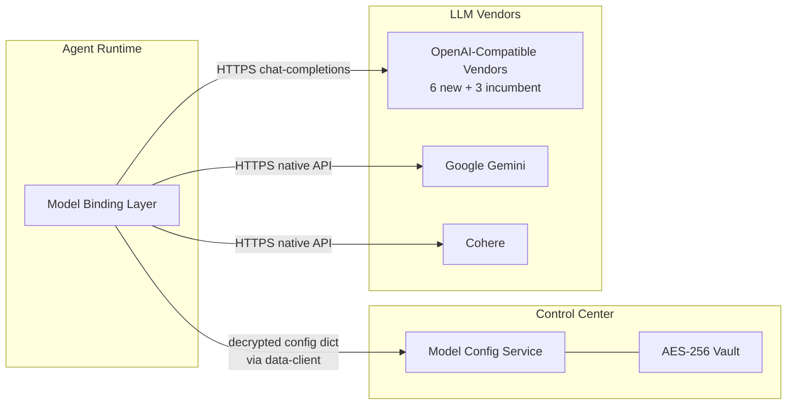
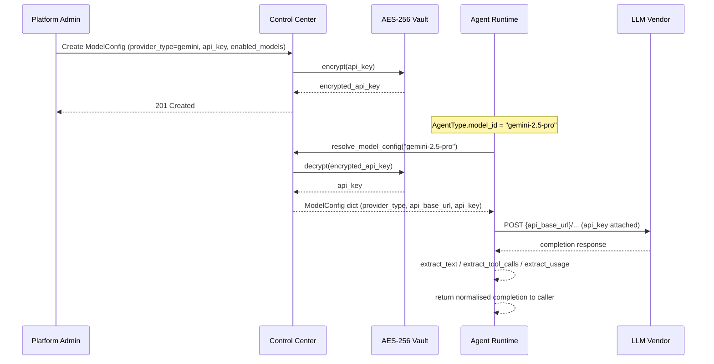

# Architecture: Expand Model Config Providers

## Summary

This change extends the Model Configuration Service to recognise twelve LLM providers — the four incumbent (`openai`, `anthropic`, `litellm_proxy`, `azure_openai`) plus eight new API-key-based providers (`gemini`, `mistral`, `cohere`, `groq`, `together`, `fireworks`, `perplexity`, `deepseek`). The eight new providers fall into two dispatch families: **OpenAI-compatible** (Mistral, Groq, Together AI, Fireworks AI, Perplexity, DeepSeek) and **native-API** (Google Gemini, Cohere). The dispatch surface is refactored from a hard-coded `if/elif` ladder into a small provider-registry facade so the six OpenAI-compatible providers share a single dispatch path while the two native-API providers get their own dedicated branches. The agent-runtime boundary is unchanged: Agent Runtime continues to receive decrypted credentials from Control Center via the data-client and never holds raw API keys at rest.

## Changed Components

| Component | File | What Changes |
|---|---|---|
| `ModelProvider` Python enum | `backend/app/db/models/agents.py` (line 70) | Enum gains eight new members (`gemini`, `mistral`, `cohere`, `groq`, `together`, `fireworks`, `perplexity`, `deepseek`) |
| Postgres enum `model_provider_enum` | Database (managed via `backend/app/db/models/agents.py` line 427) | New enum values added through an additive Alembic migration (no type recreation) |
| `ModelBindingLayer.complete` / `complete_from_context` | `backend/app/services/agents/model_binding.py` (lines 92–200) | Replaces the four-branch `if/elif` ladder with a provider-registry dispatch that fans into two families: OpenAI-compatible (one shared path) and native-API (per-vendor branches) |
| `ModelBindingLayer.extract_text` / `extract_tool_calls` / `extract_usage` | `backend/app/services/agents/model_binding.py` (lines 303–371) | Dispatchers widened to cover the new providers, keeping the `null`-on-unavailable semantics |
| `ModelConfigService.list_models_for_config` and `_list_*` helpers | `backend/app/services/agents/model_config_service.py` (lines 134–223) | A new `_list_<provider>` helper is added per new provider family; OpenAI-compatible providers reuse the existing OpenAI-shape listing logic, and native-API providers return curated static lists |
| `ModelProviderType` TypeScript union | `frontend/src/types/index.ts` (line 457) | Union gains eight new string literal members |
| `PROVIDERS` dropdown array | `frontend/src/pages/agents/ModelConfigDialog.tsx` (lines 34–39) | Array gains eight new entries; visual grouping in the dropdown separates the four incumbent providers from the eight new ones |
| `providerColor` chip-colour map | `frontend/src/pages/agents/ModelConfigListPage.tsx` (line 138–139) | Map gains eight new distinct colours (no two providers share a colour) |
| i18n labels | `frontend/src/i18n/locales/en.json` (under `agents.modelConfigs`) | New `providerLabels` map with one entry per new provider |
| Runtime call sites | `backend/app/services/agents/runtime_executor.py` (lines 1534, 2024–2025, 2141–2143, 2258–2260, 2283, 2914) | Call sites continue to pass the same `provider_type` string into `ModelBindingLayer`; the dispatcher's widened surface means no call-site changes are required |

## New Components

### Provider-Registry / Dispatch-Facade

A thin in-process registry replaces the four-branch `if/elif` ladder. The registry groups providers by **dispatch family** so the six OpenAI-compatible providers share a single dispatch path and the two native-API providers get their own dedicated branches.

```mermaid
flowchart TB
    Caller[Runtime Call Site<br/>model_id + provider_type]
    Registry[Provider Registry<br/>provider_type → DispatchSpec]
    OpenAIFam[OpenAI-Compatible Family<br/>6 new + 3 incumbent]
    NativeFam[Native-API Family<br/>2 providers]
    TextExtract[Text Extraction]
    ToolExtract[Tool-Call Extraction]
    UsageExtract[Usage Extraction]

    Caller --> Registry
    Registry -->|provider in {openai, litellm_proxy,<br/>azure_openai, mistral, groq,<br/>together, fireworks, perplexity, deepseek}| OpenAIFam
    Registry -->|provider in {gemini, cohere}| NativeFam
    OpenAIFam --> TextExtract
    OpenAIFam --> ToolExtract
    OpenAIFam --> UsageExtract
    NativeFam --> TextExtract
    NativeFam --> ToolExtract
    NativeFam --> UsageExtract
```

The registry holds, per provider: the dispatch-family key, the default `api_base_url` (when applicable), the static curated model list (for providers with no public listing endpoint), the credential-header convention, and the response-shape tag used by the extractors. The registry is a module-level constant in `model_binding.py`; no external configuration is required.

### Per-Provider Model-List Helpers

Two new helper methods on `ModelConfigService` (alongside the existing `_list_openai_models`, `_list_anthropic`, `_list_azure_models`, `_list_litellm_models`):

- A shared `_list_openai_compat_models(api_key, base_url)` helper used by every OpenAI-compatible family provider.
- Two new native-API list helpers, `_list_gemini_models` and `_list_cohere_models`, returning curated static lists (neither vendor exposes a public model-listing endpoint that returns a stable, ordered catalogue).

## Integration Points

| Integration Point | Convention | Affected Providers |
|---|---|---|
| **OpenAI-compatible chat-completions** | `POST {api_base_url}/chat/completions` with bearer-style credential header; JSON request/response shape identical to OpenAI | `mistral`, `groq`, `together`, `fireworks`, `perplexity`, `deepseek` (new), and the existing `openai`, `litellm_proxy`, `azure_openai` |
| **Google Gemini native API** | Vendor-native REST shape with vendor-native credential header; non-OpenAI request/response envelope | `gemini` (new) |
| **Cohere native API** | Vendor-native REST shape with vendor-native credential header; non-OpenAI request/response envelope | `cohere` (new) |
| **Encrypted credential storage** | All new providers store their API key in the existing `ModelConfig.encrypted_api_key` field, encrypted with the existing AES-256 platform vault | All eight new providers |
| **Agent Runtime credential flow** | Agent Runtime continues to receive the model config via the existing `data_client.get_model_config` path; the new providers use the same flow | All eight new providers (no change to the runtime boundary) |



## Data Flow Changes

The data flow for the eight new providers is identical to the existing four: an `AgentType` carries a `model_id` string, the Model Binding Layer resolves the `ModelConfig` whose `enabled_models` contains that id, the Agent Runtime calls the vendor with the resolved endpoint and credential, and the vendor's response is normalised back into Parthenon's internal completion envelope. The agent runtime never persists or holds raw API keys — Control Center remains the sole resolver.



The data flow for a vendor returning a 4xx/5xx error is unchanged: the dispatcher logs the provider key, the model id, and the vendor's error body, then raises `ModelBindingError`. Operators see the provider key in the log and can route to the right vendor's status page.

## Boundary Compliance

This change respects the top-priority architecture rules in `docs/config.yaml`:

- **Rule: 3 backend service should be fully segregated.** No change. Control Center still owns the database; Agent Runtime still uses the data-client to fetch configs.
- **Rule: Agent can only run in agent runtime services.** No change. The dispatcher remains a runtime-side component.
- **Rule: Only Control center can connect to database.** No change. The new model-listing helpers execute from the Control Center side.
- **Rule: Agent can not get any sensitive data like identity tokens, database credentials, etc.** The new providers use the existing data-client path; Agent Runtime receives a decrypted API key in memory only, just long enough to make the vendor call, and never persists it. The new provider families do not introduce any new credential material that bypasses the vault.

## Master Arch Update Instructions

Apply these updates in order after the change is implemented:

1. **Update `docs/master/architecture/modules/model-config.md`.**
   - In the "Supported Backend Types" table (currently lines 48–53), replace the two-row table with a provider-family table that lists the two dispatch families (OpenAI-compatible and native-API) and the specific provider keys that fall into each.
   - In the "ModelConfig Entity" table (lines 28–36), update the `provider_type` description to enumerate the twelve supported values and call out the provider-registry facade.
   - Update the Mermaid `flowchart` in the "Component Architecture" section only if needed to reflect the provider-registry grouping; otherwise leave the diagram and add a paragraph below it describing the two dispatch families.
   - Add a "Adding a new provider" section that points future maintainers to the registry module, the model-lister helpers, and the i18n key map.

2. **Update `docs/master/architecture/system-overview.md`.**
   - In the Mermaid diagrams, replace any explicit "OpenAI / Anthropic / LiteLLM" label with a generic "LLM provider (catalog)" label, since the catalogue is now twelve providers and grows by release.
   - Add a one-paragraph note that the provider catalogue is centrally managed in the Model Configuration Service and is the source of truth for the runtime dispatcher.

3. **Update the architecture module spec for agent-runtime** (`docs/master/architecture/modules/agent-runtime/architecture.md`).
   - In the "LLM Provider Resolution" section, add a one-line note that the dispatcher recognises the twelve-provider catalogue and that adding a new provider is a release-led activity coordinated with the Model Configuration Service.

4. **No new module folder.** The provider-registry facade lives inside the existing Model Binding Layer; it does not warrant a new top-level module.

5. **No change to `docs/master/architecture/security/`.** All new providers use the existing AES-256 vault; no new encryption mechanism, no new key-rotation policy.
