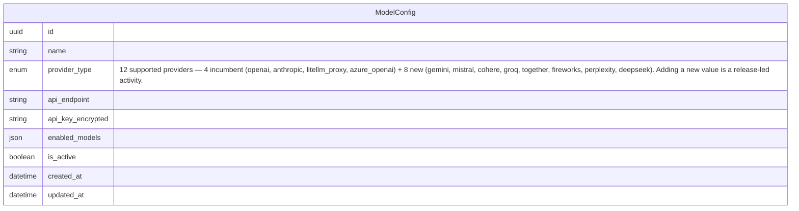

# Data Model: Expand Model Config Providers

## New Entities

**None.**

This change is purely additive at the enum level. The eight new LLM providers (`gemini`, `mistral`, `cohere`, `groq`, `together`, `fireworks`, `perplexity`, `deepseek`) are added to the **allowed-value set** of an existing field (`ModelConfig.provider_type`). They do not introduce any new business entity, no new table, no new join table, no new relationship, and no new business attribute on any existing entity.

The runtime provider-registry facade called out in `architecture.md` is a code-level dispatcher concern — not a data-model concern — and therefore does not appear as an entity here.

## Modified Entities

### `ModelConfig`

The `ModelConfig` entity is modified in exactly one place: the **allowed-value set** of the `provider_type` field grows from **4 values to 12 values**. The field's generic type, name, and cardinality are unchanged. All other attributes on `ModelConfig` are unchanged. No new relationships are introduced (the entity remains a standalone reference entity, as documented in the current master data model).

The full set of twelve supported provider keys (per PRD AC-1 and `spec-change.md` NC-1) is:

- **Incumbent (4):** `openai`, `anthropic`, `litellm_proxy`, `azure_openai`
- **New (8):** `gemini`, `mistral`, `cohere`, `groq`, `together`, `fireworks`, `perplexity`, `deepseek`

The eight new keys are organised in two dispatch families (per `architecture.md` "New Components"):

- **OpenAI-compatible family (6 new):** `mistral`, `groq`, `together`, `fireworks`, `perplexity`, `deepseek`
- **Native-API family (2 new):** `gemini`, `cohere`

This dispatch-family grouping is a runtime concern and is **not** modelled as a sub-attribute of `provider_type` — it is documented in `architecture.md` and `tech-spec.md`, not here.

The `provider_type` field's existing set of four values remains authoritative for any row that already exists in the database (PRD AC-4 and D-6: no data migration; existing rows preserve their `provider_type` value exactly). The eight new values are additive only.

**Notes on the diagram:**

- The attribute list is **identical** to the current master-data-model representation of `ModelConfig`. Only the annotation on `provider_type` changes.
- The `enum` type intentionally has no implicit cardinality / table; Mermaid `enum` is the generic business-domain representation of an enumerated attribute.
- `name` and `api_key_encrypted` are the business-domain names used in the current data-model documentation. (The actual storage field names live in the schema source file referenced below — they are implementation details and intentionally not duplicated here.)
- The Mermaid `erDiagram` block is a tech-agnostic business-domain representation. Implementation details (the storage layer, the migration mechanism) are intentionally absent.

## Removed Entities/Fields

**None.** No entity, no field, no relationship, and no enum value is removed or deprecated by this change. The four incumbent providers continue to be authoritative and are still selectable, storable, listable, and dispatchable (PRD "Out of Scope" + AC-4 / D-6).

## Schema File References

The change touches the following schema and migration files. Paths are relative to the workspace root and resolve against `source.schema` (`backend/app/db/models/`) declared in `docs/config.yaml`.

| File | What changes (at the schema-source level) |
|---|---|
| `backend/app/db/models/agents.py` | The `ModelProvider` Python enum (around line 70) gains eight new members. The `provider_type` column on `ModelConfig` is unchanged in shape; the new enum members are reflected automatically at ORM time. |
| `backend/alembic/versions/<new_revision>.py` | A new Alembic migration file is generated by the developer workflow under `backend/alembic/versions/`. The migration extends the existing `provider_type` enum additively — it does not recreate the enum type and does not touch any existing `ModelConfig` row. The filename and revision id are produced at generation time. |

The exact migration content is the developer's responsibility and lives in `tech-spec.md` and the generated migration file. The migration must be additive on the existing enum, must not recreate the enum type, must not touch any existing `ModelConfig` row, and must be safe to apply on a running database (PRD D-2, D-6).

## Master Data Model Update Instructions

After the change is implemented, apply the following two edits. The first edit is to the module-level entities document; the second is to the system overview. No other master data-model files are affected.

1. **Edit `docs/master/data-model/modules/agents/entities.md`.**
   - In the Mermaid `erDiagram` block, update only the `provider_type` attribute line on `ModelConfig` to carry the same twelve-value annotation shown in this change document. Use the same double-quoted annotation style already used in `docs/master/data-model/overview.md` (e.g. the annotation on `McpSession.auth_type`).
   - In the entity description row for `ModelConfig`, append a one-sentence note that `provider_type` recognises twelve keys (the four incumbent plus the eight new) and that adding a new value is a release-led activity.
   - Add a one-paragraph note stating that the enum is extended through additive migrations on the existing enum type, and that the model documentation file is intentionally schema-free — the actual allowed-value set is the Python enum in `backend/app/db/models/agents.py`, and the migration that extends it lives under `backend/alembic/versions/`.
   - Do not add, remove, rename, or reorder any other attribute on `ModelConfig`, and do not change any other entity in the file.

2. **Edit `docs/master/data-model/overview.md` (Agent Management section only).**
   - In the Mermaid `erDiagram` block for the "Agent Management" section, apply the same single-line change to the `provider_type` annotation as in step 1. Do not change any other attribute on `ModelConfig`, and do not change any other entity in that `erDiagram` block.
   - In the surrounding prose, replace any explicit enumeration of the four incumbent providers with a generic reference such as "twelve API-key-based LLM providers (see `docs/master/data-model/modules/agents/entities.md` for the current catalogue)". Do not introduce a per-provider list into `overview.md`.
   - Do not modify any other `erDiagram` block in `overview.md` and do not modify the cross-domain relationship map.

3. **Do not create a new file under `docs/master/data-model/modules/`** for this change. The two edits above are the only `docs/master/data-model/` updates required.
