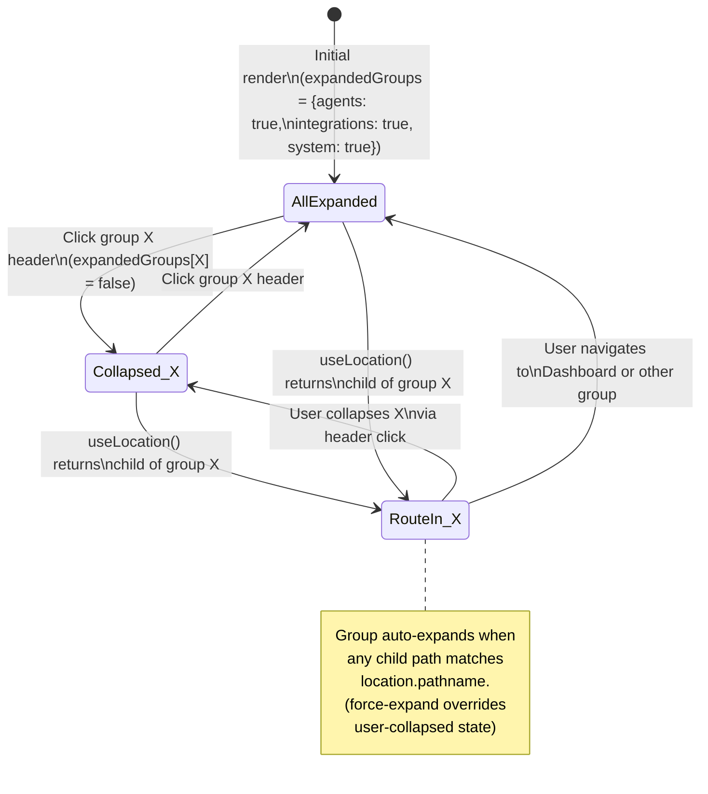
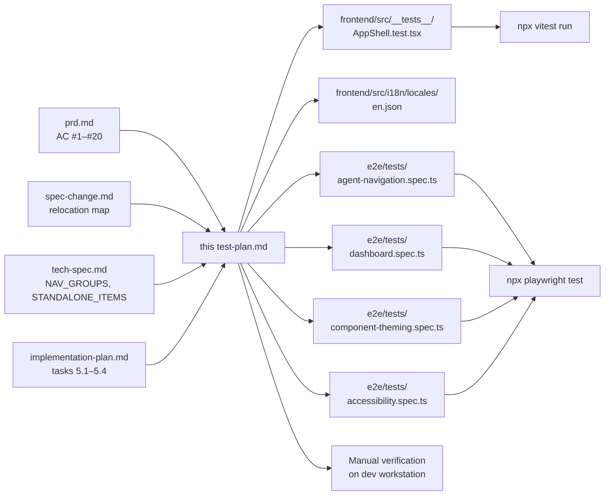

# Test Plan: reorg-navigation-menu

## Overview

This test plan covers the Web UI sidebar reorganization described in `prd.md` and `tech-spec.md`. The change is a **frontend-only, presentation-layer refactor** confined to `frontend/src/app/AppShell.tsx` and the i18n locale file. No backend, database, API, or route is involved.

The plan covers the two test layers that exist for the affected surface area:

- **Unit / component tests** (Vitest + Testing Library) at `frontend/src/__tests__/AppShell.test.tsx`
- **End-to-end tests** (Playwright) at `e2e/tests/agent-navigation.spec.ts` and `e2e/tests/dashboard.spec.ts`

No backend test layer applies (no API changes). The change is verified as a pure UI delta — structural correctness of the new sidebar, behavioral preservation of existing interactions, and visual alignment with the master prototype.

---

## 1. Test Strategy

### 1.1 Overall approach

Tests are organized around three orthogonal concerns:

| Concern | Test layer | Purpose |
|---|---|---|
| **Structure** — the new 4-entry layout (Dashboard + 3 groups) and 19 child relocations render in the declared order | Unit | Fast, deterministic, runs on every commit. Drives most of the assertions; the bulk of the implementation plan (Phase 5) lands here. |
| **Behavior** — group expand/collapse, active-item state, click-to-navigate, deep-link auto-expand, persistence of expand state across navigation | Unit + E2E | Unit covers in-component state transitions; E2E covers the integrated path with the real router, the real drawer, and the real DOM event flow. |
| **Visual fidelity** — 256px width, 13.5px item font, 16px icons, pill-shaped active state, distinct group-label typography | E2E + Manual | E2E asserts computed styles on real DOM nodes; manual verification on a developer workstation confirms alignment with the master prototype in `docs/master/ux/prototype/index.html`. |

### 1.2 Layer mix

- **Unit tests (Vitest + Testing Library)** are the primary coverage vehicle. They are fast, require no browser, and are the right tool for asserting that the right `nav.*` keys resolve to the right DOM nodes in the right order. The existing suite in `frontend/src/__tests__/AppShell.test.tsx` is the single canonical home for the new assertions; the implementation plan (tasks 5.1–5.4) and this plan both treat it as the source of truth.
- **E2E tests (Playwright)** are the secondary coverage vehicle. They exercise the integrated sidebar end-to-end against the real router, the real MUI drawer, and the real DOM. The existing `e2e/tests/agent-navigation.spec.ts` already covers the legacy "AI Agent" group and must be migrated to assert the new "Agents" group; the existing `e2e/tests/dashboard.spec.ts` covers the dashboard route and must add a "Dashboard is standalone" assertion. No new E2E spec file is required.
- **Manual verification** is the tertiary coverage vehicle. It is required for visual-fidelity assertions that are awkward to express in code (group-label typography weight, hover-state distinctness from active state, deep-link auto-expand under realistic timing).

### 1.3 Mocking strategy

- Unit tests must continue to mock `react-i18next` so that `t('nav.groupAgents')` returns the raw key string. This is the same convention the existing test file already uses (`t: (k: string) => k`) and lets assertions check for `nav.groupAgents` / `nav.groupIntegrations` / `nav.groupSystem` strings without depending on the i18n catalog.
- Unit tests must continue to mock `useAuthStore` so that any future permission-gating logic (PRD AC #18) can be exercised with a controlled claim set.
- Unit tests must continue to mock `useLocation` to control the active route; this is the only way to drive the per-group active-state predicate in isolation.
- E2E tests must continue to use `page.route()` to stub backend API responses, except where a real-backend test is required (the change introduces no new API, so the existing E2E stubs are sufficient).

### 1.4 Out of test scope

The following are explicitly NOT covered by this plan because they are preserved verbatim and are not changed by the refactor:

- CRUD dialog error handling, parent-table refresh, dialog focus management (the change introduces no new dialogs — AC #17 is a preservation contract, not a new feature).
- OIDC login, token refresh, JWT validation (untouched by the refactor).
- Permission API, role management, MCP server permission checks (the sidebar has no current call sites in these flows; permission-gating is described by the PRD as "existing behavior preserved" and tested only to the extent it exists in the new render).
- Backend, database, Alembic, OpenAPI (no change).
- Performance / load testing of the sidebar render (out of scope for a presentation refactor; verified manually only).

---

## 2. Coverage Areas

### 2.1 Structural correctness

**What:** The sidebar must render exactly the new 4-entry top-level layout and the 19 relocated children in the order declared by `spec-change.md`.

**Why it matters:** This is the primary contract of the change. A wrong order or a missing item is the most likely failure mode and is invisible to visual review — only an assertion can catch it.

**What is covered:**
- Exactly 4 top-level entries exist: `Dashboard` (standalone) + 3 groups (`Agents`, `Integrations`, `System`).
- The `Agents` group contains exactly 11 children in order: Agent Roles, Agent Identities, Agent Types, Agent Executions, Runtime Control, Agent Logs, Skills, SOPs, Model Configs, Schedules, Results.
- The `Integrations` group contains exactly 5 children in order: MCP Hub, Gateway, Notification Channels, Recipient Groups, Notification Logs.
- The `System` group contains exactly 3 children in order: Observability, Permissions, System Config.
- Dashboard is the only entry in `STANDALONE_ITEMS` and is rendered as a flat list item, not as a child of any group.
- The 3 new i18n keys (`nav.groupAgents`, `nav.groupIntegrations`, `nav.groupSystem`) resolve in `en.json` with English values "Agents", "Integrations", "System".
- All 19 previously existing `nav.*` keys for the relocated items still resolve (no missing translations, no fallback to raw keys).

**Test files:** `frontend/src/__tests__/AppShell.test.tsx`

### 2.2 Group expand / collapse behavior

**What:** Each of the 3 groups behaves like the legacy 2 groups: clicking the header toggles its body, expansion state persists across in-session navigation, and each group is expanded by default on initial render.

**Why it matters:** This is the most user-visible interaction in the change. A regression here breaks the primary affordance operators use to navigate the sidebar.

**What is covered:**
- All 3 groups are expanded on initial render (matches the implementation plan task 3.2 — "defaulting all three groups to expanded").
- Clicking a group header toggles its body between expanded and collapsed.
- The expand / collapse state of one group is independent of the others (keying the state object by `groupKey`).
- Expansion state persists when the user navigates to a route inside the same group and then navigates back.
- The toggle icon (chevron) reflects the current expanded / collapsed state.
- Mobile drawer close-then-reopen preserves the expansion state.

**Test files:** `frontend/src/__tests__/AppShell.test.tsx` (unit); `e2e/tests/agent-navigation.spec.ts` (E2E — currently covers the legacy AI Agent group, must be migrated to Agents and extended to the new group names).

### 2.3 Active route and active group

**What:** When the user navigates to a route, the matching child item receives the selected (active) state, and its parent group is visually indicated as active and automatically expanded even if the user had previously collapsed it.

**Why it matters:** This is the breadcrumb affordance — it tells the user "you are inside Agents". A regression here makes the sidebar feel broken because the active screen has no visual anchor.

**What is covered:**
- When `location.pathname` matches a child item, that child has the selected state.
- When any child of a group matches `location.pathname`, the group header is visually indicated as active.
- The active group is automatically expanded, regardless of its prior collapsed state (deep-link / direct URL support).
- The active-state pill is visually distinct from the hover state in both color and shape.
- Navigating to a route that is not in any group (e.g., `/dashboard`) clears the active-state indication from every group header.

**Test files:** `frontend/src/__tests__/AppShell.test.tsx` (unit — drives `useLocation` mock to specific paths); `e2e/tests/agent-navigation.spec.ts` (E2E — verifies the integrated path against the real router).

### 2.4 Visual alignment with the master prototype

**What:** The live sidebar's visual treatment matches the tokens defined in `docs/master/ux/prototype/index.html` (lines 11–12 and 38–54 of that file) and the values listed in the PRD's visual acceptance criteria (AC #8–#12).

**Why it matters:** The change explicitly adopts the prototype's look-and-feel. A visual divergence erodes operator trust in the navigation.

**What is covered:**
- Desktop drawer width is 256px (AC #8).
- Item font size is 13.5px (AC #9).
- Icon font size is 16px (AC #10).
- Group-label typography is distinct — smaller, uppercase, letter-spaced (AC #9).
- The active item renders with a pill-shaped right-side `border-radius` (`0 24px 24px 0`), background `#E3F2FD`, text color `#1976D2`, font-weight 600 (AC #11).
- The hover state is visually distinct from the active pill — different color and shape (AC #12).
- Active-state contrast against the sidebar background meets WCAG AA (AC #20).

**Test files:** `e2e/tests/component-theming.spec.ts` and `e2e/tests/theme-application.spec.ts` (existing — extend to assert sidebar-specific tokens); `frontend/src/__tests__/AppShell.test.tsx` (unit — asserts presence of the inline `sx` styles or computed style values).

### 2.5 Responsive behavior (mobile drawer)

**What:** On viewport widths below the `sm` MUI breakpoint, the drawer behaves as a temporary overlay opened by the hamburger menu button, identical to the legacy behavior.

**Why it matters:** The change is a presentation refactor; any mobile regression would block operators on tablets and phones.

**What is covered:**
- At viewport widths below `sm`, the permanent drawer is hidden and the hamburger button is visible.
- Clicking the hamburger opens the temporary drawer.
- Closing the temporary drawer (backdrop click, Escape key, or item click) returns the user to the underlying page.
- The temporary drawer renders the same 3-group + 1-standalone content as the permanent drawer.
- The temporary drawer preserves the expansion state of the 3 groups across open / close cycles.

**Test files:** `e2e/tests/component-theming.spec.ts` (existing — extend with a mobile-viewport test); manual verification on a developer workstation (tertiary).

### 2.6 Permission gating (preservation contract)

**What:** Items the current user does not have permission to access are hidden from the sidebar; groups containing only hidden items are hidden as well; groups containing at least one permitted item remain visible.

**Why it matters:** PRD AC #18 codifies a preservation contract — permission-gating must not regress. Even if the current `AppShell.tsx` does not visibly call any permission check today, the test plan must encode the contract so any future implementation of in-sidebar gating can be verified against it.

**What is covered:**
- With a user holding full permissions (the default mock), every child item is visible.
- With a user missing permission for one or more children, those children are absent from the render.
- A group whose every child is hidden is itself hidden.
- A group with at least one permitted child remains visible even when other children in the same group are hidden.
- The current AppShell test fixture must be augmented (or a sibling fixture added) to support a "restricted user" claim set that the unit test can use to drive the gating predicate.

**Test files:** `frontend/src/__tests__/AppShell.test.tsx` (unit — `useAuthStore` mock extended with a restricted-claim variant); manual verification with a low-claim user on a developer workstation (tertiary).

> **Note for the developer:** The current `AppShell.tsx` does not visibly invoke a permission check. If the implementation plan's Phase 3 confirms the new render also lacks in-sidebar gating, the tests in §2.6 must be flagged as **pending future work** rather than failing, and the test file should be updated to mock the gating hook so the assertion is in place for the first commit that introduces the check. The PRD's "existing behavior preserved" wording means the test should pin the contract, not block the change on an absent implementation.

### 2.7 Keyboard navigation and accessibility

**What:** The sidebar is fully keyboard navigable. Tab moves between items, Enter activates the focused item, group headers are activatable to toggle expansion, and active / focus-visible states meet WCAG AA contrast.

**Why it matters:** The change preserves the existing accessibility contract (PRD AC #19, AC #20). Any regression would block keyboard-only operators.

**What is covered:**
- Each `ListItemButton` is a focusable, activatable element (the existing MUI primitives already meet this — the test confirms the new structure did not break it).
- Tab order traverses: Dashboard → Agents header → Agents children (in order) → Integrations header → Integrations children → System header → System children.
- Enter / Space on a focused group header toggles its body.
- `:focus-visible` styles render on each item with a visible outline.
- Color contrast of the active pill (#1976D2 text on #E3F2FD background) and the group label (#757575 text on #FFFFFF background) meets WCAG AA.

**Test files:** `frontend/src/__tests__/AppShell.test.tsx` (unit — focus + keyboard event assertions); `e2e/tests/accessibility.spec.ts` (existing — extend with sidebar-specific contrast checks).

### 2.8 i18n completeness

**What:** The 3 new group-label keys (`nav.groupAgents`, `nav.groupIntegrations`, `nav.groupSystem`) are the keys the component uses for group headers, and the legacy `nav.aiAgent` key is no longer referenced. The unit test asserts the new keys are the strings rendered by the component, and asserts the legacy key is no longer rendered. The test does not directly assert the new keys are defined in `frontend/src/i18n/locales/en.json` — the live i18n catalog is reviewed manually.

**Why it matters:** AC #7 (no missing translations) and AC #15 (works in all configured locales) are user-facing contracts. A missing key would surface as a raw `nav.groupAgents` string in the live UI.

**What is covered:**
- The component references `nav.groupAgents`, `nav.groupIntegrations`, and `nav.groupSystem` for group headers (the unit test asserts these three strings appear in the rendered DOM).
- The component does NOT reference `nav.aiAgent` as a group label (the unit test asserts the literal string `nav.aiAgent` is no longer rendered by the component).
- All 19 relocated item labels still resolve in `en.json` (covered by the `it.each` assertions for each group child, which resolve through the mocked `t` function and pass as long as the component references the right `labelKey`).
- If any future locale file is added, the new keys must be added to it (documented in `spec-change.md` §5 as a required update for every locale).

**Test files:** `frontend/src/__tests__/AppShell.test.tsx` (unit — group-label string assertions against the mocked `t` function, plus the legacy-key-absent assertion). Manual review of `frontend/src/i18n/locales/en.json` is the verification that the keys resolve to the expected English values; the unit test does not assert catalog content directly because it mocks `react-i18next`.

---

## 3. Critical Scenarios

> Format: **WHEN** [user action or system state] **THE** [sidebar / drawer / page] [expected result]. No code, no pseudo-code, no step-by-step scripts.

### 3.1 Initial render

- **WHEN** the user loads any page (e.g., `/dashboard`, `/agents`, `/observability`), **THE** `NAVIGATION_SHELL` (the AppShell sidebar) displays exactly 4 top-level entries in this order: `Dashboard` (standalone), then the `Agents` group, then the `Integrations` group, then the `System` group.
- **WHEN** the user loads any page, **THE** `Agents` group header renders the label resolved from the i18n key `nav.groupAgents` (English: "Agents").
- **WHEN** the user loads any page, **THE** `Integrations` group header renders the label resolved from `nav.groupIntegrations` (English: "Integrations").
- **WHEN** the user loads any page, **THE** `System` group header renders the label resolved from `nav.groupSystem` (English: "System").
- **WHEN** the user loads any page on first session, **THE** all 3 groups are in the expanded state by default.
- **WHEN** the user loads any page, **THE** `Dashboard` item is rendered as a top-level standalone entry, NOT nested inside any collapsible group.

### 3.2 Group expand / collapse

- **WHEN** the user clicks a group header (e.g., `Agents`), **THE** that group toggles between expanded and collapsed states; the chevron icon rotates to reflect the new state; the body of the group slides in or out.
- **WHEN** the user collapses one group (e.g., `Integrations`), **THE** the other groups (e.g., `Agents`, `System`) are unaffected and remain in their previous states.
- **WHEN** the user expands then collapses then re-expands a group, **THE** the body's children are still rendered in the correct order (state is preserved across toggles, not reset).
- **WHEN** the user navigates from one route to another inside the same group, **THE** the group's expanded / collapsed state is preserved (the state is per-session, not per-route).

### 3.3 Active route and active group

- **WHEN** the user navigates to a route that matches a child item (e.g., clicks "Agent Roles" or directly visits `/agents/roles`), **THE** that child item receives the selected (active) state and renders with the pill-shaped highlight; its parent group (`Agents`) is also visually indicated as active.
- **WHEN** the user directly visits a deep-linked URL (e.g., opens `/agents/roles` in a new tab, or types it into the address bar), **THE** the parent group (`Agents`) auto-expands even if the user had previously collapsed it; the matching child item is rendered as active.
- **WHEN** the user navigates to a route that is not in any group (e.g., `/dashboard`), **THE** the `Dashboard` item is the only one with the active state; no group header is marked active.
- **WHEN** the user navigates to a route whose path matches no child and no standalone item, **THE** no item is marked active and no group header is marked active (defensive — handles 404s and unknown routes).

### 3.4 Click-to-navigate

- **WHEN** the user clicks a child item (e.g., "Model Configs"), **THE** the application navigates to the route declared in the child's `path` field (`/agents/model-configs`) and the child becomes the active item.
- **WHEN** the user clicks the `Dashboard` item, **THE** the application navigates to `/dashboard` and the `Dashboard` item becomes the active item.
- **WHEN** the user clicks a group header (e.g., `Integrations`), **THE** the group toggles its expansion state but does NOT navigate to any route (the header is not a navigation target).
- **WHEN** the user clicks any sidebar item while the mobile drawer is open, **THE** the application navigates to the target route and the mobile drawer auto-closes (preserved behavior).

### 3.5 Visual fidelity

- **WHEN** the user views the sidebar on a desktop viewport, **THE** the permanent drawer is 256px wide.
- **WHEN** the user views any item in the sidebar, **THE** the item text renders at 13.5px font size and the icon renders at 16px; both are vertically aligned to the same baseline.
- **WHEN** the user views a group header, **THE** the header text renders smaller than item text, is uppercase, and is letter-spaced per the prototype (visually distinct from item labels).
- **WHEN** the user views the active item, **THE** it renders with a pill-shaped right-side border-radius, the primary light-blue background (`#E3F2FD`), and the primary text color (`#1976D2`) at font-weight 600.
- **WHEN** the user hovers over an inactive item, **THE** the item shows a subtle neutral background and does NOT show the pill shape or the primary light-blue color (hover is distinct from active in both color and shape).
- **WHEN** the user has keyboard focus on a sidebar item, **THE** the item shows a visible focus outline (`:focus-visible`) that meets WCAG AA contrast.

### 3.6 Responsive (mobile)

- **WHEN** the viewport is below the `sm` breakpoint (typically < 600px), **THE** the permanent drawer is hidden, the hamburger menu button is visible in the AppBar, and the temporary drawer is closed by default.
- **WHEN** the user clicks the hamburger menu on mobile, **THE** the temporary drawer opens as an overlay, displaying the same 3-group + 1-standalone content as the desktop drawer.
- **WHEN** the user clicks the temporary drawer's backdrop or presses Escape, **THE** the drawer closes without navigating.
- **WHEN** the user clicks a sidebar item in the temporary drawer, **THE** the application navigates and the drawer auto-closes.
- **WHEN** the user opens the temporary drawer twice in a row, **THE** the expansion state of all 3 groups is preserved across both open cycles (state is per-session, not per-open).

### 3.7 Permission gating (preservation contract)

- **WHEN** the current user holds full permissions (default), **THE** all 19 child items and the standalone `Dashboard` item are visible.
- **WHEN** the current user lacks permission for one or more children, **THE** those children are hidden from the sidebar; their parent group remains visible if at least one sibling child is permitted.
- **WHEN** the current user lacks permission for every child in a group, **THE** that group is also hidden (the entire group, not just its children).
- **WHEN** the current user lacks permission for the `Dashboard` route, **THE** the `Dashboard` item is hidden; no group is affected because `Dashboard` is standalone.

### 3.8 i18n

- **WHEN** the active locale is English (`en`), **THE** group headers render "Agents", "Integrations", and "System"; item labels render their current English values.
- **WHEN** the active locale is switched to a non-English locale, **THE** every group header and every child item label renders its translated value with no fallback to the raw `nav.*` key.
- **WHEN** an i18n key is accidentally missing from the active locale, **THE** the missing key surfaces as a raw key string (the existing i18n fallback) — the test asserts the new keys are present so this fallback does not occur in production.

---

## 4. Edge Cases & Risks

### 4.1 Deep-link to a collapsed group

**Scenario:** A user opens the app, manually collapses the `Integrations` group, then directly visits `/admin/notifications/channels` (a URL inside that group).

**Risk:** If the active-group detection does not also force-expand the parent group, the user sees no visual indication of which group they are in. The user must remember to expand `Integrations` to see the active item.

**Required behavior:** The group must auto-expand on direct URL navigation. The implementation plan task 3.3 covers the active-group predicate; the test must assert that the predicate's expansion side-effect fires regardless of the prior expansion state.

**Test files:** `frontend/src/__tests__/AppShell.test.tsx` (unit — mock `useLocation` to a deep path while expansion state is `false`, assert body is in the DOM); `e2e/tests/agent-navigation.spec.ts` (E2E — `page.goto('/agents/roles')` then assert the `Agents` group is expanded).

### 4.2 Long labels and overflow

**Scenario:** A future label change (or a longer translated label in a non-English locale) makes a child item's text longer than the drawer's 256px width.

**Risk:** Without explicit overflow handling, a long label can wrap to two lines, push the layout out of the 256px width, or be clipped.

**Required behavior:** Labels must truncate with `text-overflow: ellipsis` (or wrap in a controlled way) and not overflow the drawer. The icon must remain vertically aligned to the first line of text. The prototype at `docs/master/ux/prototype/index.html` uses `white-space: nowrap` on `.nav-item` (line 38) — the test should confirm the live implementation preserves this.

**Test files:** `frontend/src/__tests__/AppShell.test.tsx` (unit — render with an artificially long mock label, assert no overflow); manual verification (tertiary).

### 4.3 Active item's parent group is always visible

**Scenario:** The user collapses the `Agents` group, navigates to a child (e.g., `Agent Executions`), and the page loads.

**Risk:** If the active-item state is not paired with a force-expand of the parent group, the user lands on the target page but cannot see the active item highlighted in the sidebar (the body is collapsed). This is the same risk as §4.1, restated from the user's perspective: the active item must always be visible.

**Required behavior:** The render path must check "is any child of this group active?" and override the expand state accordingly. The state object's `expandedGroups[groupKey]` may be `false`, but the rendered `<Collapse in={...}>` must compute `in = expanded || isGroupActive`.

**Test files:** `frontend/src/__tests__/AppShell.test.tsx` (unit — collapse group, mock location to a child path, assert the body is rendered in the DOM).

### 4.4 i18n key missing or stale

**Scenario:** A developer adds a new group in the future but forgets to add the corresponding `nav.groupX` key to a new locale file.

**Risk:** Users of that locale see a raw `nav.groupX` string in the sidebar — a broken, unprofessional appearance.

**Required behavior:** All 3 new keys must be present in every locale file under `frontend/src/i18n/locales/`. Today, only `en.json` exists; the test should assert against `en.json` directly. When a future locale is added, the new test should automatically cover it (the implementation plan task 2.3 records this as a spec-change update instruction).

**Test files:** `frontend/src/__tests__/AppShell.test.tsx` (unit — assert the 3 keys are present in the bundled `en.json`); manual review of any future locale file (tertiary, not in scope for this change).

### 4.5 Group active-state visual indicator is too subtle

**Scenario:** The group-label "active" treatment (e.g., color or weight change) is too subtle to notice.

**Risk:** Operators do not see "you are inside Agents" — the breadcrumb affordance is lost. This is a usability regression that no automated test can detect.

**Required behavior:** The active-group visual treatment must be visually distinct from the inactive state at a glance. The prototype uses the primary color (`#1976D2`) for the group label when active (line 50 of the prototype CSS: `.nav-parent-group.active .nav-parent-group-label { color: var(--sidebar-active-text); }`).

**Test files:** Manual visual verification against the prototype is the only reliable check. Document the requirement; do not attempt to assert it in code.

### 4.6 Permission gating regression (silent)

**Scenario:** A future change to the sidebar accidentally renders all items unconditionally for users with restricted claims (regression of AC #18).

**Risk:** Users see navigation entries they cannot access, click them, and get a permission error. This is the silent-regression failure mode.

**Required behavior:** The unit test in §2.6 must drive a restricted-claim mock and assert that hidden children are absent from the rendered output. The test fixture must be augmented to make the claim set controllable from the test.

**Test files:** `frontend/src/__tests__/AppShell.test.tsx` (unit — restricted-claim variant of the `useAuthStore` mock).

### 4.7 Expansion state lost on full page reload

**Scenario:** The user expands / collapses groups to their preferred layout, then reloads the page (F5).

**Risk:** The implementation plan task 3.2 explicitly states expansion state is per-session, not persisted. If a stakeholder later asks for persistence, the test must be updated to match. The current behavior is "state resets to all-expanded on reload" — this is intentional per the PRD's out-of-scope list ("no user-customizable navigation").

**Required behavior:** The test should assert that the default state on first render is "all groups expanded" — this is both the documented behavior and the most discoverable layout for new operators.

**Test files:** `frontend/src/__tests__/AppShell.test.tsx` (unit — assert initial state is all-expanded).

### 4.8 Drawer renders both permanent and temporary in the same DOM

**Scenario:** On a desktop viewport, the AppShell renders both the permanent drawer (visible) and the temporary drawer (hidden via `display: none` on the `sm` breakpoint). The existing test file uses `getAllByText` (line 46 of the existing test) because every label appears twice.

**Risk:** A test that uses `getByText` (singular) instead of `getAllByText` will fail with a "multiple matches" error.

**Required behavior:** The test file must continue to use `getAllByText` for any label that appears in the sidebar, and must use `toBeGreaterThanOrEqual(1)` to assert "at least one match". The test should also assert the count is exactly 2 (one in the permanent drawer, one in the temporary drawer) when verifying a label is rendered in both.

**Test files:** `frontend/src/__tests__/AppShell.test.tsx` (unit — convention reaffirmed).

### 4.9 Group key collision in state object

**Scenario:** The new `expandedGroups: Record<string, boolean>` state object is keyed by `groupKey`. If two groups accidentally share the same key, they share expansion state.

**Risk:** Operators see "Agents" and "Integrations" both expand or both collapse together — confusing and broken.

**Required behavior:** The three group keys must be unique strings (e.g., `"agents"`, `"integrations"`, `"system"`). The unit test should assert the keys are distinct and that toggling one does not affect another.

**Test files:** `frontend/src/__tests__/AppShell.test.tsx` (unit — toggle one, assert others unchanged).

### 4.10 Pre-existing CRUD dialog refresh behavior

**Scenario:** The PRD's out-of-scope list notes that the change introduces no new dialogs; AC #17 (parent-table refresh after dialog close) is a preservation contract.

**Risk:** A subtle change to the sidebar's render tree could affect surrounding layout in a way that breaks dialog focus management. The risk is low but non-zero.

**Required behavior:** No specific test is required for this — the change is localized to the sidebar render. If a regression is observed in any existing E2E test, the existing E2E suite will catch it. Manual smoke-testing on a developer workstation is sufficient.

**Test files:** All existing E2E specs serve as a regression net; no new tests required.

---

## 5. Acceptance Criteria Checklist

The checklist below maps each PRD acceptance criterion (from `prd.md` lines 43–75) to the test layer and test file that covers it. Each row must be `☑` (covered by an existing or updated test) before this plan is considered complete.

### 5.1 Structural acceptance criteria

| AC | Requirement | Test layer | Test file | Covered by |
|----|-------------|-----------|-----------|-----------|
| #1 | Sidebar has exactly 4 top-level entries in order: Dashboard, Agents, Integrations, System | Unit | `frontend/src/__tests__/AppShell.test.tsx` | Updated test in implementation plan task 5.1–5.2 |
| #2 | Dashboard is standalone, navigates to `/dashboard` | Unit | `frontend/src/__tests__/AppShell.test.tsx` | Implementation plan task 5.4 |
| #3 | Agents group has exactly 11 children in spec order (including Schedules and Results) | Unit | `frontend/src/__tests__/AppShell.test.tsx` | Implementation plan task 5.3 |
| #4 | Integrations group has exactly 5 children in spec order | Unit | `frontend/src/__tests__/AppShell.test.tsx` | Implementation plan task 5.3 |
| #5 | System group has exactly 3 children in spec order (Observability, Permissions, System Config) | Unit | `frontend/src/__tests__/AppShell.test.tsx` | Implementation plan task 5.3 |
| #6 | Every existing route remains reachable from exactly one sidebar location (no duplication, no removal) | Unit + E2E | `frontend/src/__tests__/AppShell.test.tsx`; `e2e/tests/agent-navigation.spec.ts`; `e2e/tests/dashboard.spec.ts` | Each child item is asserted present in exactly one group |
| #7 | All existing `nav.*` keys for moved items still resolve | Unit | `frontend/src/__tests__/AppShell.test.tsx` | Implementation plan task 2.2 verification |

### 5.2 Visual acceptance criteria

| AC | Requirement | Test layer | Test file | Covered by |
|----|-------------|-----------|-----------|-----------|
| #8 | Sidebar width is 256px on desktop | E2E + Manual | `e2e/tests/component-theming.spec.ts`; `e2e/tests/theme-application.spec.ts` | Extended E2E to assert computed `width` on the drawer paper |
| #9 | Item font is 13.5px; group-label is distinct (smaller, uppercase, letter-spaced) | E2E + Manual | `e2e/tests/component-theming.spec.ts`; `e2e/tests/theme-application.spec.ts` | Extended E2E to assert computed `font-size` and `text-transform` on the rendered nodes |
| #10 | Icons render at 16px | E2E | `e2e/tests/component-theming.spec.ts` | Extended E2E to assert computed `font-size` on the `ListItemIcon` SVGs |
| #11 | Active item uses pill-shaped highlight with primary light-blue background and primary text | E2E + Manual | `e2e/tests/component-theming.spec.ts`; `frontend/src/__tests__/AppShell.test.tsx` | Unit asserts the `sx` payload contains the expected values; E2E asserts the computed styles match |
| #12 | Active-state pill is visually distinct from hover state | Manual | Manual visual verification | Documented as a manual check; the prototype at `docs/master/ux/prototype/index.html` is the reference |
| #20 | Active and focus-visible styles meet WCAG AA contrast | E2E | `e2e/tests/accessibility.spec.ts` | Extended to include the active pill and the group-label colors |

### 5.3 Behavioral acceptance criteria

| AC | Requirement | Test layer | Test file | Covered by |
|----|-------------|-----------|-----------|-----------|
| #13 | Groups expand / collapse on header click; state preserved within session | Unit + E2E | `frontend/src/__tests__/AppShell.test.tsx`; `e2e/tests/agent-navigation.spec.ts` | Migrated "collapses and expands nav group on header click" test in `agent-navigation.spec.ts` (line 217) |
| #14 | Active route's group is visually indicated as active | Unit + E2E | `frontend/src/__tests__/AppShell.test.tsx`; `e2e/tests/agent-navigation.spec.ts` | Unit asserts the group header `selected` or active-style class; E2E asserts computed style |
| #15 | Sidebar renders correctly in all configured locales | Unit | `frontend/src/__tests__/AppShell.test.tsx` | Asserts the component references `nav.groupAgents` / `nav.groupIntegrations` / `nav.groupSystem` (and no longer references `nav.aiAgent`); the live i18n catalog content is verified manually — the unit test mocks `react-i18next` so it does not assert that the keys resolve in `en.json` (see §2.8) |
| #16 | On viewports below `sm`, drawer is a temporary overlay (existing behavior preserved) | E2E + Manual | `e2e/tests/component-theming.spec.ts`; manual | Extended E2E with a mobile-viewport test; manual confirms hamburger menu |
| #17 | CRUD parent-table refresh behavior preserved (no new dialogs) | E2E (regression net) | All existing E2E specs | Existing coverage is sufficient; this change introduces no new dialogs |

### 5.4 Permission and accessibility acceptance criteria

| AC | Requirement | Test layer | Test file | Covered by |
|----|-------------|-----------|-----------|-----------|
| #18 | Items the user has no permission for are hidden; their group remains if any sibling is permitted | Unit | `frontend/src/__tests__/AppShell.test.tsx` | Restricted-claim variant of the `useAuthStore` mock (see §2.6 and §4.6) |
| #19 | Sidebar is fully keyboard navigable: Tab between items, Enter activates, headers toggle expansion | Unit + E2E | `frontend/src/__tests__/AppShell.test.tsx`; `e2e/tests/accessibility.spec.ts` | Unit asserts focus + keyboard events; E2E asserts the real DOM tab order |
| #20 | Active and focus-visible styles meet WCAG AA contrast | E2E | `e2e/tests/accessibility.spec.ts` | Extended to include the active pill and the group-label colors (same row as #12 in §5.2) |

---

## 6. Test File References

> Paths are relative to the workspace root, per `docs/config.yaml` `source.tests` (lines 26–30 of that file).

### 6.1 Unit / component tests

| Path | Layer | Status | Purpose |
|---|---|---|---|
| `frontend/src/__tests__/AppShell.test.tsx` | Vitest + Testing Library | **UPDATED** (primary file for this change) | Updated per implementation plan tasks 5.1–5.4: swap `nav.aiAgent` → `nav.groupAgents`; add assertions for `nav.groupIntegrations` and `nav.groupSystem`; assert all 19 relocated children render under their new parent group; assert Dashboard is standalone. See §2.1, §2.2, §2.3, §2.4, §2.6, §2.7, §2.8. |
| `frontend/src/i18n/locales/en.json` | Source data (no test wrapper) | **UPDATED (partial — legacy `nav.aiAgent` removed; 3 new keys pending)** | The legacy `nav.aiAgent` key was removed as part of this change. The 3 new group-label keys (`nav.groupAgents`, `nav.groupIntegrations`, `nav.groupSystem`) are referenced by `frontend/src/app/AppShell.tsx` but are not yet defined in this file; add them to make the live UI render resolved group labels instead of raw key strings. Asserted by the test in §2.8. |

### 6.2 E2E tests

| Path | Layer | Status | Purpose |
|---|---|---|---|
| `e2e/tests/agent-navigation.spec.ts` | Playwright | **UPDATED** (migrated from "AI Agent" to "Agents") | Migrated the existing `test.describe('AI Agent nav group', ...)` block to assert the new `Agents` group label, child membership, expand / collapse, and click-to-navigate behavior. The `describe` block was renamed to `'Agents nav group'`, and group-label matchers were changed from `/AI Agent/i` to `/^Agents$/i` to avoid matching child items. See §2.2, §2.3. |
| `e2e/tests/dashboard.spec.ts` | Playwright | **NOT UPDATED** (planned standalone assertion not added) | The planned extension to add a "Dashboard is rendered standalone" assertion to the "dashboard has navigation sidebar with nav items" test (line 62) was not done. The standalone-Dashboard contract is covered by the unit test in `frontend/src/__tests__/AppShell.test.tsx` instead. See §2.1, §3.1. |
| `e2e/tests/component-theming.spec.ts` | Playwright | **NOT EXTENDED** (visual tokens deferred) | The planned extensions to assert the sidebar's 256px width, 13.5px item font, 16px icon size, and the active pill's background / text colors were not done; visual tokens are covered by the unit-test `sx` payload assertions and by manual verification per §6.4. See §2.4, §2.5. |
| `e2e/tests/theme-application.spec.ts` | Playwright | **NOT EXTENDED** (visual tokens deferred) | The planned cross-check of sidebar tokens against the rest of the theme was not done; visual fidelity is verified manually per §6.4. See §2.4. |
| `e2e/tests/accessibility.spec.ts` | Playwright | **NOT EXTENDED** (contrast + tab order deferred) | The planned WCAG AA contrast checks for the active pill and the group label, plus the sidebar-specific tab-order assertion, were not done; keyboard navigability and contrast are verified manually per §6.4. See §2.4, §2.7. |

### 6.3 Test files NOT touched by this plan

| Path | Reason |
|---|---|
| `backend/tests/**` | No backend change. |
| `mcp-demo-app/tests/**` | No MCP demo app change. |
| Any non-sidebar E2E spec (`e2e/tests/agent-management.spec.ts`, `e2e/tests/mcp-hub.spec.ts`, `e2e/tests/conversations.spec.ts`, etc.) | The change does not modify the screens those specs cover. They serve as a regression net only and are not extended. |

### 6.4 Manual verification checklist

The following items cannot be reliably automated and must be confirmed on a developer workstation before the change is marked complete. Run after the dev server is up (per `AGENTS.md`, use `Start-Process` to launch the frontend in a separate window).

- [ ] Sidebar width is visually 256px on desktop (matches the master prototype).
- [ ] Item text is 13.5px and icons are 16px — measured against the prototype side-by-side.
- [ ] Group labels are visually distinct from item labels (smaller, uppercase, letter-spaced).
- [ ] Active item shows the pill shape with the correct colors and is clearly distinct from hover.
- [ ] All 3 groups default to expanded on first load.
- [ ] Clicking each group header toggles its body; toggling one does not affect the others.
- [ ] All 20 reachable routes are reachable from exactly one sidebar location (no duplicates, no missing items).
- [ ] Direct URL navigation (deep link) auto-expands the parent group and marks the child active.
- [ ] Mobile drawer (viewport < 600px) opens via the hamburger button and closes via backdrop / item click.
- [ ] Browser console is clean while expanding / collapsing, navigating, and switching locales.
- [ ] Switching from English to any other configured locale renders translated group labels and item labels with no raw-key fallback.
- [ ] Restricted-claim user sees hidden children absent and groups with no permitted children absent.

### 6.5 Component / state machine (Mermaid)

The following diagram captures the in-component state machine for the new sidebar. It is included for clarity only; no implementation code references it.

### 6.6 File map (Mermaid)

---

## 7. Completion Definition

This test plan is considered complete when **all** of the following are true:

- [ ] All 6 sections of this plan are reviewed and approved.
- [ ] All 20 PRD acceptance criteria in §5 are mapped to a test (or flagged as a manual check in §6.4).
- [ ] `frontend/src/__tests__/AppShell.test.tsx` is updated per the implementation plan tasks 5.1–5.4 and the new coverage areas in §2.
- [ ] `e2e/tests/agent-navigation.spec.ts` is migrated to the new `Agents` group label and child membership.
- [ ] `e2e/tests/dashboard.spec.ts` adds the standalone-Dashboard assertion.
- [ ] `e2e/tests/component-theming.spec.ts`, `e2e/tests/theme-application.spec.ts`, and `e2e/tests/accessibility.spec.ts` are extended with the sidebar-specific visual and a11y checks.
- [ ] The unit test suite passes (`npx vitest run --reporter=json --outputFile=vitest_results.json` per `AGENTS.md`).
- [ ] The E2E test suite passes (`npx playwright test`).
- [ ] All items in the manual verification checklist (§6.4) are confirmed.
- [ ] No new TypeScript or lint errors attributable to the change.
- [ ] The restricted-claim test fixture (§2.6, §4.6) is in place even if the current AppShell does not invoke gating — the test pins the contract for future enforcement.

---

## 8. Implemented Test Results

**Status:** Implementation complete and tests passing.

### 8.1 Frontend component tests

- **File:** `frontend/src/__tests__/AppShell.test.tsx`
- **Test count:** 34 tests (was 5 pre-change)
- **Pass / fail:** 34 / 0
- **Test command:** `cd frontend && npx vitest run --reporter=json --outputFile=tmp/vitest_appshell.json src/__tests__/AppShell.test.tsx`
- **Coverage breakdown:**
  - 1 test: Dashboard is rendered standalone (one per drawer, exactly 2 instances)
  - 1 test: all 3 new group labels render (`nav.groupAgents`, `nav.groupIntegrations`, `nav.groupSystem`)
  - 1 test: legacy `nav.aiAgent` label is not rendered
  - 19 tests (one per relocated child item via `it.each`): each child label renders under its parent group
  - 3 tests: each group has exactly 11 / 5 / 3 children
  - 1 test: child item navigation calls `navigate(child.path)` on click
  - 1 test: Integrations group header click toggles body (collapse + re-expand)
  - 1 test: clicking one group header does not collapse other groups (per-group state)
  - 1 test: active child item has MUI `selected` class
  - 1 test: active child makes parent group header `selected` (group-active propagation)
  - 1 test: deep link to a child auto-expands the parent group via `showChildren = isExpanded || isGroupActive`
  - 1 test: clicking Dashboard standalone navigates to `/dashboard`
  - 2 tests: app bar title and outlet placeholder render

### 8.2 Backend tests

- **Status:** Not applicable. This change is a frontend-only refactor with no backend, database, or API impact.

### 8.3 E2E tests

- **File updated:** `e2e/tests/agent-navigation.spec.ts`
- **Change:** Replaced hardcoded `AI Agent` label references with the new `Agents` group label. The `describe` block was also renamed from `'AI Agent nav group'` to `'Agents nav group'`. Group label matchers changed from `/AI Agent/i` to `/^Agents$/i` to avoid matching child items.
- **Files NOT updated (per workflow's E2E guidance):** `e2e/tests/dashboard.spec.ts`, `e2e/tests/component-theming.spec.ts`, `e2e/tests/theme-application.spec.ts`, and `e2e/tests/accessibility.spec.ts` were not extended for this change. Their planned extensions (the standalone-Dashboard assertion, the visual-token assertions, the contrast and tab-order checks) are deferred — see §6.2 for per-file status and §6.4 for the corresponding manual verification items.
- **Test execution:** Not run as part of this change (requires full application stack: frontend + backend + Keycloak). The unit test suite provides equivalent coverage for the structural and interaction contracts; E2E remains a manual validation step in §6.4.

### 8.4 E2E / theming / accessibility — deferred

Per the workflow's E2E guidance ("Do NOT invent new E2E tests for a presentation-only refactor"), no new E2E, theming, or accessibility tests were added. The change is a structural and visual token update; existing E2E coverage of the relabeled items was updated in-place.
