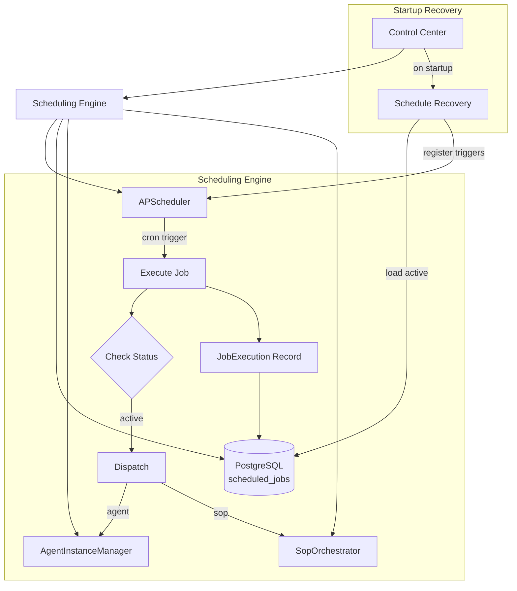
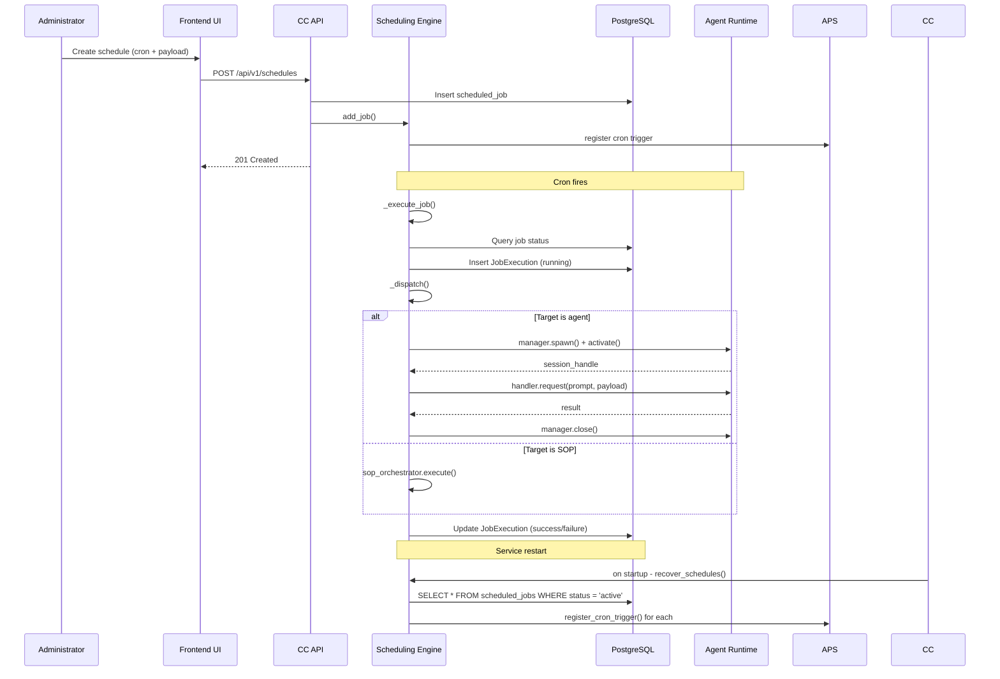

## Changed Components

### Control Center (CC)

- **New sub-component: Scheduling Engine** — runs inside the Control Center process, managing APScheduler-based cron job registration, execution dispatch, and lifecycle
- **Config** — New `scheduler_check_interval_seconds` field in `backend/app/core/config.py` Settings class alongside existing `scheduler_enabled`

### Agent Runtime (AR)

- **No changes** — agent execution remains triggered via the existing `AgentInstanceManager.spawn()`/`activate()` flow. The scheduler is a client of the agent runtime, not a modifier.

### Communication Hub (CH)

- **No changes** — scheduling is a Control Center internal concern. CH already handles agent execution requests.

## New Components

## Integration Points

| Integration | Direction | Protocol | Description |
|-------------|-----------|----------|-------------|
| SchedulingEngine → DB | read/write | SQLAlchemy async | Load active schedules, record job executions |
| SchedulingEngine → AgentInstanceManager | internal call | Python async | Spawn/activate/close agent instances for agent-type targets |
| SchedulingEngine → SopOrchestrator | internal call | Python async | Execute SOP targets with prompt and context |
| Config → SchedulingEngine | read | Pydantic Settings | Read `scheduler_enabled`, `scheduler_check_interval_seconds` |

## Data Flow Changes

## Master Arch Update Instructions

- Add Scheduling Engine as a sub-component of Control Center in `docs/master/architecture/system-overview.md`
- Add the Mermaid flowchart from this document to show Scheduling Engine internals
- Add the integration points table to the Control Center module docs
