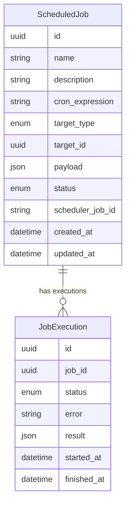

## New Entities

No new tables — `scheduled_jobs` and `job_executions` already exist in the baseline migration (`backend/alembic/versions/001_baseline.py`).

## Existing Entities Review

### ScheduledJob



### Entity Details

| Entity | Attributes | Type | Notes |
|--------|-----------|------|-------|
| `ScheduledJob` | `id` | uuid | Primary key |
| | `name` | string | Unique, max 200 chars |
| | `description` | string | Nullable |
| | `cron_expression` | string | Max 100 chars, standard 5-field cron |
| | `target_type` | enum | Values: `agent`, `sop` |
| | `target_id` | uuid | Foreign key to agent_types or sops (logical, no FK constraint) |
| | `payload` | json | Input parameters passed to agent/SOP on execution |
| | `status` | enum | Values: `active`, `paused`, `deleted` |
| | `scheduler_job_id` | string | APScheduler job ID for lifecycle management |
| | `created_at` | datetime | Auto-set on creation |
| | `updated_at` | datetime | Auto-updated |
| `JobExecution` | `id` | uuid | Primary key |
| | `job_id` | uuid | FK → ScheduledJob.id (CASCADE delete) |
| | `status` | enum | Values: `running`, `success`, `failure` |
| | `error` | string | Nullable, populated on failure |
| | `result` | json | Nullable, execution output |
| | `started_at` | datetime | Auto-set on creation |
| | `finished_at` | datetime | Nullable, set on completion |

### Key Relationships

- `ScheduledJob` → `JobExecution`: one-to-many via `job_id` foreign key with CASCADE delete
- `ScheduledJob.target_id`: logical reference to either `agent_types.id` or `sops.id` (no FK constraint — target could be deleted independently)

### Status Transitions

```
active ↔ paused  (via pause/resume API)
active → deleted  (soft delete, never hard-deleted)
```

## Schema File References

| File | Action |
|------|--------|
| `backend/app/db/models/scheduling.py` | Review — models exist and appear correct; verify all fields match requirements |
| `backend/alembic/versions/001_baseline.py` | Verify tables exist in migration (confirmed: lines 329-395) |

## Master Data Model Update Instructions

- Add `ScheduledJob` and `JobExecution` entities to the ER diagram in `docs/master/data-model/overview.md`
- Add a scheduling module entity list in `docs/master/data-model/modules/scheduling/entities.md`
