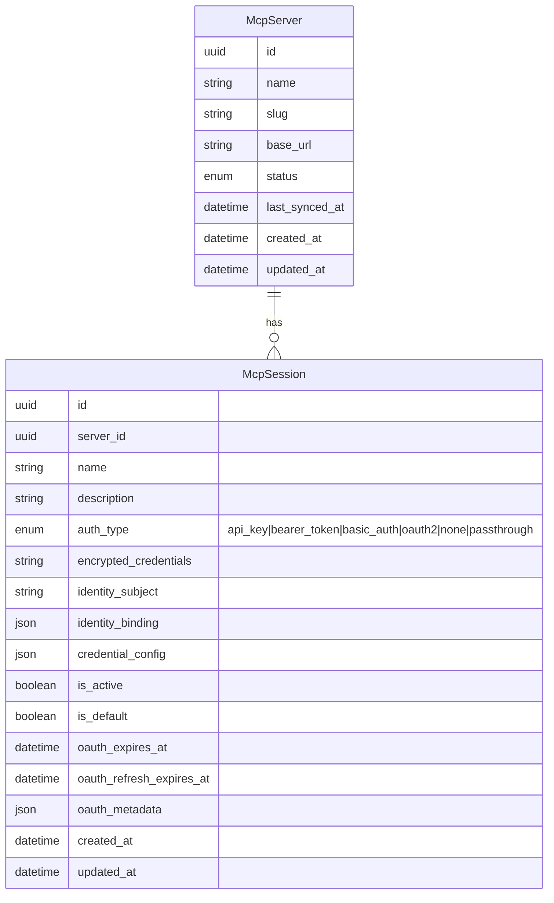

# Data Model Changes: Fix MCP Hub Sync & Sessions

## New Entities

None. This change adds a single field to an existing entity.

---

## Modified Entities

### McpSession — add `is_default` flag

Added a boolean `is_default` field to `McpSession` to explicitly designate which session serves as the default for sync operations and tool calls when no specific session is requested.

**Business rules for `is_default`:**

- At most one session per `McpServer` may be `is_default = true` at any time.
- When a server has exactly one session, that session is automatically treated as the default regardless of the flag value (business logic, not a DB constraint).
- When multiple sessions exist, the one with `is_default = true` is used for sync and tool calls when no specific session is specified.
- If the default session is deleted and other sessions remain, the user must explicitly select a new default.
- Sessions with `auth_type = passthrough` are eligible to be default (they store no credentials but are valid routing targets).

**Field change summary:**

| Entity | Change | Attribute | Type | Notes |
|--------|--------|-----------|------|-------|
| `McpSession` | Added | `is_default` | `boolean` | Defaults to `false`. At most one `true` per server. |

---

## Removed Entities / Fields

None.

---

## Schema File References

| File | Change |
|------|--------|
| `backend/app/db/models/mcp_hub.py` | Add `is_default: Mapped[bool]` field to `McpSession` class |

No changes to `backend/app/db/models/agents.py` — the `AgentRoleMcpSession` join table is unaffected. The `is_default` flag is scoped to session-level configuration on `McpSession` itself.

---

## Master Data Model Update Instructions

When this change reaches `status: master-updated`, apply the following updates:

### `docs/master/data-model/overview.md`

In the MCP Hub section erDiagram, add `boolean is_default` to the `McpSession` entity block between `boolean is_active` and `datetime created_at`. Update the business rules bullet list to include the `is_default` constraint (at most one per server).

### `docs/master/data-model/modules/mcp-hub/entities.md`

Add `boolean is_default` to the `McpSession` entity in the erDiagram block (between `boolean is_active` and `datetime created_at`). Add a sentence to the `McpSession` entity description table row noting that `is_default` designates the session used for sync and default tool calls. Add a business rule bullet:

> - At most one `McpSession` per `McpServer` may be marked `is_default = true`; a sole session is automatically treated as default.
