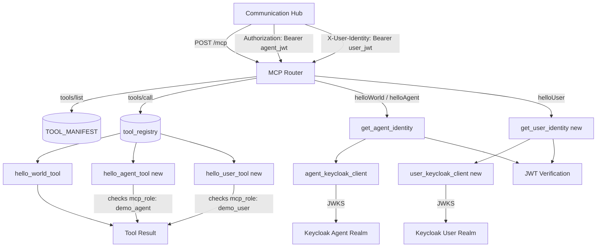
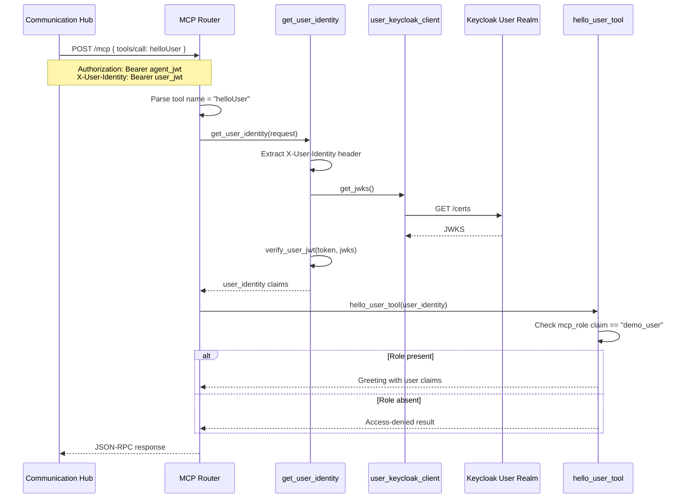

# MCP Dual-Identity Tools — Architecture Changes

## 1. Changed Components

| Component | File | Change |
|-----------|------|--------|
| `AppSettings` | `mcp-demo-app/app/config.py` | Gains optional `KEYCLOAK_USER_REALM` and `KEYCLOAK_USER_CLIENT_ID` fields. When unset, the app falls back to agent-realm config for user identity validation (single-realm backward compatibility). |
| `verify_user_jwt` (new) | `mcp-demo-app/app/auth.py` | Validates a user identity JWT against the user realm's Keycloak JWKS. Follows the same pattern as `verify_agent_jwt` but uses a separate `KeycloakClient` instance for the user realm. Falls back to agent realm when user realm is not configured. |
| `get_user_identity` (new) | `mcp-demo-app/app/auth.py` | FastAPI dependency that extracts the user identity JWT from the `X-User-Identity` request header, strips the `Bearer ` prefix, and delegates to `verify_user_jwt` for validation. |
| `user_keycloak_client` (new) | `mcp-demo-app/app/auth.py` | Second module-level `KeycloakClient` singleton dedicated to the user realm. Maintains independent JWKS and token caches from the agent realm client. |
| `hello_agent_tool` (new) | `mcp-demo-app/app/tools.py` | Tool handler accepting agent identity claims. Checks the agent's `mcp_role` claim for `"demo_agent"`. Returns a greeting with agent claims on success; returns a structured access-denied result when the role is absent. |
| `hello_user_tool` (new) | `mcp-demo-app/app/tools.py` | Tool handler accepting user identity claims. Checks the user's `mcp_role` claim for `"demo_user"`. Returns a greeting with user claims on success; returns a structured access-denied result when the role is absent. |
| `tool_registry` | `mcp-demo-app/app/tools.py` | Extended from 1 entry to 3: `helloWorld` → `hello_world_tool`, `helloAgent` → `hello_agent_tool`, `helloUser` → `hello_user_tool`. |
| `TOOL_MANIFEST` | `mcp-demo-app/app/tools.py` | Extended from 1 descriptor to 3. Each descriptor includes name, description (documenting which identity and role is required), and empty inputSchema. |
| `mcp_endpoint` (`tools/call` branch) | `mcp-demo-app/app/routes/mcp.py` | Now determines which identity to extract based on the tool name. For `helloUser`, calls `get_user_identity(request)` to extract user identity from `X-User-Identity` header. For `helloAgent` and `helloWorld`, calls `get_agent_identity(request)` as before. The resulting identity dict is passed to the tool handler. Access-denied results from tools are returned as HTTP 200 JSON-RPC success responses (not HTTP errors). |
| `init.ps1` | `mcp-demo-app/init.ps1` | Gains optional `-UserRealm` parameter. When provided, verifies the user realm exists and writes `KEYCLOAK_USER_REALM`/`KEYCLOAK_USER_CLIENT_ID` to `.env`. Optionally creates realm roles `demo_agent` (in agent realm) and `demo_user` (in user realm). |
| README | `mcp-demo-app/README.md` | Updated with dual-identity setup instructions, new env vars table, new tool descriptions, and verification steps for all three tools. |

### Unchanged Components

| Component | File |
|-----------|------|
| `hello_world_tool` | `mcp-demo-app/app/tools.py` |
| `KeycloakClient` (class definition) | `mcp-demo-app/app/auth.py` |
| `verify_agent_jwt` / `get_agent_identity` | `mcp-demo-app/app/auth.py` |
| `health_router` | `mcp-demo-app/app/routes/health.py` |
| `register_with_hub` | `mcp-demo-app/app/registration.py` |
| Communication Hub | `backend/app/api/v1/internal/mcp_proxy.py` |
| Control Center | Out of scope |

## 2. New Components

The following Mermaid flowchart shows the MCP Demo App's internal component relationships after the change, highlighting new components with a `[new]` suffix:

## 3. Integration Points

### Communication Hub → MCP Demo App (Modified)

The Communication Hub already forwards agent identity JWT in the `Authorization` header. The new integration point is the **user identity header**:

| Header | Identity | Usage | Required For |
|--------|----------|-------|-------------|
| `Authorization: Bearer <token>` | Agent identity JWT | Extracted by `get_agent_identity` | `helloWorld`, `helloAgent` |
| `X-User-Identity: Bearer <token>` | User identity JWT | Extracted by `get_user_identity` (new) | `helloUser` |

The Communication Hub's MCP proxy (`backend/app/api/v1/internal/mcp_proxy.py`) is responsible for forwarding both headers. **No changes are required to the Communication Hub** — the dual-header forwarding is assumed to already be in place as part of the existing passthrough session architecture.

### MCP Demo App → Keycloak (Modified)

The demo app now maintains **two** `KeycloakClient` instances with independent JWKS caches:

| Client Instance | Realm | Purpose |
|-----------------|-------|---------|
| `keycloak_client` (existing) | Agent realm (`KEYCLOAK_REALM`) | Validate agent JWTs, obtain own access token |
| `user_keycloak_client` (new) | User realm (`KEYCLOAK_USER_REALM`) | Validate user JWTs |

When `KEYCLOAK_USER_REALM` is not configured, `user_keycloak_client` falls back to the agent realm config, enabling single-realm deployments.

### MCP Demo App → Parthenon Hub (Unchanged)

Hub registration (`POST /api/v1/mcp/servers` and sync) remains unchanged. The expanded `TOOL_MANIFEST` (3 tools) is synced at startup through the existing flow.

## 4. Data Flow Changes

The following sequence diagram shows the dual-identity tool call flow for `helloUser`:

For `helloAgent` and `helloWorld`, the flow uses `get_agent_identity` (from `Authorization` header) and `agent_keycloak_client` → agent realm JWKS, which is the existing pattern.

## 5. Master Arch Update Instructions

### `docs/master/architecture/system-overview.md`
- Verify the MCP Demo App is represented in the system overview diagram. If present, no changes needed. If absent, consider adding it as a supporting service node.
- No structural changes required — the demo app remains a standalone service that registers with the MCP Hub.

### `docs/master/architecture/modules/` (if exists)
- If a module-level architecture diagram exists for the MCP Hub or demo app, update it to reflect the dual-identity header forwarding pattern and the two `KeycloakClient` instances.
