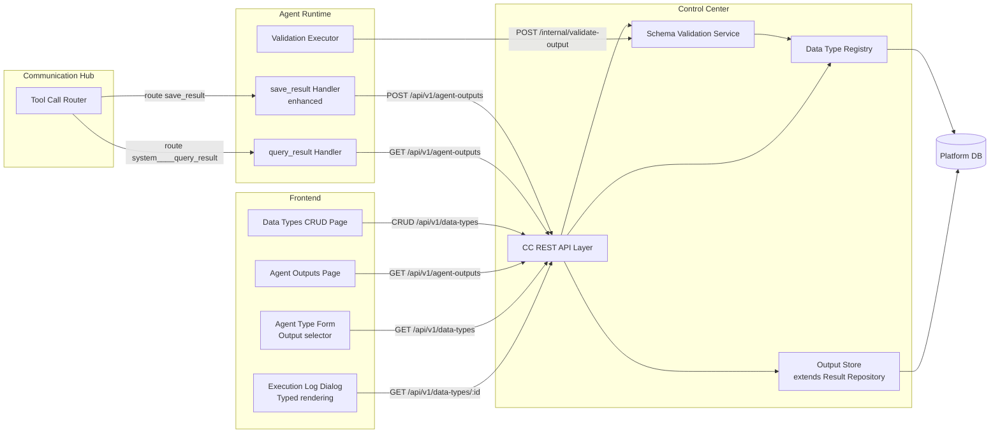
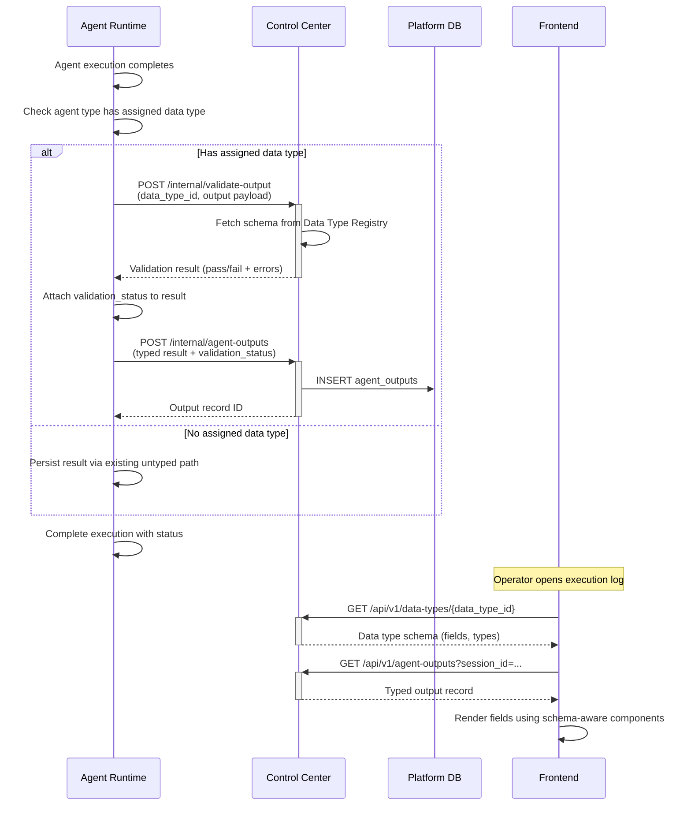
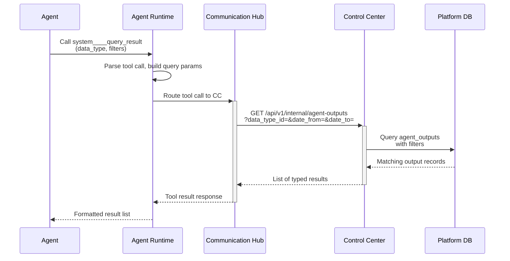

# Architecture: Enhance Agent Output System

## 1. Changed Components

### Control Center (CC)

- **Data Type Registry Service** — New internal CRUD service module for managing agent data type definitions (name, description, typed fields). Stores schema definitions in a new `agent_data_types` table. Exposes REST API endpoints for platform administrators to create, read, update, and delete data types. Enforces uniqueness on data type name. Blocks deletion of data types that are referenced by any agent type.
- **Output Persistence API** — New REST endpoints under `/api/v1/agent-outputs/` for writing typed agent outputs (called by Agent Runtime via internal API) and for querying/filtering/exporting past outputs (called by Frontend). Extends the existing Result Repository to persist typed results with a foreign key to the `agent_data_types` table.
- **Schema Validation Endpoint** — New internal endpoint `POST /api/v1/internal/validate-output` that accepts a data type ID and a payload, validates the payload against the stored schema, and returns validation result (pass/fail with field-level errors). Accessible only to callers presenting a service certificate (Agent Runtime).

### Agent Runtime (AR)

- **Execution Completion Validation** — After a non-conversational agent with an assigned output data type completes, AR calls CC's internal schema validation endpoint before persisting the result. If validation fails, the execution completes with a `validation_error` status; the raw output is still persisted alongside the error details.
- **Typed `save_result` Handling** — The existing `save_result` system tool is enhanced to accept a typed payload. When the agent type has an assigned data type, the tool call is routed to CC's output persistence API with the data type reference. Untyped callers (or agent types without an assigned data type) continue using the existing untyped result storage path unchanged.
- **`query_result` System Tool** — New built-in system tool `system____query_result` exposed to all agents. Accepts a data type name and optional filters (date range, field values). AR routes the call to CC's output query internal API. Returns a list of typed results conforming to the requested schema.

### Communication Hub (CH)

- **`query_result` Routing** — CH routes `query_result` tool calls from AR to CC's output query API. Agents may alternatively call CC directly for query_result if they possess the necessary service credentials; CH provides the default routing path for standard agent execution flows.
- **No new CH components** — The existing tool-call routing infrastructure handles the new tool type without structural changes.

### Frontend

- **Data Types CRUD Page** — New admin page listing all registered data types with create/edit/delete actions. Delete is guarded by a confirmation dialog and blocked if the type is in use (with agent type references displayed). Field editor supports string, number, boolean, date, and enum field types.
- **Agent Outputs Page** — New admin page with filter bar (data type, date range, agent type), paginated result table with flattened field columns, row detail panel, status badge (valid/validation error), and CSV export.
- **Agent Type Form Update** — The agent type create/edit form gains an "Output Data Type" selector populated from the data type registry. Only shown for non-conversational agent types. When assigned, the output type badge in the Agent Types list displays the data type name.
- **Execution Log Dialog Update** — The Result tab detects typed outputs and renders them as a structured field-by-field view following the data type schema. Field rendering is type-aware (boolean toggle, date format, enum chip). The tab label shows the data type name badge. Validation errors are displayed prominently with raw output fallback.

## 2. New Components



### Data Type Registry Module (CC)

Owns the canonical schema catalogue. Stores data type definitions in the `agent_data_types` table. Provides CRUD operations for platform administrators and read-only schema lookups for internal consumers (validation endpoint, output queries). Enforces referential integrity: a data type cannot be deleted while any agent type references it.

### Output Store Module (CC)

Extends the existing Result Repository to handle typed output persistence. Writes to a new `agent_outputs` table with columns for data type foreign key, agent type, agent instance, execution session ID, typed field values (JSONB), validation status, and raw output fallback. Supports query by data type, date range, agent type, and custom field filters. Provides CSV export.

### Schema Validation Service (CC)

Lightweight service invoked by AR at execution completion via the internal API. Receives a payload and a data type ID, fetches the schema from the Data Type Registry, validates field types, required fields, and enum values. Returns a structured result (pass/fail with field-level errors). No database access — reads schemas from the Data Type Registry module.

## 3. Integration Points

### Agent Runtime → Control Center (Internal API)

- **Schema Validation**: AR calls `POST /api/v1/internal/validate-output` with the assigned data type ID and the agent's output payload at execution completion. Authenticated via AR service certificate. Returns validation result synchronously.
- **Output Persistence**: AR's enhanced `save_result` handler calls `POST /api/v1/internal/agent-outputs` to persist typed outputs. Authenticated via AR service certificate. Returns the persisted output record ID.
- **Output Query**: AR's `query_result` handler calls `GET /api/v1/internal/agent-outputs` with filter parameters. Authenticated via AR service certificate. Returns a list of typed output records.

### Control Center → Database

- **New `agent_data_types` table**: Stores data type definitions (id, name, description, fields JSONB, created_at, updated_at). Referenced by agent types and agent outputs.
- **New `agent_outputs` table**: Stores typed execution results (id, data_type_id FK, agent_type_id FK, agent_instance_id, session_id, field_values JSONB, validation_status, raw_output TEXT, created_at). Indexed by data_type_id, agent_type_id, and created_at for efficient filtering.
- **Agent Types table extension**: Existing `agent_types` table gains `output_data_type_id` nullable FK column referencing `agent_data_types.id`. Only non-conversational agent types will have a non-null value.

### Frontend → Control Center (REST)

- `GET /api/v1/data-types` — List all data types (paginated, searchable)
- `POST /api/v1/data-types` — Create new data type
- `PUT /api/v1/data-types/{id}` — Update existing data type
- `DELETE /api/v1/data-types/{id}` — Delete data type (fails if referenced)
- `GET /api/v1/data-types/{id}` — Get single data type with full schema
- `GET /api/v1/agent-outputs` — Query typed outputs with filters (data_type_id, date_from, date_to, agent_type_id, page, page_size)
- `GET /api/v1/agent-outputs/export` — CSV export with same filter parameters
- `GET /api/v1/data-types?usage=true` — Returns data types with usage counts (referencing agent types) for delete-guard UI

## 4. Data Flow Changes

### Agent Execution → Validation → Typed Output Persistence → UI Display



### `query_result` Tool Call Flow



### Data Type CRUD Lifecycle

```mermaid
sequenceDiagram
    participant FE as Frontend
    participant CC as Control Center
    participant DB as Platform DB

    Note over FE: Admin creates data type

    FE->>+CC: POST /api/v1/data-types<br/>(name, description, fields)
    CC->>CC: Validate: unique name, ≥1 field, field types valid
    alt Invalid
        CC-->>-FE: 422 Validation error
    else Valid
        CC->>DB: INSERT agent_data_types
        DB-->>CC: New data type record
        CC-->>-FE: 201 Created (data type object)
    end

    Note over FE: Admin edits data type

    FE->>+CC: PUT /api/v1/data-types/{id}<br/>(updated fields)
    CC->>DB: UPDATE agent_data_types
    DB-->>CC: Updated record
    CC-->>-FE: 200 OK (updated object)

    Note over FE: Admin deletes data type

    FE->>+CC: DELETE /api/v1/data-types/{id}
    CC->>CC: Check agent_type references
    alt Referenced by agent types
        CC-->>-FE: 409 Conflict<br/>(list of referencing agent types)
    else Not referenced
        CC->>DB: DELETE agent_data_types
        DB-->>CC: Deleted
        CC-->>-FE: 204 No Content
    end
```

## 5. Master Arch Update Instructions

Update the following files in `docs/master/architecture/`:

1. **`modules/control-center/architecture.md`** — Add:
   - Data Type Registry module to the flowchart
   - Output Store module (extends Result Repository)
   - Schema Validation Service module
   - Reference to the two new database tables in section text
   - Brief prose sections for "Agent Data Type Registry", "Output Persistence & Query", and "Schema Validation"

2. **`modules/agent-runtime/architecture.md`** — Add:
   - `query_result` handler module to the flowchart
   - Execution completion validation step (with CC call)
   - Enhanced `save_result` tool handler
   - Prose section "Typed Output Handling" describing validation-at-completion logic

3. **`modules/communication-hub/architecture.md`** — Add:
   - `query_result` tool call routing path to the flowchart
   - Brief prose note that the routing reuses the existing tool-call router without new structural components

4. **`system-overview.md`** — Add:
   - Data Type Registry node (connected to Control Center → DB)
   - Output Store node (connected to Control Center → DB)
   - `query_result` data flow line between AR and CC
   - Update "Key Responsibilities" bullets for each service to reflect typed output capabilities

