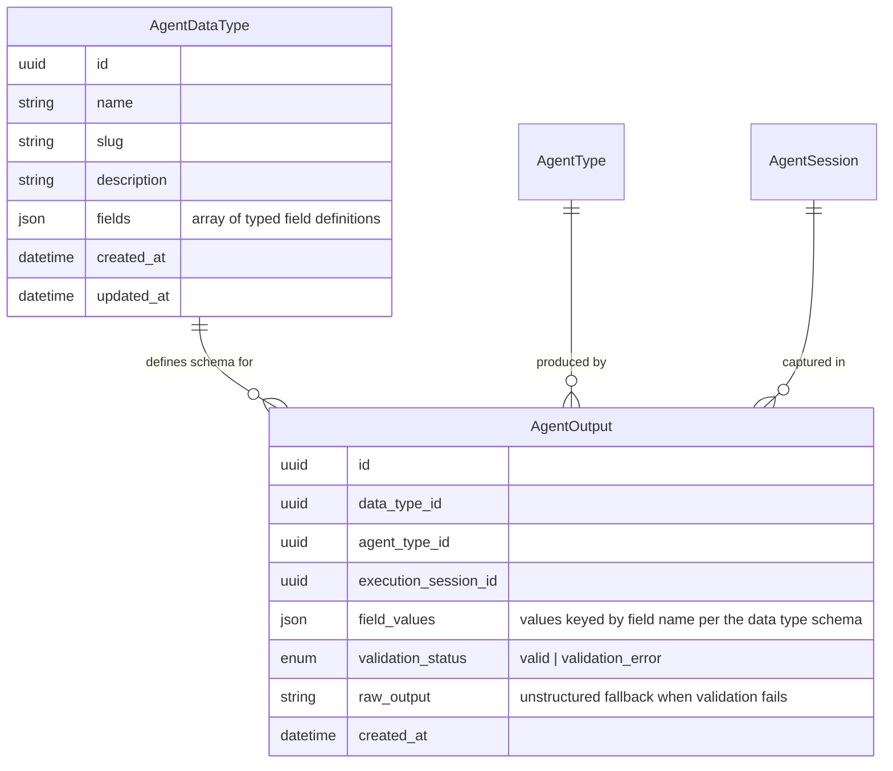
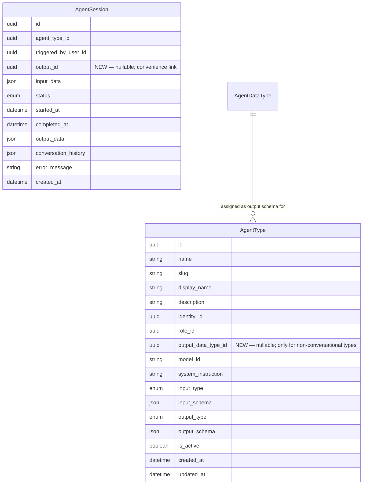

# Data Model: Enhance Agent Output System

## 1. New Entities

Two new entities are introduced to support the typed agent output system.

### Entity Descriptions

| Entity | Purpose | Key Business Rules |
|--------|---------|-------------------|
| `AgentDataType` | Central registry of reusable output schemas; each type defines a named collection of typed fields that one or more agent types can reference as their output contract. | Name must be unique. Slug is the canonical identifier used by `query_result` tool at runtime. Fields are an ordered array with each entry specifying a name, type (`string`, `number`, `boolean`, `date`, `enum`), and optional validation constraints. At least one field is required. |
| `AgentOutput` | Immutable record of a single typed agent execution result; links the agent type, execution session, and data type schema together with the validated field values. | `validation_status` is `valid` when field values pass schema validation, `validation_error` otherwise. `raw_output` stores the unparsed agent output as a fallback for UI rendering when validation fails. Field values are stored as a JSON object keyed by field name. Soft-referenced to the data type schema (schema is resolved at read time via `data_type_id`). |

---

## 2. Modified Entities

The following existing entities gain new foreign-key columns. No existing columns are changed or removed.

### Column Details

| Entity | New Column | Type | Nullable | Purpose |
|--------|-----------|------|----------|---------|
| `AgentType` | `output_data_type_id` | uuid FK → AgentDataType | Yes | Links a non-conversational agent type to its expected output schema. Null for conversational types and types using `auto` or `markdown` output. |
| `AgentSession` | `output_id` | uuid FK → AgentOutput | Yes | Optional convenience link from an execution session to its typed output record. Null when the session produced no typed output (conversational agents, pre-enhancement runs, failed executions). |

### Existing Column Clarifications

- `AgentType.output_type` — existing enum (`auto`, `typed`, `markdown`). When set to `typed`, the agent type **must** have a non-null `output_data_type_id`. The existing `output_schema` JSON column is superseded by the data type schema reference when `output_type = typed`.
- `AgentType.output_schema` — existing JSON column. Retained for backward compatibility with agent types that use inline JSON schemas. Agent types with an assigned `output_data_type_id` resolve their schema from the referenced `AgentDataType.fields` instead.

---

## 3. Removed Entities / Fields

None. All existing entities, columns, and relationships are preserved. Only additive changes are made.

---

## 4. Schema File References

The following schema model files must be created or updated:

| Action | File Path | Description |
|--------|-----------|-------------|
| **NEW** | `backend/app/db/models/agent_data_type.py` | SQLAlchemy model for `AgentDataType` — columns: `id`, `name`, `slug`, `description`, `fields` (JSON), `created_at`, `updated_at` |
| **NEW** | `backend/app/db/models/agent_output.py` | SQLAlchemy model for `AgentOutput` — columns: `id`, `data_type_id` (FK), `agent_type_id` (FK), `execution_session_id` (FK), `field_values` (JSON), `validation_status` (enum), `raw_output` (Text), `created_at` |
| **MODIFY** | `backend/app/db/models/agents.py` | Add `output_data_type_id` nullable FK column to `AgentType` model referencing `AgentDataType.id`, plus relationship to `AgentDataType` |
| **MODIFY** | `backend/app/db/models/session_logs.py` *(or the model file containing `AgentSession`/`AgentJob`)* — Add `output_id` nullable FK column to `AgentSession`/`AgentJob` model referencing `AgentOutput.id` |

> **Note on execution session entity**: The business entity is `ExecutionSession` / `AgentSession`. The current SQLAlchemy model implementing it is `AgentJob` in `backend/app/db/models/agents.py`. Apply the `output_id` column addition to the `AgentJob` class.

### Enum Types

| Enum | Values | Location |
|------|--------|----------|
| `AgentOutputValidationStatus` | `valid`, `validation_error` | `backend/app/db/models/agent_output.py` |

---

## 5. Master Data Model Update Instructions

After the schema files are implemented and migrations applied, update the master data model documentation:

### `docs/master/data-model/overview.md`

1. **Agent Management section** — Update the `AgentType` entity block to add `uuid output_data_type_id` attribute with annotation "optional; linked when output_type=typed". Add relationship line: `AgentType }o--|| AgentDataType : "output schema defined by"`.

2. **Agent Management section** — Update the `AgentSession` entity block to add `uuid output_id` attribute with annotation "optional; convenience link". Add relationship line: `AgentSession ||--o| AgentOutput : "result stored in"`.

3. **Agent Management section** — Add the new entities to the diagram block:
   - Add entity blocks for `AgentDataType` and `AgentOutput` with all generic-typed attributes.
   - Add all new relationship lines between new and modified entities.

4. **Cross-Domain Relationship Map section** — Insert new relationships if they cross existing domains:
   - `AgentDataType ||--o{ AgentOutput : "defines schema for"` — pure Agent Management domain.
   - `AgentOutput }o--|| AgentType : "produced by"` — Agent Management domain.
   - `AgentOutput }o--|| AgentSession : "captured in"` — Agent Management domain.
   - `AgentType }o--|| AgentDataType : "output schema defined by"` — Agent Management domain.

5. **Results, Scheduling & Notifications section** — No changes needed. The existing `ResultRecord` entity and `save_result` tool are enhanced internally but the entity structure remains unchanged.

### `docs/master/data-model/modules/agents/`

Create (or update) a module-level entity list file `docs/master/data-model/modules/agents/entities.md` to include the two new entities with brief descriptions (max 3 lines each) and their schema file path references.

### Source File References

Update the source file reference lines in `overview.md`:
- Agent Management section source line: add `backend/app/db/models/agent_data_type.py`, `backend/app/db/models/agent_output.py`
