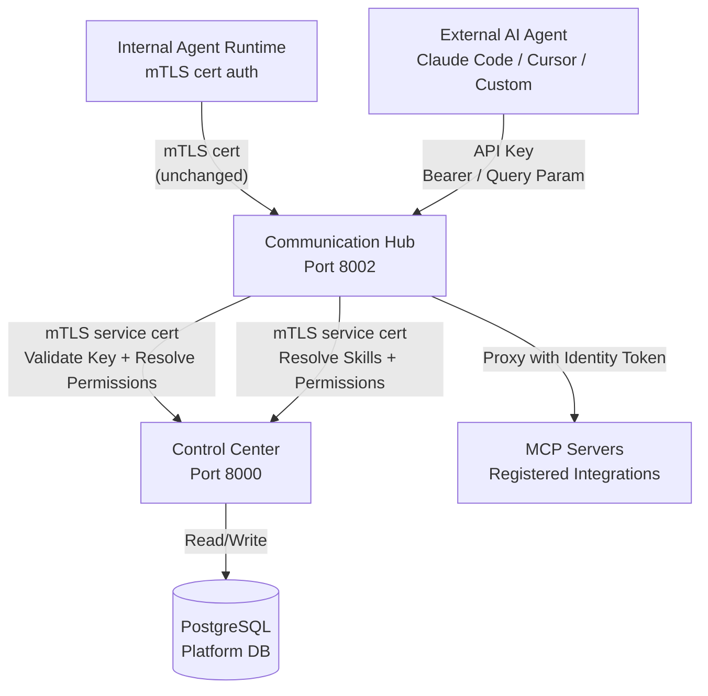
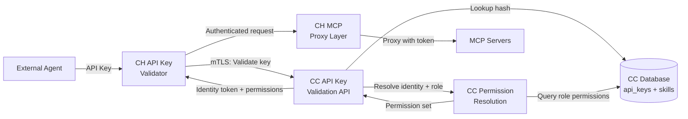
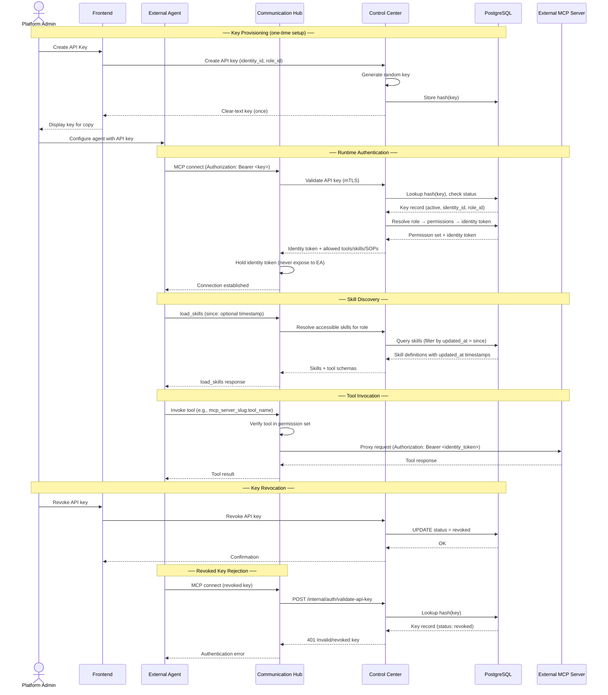
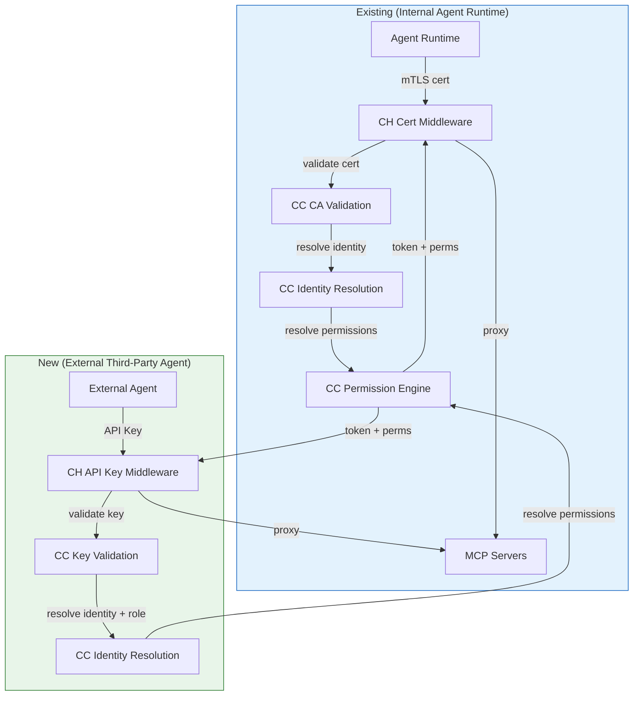

# Architecture — API Key MCP Hub Access

## 1. Changed Components

The Communication Hub and Control Center gain new capabilities to support external third-party agents alongside existing internal Agent Runtime agents. The following diagram shows where each change lands in the architecture.

**Changed components summary:**

| Component | Location | Change |
|-----------|----------|--------|
| CH Auth Middleware | Communication Hub | Extended to detect API key auth (Bearer token or query param) in addition to existing mTLS cert auth; routes each path to the appropriate validator |
| CC Internal API | Control Center | New internal endpoints for API key validation, permission resolution from API key, and skill resolution for external agents |
| CC Permission Resolution Service | Control Center | Existing identity→permission resolution logic reused; now also invoked by the API key validation path (key → identity → role → permissions) |
| CC Database | PostgreSQL | New `api_keys` table (hashed key values, bound identity/role, status, timestamps); new `updated_at` column on `skills` table |
| CH System Tool Router | Communication Hub | New `load_skills` system tool entry in the endpoint map for external agent skill discovery |
| CC Audit Service | Control Center | Extended to log API key CRUD events and authentication events |

## 2. New Components

### API Key Validator (Communication Hub)

A new middleware component in CH that intercepts requests bearing an API key (via `Authorization: Bearer` header or `?apiKey=` query parameter). It calls CC's internal validation endpoint via mTLS, receives the resolved identity/role/permission set, and caches the outcome for the request lifetime. External agents do NOT receive identity tokens — CH holds the token internally for MCP request proxying only.

### API Key Management Service (Control Center)

A new set of CC API endpoints and service logic for CRUD operations on API keys:
- **Create**: Platform admin selects an existing agent identity and agent role; CC generates a cryptographically random key, stores its hash, and returns the clear-text key once
- **List**: Returns all keys with bound identity, role, status, creation date, and last-used date
- **Revoke**: Sets key status to revoked; immediately invalidates it for future authentication

### API Key Store (Control Center Database)

New `api_keys` table storing hashed key values with references to agent identities and roles. The schema is managed through CC's standard model and migration toolchain.

### load_skills System Tool (Communication Hub)

A new system tool exposed to external agents via the standard MCP protocol. When called, CH resolves the caller's bound role into accessible skills and tools, queries CC for the full skill definitions (including `updated_at` timestamps and tool input/output schemas), and returns them. Supports an optional `since` parameter for incremental sync — only skills updated after the given timestamp are returned.

### Skill Version Tracking (Control Center Database)

A new `updated_at` column on the existing `skills` table. Set automatically on skill create/update. Enables external agents to cache skills locally and re-download only changed skills. Existing skills without timestamps receive a one-time backfill.

### New Auth Path Flowchart

## 3. Integration Points

### 3.1 CH → CC: API Key Validation (New)

A new mTLS-secured internal endpoint on Control Center that CH calls to validate an API key. CH sends the hashed key value plus an optional `since` timestamp for incremental skill sync. CC returns the resolved agent identity, role, full permission set (tools, skills, SOPs), and the decrypted identity token — which CH holds internally and never exposes to the external agent. Returns authentication errors for invalid, revoked, or unbound keys. Access is restricted to Communication Hub only (enforced by mTLS service certificate).

### 3.2 CH → CC: Skill Resolution (Changed)

Existing internal endpoints for resolving accessible skills are extended to support resolution from the external agent path:
- Skill definitions now include `updated_at` timestamps
- Incremental sync: endpoints accept an optional `since` parameter to filter skills

### 3.3 CH → CC: Permission Resolution (Changed)

CC's existing permission resolution logic is reused without change for the API key path. The resolution chain is:
`API Key → bound agent identity → bound agent role → policy evaluation → allowed tools/skills/SOPs`

This is the same permission model used by internal agents — the API key simply provides an alternative root of the resolution chain.

### 3.4 External Agent ↔ CH: MCP Endpoint (Changed)

The Communication Hub's MCP endpoint now accepts two authentication methods:
- **mTLS certificate** (existing, for internal Agent Runtime)
- **API key** (new, for external third-party agents)

Both paths converge at the same MCP proxy layer with identical permission enforcement after authentication succeeds.

### 3.5 Frontend → CC: API Key Management UI (New)

New frontend pages for Platform Administrators:
- API key list with status filter (active/revoked)
- Create API key dialog (select identity + role, display key once)
- Revoke confirmation dialog

All calls go through existing JWT-protected CC API endpoints.

## 4. Data Flow Changes

### External Agent Authentication and Tool Invocation

### Comparison: Internal vs External Auth Paths

## 5. Master Arch Update Instructions

After this change is implemented and verified, update:

### `docs/master/architecture/system-overview.md`
- Add API key authentication as a second auth path alongside existing mTLS certificate auth
- Document that the Communication Hub now serves as an MCP endpoint for both internal and external agents
- Note that external agents do NOT receive identity tokens — tokens are held exclusively by CH for proxying

### `docs/master/architecture/modules/communication-hub/architecture.md`
- Add the API Key Validator component to the CH architecture diagram
- Document the dual authentication paths (mTLS cert for internal, API key for external)
- Add `load_skills` to the system tool router responsibilities
- Show the external agent → CH → CC → MCP server flow

### `docs/master/architecture/modules/control-center/architecture.md`
- Add the API Key Management Service to the CC architecture diagram
- Add the API Key Store (`api_keys` table) to the database layer
- Document internal validation endpoint `POST /internal/auth/validate-api-key`

### `docs/master/architecture/security/` (create or update)
- If a new `api-key-security.md` doc is created, include the key lifecycle (create → active → revoked), hashing approach, and audit logging
- Document that CC-to-CH communication for key validation uses existing mTLS service certificates — no new trust model introduced
- Note that API keys inherit the full permission set of their bound identity + role — no per-key scoping

### `docs/master/architecture/modules/identity.md`
- Reference API keys as an alternative authentication credential for agent identities
- Note that the identity → role → permission resolution chain is unchanged — API keys add a new entry point
