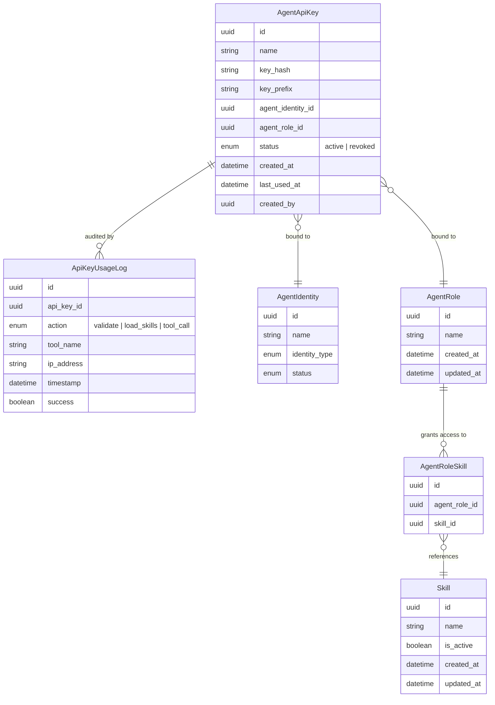

# Data Model — API Key MCP Hub

## 1. New Entities

Two new entities support API key authentication and auditing for third-party MCP hub access.

| Entity | Description |
|--------|-------------|
| **AgentApiKey** | API key bound to a specific agent identity and agent role. The key value is SHA-256 hashed at rest (`key_hash`); only the hash and a readable prefix (`key_prefix`, e.g. `phn_sk_`) are persisted. The clear-text key is displayed once at creation and never retrievable afterward. Status is `active` or `revoked`; revoked keys remain in the table for audit. `last_used_at` is updated on each successful authentication. `created_by` references the Platform Administrator (Identity) who issued the key. One active key per identity-role pair. |
| **ApiKeyUsageLog** | Immutable audit record for each API key operation. Captures the action type (`validate` for authentication, `load_skills` for skill discovery, `tool_call` for individual tool invocations), the tool name when applicable, client IP address, timestamp, and whether the operation succeeded. Supports security monitoring and usage analytics. |

**Business rules:**
- Keys inherit the full permission set of the bound role — no per-tool or per-SOP scoping on the key itself.
- Keys are valid until manually revoked; no automatic expiration.
- One active key per identity-role pair at a time.
- `key_hash` uses SHA-256; the raw key is never stored.
- `key_prefix` identifies the key type visually (e.g. `phn_sk_`) without exposing the secret.
- Revocation is immediate — the key becomes unusable on next authentication attempt.
- `ApiKeyUsageLog` entries are append-only; never modified or deleted (archival after retention period).

## 2. Modified Entities

### Skill — `updated_at` promoted to version-tracking field

The `updated_at` attribute on the Skills entity is already set automatically on modification. This change **promotes** it from a passive audit column to an active version-tracking field:

- **Before**: `updated_at` was set automatically by the ORM on modification but not surfaced in any client-facing API.
- **After**: `updated_at` is included in the MCP `load_skills` response so external agents can cache skill definitions locally and only re-download skills whose `updated_at` is newer than their cached copy. A `since` parameter on `load_skills` (or a separate `get_skill_updates` tool) filters to only skills modified after the given timestamp.

**One-time backfill needed**: Existing skills with `NULL` or default `updated_at` values must be backfilled to their `created_at` value (or `now()` for a one-time migration) so that the `since` filter operates correctly.

No schema migration is needed for the column itself — it already exists. A data migration is needed for backfill.

## 3. Removed Entities / Fields

None.

## 4. Schema File References

| File | Change |
|------|--------|
| `backend/app/db/models/agent_api_key.py` | **New file** — `AgentApiKey` and `ApiKeyUsageLog` SQLAlchemy models |
| `backend/app/db/models/skills.py` | **No schema change** — `updated_at` already exists; document its new role as a version-tracking field exposed via MCP `load_skills` |

## 5. Master Data Model Update Instructions

After implementation, update these files in `docs/master/data-model/`:

| File | Update |
|------|--------|
| `overview.md` | Add an **"API Key Access"** subsection under the **Agent Runtime Security** section (or as a new top-level section). Include the `AgentApiKey` and `ApiKeyUsageLog` entities with relationships to `AgentIdentity` and `AgentRole`. Add the Mermaid `erDiagram` block showing these entities. |
| `modules/security/entities.md` | Add `AgentApiKey` and `ApiKeyUsageLog` entity descriptions in the table, following the existing format. Update the Mermaid diagram to include both new entities with their relationships to `AgentType`, `AgentIdentity`, and `AgentRole`. |
| `overview.md` — Skills & SOPs section | Update the `Skill` entity note: add a remark that `updated_at` is surfaced to MCP clients for skill versioning/caching. No diagram change needed. |
| `modules/skills/entities.md` | Update the `Skill` entity description to note that `updated_at` is the version-tracking timestamp exposed to MCP clients for cache invalidation. |
