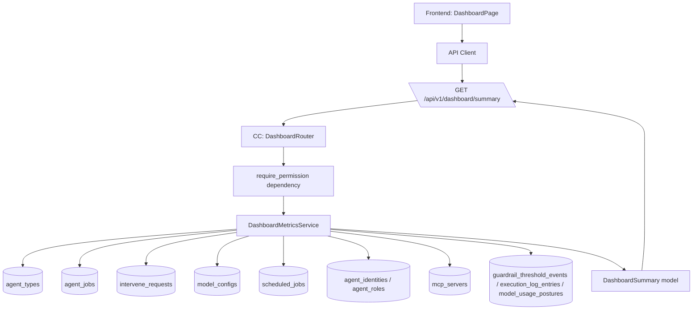
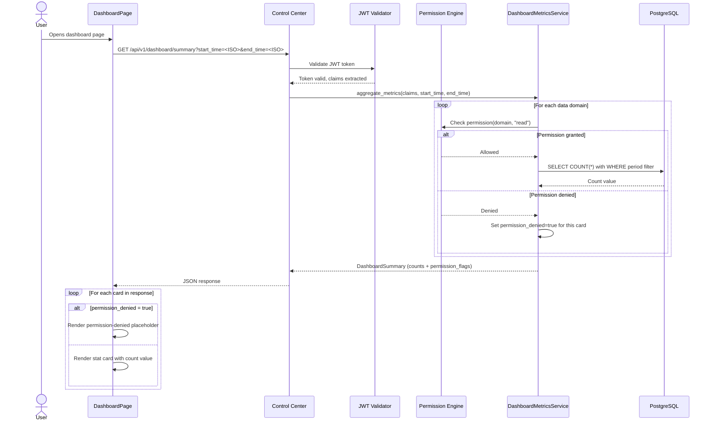

# Architecture Changes — Dashboard Operational Metrics

## 1. Changed Components

- **DashboardPage** (`frontend/src/pages/DashboardPage.tsx`) — Completely reworked from a thin placeholder showing only identity provider status and a super-admin indicator to a full operational dashboard. The existing identity provider status cards are retained but moved to a collapsed secondary section below the operational metrics grid. All new card content uses i18next through `t()` per project conventions.
- **Control Center API layer** — A new aggregation endpoint is added to the v1 API router.
- **Control Center service layer** — A new `DashboardMetricsService` is added to aggregate counts across multiple data domains in a single request.

## 2. New Components

## 3. Integration Points

- **New endpoint**: `GET /api/v1/dashboard/summary` accepts query parameters `start_time` and `end_time` (ISO 8601 datetime strings, defaulting to last 24 hours). Returns a `DashboardSummary` Pydantic model with snapshot-count cards and time-filtered metric cards.
- **Permission model**: Each data domain within the summary is individually guarded by `require_permission()` checks. The endpoint itself requires no single global permission — instead, the service checks permissions per data domain and returns a `permission_denied: true` flag for each card the caller is not authorized to see.
- **Permission-to-domain mapping**:

  | Card | Permission Check |
  |------|-----------------|
  | Agent Types (count + active/running breakdown) | `require_permission(RT_AGENT, "read")` |
  | Agent Executions (completed/failed counts) | `require_permission(RT_AGENT, "read")` |
  | Pending Interventions | `require_permission(RT_AGENT_HUMAN_INTERVENTION, "read")` |
  | Model Configurations | `require_permission(RT_AGENT_MODEL_CONFIGS, "read")` |
  | Model Usage Posture Breaches | `require_permission(RT_AGENT_MODEL_CONFIGS, "read")` |
  | Active Schedules | `require_permission(RT_AGENT_SCHEDULES, "read")` |
  | Agent Identities | `require_permission(RT_AGENT_IDENTITIES, "read")` |
  | Agent Roles | `require_permission(RT_AGENT_ROLES, "read")` |
  | MCP Servers | `require_permission(RT_INTEGRATION_MCP_HUB, "read")` |
  | Guardrail Breach Events | `require_permission(RT_AGENT_TRAILS, "read")` |

- **Frontend permission handling**: The `DashboardPage` component interprets `permission_denied` flags per card and renders a visually distinct placeholder (muted styling, lock icon) instead of the stat value. No 403 errors reach the UI. Cards are never hidden — operators know the data domain exists even if they cannot access it.

- **Architecture constraint compliance**: Only Control Center connects to the database. The frontend calls only CC REST APIs. All endpoints require JWT authentication. No inter-service communication is needed for this feature (no Agent Runtime or Communication Hub involvement). OpenTelemetry instrumentation applies to the new endpoint and service method calls per existing project convention.

## 4. Data Flow Changes

**Snapshot-count queries** (no period filter): `agent_types`, `agent_identities`, `agent_roles`, `mcp_servers`, `model_configs` (enabled only), `scheduled_jobs` (active only), `intervene_requests` (pending only).

**Time-filtered queries** (date range filter applied): `agent_jobs` (completed/failed breakdown, filtered by `created_at` or `updated_at`), `guardrail_threshold_events` (filtered by `created_at`), `execution_log_entries` (failures filtered by timestamp), `model_usage_postures` (breaches filtered by timestamp).

## 5. Master Arch Update Instructions

In `docs/master/architecture/system-overview.md`:

- Add `DashboardPage` to the left-to-right flowchart under the UI node (or add a new `UI` sub-node representing the dashboard as the entry point).
- Add `DashboardMetricsService` under the Control Center node in the system overview diagram, showing its database query paths.
- Ensure the updated diagram stays within the 15-node maximum per Mermaid diagram; if the existing diagram is already at capacity, create a new module-level diagram at `docs/master/architecture/modules/dashboard.md` showing the dashboard architecture as a focused Mermaid flowchart.
