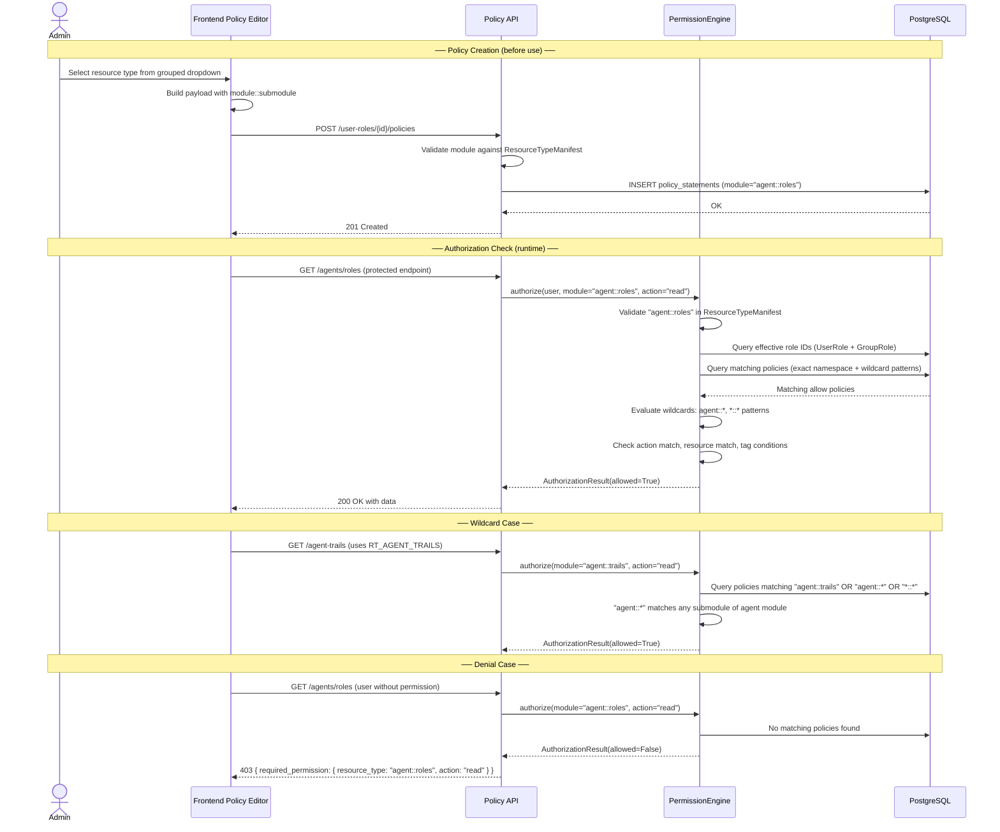

# Architecture — Namespaced Resource Types

## 1. Changed Components

The permission authorization pipeline touches several components that require changes. The following flowchart shows where each change lands in the architecture.

```mermaid
flowchart TD
    A[Frontend Policy Editor] -->|"POST/PUT namespaced type"| B[Policy API<br>/user-roles/{id}/policies]
    B -->|"writes module::submodule"| C[(PostgreSQL<br>policy_statements)]
    
    D[Protected API Endpoint<br>e.g. GET /agents] -->|"Depends(require_permission<br>RT_AGENT_MANAGEMENT, read)"| E[require_permission<br>FastAPI dependency]
    E -->|"user_id, module, action, resource_id"| F[PermissionEngine<br>authorize]
    F -->|"validates against"| G[ResourceTypeManifest<br>17 namespaced entries]
    F -->|"queries allow policies"| C
    F -->|"Authorized / Denied"| E
    E -->|"403 with resource_type"| H[Frontend Error Display<br>PermissionDeniedAlert]
    E -->|"200 OK"| D
    
    I[Bootstrap Service<br>startup] -->|"creates system_admin<br>module=*::*"| C
    J["Alembic Migration<br>(offline)"] -->|"transforms 15 → 17"| C
```

**Changed components summary:**

| Component | Location | Change |
|-----------|----------|--------|
| Resource Type Manifest | Backend `core/resource_types.py` | 15 flat constants → 17 namespaced constants + `MODULE_GROUPS` + wildcard helpers |
| Permission Engine | Backend `services/permissions/permission_engine.py` | `::`-delimited module matching, 3-level wildcard evaluation (`*::*`, `module::*`, exact) |
| Permission Dependency | Backend `api/deps.py` | No structural change needed; already passes module string through to engine |
| API Routers (20 files) | Backend `api/v1/*.py` | All `require_permission()` call sites updated to namespaced constants |
| Policy API Endpoint | Backend `api/v1/policy.py` | Returns grouped manifest with module metadata |
| Bootstrap Service | Backend `services/permissions/bootstrap_service.py` | System admin wildcard `"*"` → `"*::*"` |
| Database | PostgreSQL `policy_statements`, `policy_resources` | Data migration: legacy values → namespaced values |
| Frontend Manifest | Frontend `constants/resourceTypes.ts` | Flat manifest → namespaced + module group definitions |
| Policy Editor Dropdown | Frontend components | Flat list → grouped by module (Agents, Integrations, System) |
| Error Display Components | Frontend `components/permissions/*` | Display updated namespaced `resource_type` field |
| RolePolicyDialog | Frontend NEW `components/permissions/RolePolicyDialog.tsx` | Replaces inline expand in Roles table; Form/JSON toggle, batch save |
| FreeSolo Autocomplete Selectors | Frontend `components/permissions/AddStatementDialog.tsx` | Resource type and action selectors now accept free-text wildcards (`agent::*`, `agent::mana*`, `*`) |
| Batch Policy Save Endpoint | Backend NEW `PUT /roles/{role_id}/policies/batch` | Atomic policy replacement for a role in a single transaction |

## 2. New Components

### RolePolicyDialog
A dialog wrapping all policies for a single role, replacing the inline table-row expansion pattern. Supports two view modes: **Form view** (the existing `AddStatementDialog`-style form embedded in the dialog) and **JSON Source Code view** (a textarea with syntax highlighting for direct JSON editing). A Validate button checks JSON parseability and structure before saving. All changes are committed in a single batch operation.

### FreeSolo Autocomplete Selectors
Resource type and action selectors converted from MUI `<Select>` to MUI `<Autocomplete freeSolo>`, allowing users to type wildcard patterns (`agent::*`, `agent::mana*`, `*::*`, `*`) in addition to selecting from the predefined manifest options.

### Batch Policy Save Endpoint
A new `PUT /user-roles/{role_id}/policies/batch` backend endpoint that accepts the full set of policies for a role and replaces them atomically within a single database transaction. This supports both the Form view save (all policies sent at once) and the JSON Source Code view save (parsed JSON sent as the batch payload).

### JSON Source Code Editor
A textarea-based editor within the RolePolicyDialog that displays the role's current policies as formatted JSON. Supports bidirectional sync with the Form view and includes a Validate button that performs client-side parse checking with inline error display.

## 3. Integration Points

### 3.1 Manifest Data Structure (Changed)

The `ResourceTypeManifest` is consumed by:
- **Permission Engine** — validates `module` and `action` parameters before policy lookup
- **Policy API** `GET /policy/resource-types` — returns the manifest to the frontend
- **Frontend `useResourceTypes()` hook** — fetches and caches the manifest for dropdowns

The manifest structure evolves from:
```
{ "agent": {"actions": [...]}, "role": {"actions": [...]}, ... }  (15 flat keys)
```
to:
```
{ "agent::management": {"actions": [...]}, "agent::roles": {"actions": [...]}, ... }  (17 namespaced keys)
```
plus a `MODULE_GROUPS` constant mapping module names to their submodule lists for the frontend dropdown grouping.

### 3.2 Policy CRUD API (Changed)

**Endpoints affected:**
- `POST /user-roles/{role_id}/policies` — `module` field in request body now accepts namespaced identifiers
- `PUT /user-roles/{role_id}/policies/{policy_id}` — same
- `GET /user-roles/{role_id}/policies` — response `module` field contains namespaced identifiers
- `GET /policy/resource-types` — response now includes module grouping metadata

**Validation**: The API layer validates incoming `module` and `resource_type` values against `ResourceTypeManifest` keys, rejecting flat values.

### 3.3 `require_permission()` Parameter Format (Changed)

The function signature remains `require_permission(module, action)` where `module` is now a namespaced string constant (e.g., `RT_AGENT_ROLES` = `"agent::roles"`). All 198+ call sites are updated to import and use the new constants. The dependency function itself requires no change — it passes the module string through to `PermissionEngine.authorize()`.

### 3.5 Batch Policy Save Endpoint (New)

`PUT /user-roles/{role_id}/policies/batch`:
- **Request**: Array of policy statement objects (each with module, effect, actions, resources, tag_conditions)
- **Response**: Updated role with all policies
- **Transaction**: All existing policies for the role are deleted, then new policies are inserted in a single atomic transaction
- **Validation**: Each policy's module and actions are validated against the namespaced manifest
- **Permission guard**: Requires `system::permissions:manage`
- Supplying an empty array clears all policies for the role

This endpoint serves both the Form view save path and the JSON Source Code save path in the RolePolicyDialog.

### 3.6 Dialog State Integration (Changed)

The new RolePolicyDialog replaces the per-row inline expansion in the Roles table. A single dialog instance serves the selected role, opened via a "Manage Policies" button on each table row. The dialog manages its own state (active policies list, view mode, JSON text, validation results, save status) independently of the table row state that previously controlled inline expansion.

## 4. Data Flow Changes



    Note over Admin,DB: ── Dialog-Based Policy Editing ──
    Admin->>FE: Click "Manage Policies" on role row
    FE->>API: GET /user-roles/{id}/policies
    API-->>FE: Current policy list
    FE->>FE: Open RolePolicyDialog (Form view)
    
    alt Form View Save
        Admin->>FE: Add/edit/delete policies in form
        FE->>FE: Build policies array
    else JSON Source Code View Save
        Admin->>FE: Toggle to JSON Source Code view
        FE->>FE: Generate JSON from current policies
        Admin->>FE: Edit JSON directly
        Admin->>FE: Click Validate
        FE->>FE: Parse JSON, check structure
        FE-->>Admin: Show validation result (success/error)
        Admin->>FE: Fix errors, validate again
    end
    
    Admin->>FE: Click Save
    FE->>API: PUT /user-roles/{id}/policies/batch
    API->>API: Validate all policies against manifest
    API->>DB: DELETE existing policies + INSERT new policies (atomic)
    DB-->>API: OK
    API-->>FE: Updated role with policies
    FE->>FE: Close dialog, refresh parent table

## 5. Master Arch Update Instructions

After this change is implemented and verified, update:

### `docs/master/architecture/system-overview.md`
- Update the Permission Authorization component description to reference the `module::submodule` naming convention
- Replace any references to flat resource types with namespaced examples
- Document the three-level wildcard evaluation rules

### `docs/master/architecture/modules/` (create or update)
- If a new `iam.md` module doc is created, include the authorization flow diagram from Section 1
- Note that the permission enforcement model (deny-by-default, policy-based allow, role → policy → resource resolution) is unchanged — only the identifier format changed
- Document the RolePolicyDialog batch save flow and its integration with the batch policy API endpoint
- Document the freeSolo autocomplete pattern for wildcard resource type and action input
